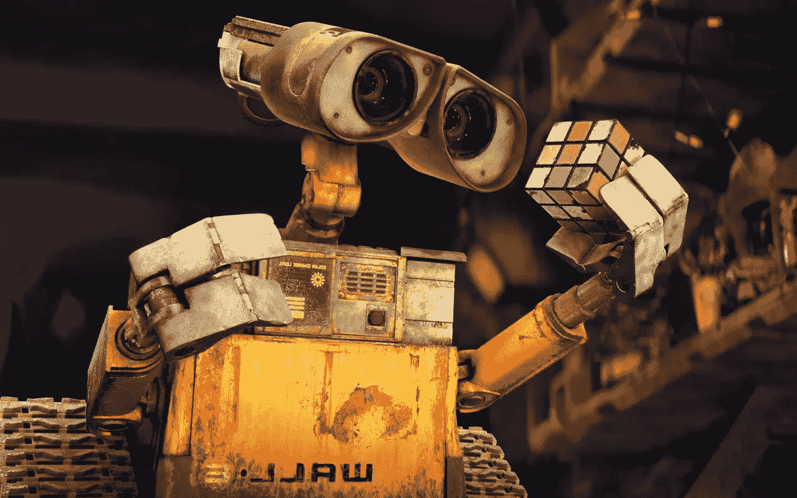

# 今年让我难忘的 7 堂机器学习课

> 原文：<https://towardsdatascience.com/7-machine-learning-lessons-that-stuck-with-me-this-year-27138a96281b?source=collection_archive---------14----------------------->

## 不，这不是用什么机器学习库的问题。

在过去的两年里，我一直是机器学习的学生，但在过去的一年里，我终于能够应用我所学到的东西，并巩固我对它的理解。所以我决定分享我在机器学习的“第一年”学到的 7 个教训，并希望让这篇文章成为每年的传统。

## 1.数据是女王

*开始之前考虑一下数据*

如今，由于网上存在大量的学习资源，学习机器学习相对容易。不幸的是，他们中的许多人倾向于掩盖*数据收集*和*清理*步骤。

在我的第一个严肃的机器学习项目中，我和我的团队遇到了一个大问题:我们从哪里获得数据？我们需要数以千计的动物图像，在放弃搜索网络的想法后，我们遇到了 [CIFAR-100 数据集](https://www.cs.toronto.edu/~kriz/cifar.html)。但是就在我们认为所有的问题都解决了的时候，我们意识到我们需要预处理我们的数据(去除背景，缩小比例，转换成矢量等等。)然后再馈入我们的深度学习模型。这被证明是我们项目中最耗时的部分(除了大约一周的通宵训练和调整我们的模型)。

任何机器学习项目的数据部分都不应该被忽视，“数据来自哪里？”应该是你开始前首先要问的问题之一。

## 2.领域知识很重要

*领域知识有时和技术技能一样重要*

人们很容易陷入这样的想法，即使用机器学习解决问题只需要技术技能。现实是，如果你只从数字和算法的角度考虑你面前的问题，你将很难走得很远。就这一次，在一个你不太了解的领域里想出项目点子可能会很困难。但是，即使你设法提出了一个伟大的想法，领域知识在决定你需要收集什么样的数据以及在训练你的机器学习模型时应该使用什么类型的特征时，也会非常有帮助。

你当然不需要成为应用机器学习技术的每个领域的专家，但你应该准备好尽可能多地学习，并与那些拥有领域专业知识的人合作。

## 3.机器学习不是银弹

*机器学习不是一切的答案*

过去几年，机器学习发展如此迅速，人工智能初创公司的数量在增加也就不足为奇了。有一种驾驭人工智能浪潮的冲动，越来越多的公司似乎正在投资聘请机器学习工程师和数据科学家，希望在竞争中领先。但现实是，机器学习并不总是答案，基本分析往往是最佳和最具成本效益的解决方案。

即使一家公司可以证明机器学习的使用是合理的，这也不意味着它准备实施它。我在我工作过的几家公司看到了利用机器学习能力的渴望，但他们往往没有足够的相关数据，质量也值得怀疑。

在你开始建立一个机器学习模型之前，你应该总是做你的研究并尝试不同的技术来解决一个问题，这可以节省你大量的时间和金钱。

## 4.无需从头开始编码

拥抱社区已经创造的工具

学习基础知识是至关重要的，它将确保你在处理问题时做出最好的决定，但从头开始编写机器学习模型不是很实际。

当我在学校开始学习机器学习时，我从头开始编写基本算法，但我很快意识到，我不需要为了将理论付诸实践而重新发明轮子。事实上，通过使用基本的机器学习库和 API 解决问题，我开始在学习中进步得更快，这只是给了我更多的时间来明智地思考失败的方法和思考优化。

下一次你有问题时，你的目标应该是在你从头开始编码之前，找出是否有一个 ML 工具来帮助你解决它。

## 5.人在回路中

*人类和机器一起更强大*

不管主流媒体想让我们相信什么，人工智能的当前状态还没有能力取代人类。

YouTube 是一个很好的例子，说明了人在循环中的重要性，即人参与到机器学习过程的每个阶段。例如，考虑一下 YouTube 的算法是如何错误地对成千上万的视频进行版权保护和去货币化的，创作者群体真的很痛苦。机器学习算法还不够“智能”，不足以单独区分合理使用和版权，使用人类判断来检查算法建议并提供反馈极其重要。

机器驱动的系统非常强大，但它们仍然达不到预期的准确率，在人类的帮助下，它们可以实现超出我们想象的伟大成就。

## 6.这是一门艺术！！

*有时这全靠经验和大量的尝试和错误*

我记得在讲座结束后，我找到我的教授，问他如何在人工神经网络中选择正确的神经元数量和隐藏层。我希望有一个公式或某种标准方法来得出正确的组合，但我得到的只是轻微的傻笑和“这是一门艺术！”。我的教授解释说，找到正确的组合取决于经验和大量的尝试和错误。听到这一点我有点失望，但我越是与机器学习算法，特别是神经网络打交道，我就越能接受这样一个事实，即在机器学习中没有“一刀切”的做法。

有许多不同的方法可以帮助你优化机器学习算法，你应该尽可能多地熟悉这些方法，但最重要的是，要习惯于跳出框框思考，进行大量的试错。

## 7.找一个导师或伙伴

*愿意寻求帮助*

这一课不仅仅适用于机器学习工程师，无论你在哪个领域，你都应该认识到寻求帮助的力量！

独自工作当然没有错，但不可否认的是，有一个伙伴或导师往往能帮助你更快更远地前进。在我的学习过程中，有一位导师是至关重要的，有第二双眼睛来修改我的作品让我受益匪浅。

我们很多人都避免寻求帮助，要么是因为害怕被拒绝，要么只是因为给别人带来不便，但你会惊讶地发现有多少人愿意不怕麻烦地伸出援助之手。练习寻求帮助，并见证它如何让你的生活变得更好。

希望这些教训对你的机器学习生涯有所帮助。如果你有任何问题或者想分享你自己的经验，我很乐意在评论中看到它们！