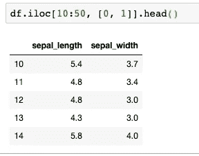

# 当你开始与图书馆合作时，7 个实用的熊猫提示

> 原文：<https://towardsdatascience.com/7-practical-pandas-tips-when-you-start-working-with-the-library-e4a9205eb443?source=collection_archive---------10----------------------->

## 解释一些乍一看不那么明显的东西…


**简介**

在本文中，我想分享一些我认为对任何开始数据科学之旅的人都有用的技巧。Python pandas 包是数据科学家使用最多的库之一，对于任何想要涉足该领域的人来说，它绝对是必不可少的。

有时候学习之旅并不那么直截了当，所以我想分享一些让学习变得更容易的小技巧。一些提示是熊猫最重要的一些功能的更传统的用法，而其他的是关于如何在包装内做一些事情的实用建议。

请继续阅读！

**使用这三个函数来检查你的数据:head()、info()、describe()**

这三个函数将帮助您进行初始数据分析，并且已经为您提供了关于数据集的大量信息。加载数据集后运行这三个工具总是一个好的开始。

我们将加载 iris 数据集来演示它们是如何工作的。您可能会在加载 csv 文件后立即这样做。

```
from sklearn.datasets import load_iris
import pandas as pddata = load_iris()
df = pd.DataFrame(data['data'], columns=data['feature_names'])
df['species'] = data['target']
```

现在数据已经加载，您可以看到 head 函数是如何工作的:


您可以看到它显示了数据框的前 5 行，其列名在顶部，索引在左侧。这已经是一些有趣的信息了。现在让我们尝试使用 info()函数:


这为我们提供了关于行数、150 个条目和 5 列数的信息。您可以在我们的列中看到哪些数据类型。在这个例子中，除了 species 列是一个整数之外，所有的列都是浮动的。

让我们看看 describe()函数可以在这里添加什么:


这里有更多的信息。我们可以看到每一列的最大值和最小值。我们也可以阅读集中趋势摘要:平均值和标准差，以及四分位范围(25%，50。75%).

这里还有一点没有探讨。在我的数据集中，所有的列都是数值型的，describe()函数对数值型和分类型变量的工作方式不同。为了演示如何使用这两者，我将添加一个名为“is_dangerous”的伪分类列。

```
import numpy as np
df['is_dangerous'] = np.where(df['sepal length (cm)']>6, 'yes', 'no')
```

我刚刚使所有萼片长度大于 6 的行变得危险。我们现在打电话描述一下。


请注意，我已经在 describe()中使用了 *include* 参数，并将其设置为“全部”。这使得函数也包括分类变量的数据描述。您可以看到 is_dangerous 列有两个唯一的值，最常见的是“no ”,它出现了 83 次。

我希望您可以看到，仅仅通过这三个函数:head()、info()和 describe()您就可以了解到许多关于数据的信息。

**如何查看数据框中的所有列**

如果您的数据框中有许多列，jupyter 笔记本的默认行为是显示一些第一列和最后一列以及中间的三个点(…)。如果您的数据框有许多行，并且您想要查看所有行，情况也是如此。简单的解决方法是使用以下代码检查数据框的尺寸并更改默认显示设置:

```
pd.set_option('display.max_columns', 500)  
pd.set_option('display.max_rows', 500)
```

在代码中导入后添加此内容，并将数字设置为您的数据框尺寸。

**如有必要，重命名列名**

如果列名过长，包含空格，或者不是好的列名，最好的方法是重命名它们。在你分析的一开始就这么做，会解决很多问题。让我们看看 iris 数据集中的默认列名。


您可以看到这里的列名并不理想。我认为公制(厘米)是多余的，我建议使用下划线代替空格。这将允许您稍后使用点符号选择数据框中的列。那我们换个名字吧:

```
df.columns = df.columns.str.replace(' \(cm\)', '').str.replace(' ', '_')
```

我删除了列名中的'(cm)'并用下划线替换了空格。通常的做法是删除列名中的尾随空格(如果有的话)。此外，如果列名没有遵循可以应用于所有列名的模式，您可以一个一个地更改它们。

**使用内置的绘图功能绘制简单的数据图**

要做简单的绘图，你可以使用内置的熊猫函数。Pandas 函数在某种程度上是有限的，为了进行进一步的分析，你可能需要学习如何使用 matplotlib 或 seaborn，但是如果你想制作一个快速图表来查看你的数据，你可以使用这些一行程序。让我们用 Iris 数据集再次探索它们。我将绘制数据集中所有例子的萼片长度:


这里的 x 轴代表指数(单个例子), y 轴代表萼片长度。记住在 matplotlib 导入后添加' *%matplotlib inline'* ，这样您的图形就会显示在笔记本中。

你也可以把这两个变量分散开来。让我们通过将萼片长度与萼片宽度进行分散来展示这一点。


另一个有用的熊猫图是直方图，它可以应用于整个数据框。这样，它将为所有数字列绘制直方图:


为了可视化分类数据，您可以使用 pandas 的 value_counts()函数和条形图:


可以看到用熊猫库绝对可以做一些简单的图形。深入研究文档，了解更多信息，并学习如何使用不同的参数使您的图形更好。

**了解 loc 和 iloc 选择的工作原理，并能够自信地使用它**

Loc 和 iloc 是从数据框中选择数据的方法。loc 允许您通过名称(列名和索引名)访问数据，而 iloc 也是如此，但是您需要对列和索引都使用整数索引(因此 iloc 表示 int number)。

让我们看看它们在实践中是如何工作的:

```
df.loc[:, ['sepal_length', 'sepal_width']]
```

上面的代码为 sepal_length 和 sepal_width 两列选择了所有行(冒号是 all 的快捷方式)。

```
df.loc[10:50, ['sepal_length', 'sepal_width']]
```

上面的代码选择了相同的列，但只选择了 10 到 50 之间的行。我们在这里使用整数来选择行，而我们使用 loc，这可能会令人困惑。这是因为我们的索引是整数，因为我们在创建数据框时使用了默认索引。你可以有字符串形式的索引，比如唯一的行标识符。为了展示这一点，让我们将索引改为字符串:


我现在已经将索引改为字符串，并调用 head 函数来查看一些数据条目。

乍一看，数据框看起来是一样的，但我想说明有一个重要的区别。让我们尝试与上一个示例相同的选择:


尝试这段代码时，应该会出现错误。我不打算深究错误的细节，但这是因为 loc 需要使用特定的索引值，这些值现在是字符串，而不是整数。但是，您可以使用 iloc 来执行相同的操作。



您能看到我们必须将列名更改为相应的列号吗？这是因为 iloc 不处理列名，而是处理它们的索引(第一列从 0 开始)。

您可以在“走向数据科学”上找到有关数据框选择的更多详细教程，但我想说的主要观点是，您希望尽快了解如何使用它们，以便能够快速有效地操作您的数据框。

## **轴:0 代表行，1 代表列**

对于不记得的人来说，这是一个相当快速实用的提示。在熊猫中，我们总是首先提到行，然后是列。因此，如果 df.shape 给定为(160，2)，则意味着有 160 行和 2 列。当我们使用 loc 和 iloc 时，方括号中的第一项是指行，第二项是指列。当我们使用 pandas 函数时，需要轴参数，比如 apply()，那么轴=0 表示行，轴=1 表示列。

**使用自动补全功能**

我的最后一个技巧是在 jupyter notebook 中使用自动完成功能。它是内置的，当你开始输入变量来激活它时，你只需要点击 tab 键。这会节省你打字和调试错别字的时间。如果你仍然不知道如何使用它，检查一下我不久前写的 j [upyter 自动完成文章](/jupyter-notebook-autocompletion-f291008c66c)。

**结论**

我已经给了你一些关于如何使用熊猫的实用技巧，现在是时候在一些真实的数据集上尝试它们了。这绝对不是一个排他性的列表，还有很多要学习和涵盖。我认为这可以让你走上正确的道路，并在开始使用一个新的库时消除一些最初的困惑。

祝你好运！

*原载于 about datablog . com:*[2019 年 11 月 11 日](https://www.aboutdatablog.com/post/7-practical-pandas-tips-when-you-start-working-with-the-library)*开始与图书馆合作时的 7 个实用熊猫小贴士。*

*PS:我正在 Medium 和*[***aboutdatablog.com***](https://www.aboutdatablog.com/)*上撰写以简单易懂的方式解释基本数据科学概念的文章。你可以订阅我的* [***邮件列表***](https://medium.com/subscribe/@konkiewicz.m) *在我每次写新文章的时候得到通知。如果你还不是中等会员，你可以在这里加入*[](https://medium.com/@konkiewicz.m/membership)**。**

*下面还有一些你可能喜欢的帖子*

*[](/what-are-lambda-functions-in-python-and-why-you-should-start-using-them-right-now-75ab85655dc6) [## python 中的 lambda 函数是什么，为什么你现在就应该开始使用它们

### 初学者在 python 和 pandas 中开始使用 lambda 函数的快速指南。

towardsdatascience.com](/what-are-lambda-functions-in-python-and-why-you-should-start-using-them-right-now-75ab85655dc6) [](/pandas-data-manipulation-functions-7b3519fc1370) [## Pandas 数据操作函数:apply()、map()和 applymap()

### 以及如何在熊猫身上正确使用它们…

towardsdatascience.com](/pandas-data-manipulation-functions-7b3519fc1370) [](/sorting-data-frames-in-pandas-a5a3af6f346a) [## 对熊猫中的数据框进行排序

### 如何快速有效地排序数据帧

towardsdatascience.com](/sorting-data-frames-in-pandas-a5a3af6f346a)*