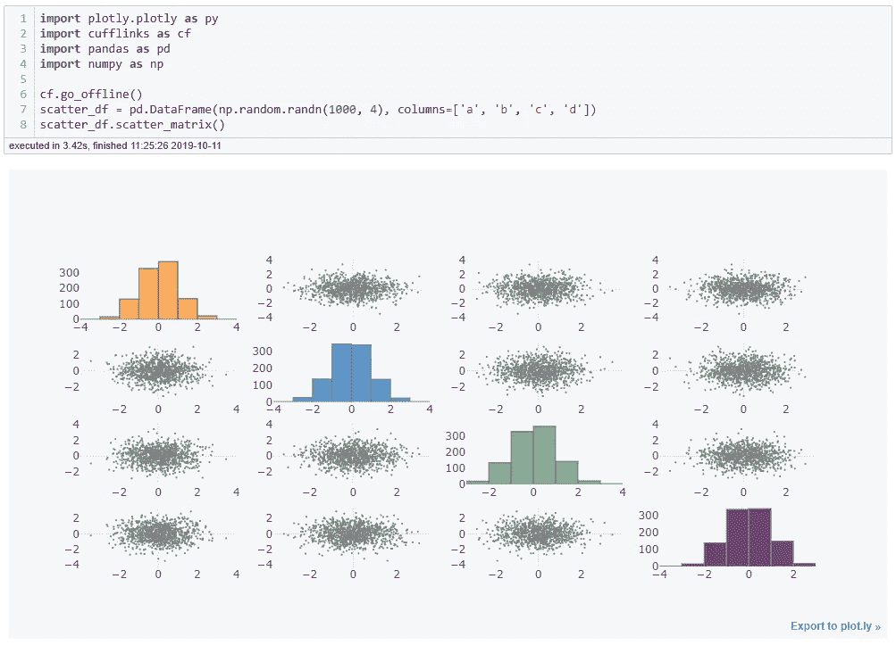
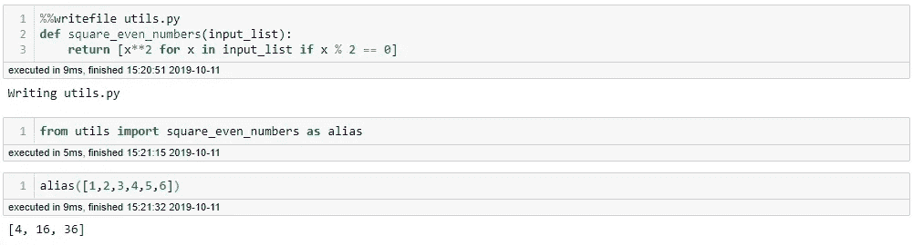

# 快速改进 Python 数据分析的 7 件事

> 原文：<https://towardsdatascience.com/7-things-to-quickly-improve-your-data-analysis-in-python-3d434243da7?source=collection_archive---------5----------------------->


A pretty picture to catch your eye.

让您的数据分析更上一层楼！

# 再次感谢你

对听起来像破记录的完全明显的风险视而不见我只想对另一个巨人**说一声谢谢**感谢所有阅读和分享我上两篇文章的人: [**Python 窍门 101，每个新程序员都应该知道的事情**](/python-tricks-101-what-every-new-programmer-should-know-c512a9787022) 和 [**只用一行 Python 代码**](/exploring-your-data-with-just-1-line-of-python-4b35ce21a82d) 探索您的数据。在这里，我认为“Python 技巧 101…”的文章是成功的，然后你继续前进，再次吹走任何期望。
所以，引用我自己的话:

> "谢谢，让我们继续吧！"

在这篇文章中，我认为创建一个我学到的东西的列表会很好，这些东西加速或改进了我的日常数据分析。所以，事不宜迟，这里列出了我们将在文章中涉及的内容:

# 内容概述:

1.  **熊猫简介**
2.  **使用袖扣绘制熊猫数据& Plotly**
3.  IPython 魔法命令
4.  **Jupyter 中的奇特格式**
5.  **Jupyter 快捷键**
6.  **Jupyter(或 IPython)中每个单元的多个输出**
7.  **立即在你的 Jupyter 笔记本上制作幻灯片**

如果这些听起来像是你可能喜欢学习的东西，继续滚动。

请注意，这将是一个相当长的问题。尽管如此，我还是尽可能做到简明扼要。我希望你喜欢！

# #1:熊猫简介

对于那些一直关注我的人来说，这并不奇怪。这个工具的好处是显而易见的。下面的动画是调用简单方法`df.profile_report()`的结果，自己看看结果报告:


使用这个工具很简单，只需安装和导入 Pandas Profiling 包。

我不会在这个问题上花太多时间，因为我已经写了一篇关于这个主题的小文章，所以如果你想知道更多关于这个包的宝石，那么请在这里阅读我关于熊猫简介的文章:

[](/exploring-your-data-with-just-1-line-of-python-4b35ce21a82d) [## 仅用一行 Python 代码探索您的数据

### 在不到 30 秒的时间内完成所有标准数据分析。熊猫侧写的奇迹。

towardsdatascience.com](/exploring-your-data-with-just-1-line-of-python-4b35ce21a82d) 

# **#2:使用袖扣绘制熊猫数据& Plotly**

我们当中大多数有着*经验的*数据科学家或数据分析师，都会对[**【matplotlib】**](https://matplotlib.org/)**和 [**熊猫**](https://pandas.pydata.org/) 之间的集成相当熟悉。也就是说，你可以快速绘制一个简单的 pd 图。数据帧或 pd。系列，只需调用`.plot()`方法:**

****

**Kind of boring right?**

**现在，这一切都很好，但如何一个互动的，可平移，可缩放，可缩放的情节呢？ [**袖扣**](https://plot.ly/ipython-notebooks/cufflinks/) 来救场了！*(承蒙*[](https://plot.ly/)**)****

***要在您的环境中安装袖扣，只需在您最喜欢的终端上运行`! pip install cufflinks --upgrade`，您就可以开始了。看一看以下内容:***

******

***Much better!***

***注意，上面唯一改变的是袖扣的进口和`cf.go_offline()` 的设置。除此之外，只需将你的`.plot()`方法改为`.iplot()`即可。***

***像`.scatter_matrix()`这样的其他方法也能给你一些非常好的观想:***

******

***Very cool!***

***我强烈建议任何从事大量数据可视化工作的人看看 [**袖扣**](https://plot.ly/ipython-notebooks/cufflinks/) 和[**plottly**](https://plot.ly/)**的文档，为自己发现更多的方法！*****

# *******#3: IPython 魔法命令*******

*****IPython 的“魔力”基本上是 IPython 在标准 Python 语法之上的一系列增强。魔术命令有两种风格:*线魔术*，由单个`%`前缀表示并在单行输入上操作，以及*单元魔术*，由双`%%`前缀表示并在多行输入上操作。以下是“魔术”提供的一些有用的功能:*****

## *****%lsmagic:找到他们。*****

*****为什么不从一些古老的自助开始呢？如果你要记住一个魔法命令，它应该是这个。执行`%lsmagic`命令将授予您所有可用魔法命令的完整列表:*****

**********

## *****%debug:交互式调试。*****

*****这大概是我用的最多的魔法命令了。*****

*****我们大多数人都尝试过:你发现自己正在执行一个不断中断的代码块，而你——*在极度绝望中*——编写 20 条 print()——语句来输出每个变量的内容。然后，当您最终解决问题时，您必须返回并再次删除所有打印功能。*****

*****但现在不是了！遇到问题后，只需执行`%debug`命令，并执行您想要的任何代码部分:*****

**********

*****那么上面发生了什么？*****

1.  *****我们有一个函数，它接受一个列表作为输入，对所有偶数求平方。*****
2.  *****我们运行我们的函数，但是有东西坏了。我们没被告知什么！*****
3.  *****我们使用`%debug`命令在函数中断时进入函数。*****
4.  *****我们要求调试器告诉我们`x`和`type(x)`的值。*****
5.  *****失败是明显的。我们将`'6'`作为**字符串**传递！*****

*****这对于更复杂的函数非常有用，我相信你可以想象得到！*****

## *****%store:在笔记本之间传递变量。*****

*****这个也很酷。为了便于讨论，假设您花了一段时间清理笔记本中的一些数据，现在您想在另一台笔记本中测试一些功能，因此您必须在同一台笔记本中实现这些功能，或者保存您的数据并将其加载到另一台笔记本中，对吗？不是用`%store`！只需存储变量并在您想要的任何其他笔记本中检索它:*****

**********

*****`%store [variable]`存储变量。
`%store -r [variable]`读取/检索存储的变量。*****

## *****%who:列出全局范围的所有变量。*****

*****曾经给一个变量赋值却忘记了变量名？也许你不小心删除了单元格为变量赋值的职责？用`%who`你会得到一个所有全局赋值变量的列表:*****

**********

## *****%%time:魔法计时。*****

*****通过这个小命令，您可以获得您可能需要的所有时间信息。只需将`%%time`命令应用于您想要的任何一段可执行代码，您将得到如下输出:*****

**********

*****24 micro-seconds.. Sloppy*****

## *******%%writefile:将单元格内容写入文件。*******

*****而这也将是我在本文中要讲的最后一个。当您在笔记本中编写了一些复杂的函数或类，并希望将其保存在独立于笔记本的文件中时，这种方法特别有用。只需在函数或类的单元格前加上`%%writefile`命令，后跟一个文件名来保存它:*****

**********

*****如您所见，我们可以简单地将我们创建的函数保存到一个" *utils.py* "文件中，然后我们就可以随意地导入它。在其他笔记本中也是如此！*(只要它们在 utils.py 文件的同一个目录中)******

# *******# 4:Jupyter 中的奇特格式*******

*****这个超级酷！基本上，Jupyter 允许在 markdown 单元格中设置一些 HTML / CSS 格式。这些是我用过最多的一次:*****

*****蓝色时尚的那款:*****

```
***<div class="alert alert-block alert-info">
    This is <b>fancy</b>!
</div>***
```

*****红色的有点吓人的那个:*****

```
***<div class="alert alert-block alert-danger">
    This is <b>baaaaad</b>!
</div>***
```

*****绿色和宁静的那个:*****

```
***<div class="alert alert-block alert-success">
    This is <b>gooood</b>!
</div>***
```

*****在这里看看他们的行动:*****

**********

*****当你想用笔记本的形式展示一些发现时，这些是很好的选择！*****

# *******#5: Jupyter 快捷键*******

*****访问和学习键盘快捷键，可以使用命令调板:`Ctrl + Shift + P`。这将显示笔记本所有功能的列表。以下是最基本命令的摘录:*****

*****`Esc`:这将带你进入 ***命令模式*** 。这也是您可以使用箭头键浏览笔记本的模式。*****

*****而在 ***命令模式下*** :*****

*   *****`A`和`B`:在当前单元格的上方或下方插入一个新单元格。*****
*   *****`M`:将当前单元格改为[**M**ark down。*****
*   *****`Y`:将当前单元格改为编码。(y tho？)*****
*   *****`D,D`:[**D**]有效[**D**]删除当前单元格。*****

*****`Enter`:返回当前单元格的 ***编辑模式*** 。*****

*****在 ***编辑模式下*** :*****

*   *****`Shift + Tab`:显示您在当前单元格中键入的对象的**Docstring**(documentation)——按住快捷键在文档模式间循环。*****
*   *****`Ctrl + Shift + -`:从光标所在位置拆分当前单元格。*****
*   *****`Esc + F`:查找并替换除输出之外的代码。*****
*   *****`Esc + O`:切换单元格输出。*****

*****选择多个单元格:*****

*   *****`Shift + Down`和`Shift + Up`:选择向下或向上的下一次卖出。我认为你可以用推理的力量找出哪个是哪个。*****
*   *****`Shift + M`:合并选中的单元格。*****
*   *****作为旁注，请记住，一旦选择了单元格，您就可以批量删除/复制/剪切/粘贴/运行它们。*****

# *******# 6:Jupyter(或 IPython)中每个单元的多个输出*******

*****这个很棒。你有没有想过展示？head()和。tail()但是你中途放弃了，因为创建额外的代码单元来运行。tail()方法？不用担心，现在您可以使用以下代码行显示您想要的所有输出:*****

```
***from IPython.core.interactiveshell import InteractiveShell
InteractiveShell.ast_node_interactivity = "all"***
```

*****瞧，多路输出的力量:*****

**********

*****Easy peasy lemon squeezy*****

# *******#7:即时制作笔记本幻灯片*******

*****使用 **RISE** 功能，只需轻轻一击，你就可以将你的 Jupyter 笔记本变成幻灯片。最棒的是，笔记本还是活动的，可以边演示边进行现场编码！看一看:*****

**********

*****Source: [https://github.com/damianavila/RISE](https://github.com/damianavila/RISE)*****

*****要使用这款出色的工具，只需根据您的环境使用 conda 或 pip 安装 RISE 即可:*****

```
***conda install -c conda-forge rise
/// OR ///
pip install RISE***
```

*****现在，只需单击“新建”按钮，您就可以从笔记本中创建精美的幻灯片:*****

**********

# *****结束语*****

*****感谢阅读。我鼓励任何人自己更详细地探索每一点，找出你想要在自己的工作流程中应用它们的确切内容和方式。*****

*****如果你想看和了解更多，一定要关注我的 [**媒体**](https://medium.com/@peter.nistrup) 🔍**[**碎碎念**](https://twitter.com/peternistrup) 🐦*******

*****[](https://medium.com/@peter.nistrup) [## 彼得·尼斯特鲁普-中等

### 阅读彼得·尼斯特拉普在媒介上的作品。数据科学、统计和人工智能...推特:@PeterNistrup，LinkedIn…

medium.com](https://medium.com/@peter.nistrup)*****