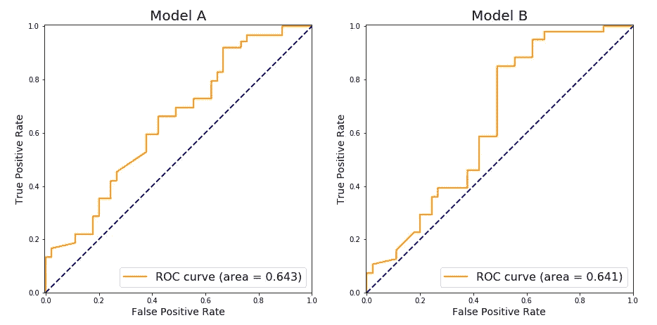
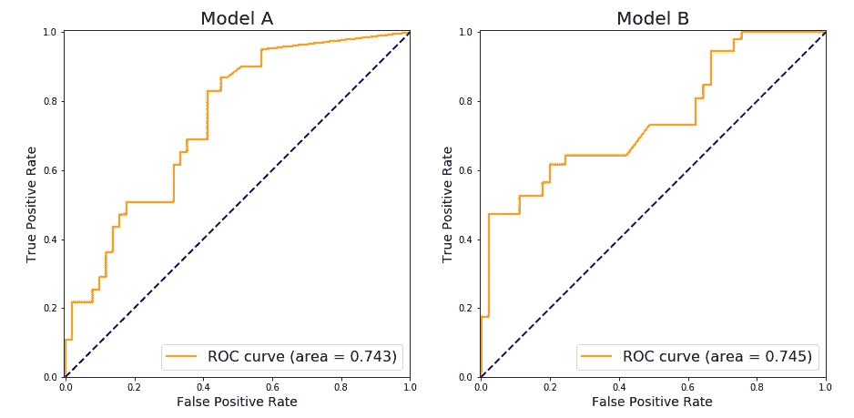
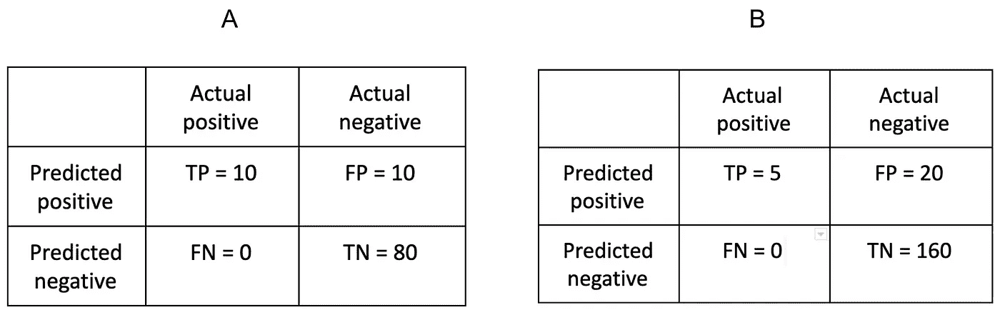

# 关于 ROC AUC 你应该知道的 7 件事

> 原文：<https://towardsdatascience.com/7-things-you-should-know-about-roc-auc-b4389ea2b2e3?source=collection_archive---------7----------------------->

## 流行的性能指标的几个警告

Image by [Gerd Altmann](https://pixabay.com/users/geralt-9301/?utm_source=link-attribution&amp;utm_medium=referral&amp;utm_campaign=image&amp;utm_content=1044090) from [Pixabay](https://pixabay.com/?utm_source=link-attribution&amp;utm_medium=referral&amp;utm_campaign=image&amp;utm_content=1044090)

不同分类问题的模型可以通过尝试最大化或最小化各种性能测量来拟合。针对模型性能的一个方面而非另一个方面的测量非常重要，以便我们能够做出明智的决策，并选择最适合我们设计的性能测量。

ROC AUC 通常在许多领域中被用作评估分类器性能的突出度量，并且研究人员可能由于较高的 AUC 而偏爱一个分类器。

关于 ROC AUC 的复习，可以在[这里](https://developers.google.com/machine-learning/crash-course/classification/roc-and-auc)找到清晰简明的解释。如果你对 ROC AUC 完全不熟悉，你可能会发现这篇文章对这个主题挖掘得有点太深，但我希望你仍然会发现它很有用，或者将它收藏起来以供将来参考。

此处提供的大部分材料基于[ [Lobo 等人，2008](http://www2.unil.ch/biomapper/Download/Lobo-GloEcoBioGeo-2007.pdf) ]的一篇论文，其中作者阐述了关于使用 ROC AUC 评估分类模型性能的几个问题。

我们将回顾使用 ROC AUC 时应该注意的几个问题，并查看一些示例以更好地理解它们。

## **苹果不是橘子**

乍一看，似乎使用两个分类器的决策函数计算的单个数字(ROC AUC)确实可以用于比较它们。这个想法是基于隐含的假设，即两个分类器的 AUC 是以独立于分类器决策函数输出(即分数)分布的方式导出的。
然而，在[手，2009](https://link.springer.com/content/pdf/10.1007/s10994-009-5119-5.pdf) 作者表明，事实并非如此:

> AUC 使用取决于分类器本身的度量来评估分类器。也就是说，AUC 使用不同的度量来评估不同的分类器。

并进一步提供了以下类比:

> 这就好像一个人用一把以英寸为单位的尺子测量一个人 A 的身高，而另一个人用一把以厘米为单位的尺子测量一个人 B 的身高，然后仅仅通过比较数字来决定谁更高，而忽略了测量单位不同的事实。"

简而言之 AUC 是一个平均的最小损失度量，其中错误分类损失是在一个成本比分布上平均的，该成本比分布取决于所讨论的分类器的分数分布。

换句话说，我们可以计算分类器 **A** 的 AUC 并得到 0.7，然后计算分类器 **B** 的 AUC 并得到相同的 AUC 0.7，但这并不一定意味着它们的性能相似。

我们鼓励好奇的读者阅读[ [Hand，2009](https://link.springer.com/content/pdf/10.1007/s10994-009-5119-5.pdf) ]，在那里他会找到对该问题非常直观的解释，以及严格的数学分析，然后是建议的解决方案。

## **概率值被忽略**

让我们比较两个假设的二元分类模型，它们适用于来自数据的相同样本:

*   模型 A 预测许多正面例子有 **~0.55** 的概率为正面，许多负面例子有 **~0.45** 的概率。
*   模型 B 预测许多正面例子有概率 **~0.85** 为正面，许多负面例子有概率~ **0.25** 。

两个模型可以有非常相似的 AUC，但模型 B 在区分正面和负面例子方面显然做得更好。选择不同的样本并重新调整我们的模型会产生不同的结果，而模型 B 的卓越的分类能力会更加明显。

如果我们仅依靠 AUC 来评估模型表现，我们可能会认为模型 A 和 B 非常相似，而事实上它们并不相似。

## **“曲线下面积”不等于“感兴趣面积”**

评估 ROC 曲线时，有两个区域描述了模型在“极端”阈值下的表现:

*   曲线的左侧有一个小的真阳性率，也有一个小的假阳性率。
*   曲线的右边，我们有很大的真阳性率，也有很大的假阳性率。

我们显然不会仅仅因为一个模型在这些区域有较大的 AUC 而偏爱它，但是 AUC 只是一个单一的数字，它也包括这些区域的 ROC 曲线下的面积。

Image by Author

A 型比 B 型好吗？

两个模型的 AUC 非常相似，但模型 A 在真阳性率与假阳性率(对于所有阈值)方面更一致，而对于模型 B，真阳性率和假阳性率之间的比率高度依赖于阈值选择-阈值越低越好。

## **哪个更重要？真阳性率还是假阳性率？**

在某些情况下，最小化假阳性率比最大化真阳性率更重要，而在某些情况下，可能正好相反。这完全取决于我们的模型将如何被使用。

当计算 AUC 时，假阳性率和真阳性率的权重相等，因此它不能帮助我们选择适合我们特定用例的模型。

Image by Author

A 和 B 哪个型号更好？

这取决于我们的领域和我们打算使用模型的方式。

*   考虑到**模型 A** 的 ROC 曲线，如果我们决定我们必须有至少 **60%** 的真阳性率，我们将不得不接受该模型也将有 **30%** 的假阳性率。
*   考虑到**模型 B** 的 ROC 曲线，我们可以实现至少 **60%** 的真阳性率和 **20%** 的假阳性率。

如果最小化假阳性率是我们案例中最重要的衡量标准，那么模型 B 优于模型 A，即使它们具有非常相似的 AUC。

## **模型误差在特征范围内的分布**

让我们比较两个简单的二元分类模型，它们使用单个特征 ***x*** 来预测类别 ***y*** 。
假设两个模型达到相同的精度。

*   **模型 A** 的误分类错误发生在 ***x*** 的小值以及 ***x*** 的大值。
*   **模型 B** 的误分类错误多发生在 ***x*** 的低值，很少发生在 ***x*** 的大值。

两种模型可以具有非常相似的 AUC，但是:

*   对于 ***x*** 的大值，模型 B 在预测 ***y*** 方面要好得多。
*   型号 A 在 ***x*** 范围内具有更一致的性能

AUC 本身无法让我们知道模型之间的性能有如此大的差异，我们也不知道它们的误差分布是否不同。

## **评估不平衡类的性能**

我们经常会遇到类别不平衡的数据。
考虑两个混淆矩阵，这两个混淆矩阵是通过对来自数据的两个不同样本拟合相同的模型而获得的:

> **注** : AUC 使用模型的单一阈值计算，如[ [Sokolova & Lapalme，2009](http://rali.iro.umontreal.ca/rali/sites/default/files/publis/SokolovaLapalme-JIPM09.pdf) ]:
> AUC = 0.5*(灵敏度+特异性)。

Image by Author

我们的混淆矩阵如下:

*   混淆矩阵 A 是在样本上评估模型的结果，其中正例构成数据的 **10%** 。
*   混淆矩阵 B 是在样本上评估相同模型的结果，其中正面例子构成数据的 **3%** 。
    我们通过将反面案例的数量增加一倍、正面案例的数量减半来实现这一目标

性能指标包括:

*   **混淆矩阵 A** —
    精度:0.5
    召回:1
    F1-得分:0.666
    AUC: 0.5625
*   **混淆矩阵 B** —
    精度:0.2
    召回:1
    F1-得分:0.333
    AUC: 0.5625

在这两种情况下，我们获得了相同的 AUC，但是其他测量值(例如 F1 分数)的变化表明，我们的模型的性能根据正例的比例而变化，而 AUC 在上述条件下是不变的-将负行和正行乘以不同的标量[ [Sokolova & Lapalme，2009](http://rali.iro.umontreal.ca/rali/sites/default/files/publis/SokolovaLapalme-JIPM09.pdf) ]。

同样，AUC 本身并不能提供我们评估模型性能所需的所有信息。

## 小样本精度

在[ [Hanczar 等人，2010](https://academic.oup.com/bioinformatics/article/26/6/822/244957) ]中，作者进行了模拟研究以及对真实数据的分析，并发现 ROC 相关的估计值(AUC 是其中之一)是实际指标的相当糟糕的估计值。这在小样本(50-200 个示例)中更为突出，当类别不平衡时，情况会变得更糟。

换句话说，当我们使用 AUC 评估分类器的性能时，我们这样做是为了尝试和估计分类器 ***真实的*** AUC，当它将“在野外”用于真实数据时(即，当我们的分类器将在生产中运行时)。然而，我们计算的 AUC(对于小样本)是一个糟糕的估计值——它离真正的 AUC 太远了，我们应该非常小心，不要相信它。

需要明确的是，如果我们基于包含 200 个样本的样本计算 AUC，并且我们获得的 AUC 为 0.9，那么真实的 AUC 可能是 0.75，我们无法知道(至少在不查看置信区间或其他一些工具的情况下，这些工具将使我们能够衡量估计量的方差)。

# 我们应该如何使用 ROC AUC 来衡量绩效？

而一些性能测量更容易解释(精确度、召回率等)。)ROC AUC 有时被视为一个神奇的数字，它以某种方式量化了我们需要了解的关于模型性能的所有信息。

正如我们所指出的，如果我们选择使用 ROC AUC，我们需要了解它的各种问题。如果在考虑了这些问题之后，我们仍然认为我们希望使用 ROC AUC 来评估分类器的性能，我们可以这样做。我们可以使用任何我们想要的方法，只要我们充分意识到它的局限性和缺点——正如我们使用 Recall 并记住它对于假阳性的数量是不变的一样，我们也可以使用 ROC-AUC，同时记住它的局限性。

重要的是要强调，不应该只使用单一的指标来比较分类模型的性能。在这方面，ROC AUC 与精确度、召回率或任何其他常用指标没有什么不同。为了全面地评估性能，我们最好考虑几个感兴趣的指标，同时了解它们的特征。

# 摘要

我们讨论了关于 ROC AUC 的几个问题:

1.  AUC 依赖于分类器的内在属性，这使得基于 AUC 的分类器比较不适合于比较(在许多常见情况下)。
2.  AUC 不反映分类器预测的潜在概率值。
3.  AUC 是通过考虑所有可能的评分阈值来计算的，无论我们是否会选择使用这些阈值。
4.  假阳性和真阳性是同等重要的，不管它是否适合我们。
5.  AUC 不提供关于分类器误差分布的信息。
6.  AUC 相对于数据中阳性样本的比率是不变的。
7.  AUC 对于小样本是不可靠的。

ROC AUC 与其他指标相似，有其优点和缺点。因为有很多资料都提到了它的优点，所以这篇文章重点介绍了它的一些其他特征。这些是 ROC AUC 测量的特性，不一定是缺点。每个度量在某些条件下是可变的，而在另一些条件下是不变的(正如你可以在[ [索科洛娃&拉帕尔梅，2009](http://rali.iro.umontreal.ca/rali/sites/default/files/publis/SokolovaLapalme-JIPM09.pdf) ]中看到的那样)，这些属性是有利还是不利由用户决定。

最好使用几个指标来比较分类器，而不仅仅是一个，当使用 ROC AUC 时，人们还可以查看 ROC 曲线，它可以提供有价值的信息[ [Fawcett，2004](http://www.blogspot.udec.ugto.saedsayad.com/docs/ROC101.pdf) ]。

# 好了

感谢您的阅读！我希望这篇文章对你有用。如果您有任何问题或建议，请留下评论。欢迎各种形式的反馈！

# 进一步阅读

[ [Sokolova & Lapalme，2009](http://rali.iro.umontreal.ca/rali/sites/default/files/publis/SokolovaLapalme-JIPM09.pdf) ]提供了在机器学习分类任务的完整频谱中使用的 24 个性能测量的分析，并审查了这些测量在混淆矩阵变化下出现的 8 个不变性属性的方差和不变性。

关于如何解读 ROC 图的非常好的论文，你可以参考[ [Fawcett，2004](http://www.blogspot.udec.ugto.saedsayad.com/docs/ROC101.pdf) ]。作者自下而上非常透彻地解释了这个主题。

如果你对 ROC 曲线的置信带感兴趣[ [Macskassy & Provost，2004](https://archive.nyu.edu/jspui/bitstream/2451/27802/2/CPP-07-04.pdf) ]提供几个选项。

[ [Ferri et al. 2005](http://dmip.webs.upv.es/ROCML2005/papers/ferriCRC.pdf) ]引入了一种新的概率版 AUC，称为 pAUC，它在评估排名表现的同时也考虑了概率的大小。

# 参考

1.  洛博，J. M .，希门尼斯-瓦尔夫德，a .，&雷亚尔，R. (2008)。 [AUC:对预测分布模型表现的误导性衡量](http://www2.unil.ch/biomapper/Download/Lobo-GloEcoBioGeo-2007.pdf)。*全球生态与生物地理学*， *17* (2)，145–151。
2.  Hand，D. J. (2009)。[测量分类器性能:ROC 曲线下面积的连贯替代方法](https://link.springer.com/content/pdf/10.1007/s10994-009-5119-5.pdf)。*机器学习*， *77* (1)，103–123。
3.  m .索科洛娃和 g .拉帕尔梅(2009 年)。[对分类任务的性能测量的系统分析](http://rali.iro.umontreal.ca/rali/sites/default/files/publis/SokolovaLapalme-JIPM09.pdf)。*信息处理&管理*、 *45* (4)、427–437。
4.  汉扎尔，b .，华，j .，西玛，c .，温斯坦，j .，，m .，&多尔蒂，E. R. (2010)。[ROC 相关估计的小样本精度](https://academic.oup.com/bioinformatics/article/26/6/822/244957)。*生物信息学*， *26* (6)，822–830。
5.  麦克卡西和教务长(2004 年)。[ROC 曲线的置信带:方法和实证研究](https://archive.nyu.edu/jspui/bitstream/2451/27802/2/CPP-07-04.pdf)。第一届人工智能 ROC 分析研讨会会议录。2004 年 8 月。
6.  茨韦塔纳·福塞特(2004 年)。ROC 图:[研究者注意事项和实际考虑](http://www.blogspot.udec.ugto.saedsayad.com/docs/ROC101.pdf)。*机器学习*， *31* (1)，1–38。
7.  Ferri，c .，Flach，p .，Hernández-Orallo，j .，和 Senad，A. (2005 年 8 月)。[修改 ROC 曲线，纳入预测概率](http://dmip.webs.upv.es/ROCML2005/papers/ferriCRC.pdf)。在*第二届机器学习 ROC 分析研讨会会议录*(第 33–40 页)。机器学习国际会议。