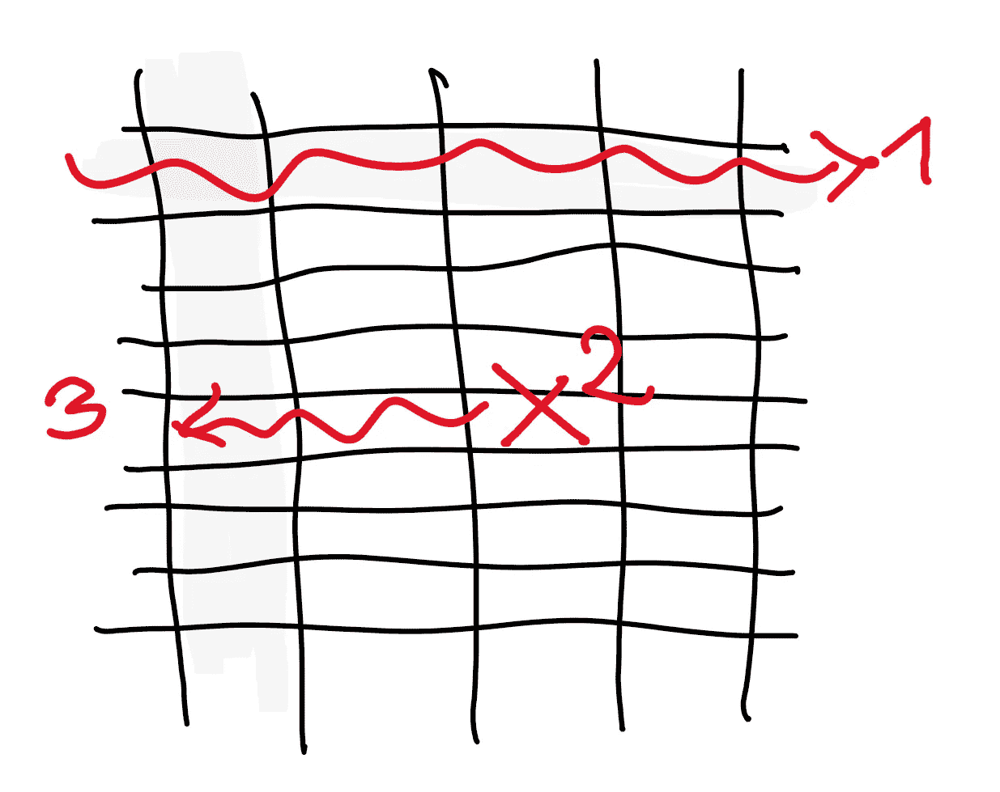
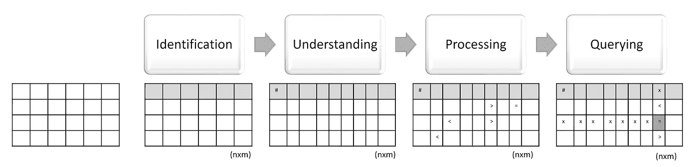
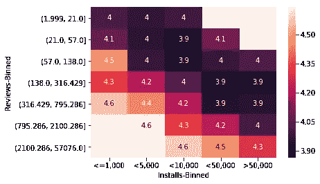
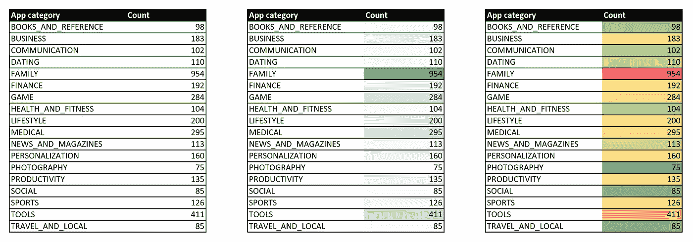

# 优化表格数据显示的 7 条经验法则

> 原文：<https://towardsdatascience.com/7-thumb-rules-to-optimize-your-tabular-data-presentation-97da86bbbf46?source=collection_archive---------25----------------------->

有时当你向观众展示你的研究成果时，你需要用一张表格。表格很难理解，因为它们可以同时显示多个维度，并且通常只使用标题来定义选择数据的方式。

当以表格的方式显示记录时，你的数据有可能不被识别。表格不会引起任何人的注意。你可以尽力解释每个单元格内的值，但你可能会失败。当与表格打交道时，人们首先需要理解表格是关于阅读标题的。然后，他们必须随机选择单元格来理解数据类型，并调整数值以评估他们所读取的数据量。最后，他们需要大量的精力来理解你在说什么。

**TL；DR:** 我将向您展示一些针对表格数据的数据识别技术。这些技术将帮助您的受众更多地关注您的单元格的影响，而不是表格定义本身——请随意下结论以获得快速的项目符号列表。

## 何时使用桌子

由于表格风险很大，你必须谨慎选择何时使用它们。它们能很好地展示分析数据和多维信息，但很难一目了然。在讨论你的发现时，只有在你离不开的情况下才选择一张桌子。

「只有离不开才选桌子」是什么意思？嗯，当一个事件的大小需要用数字来描述时，或者当需要一个数字参考来捕捉数据的影响时，你不能没有。当您需要进行分析并显示不同维度和统计样本之间的相关性时，您可能需要一个表格。

表格也是表示数据的最结构化的方式:每次想要显示原始数据或精确数据时，都需要使用表格。

# 数据库隐喻

> 我们的大脑就像一个数据库。它需要指数才能表现良好。颜色是它索引表格的方式。

我们的大脑没有能力看一张表，一眼就看到所有的信息。*如果你不添加一些色彩，你的观众将需要大量的时间和精力来理解和处理你的数据*。值得一提的是，由于理解和处理数据需要集中注意力，他们必须在停止听你说话或阅读表格之间做出选择。

在最好的情况下，当你想让你的读者理解你的研究的总体结果时，他们只会阅读一些随机的单元格。

按照我们的数据库比喻，当显示一个表时，我们需要:

1.  *运行一个“创建表格”命令*。我们需要确定所有的列，并仔细阅读它们，一个接一个。从左到右(当有许多列时，人们使用从中心到最外围的列来阅读:使用此信息将最有用的信息放在中心区域)。这是识别阶段。
2.  *“改变表格”以找到数据类型*。因为我们不是真正的数据库，所以我们需要从单元格中选取随机值来理解每个列的数据类型。这个过程很慢，如果在标题上添加度量单位，也会发生这种情况:理解人类的数据类型发生在表定义之后。这就是“理解阶段”。
3.  有一个时刻*你必须得到你的数据的上下文*。你需要给自己定位。这就像一个测试，以确保您理解了模式。我们需要选择随机值，并将这些值与其他值进行比较，以确定“大于”和“小于”的良好定义。注意:如果可以的话，你应该标准化你的数据以使这个阶段更快。这就是我所说的“处理阶段”。
4.  *应用“选择”语句*。**这是最重要的部分，因为这是唯一一个给你的表增加商业价值的部分**。你需要以某种方式指定一个“往哪里看”或“如何分组”的条件，让人们找到一些证据。标题是达到这一效果的最常见方式。我将向你展示如何用颜色来强调事实观察。这就是“查询阶段”。

你知道，当你运行“选择语句”时，你还需要一些索引来加快搜索速度。*如果你不使用索引，你需要扫描整个表*。我们来讨论一下这个问题。

# 为你的餐桌增添色彩

热图对你有帮助。我建议你在任何可能的地方(总是)使用它们。

考虑下表:

这显示了应用程序统计样本在谷歌 Play 商店上的平均评论，分为安装应用程序的设备数量和评论数。以这种方式显示数据很容易理解 3.9 左右的值是我们的预期值。

我在没有上下文的情况下提出了这个表，在阅读它之前，你已经知道有一个模式。在阅读标题之前，你已经意识到数值是以一种统一的方式分布在对角线上的，并且你已经了解了一般事件的大小。

如果你想让你的读者稍后再处理标题(这样他们就可以先关注价值)，你应该使用更大更鲜艳的单元格。在我们的例子中，在知道表的内容之前，您就知道值是平均分布的。

## 如何快速选择数据

继续我们的比喻，我们可以说我们的眼睛把一个表看作一个数据库引擎。如果没有索引，检索数据会花费很多时间。

还有一个问题。数据库在两个不同的时间运行 create-table 命令和 select 命令，我们也是这样做的。问题是在演示过程中，我们必须同时处理这两个命令。

我们可以说表更像是一个“数据库视图”:它们在我们的 RAM 中:我们每次都需要重新创建它们。当访问(查询)数据时，我们几乎每次都必须提取列来获得上下文。

我们需要一种方法来“物化”我们的视图并添加索引。颜色就像聚簇索引:它们帮助你查找数据，将信息存储在彩色(索引)栏中。它们也是以语义有效的方式对数据进行排序的一种很好的实用方法。

考虑这个例子:

这些表格以 3 种不同的方式向我们展示了相同的数据:

1.  第一张*表*是无色的。你需要很多时间来阅读所有的数据，你也不知道它们有什么有趣的地方。低值比高值好吗？这个表也根本不包含“select”语句。
2.  第二张*表*显示了一些绿色和彩色值。我们的大脑会理解我们应该关注(并希望记住)一两行，因为其他行不太相关。绿色还会告诉我们的大脑，这几个值与积极的发现有关。
3.  第三个表格的第二列背景颜色为绿红色。由于有更多的颜色，它需要更多的时间来处理比第二个。它向我们表明，积极的项目很多，消极的项目很少。

尽管第二个和第三个表包含相同的原始数据，但它们显示了不同的证据。我们可以说它们与不同的“select”语句绑定在一起。

作为一名数据科学家，你应该问问自己为什么要提出这个表格。如果你想强调你的统计总体缺乏一致性，你应该使用第三表:许多颜色的梯度有助于你的大脑划分数据。如果你想告诉你的观众，在 Play Store 上有更多的“家庭”和“工具”应用程序，你应该使用第二张表。

这是因为颜色代表我们大脑中的集群。它们不仅与情感有关，而且是宁滨事实的有力证明。在处理数据时，将颜色视为分组数据的盒子，将相同颜色的阴影视为盒子内的排序优先级。

# 结论(TL；博士)

现在，我们有了一种实用的方法来将表定义与索引绑定在一起，并将表与查询命令链接在一起。让我们总结一下我们的发现:

1.  如果你需要表格并且你想让你的数据被理解，那么**将它们着色**。
2.  **始终建议您的表(定义)和要应用的查询**。如果你能展示你的查询结果就更好了:用颜色来达到这个目标。
3.  如果你希望你的数据是中性的，就不要使用绿色或红色:颜色具有基于文化的情感价值。
4.  **大而填充的单元格在标题前被阅读**:如果你想让你的读者在知道数据是关于什么之前找到一个模式，现在你知道该怎么做了。
5.  **颜色就像聚集索引**:它们是在“数据库扫描”所有行之前得到一个点的唯一方法。
6.  **使用“选择…位置”条件绑定表格，使用相同颜色的阴影**。阴影既是索引又是过滤器。
7.  **使用多种颜色在你的“选择”语句中应用“分组依据”**。在 faster 中按索引分组。