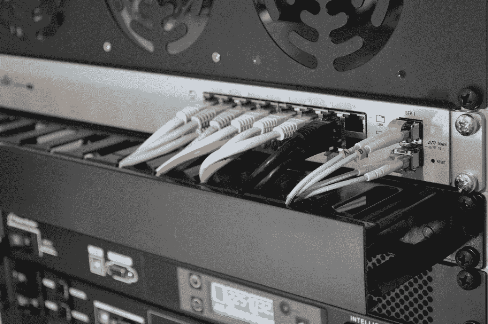
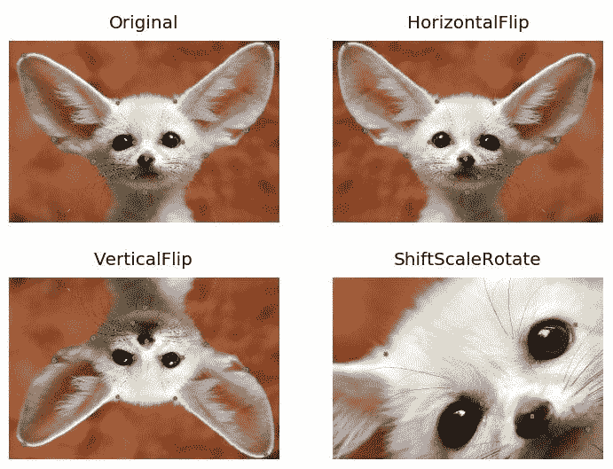
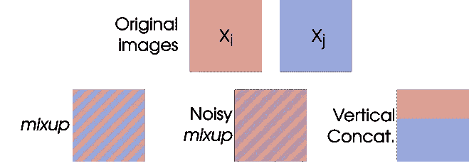
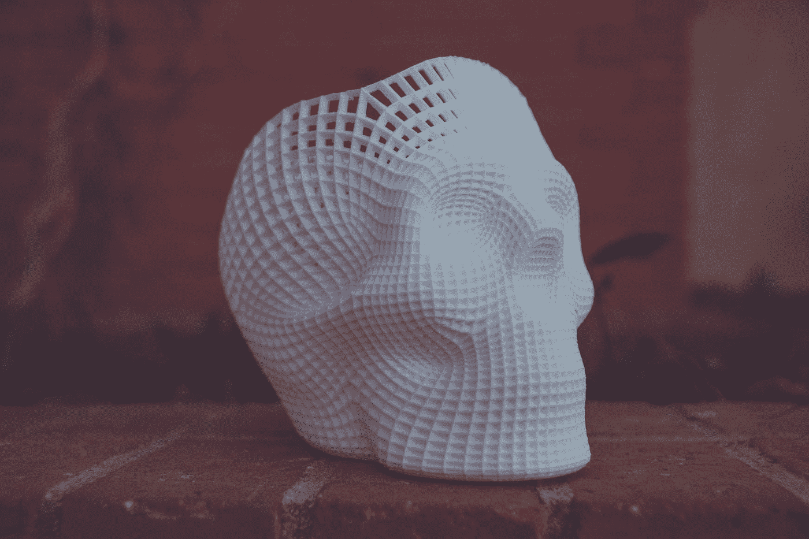
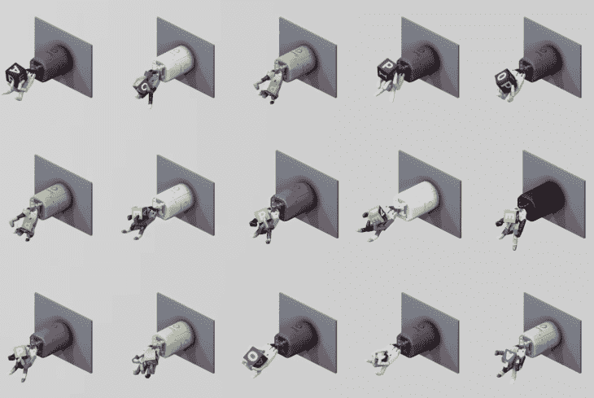
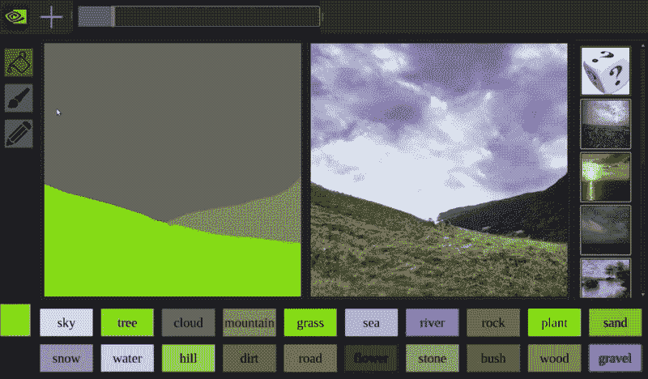

# 处理小数据的 7 个技巧

> 原文：<https://towardsdatascience.com/7-tips-for-dealing-with-small-data-7ffbd3d399a3?source=collection_archive---------3----------------------->

## 因为通常情况下，这就是你要得到的。

我们经常听说 ***大数据*** 是构建成功机器学习项目的关键。

> 这是一个主要问题:许多组织没有你需要的数据。

没有最基本的原材料，我们如何原型化和验证机器学习的想法？在资源稀缺的情况下，如何高效地获取数据并利用数据创造价值？

在我的工作场所，我们为客户制作了很多功能原型。正因为如此，我经常需要让 ***小数据*** 大有作为。在这篇文章中，我将分享 7 个小技巧来改善你的小数据集的原型制作结果。

# 1:意识到你的模型不会概括得那么好。

这应该是首要任务。你正在建立一个模型，它的知识是基于宇宙的一小部分，这应该是唯一一个可以期望它很好工作的地方。

如果你正在基于一系列室内照片构建一个计算机视觉原型，不要指望它在室外也能很好地工作。如果你有一个基于聊天室玩笑的语言模型，不要指望它能为奇幻小说工作。

**确保你的经理或客户理解这一点。**这样，每个人都可以对你的模型应该交付的结果有一个现实的期望。它还创造了一个机会，可以提出有用的新 KPI 来量化原型范围内外的模型性能。

# 2:建立良好的数据基础设施。

在许多情况下，客户端没有您需要的数据，公共数据也不是一个选项。如果原型的一部分需要收集和标记新的数据，确保你的基础设施尽可能少地产生摩擦。

你需要**确保数据标记非常简单**，这样非技术人员也可以使用。我们已经开始使用 [***神童***](https://prodi.gy/) ，我认为这是一个很好的工具:既可访问又可扩展。根据项目的规模，您可能还希望**设置一个自动数据接收**，它可以接收新数据，并自动将其提供给标签系统。

> 如果把新数据输入你的系统又快又容易，你会得到更多的数据。

# 3:做一些数据扩充。

您通常可以通过增加现有数据来扩展数据集。它是关于对数据进行微小的改变，而不应该显著地改变模型输出。例如，如果将猫的图像旋转 40 度，它仍然是猫的图像。

在大多数情况下，**增强技术允许你产生更多的“半唯一”数据点来训练你的模型**。首先，你可以尝试在你的数据中加入少量的高斯噪声。

对于计算机视觉来说，有很多巧妙的方法来增强你的图像。我有过使用 [***相册***](https://github.com/albu/albumentations) 库的正面体验，它可以进行许多有用的图像转换，同时保持你的标签不受伤害。

Photo credit: [Albumentations on Github](https://github.com/albu/albumentations)

另一个很多人发现有用的增强技术是****。*** 这种技术直接获取两幅输入图像，将它们混合在一起，并组合它们的标签。*

**

*Photo credit: [Cecilia Summers & Michael J. Dinneen](https://www.groundai.com/project/improved-mixed-example-data-augmentation/1)*

*当扩充其他输入数据类型时，需要考虑哪些转换会改变标签，哪些不会。*

**

# *4:生成一些合成数据。*

*如果您已经用尽了增加真实数据的方法，您可以开始考虑创建一些假数据。生成合成数据也是一种很好的方法，可以覆盖真实数据集没有覆盖的一些边缘情况。*

*举例来说，许多用于机器人的强化学习系统(如 OpenAI 的[***Dactyl***](https://openai.com/blog/learning-dexterity/))在部署到真实机器人之前，在模拟的 3D 环境中进行训练。对于图像识别系统，您可以类似地构建 3D 场景，为您提供成千上万的新数据点。*

**

*15 simulated instances of [**Dactyl**](https://openai.com/blog/learning-dexterity/)training in parallel.*

*创建合成数据有多种方法。在 [Kanda](https://www.kanda.dk/) ，我们正在开发一种基于转盘的解决方案，为物体检测创建数据。如果你有很高的数据需求，你可以考虑[使用*生成合成数据*](/graduating-in-gans-going-from-understanding-generative-adversarial-networks-to-running-your-own-39804c283399)*。要知道，GANs 是出了名的难训练，所以首先要确定这是值得的。**

****

**NVIDIAs [**GauGAN**](https://blogs.nvidia.com/blog/2019/03/18/gaugan-photorealistic-landscapes-nvidia-research/)in action!**

**有时你可以结合各种方法:苹果有一个非常聪明的方法 [**使用 GAN 来处理 3D 建模面部的图像，以看起来更加逼真**](https://machinelearning.apple.com/2017/07/07/GAN.html) 。如果你有时间的话，这是一个扩展数据集的很棒的技术。**

****

# **5。当心幸运劈叉。**

**在训练机器学习模型时，按照某种比例将数据集随机[拆分成**训练集和测试集**](/why-and-how-to-cross-validate-a-model-d6424b45261f) 是相当常见的。通常，这是好的。但是当处理小数据集时，由于训练样本的数量很少，因此存在很高的噪声风险。**

**在这种情况下，**您可能会意外地得到一个幸运的分割**:一个特定的数据集分割，在这个分割中，您的模型将会很好地执行并推广到测试集。然而在现实中，这可能只是因为测试集(巧合)不包含困难的例子。**

**在这种场景下， [***k 倍交叉验证***](https://machinelearningmastery.com/k-fold-cross-validation/) 是更好的选择。本质上，您将数据集分成 ***k*** “折叠”并为每个 ***k*** 训练一个新模型，其中一个折叠用于测试集，其余的用于训练。这控制了你所看到的测试性能不仅仅是由于幸运(或不幸)的分裂。**

****

# **6。利用迁移学习。**

**如果你正在处理某种标准化的数据格式，如文本、图像、视频或声音，你可以利用迁移学习来利用其他人在这些领域所做的工作。就像站在巨人的肩膀上。**

**当你进行迁移学习时，你采用其他人建立的模型(通常，*“其他人”*是谷歌、脸书或一所主要大学)，然后 [**对它们进行微调，以适应你的特殊需求**](/a-comprehensive-hands-on-guide-to-transfer-learning-with-real-world-applications-in-deep-learning-212bf3b2f27a) 。**

**迁移学习之所以有效，是因为大多数与语言、图像或声音有关的任务都有许多共同的特征。例如，对于计算机视觉来说，它可以检测某些类型的形状、颜色或图案。**

**最近，我为一个有高精度要求的客户开发了一个对象检测原型。我能够通过微调一个[***MobileNet***](/review-mobilenetv1-depthwise-separable-convolution-light-weight-model-a382df364b69)*[**单发探测器**](/review-ssd-single-shot-detector-object-detection-851a94607d11) 极大地加快开发速度，该探测器已经在谷歌的 [***开放图像 v4***](https://opensource.google.com/projects/open-images-dataset) 数据集(~ 900 万标记图像！).经过一天的训练，我能够使用大约 1500 张标记图像生成一个相当健壮的对象检测模型，其**测试图为 0.85。*****

****

# **7。试试“弱学习者”的合奏。**

**有时候，你不得不面对这样一个事实:你没有足够的数据来做任何新奇的事情。幸运的是，有许多传统的机器学习算法可供选择，这些算法对数据集的大小不太敏感。**

> **当数据集很小并且数据点的维数很高时，像 [**支持向量机**](/support-vector-machines-svm-c9ef22815589) 这样的算法是很好的选择。**

**不幸的是，这些算法并不总是像最先进的方法一样准确。这就是为什么它们可以被称为“弱学习者”，至少与高度参数化的神经网络相比是如此。**

**提高性能的一种方法是组合几个这样的“弱学习器”(这可以是一组[支持向量机](/support-vector-machines-svm-c9ef22815589)或[决策树](/decision-trees-in-machine-learning-641b9c4e8052))，以便它们“一起工作”来产生预测。 [**这就是集成学习的全部。**](https://becominghuman.ai/ensemble-learning-bagging-and-boosting-d20f38be9b1e)**