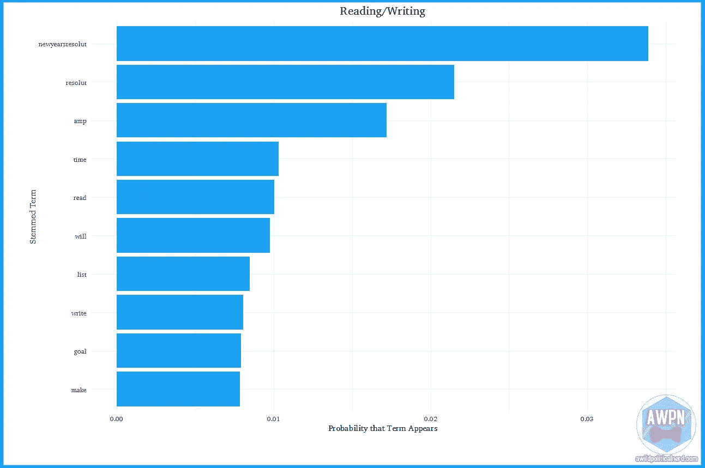
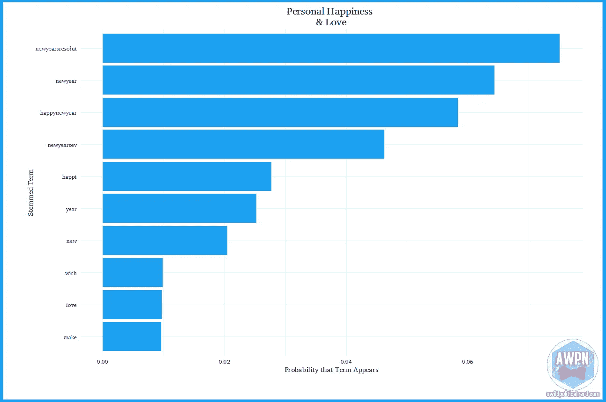
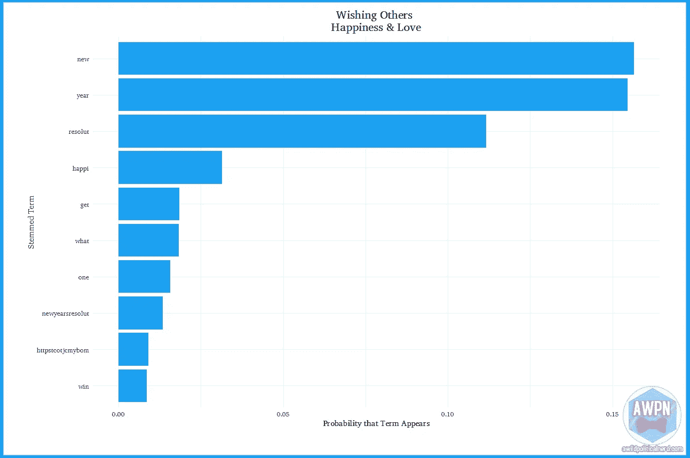
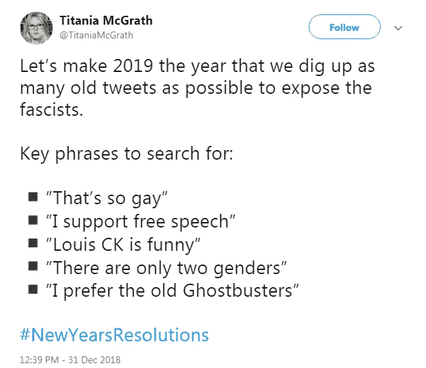
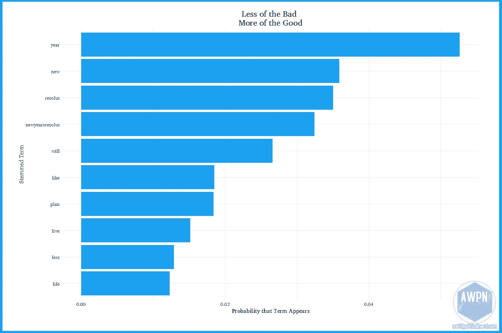
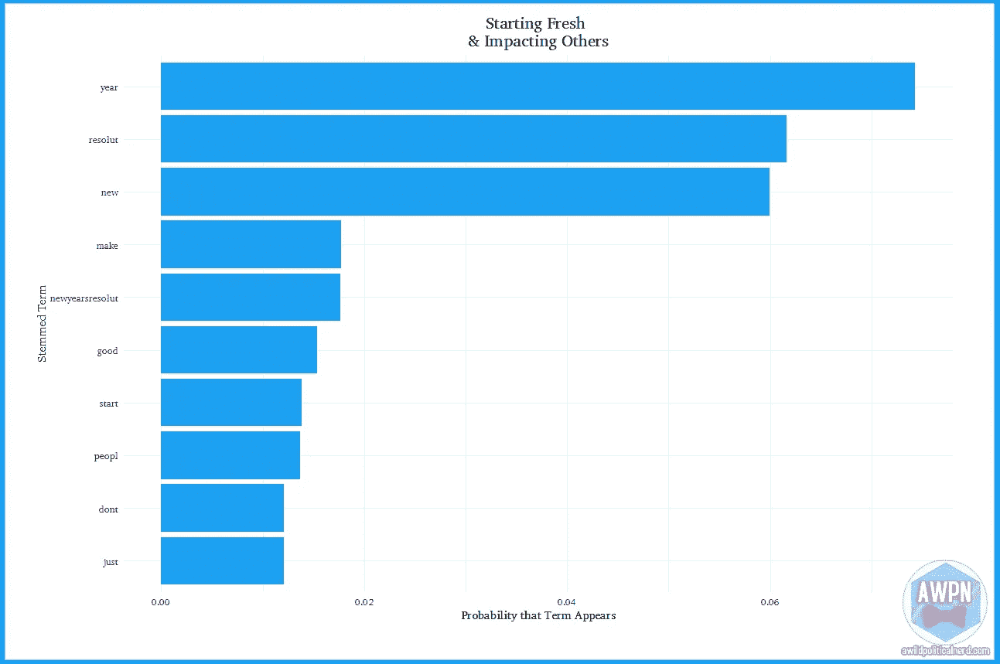
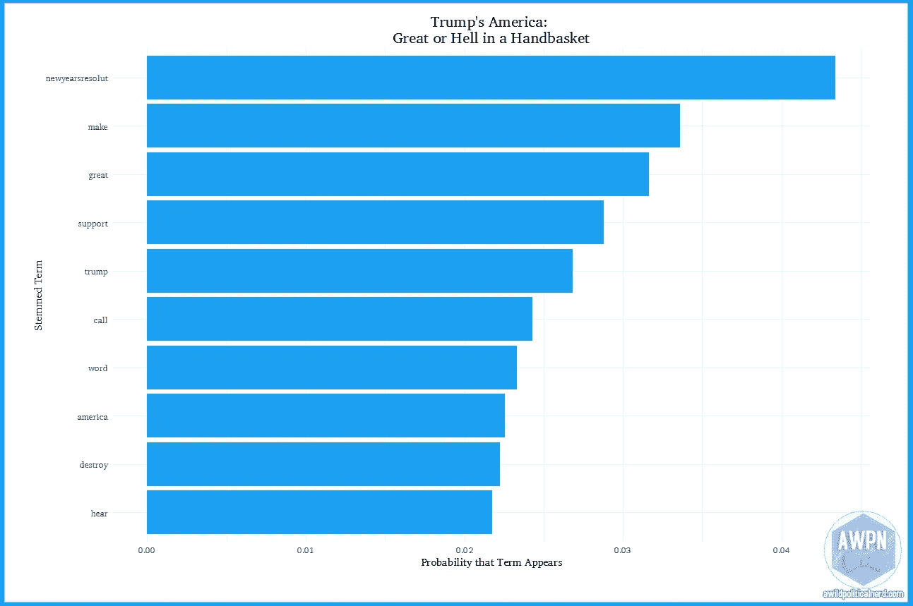
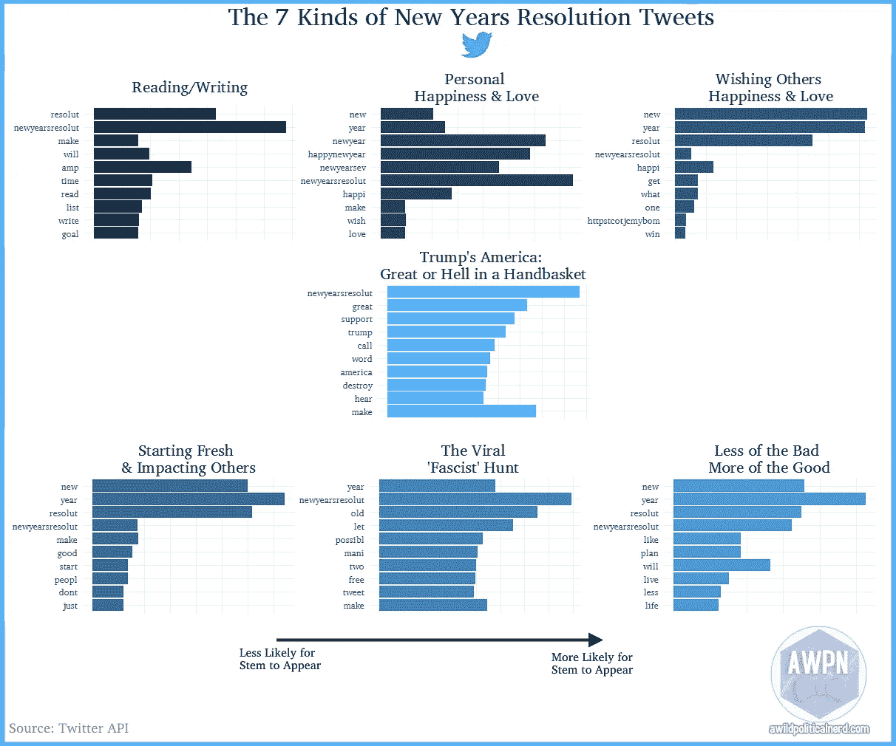

# 7 种新年决心推文

> 原文：<https://towardsdatascience.com/7-types-of-new-years-resolution-tweets-d437c87d5f9c?source=collection_archive---------30----------------------->

## 对 4 万条推文的分析揭示了我们如何实现 2019 年的目标。

这是新一年的开始！人们正在更换日历，联系所爱的人，并决定他们今年想要尝试和坚持的决心。如果人们正在做某事(真的是任何事)，你可以打赌他们中有相当多的人会在推特上谈论这件事。

有一些关于[的文章，最受欢迎的决心是什么](https://www.statista.com/chart/12386/the-most-common-new-years-resolutions-for-2018/)，[实现它们不会让我们快乐](https://fivethirtyeight.com/features/happy-new-year-your-resolutions-wont-bring-you-joy/)，以及我们可能无论如何都不会实现它们。愉快。我决定，没有什么真正着眼于人们如何处理整个决议企业。为此，我上了推特，并利用一些很好的计算社会科学，决定看看人们是如何对待决心的。推特用户在推特上发布的关于决议的话题是什么？那些题目中最常见的词是什么？它有没有说我们如何对待决心的想法？这些就是我们今天要回答的问题。

在深入研究之前，先简单说一下。虽然这个项目使用了计算社会科学的技术，但我并不急于给它贴上“科学”的标签。这是我强调不要说的:“计算机算法显示只有 7 种新年决心推特。这就是大数据带给他们的一切。”相反，这只是一种有趣的方式，可以让你了解 Twitter 上围绕新年决心的一些更广泛的模式。

## 数据

使用 Twitter 的 API，我搜索了包含#newyearsresolutions2019、#resolutions、#newyearsresolution、#newyearsresolutions(是的，这里有*是*的区别)的推文，以及任何包含“新年决议”字样的推文，而没有笨拙地将它们塞进一个标签。我在 12 月 31 日中午 12:00 左右开始收集数据，并在 1 月 1 日凌晨 12:00 后做了最后一次拉动。最早的推文可以追溯到 12 月 22 日，多亏了时区的魔力，一直延续到 1 月 1 日早上 5:17。这一过程产生了 41502 条独特的推文。我并不完全有条不紊地决定何时拉车，因为我太忙于享受与 2018 年说再见了。依照之前的引子，对此半信半疑。

在清理数据(删除停用词和标点符号，对文本进行词干处理，删除 htmls 等)后，我使用潜在狄利克雷分配(LDA)对推文中的潜在主题进行建模。LDA 假设语料库中的所有文档都有固定数量的主题——在我们的例子中，是我们搜集的所有 tweets 并允许在单个文档中出现多个主题。然后，该方法会告诉您任何特定单词出现在主题中的概率。因此，“苹果”出现在第一个主题中的概率可能是 0.0002，出现在第二个主题中的概率可能是 0.05(据推测，该数据来自一个苹果爱好者论坛)。你可以选择这些单词中最流行的，调查它们何时出现在一起，并了解它们出现的时间

对 LDA 有一个警告。你必须*选择*数据中存在多少主题，以便实现它。也是由我们来决定那些话题的意思。虽然有很多方法可以很好地了解正确的主题数量，但是在这些数据中尝试它们会产生超过 25 个不同的主题。这从直觉上讲是有道理的，但是坦率地说，这导致了糟糕的博客文章。我开始看到，在 7 岁以后，模型解释的回报越来越少，所以这是我选择的数字。同样，不科学，但足够的一些乐趣。

没有任何进一步的麻烦。

# 7 种新年决心

## 有抱负的读者和作家们:

人们喜欢阅读，也喜欢写作。或者说，最起码，爱到*要*读，*要*写。多读多写是很常见的决心，所以这一条并没有让我太惊讶。

> “我 2019 年的一个安静的决议是避免在线讨论写作过程，而是花一些时间实际阅读或写作。”— [SheerHubris](https://twitter.com/SheerHubris/status/1079878828795850752)
> 
> “思考人生……我想多跑步、少吃饭、多欢笑、少压力、多唱歌、少喊叫、多听、少说、多阅读、少滚动、多写作、少发短信#新年决心#作家#写作目标”——Grumpy _ SENCO

## 希望爱自己，变得更快乐

自我关心和爱是解决推特的另一个话题。在过去的一年里，人们越来越关注心理健康。看到人们关心照顾自己，我心里很高兴。

> “新年决心:——不骂人——交更多的朋友——更快乐——达到更健康的体重——在我的 a 级考试中做好事——发现自我”— [PaizuriRS](https://twitter.com/PaizuriRS/status/1079936751345561601)
> 
> “新年决心:真诚地爱自己&继续自我成长。今年我确实成长了很多，但我想继续变得更快乐、更健康，成为一个更成熟的人。永远传播积极&永远善待他人。”— [剪影阴影](https://twitter.com/silhouettehaz/status/1079829419693391872)

最后一个触及了我们列表中的下一个主题，很好地展示了这样一个事实，即即使是很小的文本也可以触及多种事物！

## 爱他人

人们不仅仅希望自己新年快乐，他们也希望其他人也有一个快乐的新年！尽管如此，如果我暗示相当一部分包含这个话题的推文不是来自品牌账户，那我就是在撒谎。

> “新年快乐！我们真诚地祝愿大家在 2019 年幸福快乐，万事如意。这是你的一年，你的时间就是现在，去得到它！！！！感谢你今年所有的爱和支持。爱瑞秋和瑞#快乐新年#新年 2019 #新年决心”——[对立旅行](https://twitter.com/oppositetravel/status/1079890115097489414)
> 
> “新年快乐！！为你的健康和幸福干杯！！# behappy # behe health # new years resolutions # get fit # dont wait # livenow # bein the moment # happy and healthy # sharing scaring”——[aloha rush](https://twitter.com/AlohaRush/status/1079887885933965313)

## 病毒性法西斯追捕

我们从你的预期票价中休息一下，给你带来这个分析的第一部分，让我去“嗯。”下一组单词实际上只有一条与之相关的 tweet。事实证明，这只是为数不多的几条关于新年决心的微博中的一条。

有趣的是，这些都不是法西斯的决定性因素——有些是混蛋的决定性因素——但这是推特。髓和 snark 基本上是一个注册的要求。

这带来了一个有趣的问题:转发算不算这类分析？他们中的许多人会做这里发生的事情，构建一个基本上围绕原始推文的“主题”。但是如果这就是人们在推特上真正做的事情，知道这一点也很重要。

值得一提的是，我认为转发通常是一种认可。有些人会用它们来引起对争论的注意，但他们这么做主要是为了说“我也有这种感觉！”所以我觉得这是可以辩护的，但是一条病毒式的推文可以非常明显地搞乱定量内容分析的工作。

## 淘汰旧的…

在这些话题的基调发生转折之后，我们转向一个与你所期待的更相称的话题。人们想要变得更好——但重点是他们会放弃的东西。与其说是蜕变成一只美丽的蝴蝶，不如说是停止吃那么多垃圾食品，这样我们才能更好地适应这个茧。

> 所以……已经 2018 年的最后一天了。时间去了哪里？决心并不总是能实现，但目标是增加锻炼，减少加工肉类和精制糖，活在当下，更善良，花时间和你爱的人在一起，这似乎是 2019 年的一个好计划。你呢？— [和 YC2311](https://twitter.com/ANDYC2311/status/1079825118589788161)
> 
> 新年快乐除了#keepingwildfishfree，我们还致力于在 2019 年减少#一次性塑料和生活#塑料 free，以保持我们美丽的珊瑚礁(和地球)的活力。你 2019 年的#新年决心是什么？你打算采取什么步骤来实现它们？— [萨维内莫](https://twitter.com/savenemo/status/1079945271872708608)

## 成为一盏明灯

与流行的观点相反，大多数人不仅仅是为了自己。(我的意思是，如果一个社会物种完全由反社会者组成，它将很难生存)。很多人不仅想为自己做好事，也想为别人做好事。

> “你知道我喜欢什么，有勇气为小人物辩护的人。你知道，那个感觉被冷落的学生。帮助他们实现他们的全部潜力。让我们把它作为今年的新年决心吧！#提倡#坚持不懈#黄蜂#下一级#勇气#充分发挥潜力”——[多样性 54](https://twitter.com/diversity54/status/1079828588734660608)

## 它总是回到特朗普身上

让我把我的卡放在桌子上:对于那些不知道的人，我是一名政治学博士候选人，专攻政治行为和心理学。这意味着我必须忍受与特朗普有关的事情——很多。当我构思这个项目时，我认为这是一种逃离不断加深的新低点坑的有趣方式，这些新低点坑是由争议的不断轰炸挖掘出来的。另一方面，特朗普总统花在推特上的时间比新闻发布会上的时间还多，所以我可能不应该如此惊讶。尽管我确实感觉到与那些愤怒地进入这个话题的人有一种亲切感。

> “我的新年决心是将支持议长@NancyPelosi 和@TheDemocrats 作为我的使命，因为他们反对特朗普政权的法西斯冲动，倡导进步议程，并为 2020 年的巨大胜利做准备。谁在里面？# new years resolutions”-DEM write
> 
> “媒体和我们公众做出承诺，停止报道@realDonaldTrump 在 2019 年发布的每一条推文，怎么样？停止给予他他极度渴望的关注。# new years resolutions # notrumtweets "[missangeleyes](https://twitter.com/missangeleyes/status/1079828546082742273)
> 
> “你们所有憎恨特朗普的自由主义者应该制定一个新年决议:停止为 2019 年的人类提供嫉妒、愤怒、仇恨、可悲的可怜借口。”— [Anthony14133926](https://twitter.com/Anthony14133926/status/1079881130193620994)

> 现在你知道了！纽约决议推文的 7 种类型！

Note: The reason that the-x axes are unlabeled is because the probabilities vary across topics but the presentation of the bar graph can give the incorrect impression that a word appears with equal/greater frequency than another.

我已经把这个分析的注释代码放在我的 GitHub 上了。(我今年的一个决心是更好地张贴在那里)。请在评论中让我知道你对这个分析的看法。

新年快乐！

*彼得·r·利卡利是弗罗里达大学政治学博士生，专攻美国政治、政治行为和政治方法论。所表达的意见是他自己的。也可以在* [*YouTube*](https://www.youtube.com/channel/UCuCCVkVbWmYmgg7W9x2Y30g) *和推特(* [@prlitics13](https://twitter.com/prlitics13) *)上找到他。剩下的一点点业余时间都花在了长跑，和他耐心的妻子玩电子游戏，遛狗，和他的猫 Asia 进行奇怪的富有成效的单边对话上。*

# 注释和资源:

[社会科学计算](https://cfss.uchicago.edu/fall2016/text02.html#lda_with_an_unknown_topic_structure)

通过 R 掌握文本挖掘

用 R 进行文本挖掘:朱莉娅·西尔格和大卫·罗宾逊的整洁方法

[Isis 推文的主题建模](https://rpubs.com/cosmopolitanvan/topicmodelling)