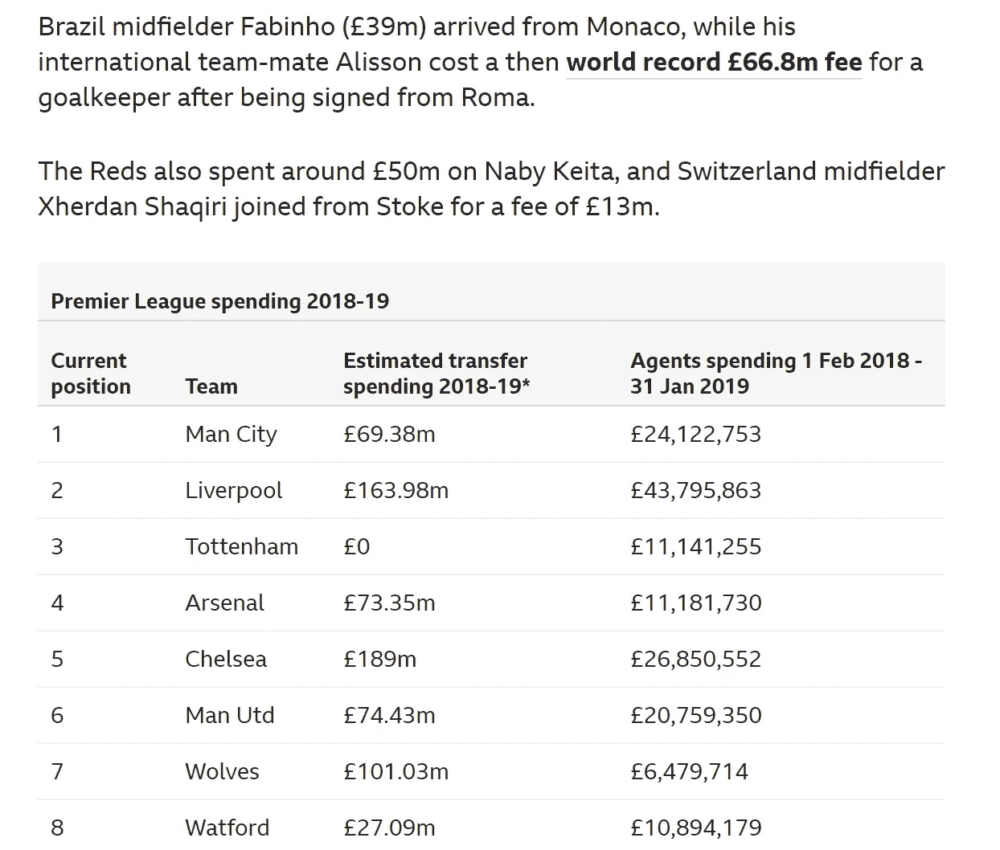
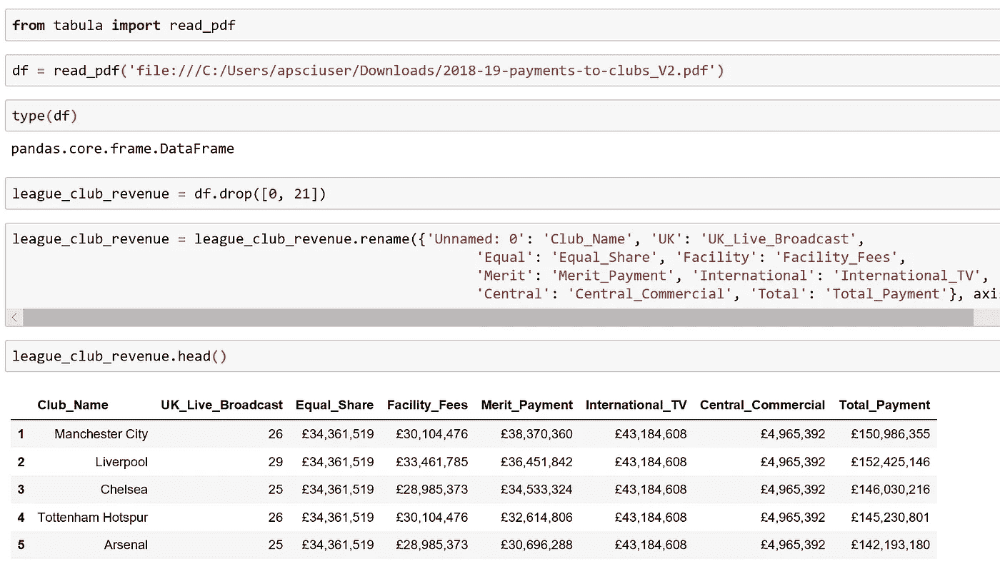

# 7 个有用的熊猫数据管理技巧

> 原文：<https://towardsdatascience.com/7-useful-pandas-tips-for-data-management-8b23a85bf41f?source=collection_archive---------12----------------------->

## 一个英超金融评论的例子

Image Courtesy of [Firmbee.com](https://unsplash.com/@firmbee) via [Unsplash](https://unsplash.com/photos/gcsNOsPEXfs)

# 金钱球

英超联赛是一项大生意。事实上，英超俱乐部在 2018-19 赛季向足球经纪人支付了超过 2.6 亿英镑——比前 12 个月增加了 4900 万英镑。仅这个统计数据就激起了我的兴趣，并驱使我更深入地研究 2018-19 赛季的英超联赛支出。

为了对刚刚结束的这个赛季的英超联赛进行全面的财务评估，我使用了 Python Pandas 模块。在这样做的时候，我使用了 Pandas 库的许多特性，这使得数据管理变得稍微容易了一些。

这篇教程文章包括了我所从事的数据收集和管理的这些有用的 Pandas 技巧和特性。

# **提示 1:查找数据**

花在经纪人身上的钱和估计的转会支出是我想为每个英超俱乐部确定的两个关键变量。我快速搜索了一下，找到了 BBC 的网页，标题是:[英超:俱乐部 2018-19 赛季足球经纪人支出增至 2.6 亿](https://www.bbc.co.uk/sport/football/47817930)。下面是我要刮的表。使用熊猫很容易做到这一点。

这里的技巧不是使用 pd.read_html 方法(*，对于本文来说，它本身就是一个技巧*)，而是使用索引。我怎么知道索引第 0 个元素呢？答案就在这里，切换到 Chrome 中的开发者工具，使用控制台标签。在这里，我搜索 table 标记，结果是一个长度为 1 的数组。这意味着在这个特定的网页上只有一个表格。如果我索引，第一个(*并且只有*)元素我将能够刮表。

然而，现在我们遇到了一个小小的障碍，所以是时候给熊猫第二个提示了！。

# 技巧 2:多索引到单索引

当抓取该表时，将返回一个多索引，如下所示。在大多数情况下，最好有一个单一的索引。这将使数据排序和过滤更容易。现在，最高层的一栏“2018-19 英超联赛支出”需要删除。

为此，我使用了**。xs()方法。在这个方法中，我指定的第一个参数是我想要得到其横截面的列的名称。在这里，我指定“2018-19 赛季英超联赛支出”。**轴=1** 获取列的横截面，并且 **drop_level** 参数=True，返回没有多级索引的横截面。**

显然，现在*有了*单一索引，但是列名之间仍然有很多空格，这使得某些任务，比如过滤变得更加麻烦。理想情况下，这些列都应该是单个字符串元素。

# 技巧 3:快速简单的列重命名

列名非常能说明它们的内容。因此，我只想稍微改变它们，这样下游的数据操作就更容易了。这里，我使用了 **df.columns.str.replace** 方法，用下划线替换所有空格、连字符和星号。

需要删除这些字符，因为当我们尝试过滤(稍后)时，它们会导致语法错误。因此，最佳做法是移除/更换它们。

为了演示这个字符串函数有多有用，我加入了等价的代码，注释掉了，这是使用 **df.rename** 函数获得相同结果所必需的。如图所示，这要简单得多。

*简单，当你知道怎么做的时候！*

现在，我执行一些简单的字符串操作函数，如下面的 GitHub 要点所示，将字符串条目转换成数字数据类型。

这张表有一些有趣的数据，但我真正想要的是对 2018–19 赛季英超财务的全面看法。所以，说到第四点。

# 技巧 4: Pdf 转熊猫数据框

导航到[英超新闻文章](https://www.premierleague.com/news/1225126)，我获得了关于 2018/19 赛季中央支付给俱乐部的英超价值的信息。该页面包含一个可下载 pdf 的链接(如下所示)。接下来的几个任务包括抓取这个表，并将其与从 [BBC 足球网页](https://www.bbc.co.uk/sport/football/47817930)中提取的支出表合并。

我从 tabula 导入了 **read_pdf** 方法，并将文件路径传递给了这个方法。我最初给数据帧分配了变量名 df，并检查了它的类型。返回一个熊猫数据帧。随后进行了简单的清理和重命名，但是我包含了这个技巧，因为它真实地展示了将 pdf 表格转换成适合分析的 Pandas 数据框架是多么简单。

# 技巧 5:多列字符串操作

league_club_revenue 数据帧中的列是字符串数据类型，需要转换为数值数据类型。但是，通过仔细检查，除了“俱乐部名称”和“英国直播”之外，所有的列值都以“”符号为前缀，中间用逗号隔开。

要一起更改这些列，我只需创建一个列列表(熊猫系列)。然后，我在 DataFrame 内的 for 循环中迭代这些列，用空字符串替换“”和“，”，然后使用。a 类型方法。我还除以 100 万，因为最终我想将“支出”和“联赛 _ 俱乐部 _ 收入”数据框架合并在一起，因此我需要这两个数据框架之间的数据保持一致。我需要所有的列都以百万来表示它们的值。

几乎一行代码就清理了整个数据帧！

# 技巧 6:简单合并

为了合并并成功对齐数据，我在 league_club_revenue 数据帧中生成了一个新列。这是必要的，因为两个表中的团队顺序不同。我创建了一个名为“Team”的新列，其中球队按顺序排列，它们出现在 league_club_revenue 数据框架中。然后，我可以在这两个数据帧之间共享的公共列上进行合并，每个数据帧上的行将对齐。

新的数据框架 Financial_review 现在是合并后的产品。数据格式是一致的，除了“UK_live_broadcast”和“Current_Position”以百万(英镑)表示。

# 技巧 7:过滤

新合并的数据帧现在可修改用于查询。从一个基本查询开始，我指定了两个条件。我想知道那些花费超过 800 万英镑的经纪人费用的球队，最终排名低于第 10 位(*截至 4 月 4 日，BBC 关于经纪人和估计费用的文章撰写时*)。

结果可能表明，这些球队的经纪人可以做得更好，因为他们为之物色球员的球队位于排行榜的下半部分！

现在假设，我们想要查询另一个条件。然而，这一次我们不希望返回整个记录(行)。为此，只需编写过滤条件，后跟一个句点，然后是要返回的列。在这里，我只想知道那些估计花了 6000 多万转会费，收到的支付功绩不到 2000 万的球队的名字。

看起来伯恩茅斯、布莱顿和富勒姆花费很大，但在基于成绩的奖金方面没有很好地收回投资。与其他球队相比，这些球队的财政状况目前看来并不乐观！

出于比较的目的，我已经包括了如果我不使用 not 符号后跟列“Team”时返回的结果。这里，返回整个记录或行。

最后，我将通过演示如何使用一个简单的聚合函数来做总结。首先，计算英超联赛中所有球队的经纪人支出的平均值(以百万计)。显示了实现这一结果的两种不同方法，第一种方法是使用方括号，第二种方法是使用点符号(更常用)，这也是为什么像空格这样的非法字符需要被删除并替换为下划线的原因。

假设你想分别找出英超联赛上半区和下半区球队的平均英国转播比赛。为了获得更深入的了解，确定排名上半部分的球队与排名下半部分的球队的平均转播比赛之间的差异是很有趣的。

简单用**。loc** 然后使用[:10 后跟一个逗号，最后是引号中的列后跟一个右方括号，选择前 10 行。对表格的后半部分重复这一过程，[10:，我们可以清楚地看到，上半部分的球队比下半部分的球队平均多 8.49 场英国广播比赛。

我希望这个例子展示了一些有用的 Pandas 特性，使数据处理和管理变得更容易。如果你喜欢英超联赛的例子，我已经写了一篇介绍性的文章，题为“[英超联赛中的熊猫](/pandas-in-the-premier-league-78f1d0c21b4f)”，展示了熊猫如何帮助清理初始数据。