# 保护亚马逊雅典娜的 7 种方法

> 原文：<https://towardsdatascience.com/7-ways-to-secure-amazon-athena-db31a7cb6c88?source=collection_archive---------23----------------------->

## [专业数据技能](http://towardsdatascience.com/tagged/Professional Data Skills)

Photo by [MILKOVÍ](https://unsplash.com/@milkovi?utm_source=medium&utm_medium=referral) on [Unsplash](https://unsplash.com?utm_source=medium&utm_medium=referral)

[**亚马逊雅典娜**](https://aws.amazon.com/athena/) 是来自亚马逊网络服务的无服务器数据分析工具。它易于使用，不需要设置任何服务器，支持 ANSI SQL 从亚马逊 S3 查询结构化和半结构化数据。许多公司选择 Athena 是因为它的简单性和低成本。

在互联网上甚至在 Medium 这里有很多关于 Athena 能做什么和不能做什么的资源，以及应该遵循的最佳实践。我就不细说了。相反，让我们来谈谈在设计会议上经常出现的棘手但必要的问题:*安全性*。

当考虑将 Athena 作为一个工具时，首先要问的问题之一是它有多安全？Athena 是一个无服务器工具:您不需要在 VPC 中设置任何 Athena 实例，也没有安全组来过滤掉不需要的流量。就像 S3 一样，雅典娜必须通过互联网访问。

这时，安全和数据架构团队会有些惊讶。为什么你被问到，你应该选择这样一个有风险的工具吗？

嗯，它一点风险都没有，而且像任何其他技术一样——你让它多安全真的取决于你。

以下是您需要了解的关于 Athena security 的信息。

> 从广义上讲，数据安全性可以从两个方面来考虑:当数据处于静止状态时和当数据正在传输时。

让我们考虑静态数据。

**场景#1:** 您有一个 S3 存储桶，其中包含您想要从 Athena 查询的数据。您如何确保桶中的数据是安全的？

首先，确保源 bucket 是不可公开访问的——除非您出于一个非常好的理由有意识地希望它公开。句号。这是考虑 Athena 安全性时要做的第一件事(事实上，当您出于任何目的使用 S3 时)。很少有关于公开的 S3 桶导致的数据泄露的恐怖故事。下面是如何从 AWS 控制台更改存储桶的该属性:

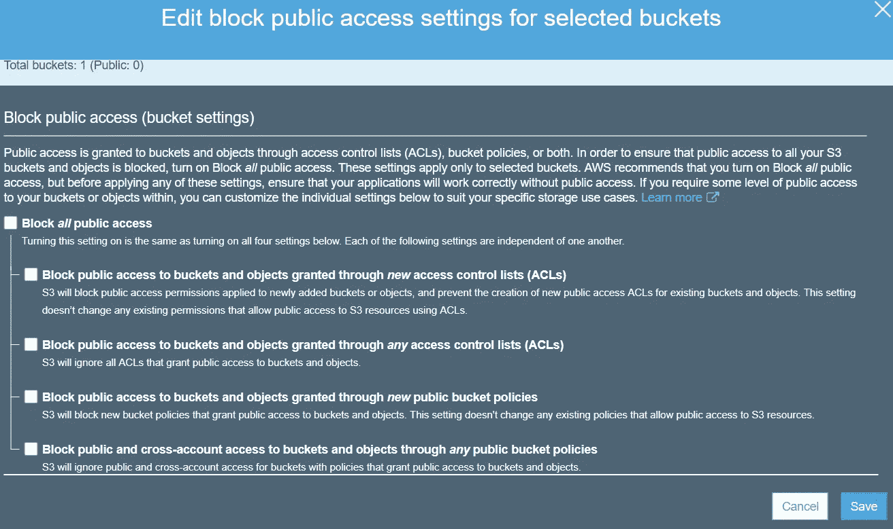

Changing the public access policy for individual buckets

其次，确保桶中的数据是加密的。这是静态加密。有两种方法可以做到这一点:您可以加密桶:

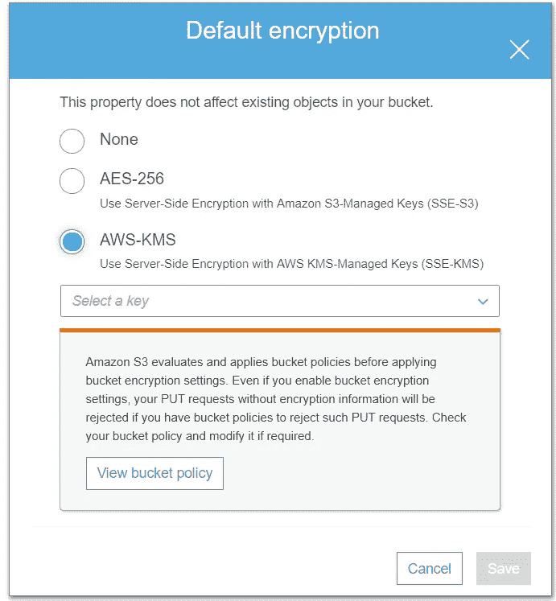

Encrypting an S3 bucket from AWS console

或者您可以加密源文件:

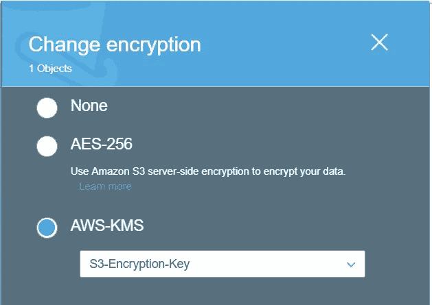

Encrypting an S3 object from AWS console

无论哪种方式，您都可以使用 [**AWS 密钥管理服务**](https://aws.amazon.com/kms/) 来进行加密。有三种类型的钥匙:

*   SSE-S3:这是你让 S3 管理加密密钥的地方
*   KMS:给，你有自己的钥匙，让 KMS 用吧
*   **上交所-KMS** :你使用 KMS 生成的密钥，让 KMS 管理它

除非有必要，否则使用 SSE-KMS 密钥。通过 SSE-KMS，你可以控制*谁可以访问*密钥。下图显示了 KMS 键的两种访问级别。

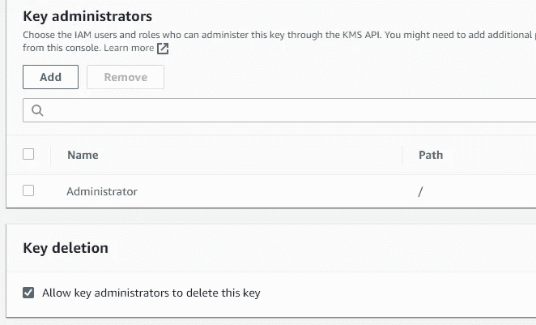

IAM users and roles can be made KMS key administrators

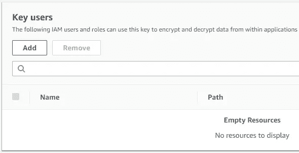

IAM users and roles can be made KMS key users

第三，确保您的*查询结果被加密*。Amazon Athena 将查询结果存储在一个名为 **S3 暂存目录**的 S3 位置(可以配置)。加密 S3 桶或源文件并不意味着查询结果也被加密。除非您加密暂存目录，否则您并没有真正加密您的静态数据。

考虑一下:您从 Athena 运行一个关于一些敏感数据的查询。结果集作为文件保存在临时位置。现在，如果您的查询正在获取敏感数据，并且您没有对暂存位置进行加密，那么一些敏感信息将保持不加密状态。

加密单个查询结果怎么样？加密临时目录后，每个后续查询结果都将被加密。

这是加密暂存目录的方式:

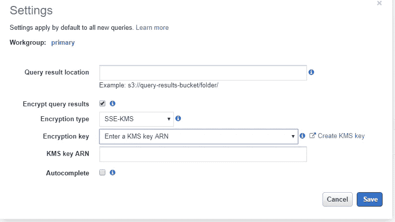

Encrypting the Athena query result location

您应该使用相同的密钥来加密数据和查询结果吗？我建议使用不同的钥匙。这是一个管理开销，但是如果一个密钥被破坏，你知道至少另一个是安全的。

第四，你可以加密你的胶水数据目录。数据目录包含所有 Athena 表定义(以及其他内容)。一旦加密了目录，Athena 表定义(而不是数据)就被加密了。取决于你想在加密方面走多远，这可能是一个不错的补充。

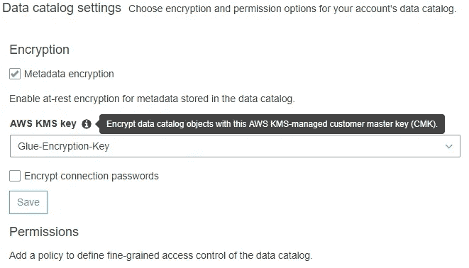

Encrypting AWS Glue data catalog

**场景#2** :你已经加密了数据；如何控制对数据的访问？

您可以使用 [**存储桶策略**](https://docs.aws.amazon.com/AmazonS3/latest/user-guide/add-bucket-policy.html) 微调对源数据的访问。存储桶策略规定了谁可以访问存储桶以及他们可以对其内容做什么(例如，解密数据)。存储桶策略可以允许来自同一个或另一个 AWS 帐户的 IAM 用户访问存储桶。这意味着，如果策略明确拒绝角色、用户或组的访问，即使某人有权访问桶加密 KMS 密钥，他/她也可能无法访问其内容。

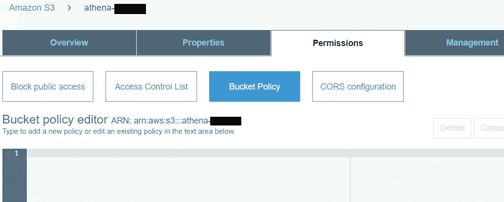

The S3 bucket policy editor allows writing bucket policy

**场景#3** :您只希望某些用户从 Athena 运行查询。

Athena 不像传统数据库那样支持用户帐户。控制谁可以访问 Athena 的唯一方法是通过 [**IAM 策略**](https://docs.aws.amazon.com/IAM/latest/UserGuide/access_policies_create.html) 。Athena 有两个 AWS 管理的 IAM 策略:

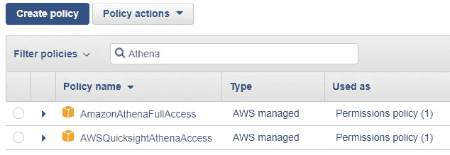

AWS managed policies for Amazon Athena

第一个策略(AmazonAthenaFullAccess)允许用户在 Athena 上执行任何操作。第二个(AWSQuicksightAthenaAccess)应该分配给使用 Amazon Quicksight 访问 Athena 的 IAM 用户。

我建议您为 Athena 用户创建两个自定义 IAM 策略。一个是“超级用户”策略，允许创建、修改或删除 Athena 对象，如数据库、表或视图。另一个是“分析师”政策。它没有管理权限。

创建策略后，创建两个角色并将每个策略分配给一个角色。接下来，将角色分配给 IAM 组。最后，根据访问要求将各个 IAM 用户分配到这些组中。

如果您的 Athena 查询是从 EC2 实例运行的，那么您可以将角色分配给该实例。

如何保护传输中的数据？你如何控制它？

在这里你不需要做什么。Amazon 服务端点是 SSL 加密的。这意味着传输层安全性(TLS)用于加密在 S3 和雅典娜之间传输的对象。

如果您使用符合 JDBC 标准的 SQL 查询工具来运行 Athena 查询，则返回给客户端的数据将被 SSL 加密。

最后一个选项实际上不是为了保护任何东西，而是为了监控。

您可以在您的 AWS 帐户上启用 [CloudTrail](https://aws.amazon.com/cloudtrail/) ，一旦启用，它将记录对该帐户中任何 AWS 服务的每个 API 调用。这些事件的日志文件将以压缩和加密的格式存储在 S3。

由于 CloudTrail 日志保存在 S3，所以可以从 Athena 上搜索到它们。事实上，CloudTrail 控制台提供了为日志创建 Athena 表的工具。

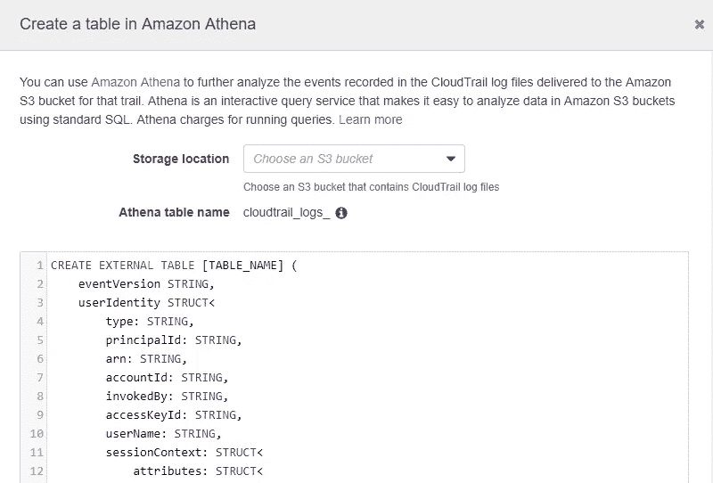

Creating an Athena table from the AWS CloudTrail console

一旦创建了表，就可以搜索日志。

您还可以配置 CloudTrail 为 Athena 源桶捕获 S3 数据事件，如 GetObject (Read)和 PutObject (Write)。您可以使用这些数据事件的日志来查看 AWS Athena 何时访问 S3。

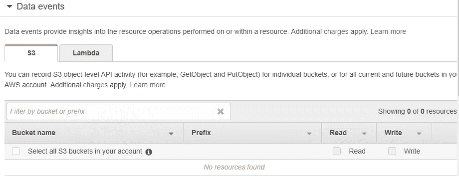

AWS CloudTrail configuration for S3 data events

现在，您已经看到了保护 Amazon Athena 的几个选项。你实现哪一个取决于你自己。

其他先进地区呢？比如自动化雅典娜？或者让它与 BI 分析工具一起工作？要通过动手练习学习这些和更多内容，你可以在 Pluralsight 注册我的在线课程:[亚马逊雅典娜](https://app.pluralsight.com/library/courses/amazon-athena-advanced-operations)高级运营。

***注来自《走向数据科学》的编辑:*** *虽然我们允许独立作者根据我们的* [*规则和指导方针*](/questions-96667b06af5) *发表文章，但我们不认可每个作者的贡献。你不应该在没有寻求专业建议的情况下依赖一个作者的作品。详见我们的* [*读者术语*](/readers-terms-b5d780a700a4) *。*