# 除 Console.log()以外的 8 个控制台 API 函数

> 原文：<https://towardsdatascience.com/8-console-api-functions-other-than-console-log-81cc6b7164b?source=collection_archive---------8----------------------->

## 除 console.log 之外的一些重要控制台 API 函数的深入指南


Console API Functions

控制台 API 最常用的方法无疑是`console.log`。然而，它还附带了几个其他有用的方法，可以提高我们的调试效率。

让我们开始吧🏊并了解其他一些方法👇

> 注意:从 10.0.0 版本开始，NodeJS 和几乎所有主流浏览器都提供了所有方法。

# console.table(数据[，属性])👇

在调试时，如果有一个复杂的嵌套对象或一组相同类型的对象，我们在阅读、理解和比较对象时会遇到困难。

`console.table()`是来救我们的。它以清晰的表格格式呈现数据。因此提高了可读性。

该方法有两个参数:

*   `data`:任意类型的数据集合，通常是对象数组。
*   `properties`:您想要用来显示表格的字段的字符串数组。

让我们用一个例子来了解更多:

```
const data = [
  {
    "id": "0001",
    "type": "donut",
    "name": "Cake",
    "ppu": 0.55,
  },
  {
    "id": "0002",
    "type": "donut",
    "name": "Raised",
    "ppu": 0.55,
  }
];
```

我们有一系列的对象`data`。让我们来看看数据的表格方法输出。

1.  `console.table(data)`

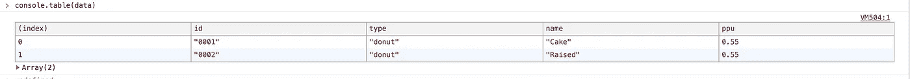

`console.table(data)`

2.`console.table(data, ['name'])`

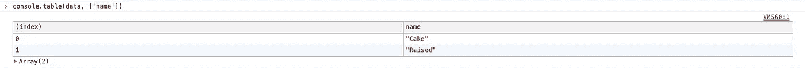

`console.table(data, ['name'])`

对嵌套对象进行同样的尝试，并查看输出😄

> 注意:您可以通过单击列的标签按列对表格进行排序。

# **控制台.组(标签)&控制台.组结束(标签)**👇

有时，可能会有这样一种情况，我们希望在一个循环中记录值。最好的办法是在每个循环的末尾添加一个分隔符来分隔每次迭代的值，但这仍然不够有效，因为没有标签来描述日志。

使用`console.group`,在登录到控制台时，正确组织相关数据并使用确定的组标签表示每个组变得非常简单。

这些方法带有一个可选参数— `label`，它是组的名称。

尽管不要求将参数传递给`console.group()`，但是我们还是应该这样做，以便弄清楚哪些值被分组在一起。

我们不必将组名传递给`console.groupEnd()`，因为它总是会关闭最近创建的组。

如果我们在一个已经创建的组中调用`console.group()`，我们也可以创建嵌套组。这里有一个简单的例子，可以帮助我们更好地理解它。

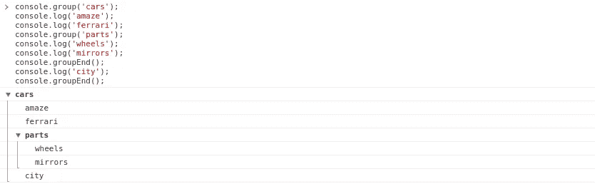

console.group() and console.groupEnd()

> 注意:由`console.group(label)`创建的组最初是打开的，如果我们调用`console.groupCollapsed(label)`，我们可以从一开始就将组显示为折叠的。这里有一个例子:

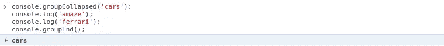

console.groupCollapsed(label)

# console.dir(对象)和 console.dirxml(对象)👇

在过去，`console.log`和`console.dir`之间的行为非常不同，特别是在记录对象内容时，但是新的 JavaScript 引擎已经扩展了`console.log`的功能，所以和`console.dir`已经没有太大的区别了。

我发现的唯一区别是在浏览器控制台中访问 DOM 元素时。

*   `console.log`在类似 HTML 的树中打印元素
*   `console.dir`在一个类似 JSON 的树中打印元素，从这里我们可以检查元素的 DOM 属性

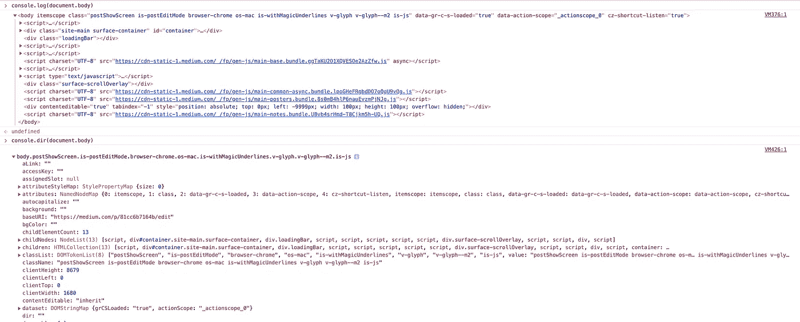

Difference between console.log() and console.dir()

在 Node.js 的情况下，`console.dir(obj[, options])`函数接受一个可选参数，该参数是一个可以有以下键的对象:

*   `showHidden` [<布尔>](https://developer.mozilla.org/en-US/docs/Web/JavaScript/Data_structures#Boolean_type) 。如果`true`那么对象的不可枚举和符号属性也将被显示。**默认:** `false`。
*   `depth` [<编号>](https://developer.mozilla.org/en-US/docs/Web/JavaScript/Data_structures#Number_type) 。告知在格式化对象时递归的次数。这对于检查大型复杂物体很有用。要使其无限递归，请传递`null`。**默认:** `2`。
*   `colors` [<布尔>](https://developer.mozilla.org/en-US/docs/Web/JavaScript/Data_structures#Boolean_type) 。如果`true`，则输出将采用 ANSI 颜色代码。颜色可定制。**默认:** `false`。

> 注意:如果你知道更多的区别，请随时用例子在下面评论😊

对 HTML 和 XML 元素或对象调用`console.dirxml()`等同于调用`console.log()`

> 注意:Node.js 内部的`console.dirxml`也调用`console.log`作为其参数。

让我们看一个例子

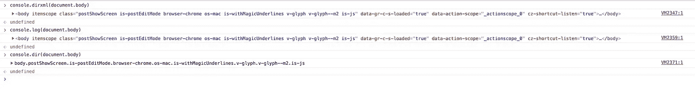

Difference between console.log() and console.dirxml()

# console.profile([，label]) & console.profileEnd([，label])👇

`console.profile([,label])`开始记录调用它的地方(Browser 或 Node.js)的 CPU 和内存使用情况的性能概要。

探查器的每次运行都保存为一个单独的选项卡，由作为参数传递的标签标识。

记住使用`console.profileEnd(label)`结束剖析。

让我们通过一个例子来理解:

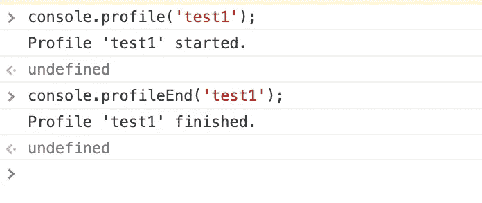

这会创建一个名为`test1`的 JavaScript 分析器，并开始记录浏览器的性能(假设它运行在浏览器中)。以查看 Chrome 浏览器中记录的性能。

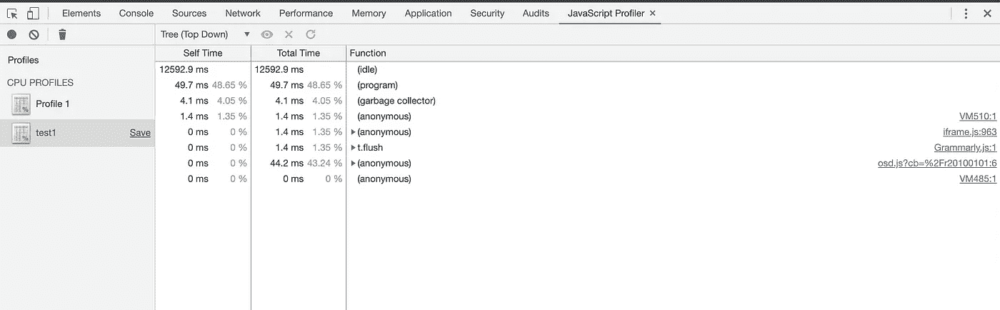

console.profile([, label]) & console.profileEnd([, label])

> 注意:如果你在开发者工具中没有看到 JavaScript profiler 面板，那么请点击这个——点击三点菜单(在右上角)⋮->更多工具-> JavaScript Profiler。

对于 Node.js，该方法不显示任何内容，除非在检查器中使用。停止当前的 JavaScript CPU 性能分析会话(如果已经启动),并将报告打印到检查器的**性能分析**面板。

如果在没有标签的情况下调用`console.profileEnd()`方法，最近启动的概要文件将被停止。

> 注意:此功能是非标准的，不在标准轨道上。不要在面向 Web 的生产网站上使用它。

# **控制台.时间([，标签]) &控制台.时间结束([，标签])** 👇

`console.time()`启动可用于计算操作持续时间的计时器。`console.timeEnd()`停止计时器并以毫秒为单位打印总运行时间。

定时器由唯一的`label`标识，如果没有指定，`timeEnd`将采用最近的时间功能并停止它。

当您需要对一段代码进行性能检查时，通常会用到它们。你也可以向`time`和`timeEnd`传递一个字符串，它将启动另一个同名的定时器。

我们用一个小例子来了解一下

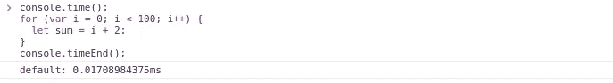

console.time([, label]) & console.timeEnd([, label])

循环完成所用的时间是 0.01784375 毫秒

> 注:查看[这个性能分析开源代码](https://github.com/dg92/Performance-Analysis-JS)完全是使用上述两个函数制作的。

# **console.count([，label])&console . count reset(**[，label] **)** 👇

`[console.count](https://developer.mozilla.org/en-US/docs/Web/API/Console/count)([,label])`在作为参数传递的标签上放置一个计数器。每次调用它时，计数器的值都会增加。调试控制台中显示一个标签和一个数字，如果`label`没有通过，`console.count()`将记录当时它被调用的次数，默认标签如下:

```
[label]: X    //when label is passed
default: X    //when label is not passed
```

`console.countReset()`将重置 count 的值，如果它与参数`label`一起使用，那么它将重置该特定标签的计数值。

这里有一个例子可以更好地理解这些方法。

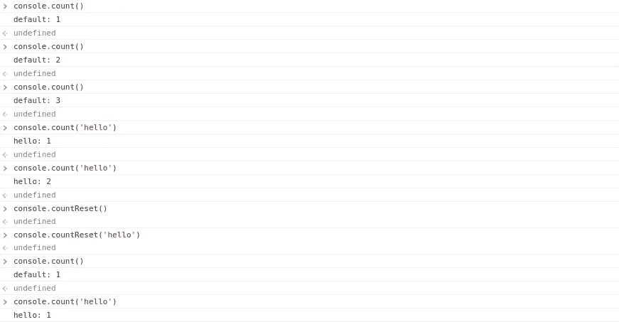

console.count([, label]) & console.countReset([, label])

在上面的例子中，当我们使用`console.countReset()`重置计数器的值，并再次调用`console.count()`方法时，我们看到它返回计数器 1，就像它调用一次一样。

此外，请注意带标签和不带标签调用这些方法的区别。🌟

# console.assert(表达式，消息)👇

该方法用于运行简单的断言测试。它需要两个必需的参数:

*   `expression`:布尔表达式。
*   `message` : 写入控制台的字符串或对象。

> **注意:如果一个表达式为 false，它会向控制台写入一条消息并抛出异常。如果这是真的，那么它将什么也不做。**

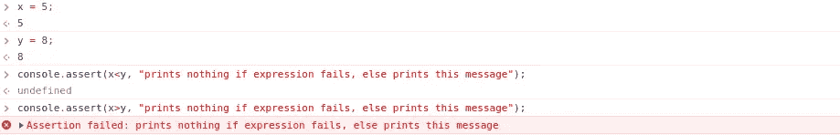

console.assert(expression, message)

# console.trace([，data])👇

有时，在调试复杂的函数调用时，我们会陷入检测可调用函数及其参数值的困境。这就是`console.trace()`出现的地方，它从被调用的点打印可调用函数的堆栈跟踪到控制台。

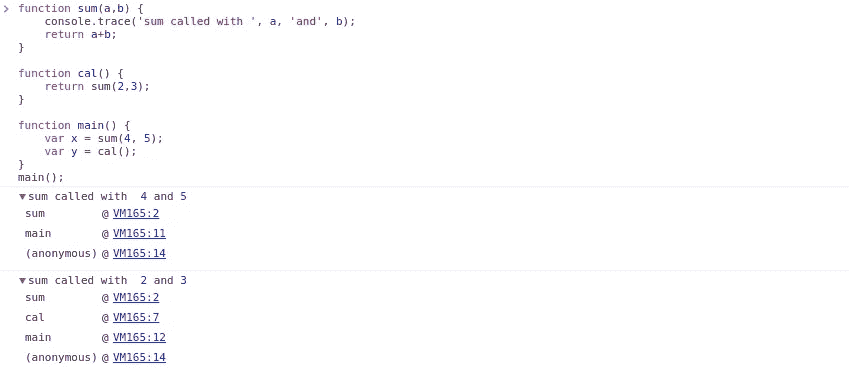

console.trace([,data])

> 注意:当 Node.js 中抛出异常时，或者当我们在浏览器中调试函数时，可以使用这种方法的一个实例是跟踪堆栈。

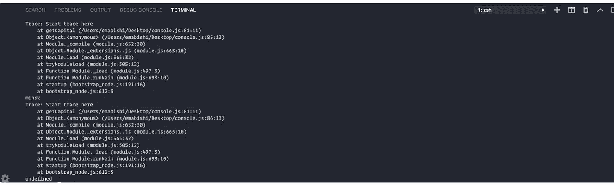

A stack trace example from Node.js

# 输出太多？

使用`**console.clear()**` **清除所有内容即可😃**

如果您想加入我的电子邮件列表，请考虑在此处输入您的电子邮件地址 和**关注我的**[**medium**](https://medium.com/@ideepak.jsd)**阅读更多关于 javascript 和**[**Github**](https://github.com/dg92)**的文章，查看我的疯狂代码**。如果有什么不清楚或者你想指出什么，请在下面评论。

你可能也会喜欢我的其他文章

1.  [20 VS 快速编码的代码快捷键](https://medium.com/better-programming/20-vs-code-shortcuts-for-fast-coding-cheatsheet-10b0e72fd5d)
2.  [VS Web 开发效率的代码扩展](https://medium.com/better-programming/vs-code-extension-for-web-dev-productivity-fa541654161f)
3.  Nodejs 应用程序结构——构建高度可扩展的架构。

***如果你喜欢这篇文章，请随意分享，帮助他人找到它！***

**谢谢！**