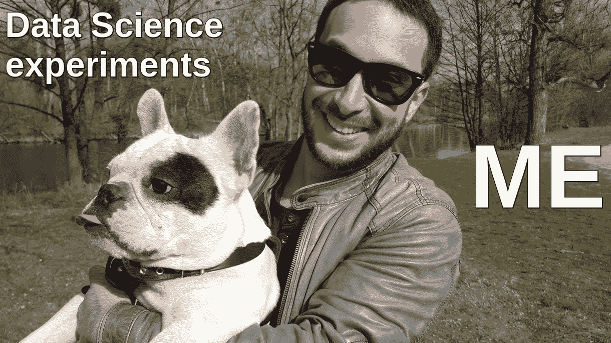
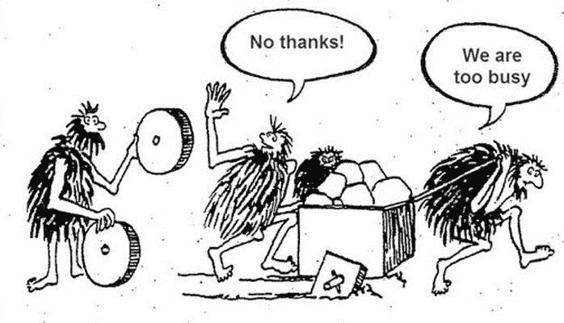
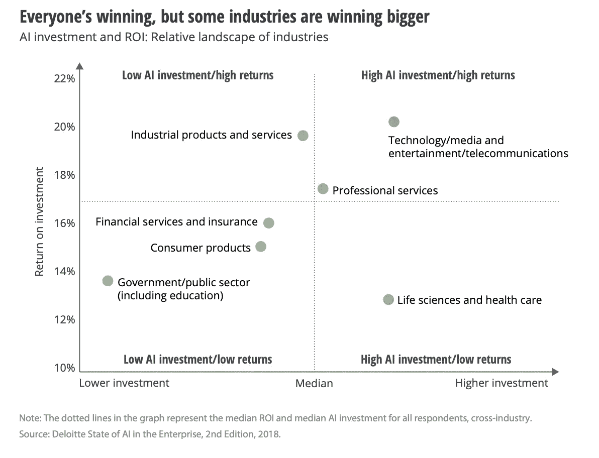
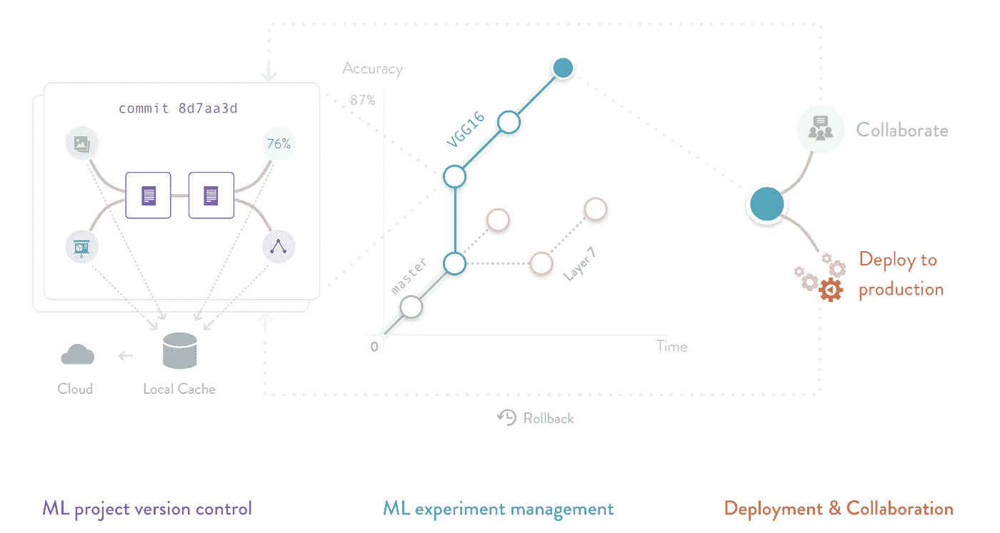
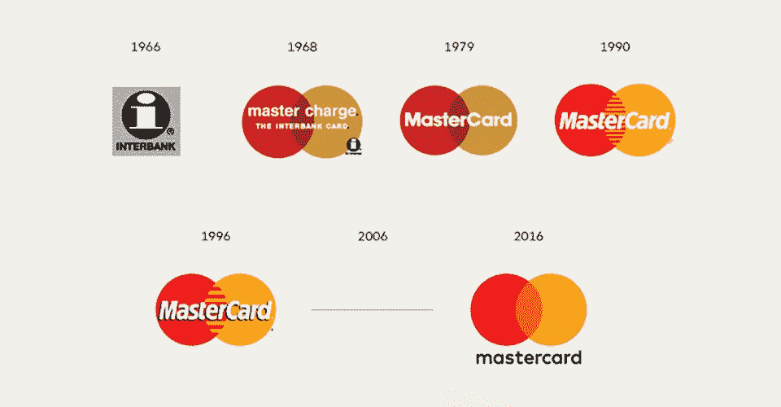

# 8 机器学习实施中的经验教训

> 原文：<https://towardsdatascience.com/8-lessons-learned-in-machine-learning-implementation-86cede701eb1?source=collection_archive---------29----------------------->

## 机器学习和数据科学发展中该做什么和不该做什么的快速概述

在过去的三年里，我在 DataArt 领导机器学习和数据科学，研究不同业务的痛点，提出技术解决方案并进行实施。

在我与技术打交道的时间里，我已经确定了我使用的八个关键规则。

# 1.如果工具存在，不要重新发明轮子

Not invented here syndrome. Image: [source](https://blog.drinkbird.com/not-invented-here).

一个在技术社区流行的想法，为每一个新问题建立定制的解决方案。许多工程师真的相信，他们非常定制的方法，为适应确切的业务案例而构建，比从货架上拿出一个解决方案并根据特定案例进行调整更好。

云提供商正在快速开发 ML 服务，走着大数据服务在他们之前走过的路。十年前，大数据是一种价格昂贵、易于扩展和容错的奇异水果。现在是标配了。开源工具也是如此。**在 99%的情况下**，你不需要发明一个新的图书馆或数据库，因为最有可能的是**你会在市场上找到一些有用的东西**。

# 2.始终考虑商业价值和投资回报率

Source: [Deloitte](https://www2.deloitte.com/content/dam/insights/us/articles/4780_State-of-AI-in-the-enterprise/DI_State-of-AI-in-the-enterprise-2nd-ed.pdf).

每个技术任务都应该带来商业价值。如果你做研究，你应该总是能够提供一个你在现实生活中正在处理的案例的例子。**通常，如果你不能量化这样一个案例，就没有必要在它上面花费时间。**

ROI 计算方法可能需要重新校准。与经典编程相比，机器学习是一种概率方法，永远不会为您提供 100%的准确性，因此您应该始终评估准确性的提高是否会带来价值 2、5、10 或 20 %的投资。

好消息是，数据科学项目非常接近业务，所以你应该有很大的回报感。

假设您有数百人，他们的工作是从文档中提取数据，那么自动化提取结果的准确性增加 5%可能意味着每年数百万美元。但是，如果增加 1%的准确度会花费大量的金钱，这是计算机视觉项目中的一个普遍情况，也许有更有价值的任务，我们仍然可以依靠人类操作员。

# 3.永远不要在假设形成之前就开始研究

通常，商业人士会以这样的方式提出问题:“我们有大量的数据，我们如何从这些数据中找到意义？你能帮我们找到真知灼见吗？”

没有一个明确的假设，永远不要开始研究这个，否则，这是在大海捞针。把机器学习想象成一个能做好一件事的超级智慧——自动完成由于缺乏计算能力而无法手动处理的事情。如果你不能回答你在寻找什么，很可能你在做一些随机的事情。

总是从这样的问题开始:

*   我想解决什么样的问题？
*   我想回答什么样的问题？

# 4.必须小心处理与现有系统的集成

整合本身没什么大不了。但是一定要考虑到人类的感知。如果公司有一个基于规则的系统来做决策，并且很清楚它是如何工作的，那么一个使用 ML 技术的新解决方案对利益相关者来说就像一个黑盒。因此，制定明确的迁移计划以应对潜在风险至关重要。

我们与一家商务旅游公司合作，这家公司的工作之一就是为客户购买机票。预订需要 17 个小时，在此期间价格可能会波动。波动可能取决于许多因素:客流量、星期几、一天中的时间、季节、重大体育或文化活动、天气等。目标是证明，在 ML 的帮助下，分析历史数据，价格可以在旧的但经过验证的基于规则的系统产生的现有降价的基础上降低几个百分点。

但是没有人愿意依赖一个营业额十亿美元的黑匣子。详细阐述了一个迁移计划:首先，与生产系统并行设置一个基于 ML 的预测器，然后在生产中处理 10%的采购，然后是 30%，不断测量相对性能。当系统在生产中得到验证时，至少 10%的门票仍需要通过旧的基于规则的算法来购买，以获得销售引擎的最新更新，从而避免过度拟合(ML 系统自认为了解周围世界的一切时的状态)。

向所有利益相关者证明 ML 过程是渐进的，并且在失败的情况下是可逆的，这一点非常重要。

# 5.进行版本控制

Image: [DVC](https://dvc.org/).

你的 ML 模型的每一个新版本都是一个实验。它可能成功也可能失败，这就是为什么你应该总是有一个工作的 CI/CD 管道，以便能够反向到一个旧版本。

但是，您也不应该忘记数据的正确版本、模型参数和实验结果。这里有专门的工具可以帮忙，比如 DVC——ML 的版本控制系统。

# 6.不要让轮子在研究中旋转:保持目标集中(但不要忽视伟大的意外发现)

当你开始研究一个问题，然后发现另一个问题，然后你发现自己在一个完全不同的地方，对产品来说并不重要，这很容易被研究的常规所困扰。

专注于你的研究，不要分心，记住你为什么开始，主要目标是什么。

**然而，如果你看到一个对用户来说可能很有价值的唾手可得的果实——去得到它！**当您进行可视化来表示在数据中发现的见解时，这尤其可能发生。从形式上看，这在当时可能并不重要，但是您永远不知道在某个时候什么对业务来说可能是有价值的。

请记住，在您最喜爱的应用程序中接收微小但可爱的更新是多么美好。

# 7.要有创意！

总有一种复杂而准确的方法来解决大量数据争论、特征工程等问题，这意味着需要数天的手工操作。但是你能简单的用 20%的努力带来 80%的结果吗？

我们已经学会在数据之上运用横向思维。在一个案例中，我们需要在一家大型化学公司中按照业务单元对流程进行分类。我们发现了一种替代手动输入的方法，即使用公开的 NLP 模型，将流程和部门短语转换为向量，并找到最接近的对。

Image: [source](https://www.thedesignchambers.co.uk/mastercard-brand-history-of-a-logo/).

有一次，我们需要对包含万事达标识的 20 年的营销材料进行分类，以找出哪些材料仍然是真实的。成千上万的文件。在某个时候，我们意识到万事达卡的最后一次标志变化发生在 2016 年。两个小时来标记和训练基于云的图像识别服务，瞧，我们只剩下新的文档了。

在数据科学项目中，我们总是缺乏数据或专业知识，因此创造力是构建工作解决方案的重要资产。

# 8.人的因素——保持敏感并管理期望

像 ML 这样的新技术带来了一系列的挑战，这些挑战是更成熟的技术所没有的。像 ML 这样的新技术的一个主要问题是确保提出的解决方案不会因为不可避免的不确定性而使管理层感到沮丧。

对于周围的大多数人来说，ML 和数据科学是一个黑盒子，这就是为什么期望管理比以往任何时候都更重要。不要忘记教育人们，量化研究结果以与目标进行比较，并从技术和人的角度提前考虑集成。

而且，在适当的情况下，人工智能、启发式方法和人工程序的结合是很好的。当人们开始构建一个基于人工智能的解决方案时，往往会有一种建立完全自动化的东西的意图——一个带有铃铛和哨子的 oracle，可以绝对确定地提出建议。

如果这是可能的，你是幸运的，但不要忘记，即使 ML 不允许你完全解决任务，它也可以在准备决策所需的数据方面提供很大的帮助。将最终决定权从 ML 手中夺走有助于避免行业专家的不信任，他们通常更喜欢由人来做出最终决定。

你有什么见解？请在评论中分享。