# 为什么我认为 Python 非常适合机器学习和人工智能

> 原文：<https://towardsdatascience.com/8-reasons-why-python-is-good-for-artificial-intelligence-and-machine-learning-4a23f6bed2e6?source=collection_archive---------3----------------------->

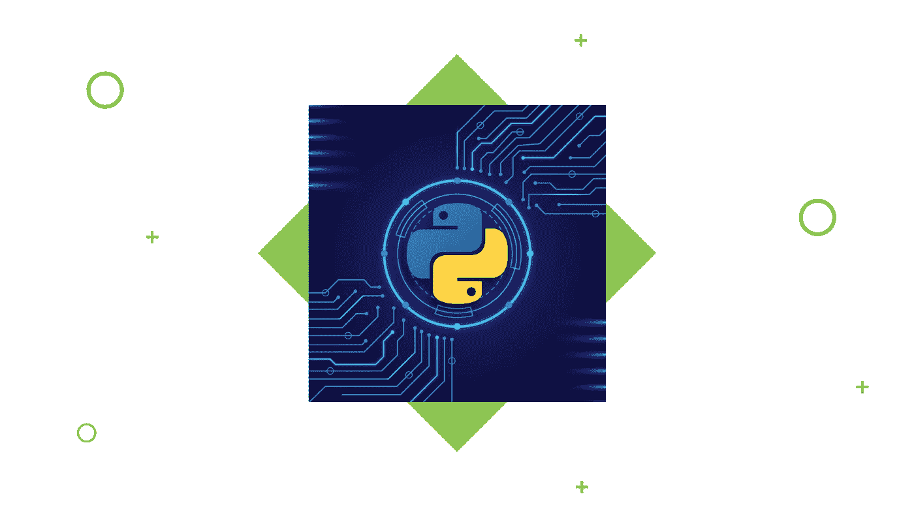

> 这篇关于 [**为什么 Python 对 ML 和 AI**](https://djangostars.com/blog/why-python-is-good-for-artificial-intelligence-and-machine-learning/#utm_source=medium&utm_medium=towardsdatascience.com&utm_campaign=8%20reasons%20why%20python%20is%20good%20for%20ml%20and%20ai&utm_content=why%20Python%20is%20good%20for%20ML%20and%20AI) 有好处的文章，原贴于 [**Django Stars 博客**](https://djangostars.com/blog/#utm_source=medium&utm_medium=towardsdatascience.com&utm_campaign=8%20reasons%20why%20python%20is%20good%20for%20ml%20and%20ai) 。

人工智能(AI)和机器学习(ML)是 IT 行业的新黑。虽然关于其开发安全性的讨论不断升级，但开发人员扩大了人工智能的能力和容量。今天，人工智能已经远远超出了科幻小说的概念。这成了一种必然。人工智能被广泛用于处理和分析海量数据，有助于处理无法再由人工完成的工作，因为其数量和强度显著增加。

例如，人工智能被应用于分析，以建立预测，帮助人们制定强有力的战略，寻找更有效的解决方案。FinTech 在投资平台中应用人工智能进行市场研究，并预测将资金投入何处以获得更大利润。旅游业使用人工智能来提供个性化建议或推出聊天机器人，并增强整体用户体验。这些例子表明，人工智能和人工智能被用来处理大量数据，以提供更好的用户体验，更个性化和更准确的体验。

# 人工智能和人工智能如何形成未来的技术

今天，随着数据量和复杂性的增加，人工智能和 ML 被用于数据的处理和分析。平心而论，人脑是可以分析大量数据的，但这种能力受限于它随时可以吸收的数据量。人工智能不受这个限制。人工智能提供的更准确的预测和见解提高了业务效率，降低了生产成本，提高了生产率。难怪许多行业应用人工智能和人工智能来提高性能和推动产品开发。

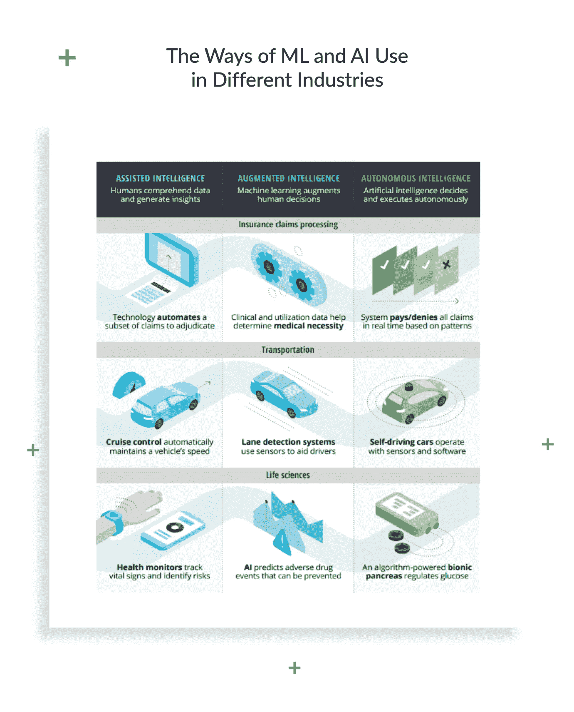

根据德勤的研究，人工智能驱动的公司是旨在提高生产力的技术变革的最新趋势。他们的预测也证明了这一点，即在未来 24 个月内，将在产品和流程中使用人工智能以实现更高效率和战略目标的公司数量可能会增加。简而言之，人工智能有助于用更少的努力做更好的工作。

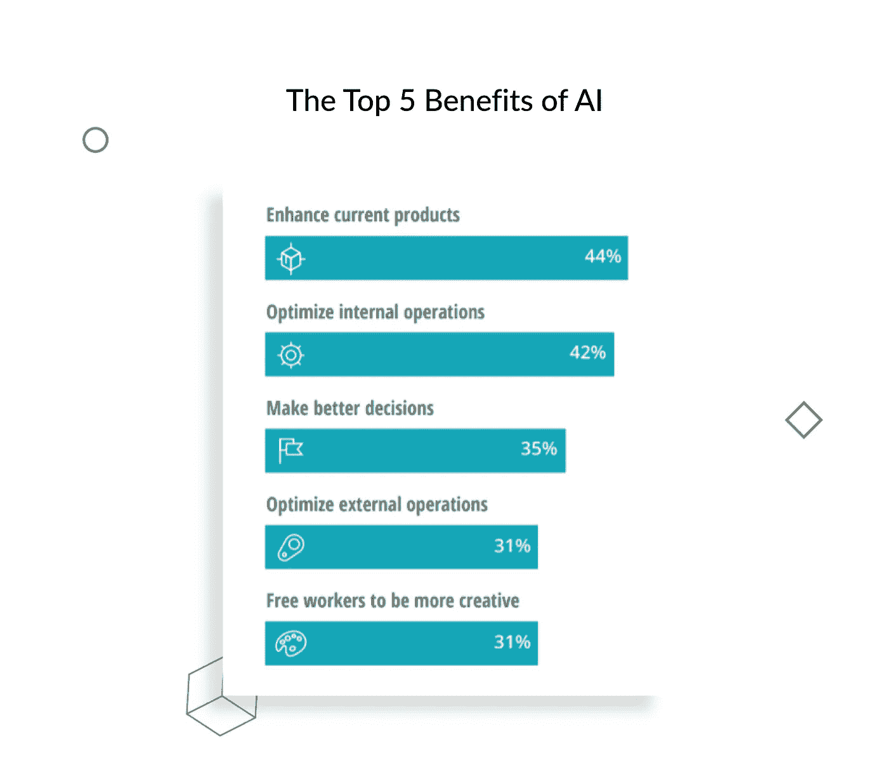

鉴于人工智能使用的优势，越来越多的公司渴望使用它。然而，人工智能是一条双行道——被用于优化分析过程，它不是最容易开发的技术。由于要分析的数据量巨大，人工智能产品必须能够有效地处理高负载的过程，并且不会为此花费太多时间。为了使其正常工作，必须为其开发选择合适的语言。就语法而言，它不会太复杂，能够处理复杂的过程，并且易于支持。

# Python 是人工智能和 ML 的最佳编程语言

随着人工智能和人工智能在各种渠道和行业中的应用，大公司在这些领域进行投资，对人工智能和人工智能专家的需求也相应增长。来自 IBM 机器学习部门的 Jean Francois Puget 表达了他的观点，Python 是人工智能和 ML 最受欢迎的语言，并基于 indeed.com 的一个趋势搜索结果。

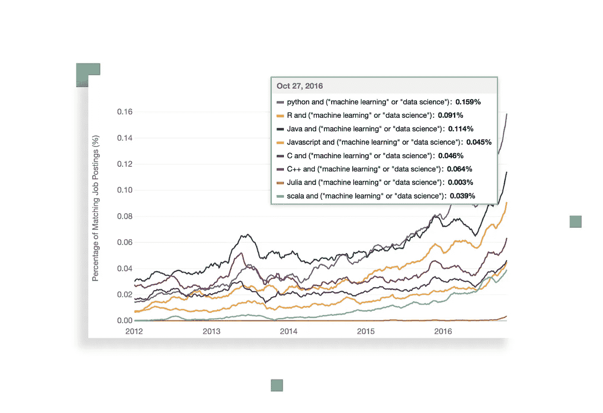

根据 Francois Puget 的图表，Python 是 AI 和 ML 的主要代码语言。

我们对 Python 的优势进行了一些研究，并发现了为什么在将 AI 和 ML 项目付诸实践时应该选择 Python。

## 您可能还喜欢:

[](https://djangostars.com/blog/benefits-of-the-use-of-machine-learning-and-ai-in-the-travel-industry/#utm_source=medium&utm_medium=towardsdatascience.com&utm_campaign=8%20reasons%20why%20python%20is%20good%20for%20ml%20and%20ai&utm_content=you%20may%20also%20like%201) [## 旅游业中的机器学习和数据分析

### 克里斯托弗·哥伦布是历史上最著名的旅行家之一，他一生只进行了 4 次旅行。其中一个…

djangostars.com](https://djangostars.com/blog/benefits-of-the-use-of-machine-learning-and-ai-in-the-travel-industry/#utm_source=medium&utm_medium=towardsdatascience.com&utm_campaign=8%20reasons%20why%20python%20is%20good%20for%20ml%20and%20ai&utm_content=you%20may%20also%20like%201) [](https://djangostars.com/blog/6-examples-ai-financial-services/#utm_source=medium&utm_medium=towardsdatascience.com&utm_campaign=8%20reasons%20why%20python%20is%20good%20for%20ml%20and%20ai&utm_content=you%20may%20also%20like%202) [## 金融服务中的 6 个人工智能示例

### 正如许多其他技术进步一样，人工智能从童话故事中走进了我们的生活…

djangostars.com](https://djangostars.com/blog/6-examples-ai-financial-services/#utm_source=medium&utm_medium=towardsdatascience.com&utm_campaign=8%20reasons%20why%20python%20is%20good%20for%20ml%20and%20ai&utm_content=you%20may%20also%20like%202) 

# 1.一个伟大的图书馆生态系统

丰富的库选择是 Python 成为最流行的人工智能编程语言的主要原因之一。库是一个模块或一组由不同来源发布的模块，如 [PyPi](https://pypi.org/) ，其中包括一段预先编写的代码，允许用户实现某些功能或执行不同的操作。Python 库提供了基础级别的项目，因此开发人员不必每次都从头开始编码。

ML 需要连续的数据处理，Python 的库让你可以访问、处理和转换数据。这些是你能为 ML 和 AI 使用的一些最广泛的库:

*   [Scikit-learn](http://scikit-learn.org/stable/user_guide.html) 用于处理基本的 ML 算法，如聚类、线性和逻辑回归、回归、分类等。
*   [熊猫](https://pandas.pydata.org/)用于高层数据结构和分析。它允许合并和过滤数据，以及从其他外部来源(例如 Excel)收集数据。
*   [Keras](https://keras.io/) 进行深度学习。它允许快速计算和原型制作，因为除了计算机的 CPU 之外，它还使用 GPU。
*   [TensorFlow](https://www.tensorflow.org/) 用于通过建立、训练和利用具有大规模数据集的人工神经网络来处理深度学习。
*   [Matplotlib](https://matplotlib.org/tutorials/index.html) 用于创建 2D 图、直方图、图表和其他可视化形式。
*   [NLTK](http://www.nltk.org/) 用于处理计算语言学、自然语言识别和处理。
*   [Scikit-image](https://scikit-image.org/) 用于图像处理。
*   [PyBrain](http://pybrain.org/) 用于神经网络、无监督和强化学习。
*   [Caffe](http://caffe.berkeleyvision.org/) 用于深度学习，允许在 CPU 和 GPU 之间切换，并使用单个 NVIDIA K40 GPU 每天处理 60+ mln 图像。
*   [统计模型](http://www.statsmodels.org/devel/)用于统计算法和数据探索。

在 [PyPI 库](https://pypi.org/)中，你可以发现和比较更多的 Python 库。

# 2.低准入门槛

在 ML 和 AI 行业工作，意味着要处理一堆你需要用最便捷有效的方式处理的数据。较低的准入门槛允许更多的数据科学家快速掌握 Python，并开始使用它进行人工智能开发，而无需浪费太多精力来学习这种语言。

Python 编程语言类似于日常英语，这使得学习过程更加容易。其简单的语法允许您轻松地处理复杂的系统，确保系统元素之间的清晰关系。

例如，编写这段代码的目的是为了确定输入的数字是否是质数。

下面是代码的视图:

```
test_number = 407 # our example is not a prime number# prime numbers are greater than 1if test_number > 1:# check for factorsnumber_list = range(2, test_number)for number in number_list:number_of_parts = test_number // numberprint(f"{test_number} is not a prime number")print(f"{number} times {number_of_parts} is {test_number}")breakelse:print(f"{test_number} is a prime number")else:print(f"{test_number} is not a prime number")
```

正如你在最后一行看到的，这段代码的结果是测试数不是质数。坦率地说，一个说英语的人可以很容易地理解代码的含义，因为它使用简单的英语单词。

除此之外，还有很多可用的文档，Python 社区也随时提供帮助和建议。

# 3.灵活性

用于机器学习的 Python 是一个很好的选择，因为这种语言非常灵活:

*   它提供了选择使用 OOPs 或脚本的选项。
*   也不需要重新编译源代码，开发人员可以实现任何更改并很快看到结果。
*   程序员可以结合 Python 和其他语言来达到他们的目标。

此外，灵活性允许开发人员选择他们完全熟悉的编程风格，甚至组合这些风格以最有效的方式解决不同类型的问题。

*   命令式风格由描述计算机如何执行这些命令的命令组成。通过这种方式，你可以定义程序状态改变时的计算顺序。
*   **函数式风格**也被称为声明式，因为它声明了应该执行什么操作。它不考虑程序状态，与命令式相比，它以数学方程的形式声明语句。
*   **面向对象风格**基于两个概念:类和对象，相似的对象形成类。Python 并不完全支持这种风格，因为它不能完全执行封装，但是开发人员仍然可以在一定程度上使用这种风格。
*   程序风格在初学者中最常见，因为它以一步一步的方式进行任务。它通常用于排序、迭代、模块化和选择。

灵活性因素降低了出错的可能性，因为程序员有机会控制局面并在舒适的环境中工作。

# 4.平台独立性

Python 不仅使用起来舒服、容易学习，而且用途广泛。我们的意思是，用于机器学习开发的 Python 可以在任何平台上运行，包括 Windows、MacOS、Linux、Unix 和其他 21 种平台。为了将流程从一个平台转移到另一个平台，开发人员需要实现一些小规模的更改，并修改一些代码行，以创建适用于所选平台的可执行形式的代码。开发者可以使用像 [PyInstaller](https://pypi.org/project/PyInstaller/) 这样的包来准备他们的代码，以便在不同的平台上运行。

同样，这为各种平台上的测试节省了时间和金钱，并使整个过程更加简单和方便。

# 5.可读性

Python 非常容易阅读，所以每个 [Python 开发者](https://djangostars.com/services/python-django-development/#utm_source=medium&utm_medium=towardsdatascience.com&utm_campaign=8%20reasons%20why%20python%20is%20good%20for%20ml%20and%20ai&utm_content=Python%20developer)都可以理解他们同行的代码，并修改、复制或分享它们。没有混淆，错误或冲突的范例，这导致了人工智能和人工智能专业人员之间更有效的算法，思想和工具的交流。

也有像 [IPython](https://ipython.org/) 这样的工具可用，这是一个交互式 shell，提供额外的功能，如测试、调试、制表和其他功能，并简化工作流程。

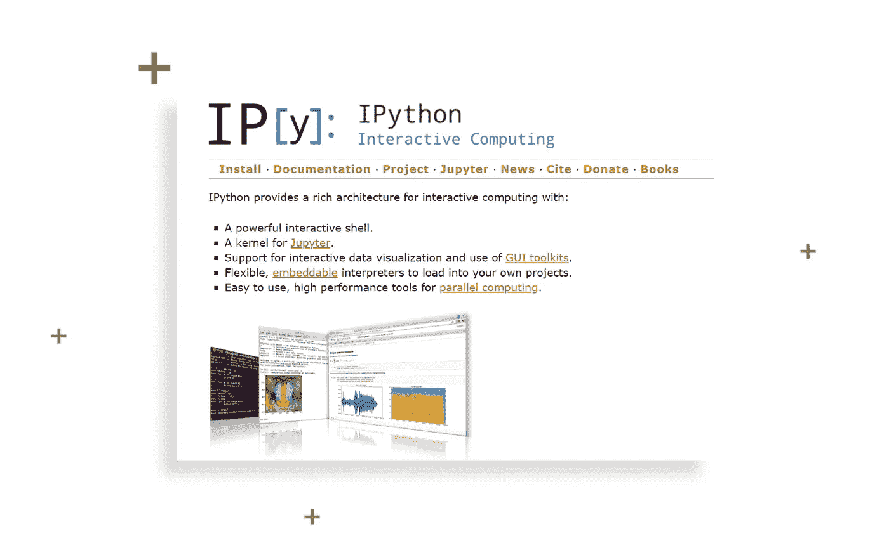

# 6.良好的可视化选项

我们已经提到 Python 提供了各种各样的库，其中一些是很好的可视化工具。然而，对于 AI 开发人员来说，重要的是要强调，在人工智能、深度学习和机器学习中，能够以人类可读的格式表示数据至关重要。

像 [Matplotlib](https://matplotlib.org/) 这样的库允许数据科学家构建图表、直方图和绘图，以便更好地理解数据、有效地展示和可视化。不同的应用程序编程接口也简化了可视化过程，使创建清晰的报告变得更加容易。

# 7.社区支持

当围绕编程语言建立了强大的社区支持时，这总是很有帮助的。Python 是一种开源语言，这意味着有很多资源对程序员开放，从初学者到专业人员。

许多 Python 文档可以在网上以及 Python 社区和论坛中获得，程序员和机器学习开发人员在那里讨论错误、解决问题并互相帮助。

Python 编程语言是绝对免费的，各种有用的库和工具也是如此。

# 8.日益普及

由于上面讨论的优势，Python 在数据科学家中越来越受欢迎。根据 StackOverflow 的消息，Python 的受欢迎程度预计至少会持续到 2020 年。

这意味着寻找开发人员和替换团队成员变得更加容易。此外，他们的工作成本可能没有使用不太流行的编程语言时高。

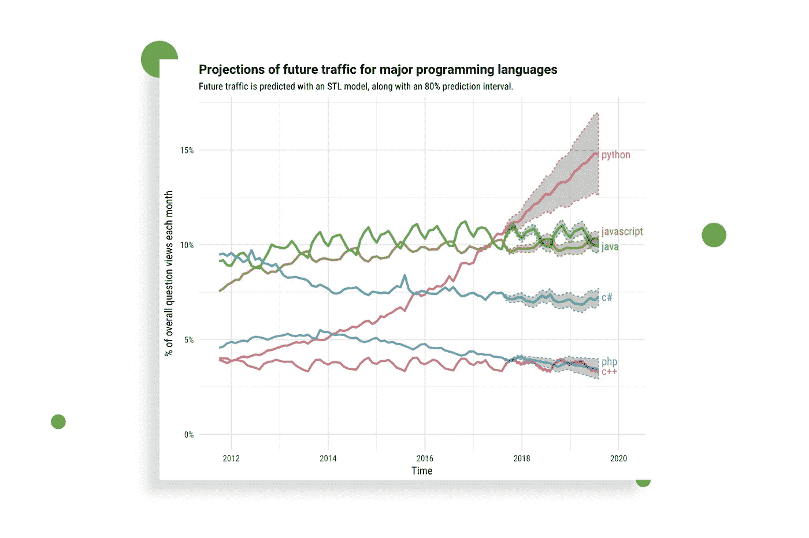

# 人工智能和人工智能的 Python 用例

Python 提供了许多对 AI 和 ML 特别有用的特性，这使得它成为实现这些目的的最佳语言。难怪各行各业都用 Python 做预测等机器学习任务。

让我们仔细看看中的一些示例:

*   旅行；
*   Fintech
*   运输；
*   医疗保健。

# 旅行

例如，旅游业巨头 Skyscanner 使用 Python 无监督 ML 算法来预测新飞机航线的行为。他们比较了数千个出发地和目的地，用 30 种不同的标准来评估每一个目的地，以确定乘客的需求。他们的结果显示在[仪表盘](https://partners.skyscanner.net/how-ai-can-better-support-airlines-in-their-fleet-developments/thought-leadership?AID=13018000&PID=6361382&SID=trd-1420779728595016236&associateid=AFF_TRA_00014_00001&utm_source=commission+junction&utm_medium=affiliate&utm_campaign=uk-travel-3486349-6361382&utm_content=uk-travel-13018000&_tck=b/fqwn9l6MTFqFPLF1/8ilVE0fESuLlDT8coKepLQog)上，在那里你可以选择任何始发城市来查看从 0 到 9 的目的地组及其特征。

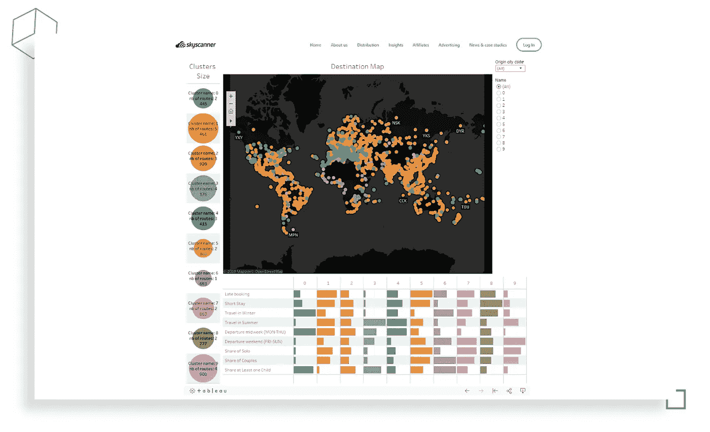

这样一个[人工智能在旅游行业](https://djangostars.com/blog/benefits-of-the-use-of-machine-learning-and-ai-in-the-travel-industry/#utm_source=medium&utm_medium=towardsdatascience.com&utm_campaign=8%20reasons%20why%20python%20is%20good%20for%20ml%20and%20ai&utm_content=AI%20implementation%20in%20the%20traveling%20industry)中实施的例子对于向用户推荐目的地、协助创建营销预算以及为新路线设定初始价格非常有帮助。

# 金融科技

[金融服务中使用的人工智能](https://djangostars.com/blog/6-examples-ai-financial-services/#utm_source=medium&utm_medium=towardsdatascience.com&utm_campaign=8%20reasons%20why%20python%20is%20good%20for%20ml%20and%20ai&utm_content=AI%20used%20in%20financial%20services)有助于解决与风险管理、欺诈防范、个性化银行、自动化和其他工具相关的问题，从而为用户提供高质量的金融服务。据预测，到 2030 年，金融科技中的人工智能可以将运营成本降低 22 %( T7 ),产生令人印象深刻的 1 万亿美元。

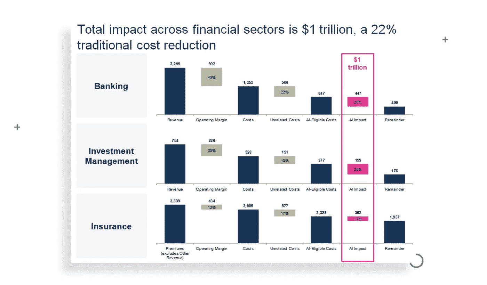

基于 Python 构建的网上银行软件的成功例子有 [Venmo](https://venmo.com/about/product/) 、 [Affirm](https://www.affirm.com/) 或 [Robinhood](https://robinhood.com/) 。这些服务不仅允许用户进行和控制他们的支付和购买，而且它们还在软件内部创建了一个社交网络，因此人们可以保持联系。

当谈到加密货币时，Python 被用来构建类似于 [Anaconda](https://www.anaconda.com/) 的解决方案，以有效地分析市场，进行预测和可视化数据。

# 运输

优步用 Python 开发了一个 ML 平台[米开朗基罗 PyML](https://eng.uber.com/michelangelo-pyml/) 。他们用它进行在线和离线预测，解决日常任务。米开朗基罗 PyML 是最初米开朗基罗产品的扩展，它是可扩展的，但不够灵活。现在，用户可以用 PyML 验证模型，然后在米开朗基罗中复制它们，以获得充分的效率和可伸缩性。

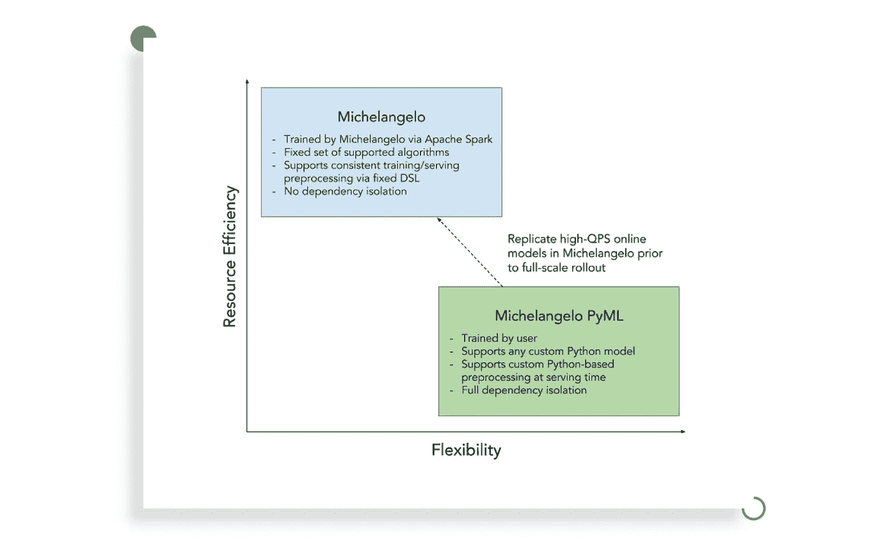

# 卫生保健

人工智能正在重塑医疗保健行业，帮助预测和扫描疾病，检测损伤，并帮助人们通过易于使用的移动应用程序在日常生活中保持良好的健康。

业界有很多基于人工智能的伟大项目。例如， [Fathom](https://www.fathomhealth.co/) 是一个自然语言处理系统，用于分析电子健康记录，他们的任务是“自动化医疗编码”他们的领导者来自谷歌、亚马逊、脸书等公司，或者斯坦福大学和哈佛大学。

AiCure 是另一家专注于确保患者在正确的时间服用正确药物的初创公司。为此，他们使用面部识别、药丸识别和动作识别等技术。该应用程序还能够分析患者的状态，并了解治疗是否有效。他们使用 IMA，这是一种交互式医疗助手，可以收集临床上有意义的数据，然后通过软件进行分析。

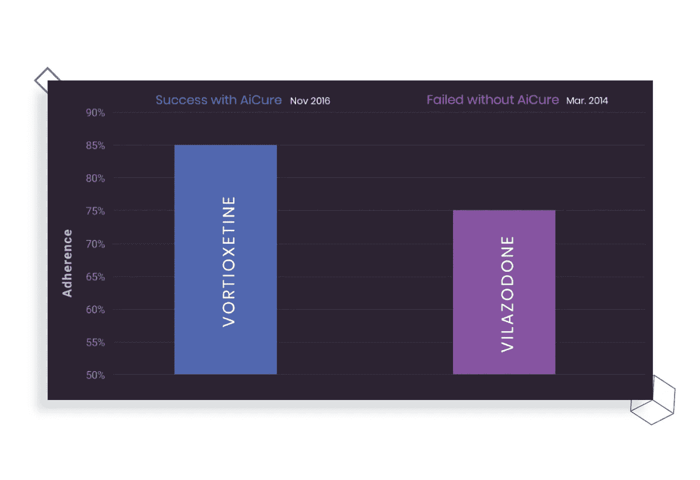

越来越受欢迎导致数据科学社区对 Python 程序员的需求越来越大，选择一种需求量大的语言是明智的选择，因为在未来，它将允许更多的功能。

# 用于机器学习的 Python:有用的开源项目

Python 的开源特性允许任何人工智能开发公司与社区分享他们的成果。如果你已经下定决心，决定学习 Python，或者想在你的人工智能项目中使用这种语言，这里有一个有用的开源项目列表供你开始使用:

*   [OpenCog 基金会](https://opencog.org/) OpenCog 致力于创造具有人类能力的人工通用智能(AGI ),以此“共同构建更好的思想”。它成立于 2011 年，现在，它被用于奇点网络项目，以及汉森机器人公司，为索菲亚和其他机器人提供智能。
*   人工智能研究所人工智能研究所是不来梅大学计算机科学学院的一部分。它对人工智能进行研究，举办不同的研讨会和活动，帮助推动人工智能技术向前发展，让更多年轻人参与该领域并对他们进行教育，同时支持现有的人工智能项目和公司。
*   这是“世界上最高效的团队聊天”，每天可以处理数千条实时消息。财富 500 强公司和其他大型开源项目使用 Zulip，它提供了清晰的组织、异步通信和其他对团队有用的巨大优势。
*   [Magenta
    它致力于图像、歌曲、图画的生成，让艺术家探索新的创作方式。](https://magenta.tensorflow.org/)
*   MailPile
    MailPile 是一款创新的电子邮件客户端，专注于安全和私密的通信。这个项目试图回答一个问题:“我如何在网上保护我的隐私？”它速度快，没有广告，有强大的搜索功能，还有隐私和加密功能。

# 总结一下

人工智能和人工智能是快速发展的通用技术，让科学家解决现实生活中的困境，并提出聪明的解决方案。他们中的许多人认为 Python 是人工智能的完美编程语言的原因是由于以下优点:

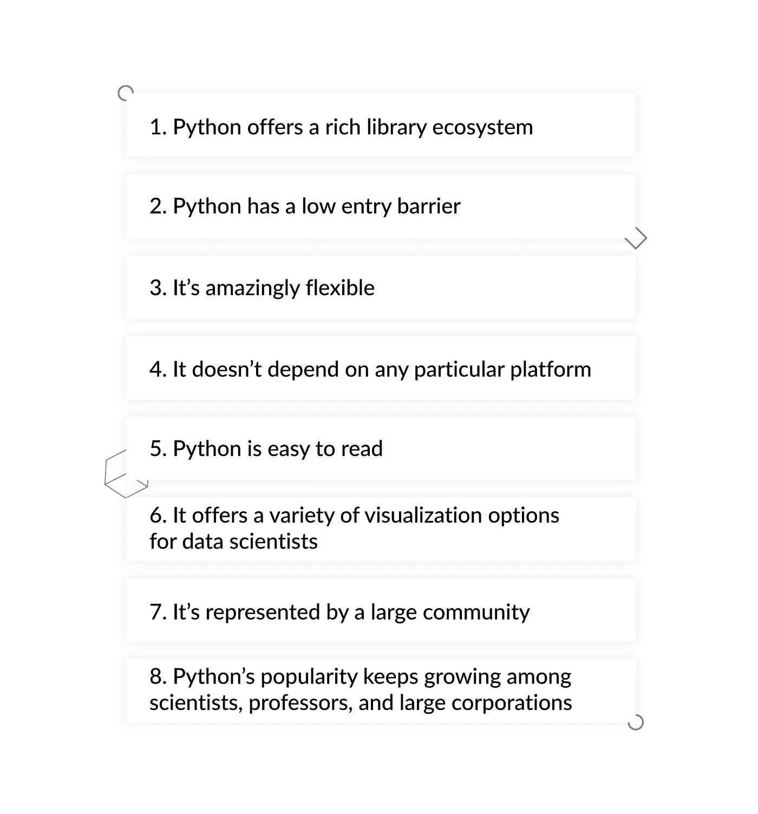[](https://djangostars.com/services/python-django-development/#utm_source=medium&utm_medium=towardsdatascience.com&utm_campaign=8%20reasons%20why%20python%20is%20good%20for%20ml%20and%20ai&utm_content=banner_end)