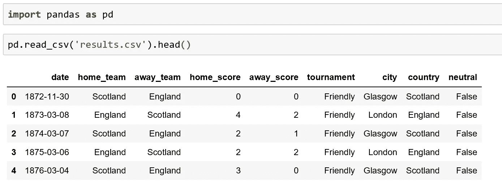
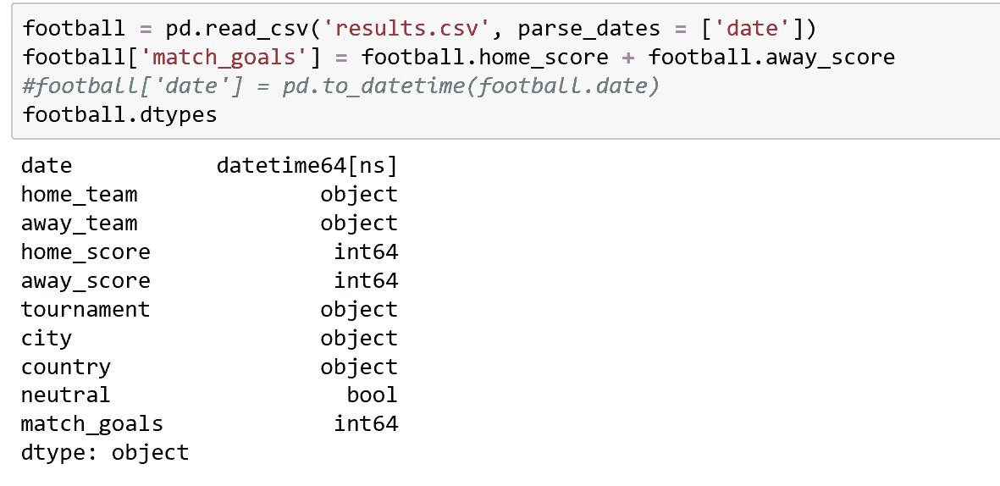
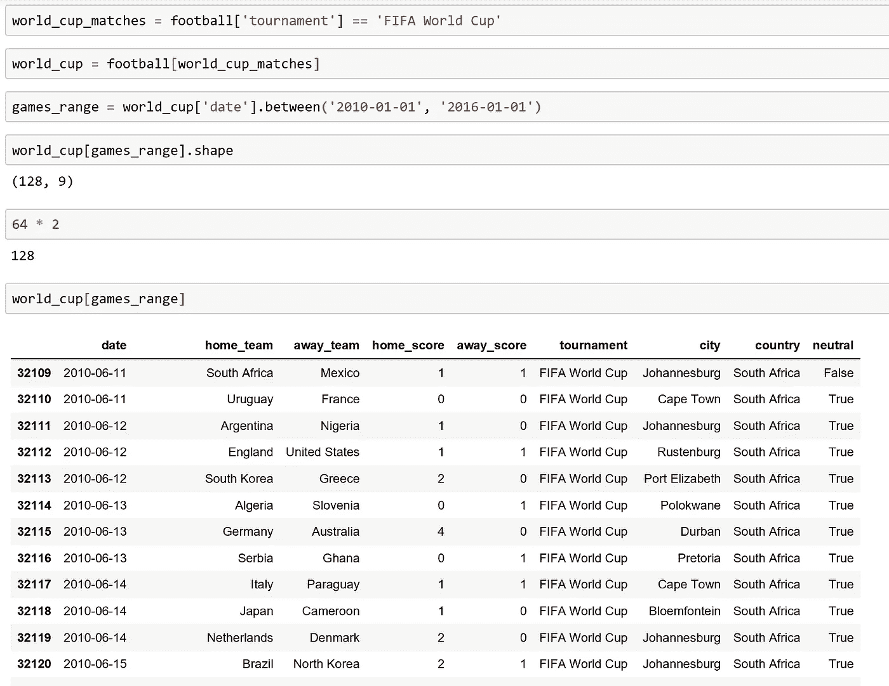
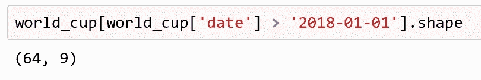
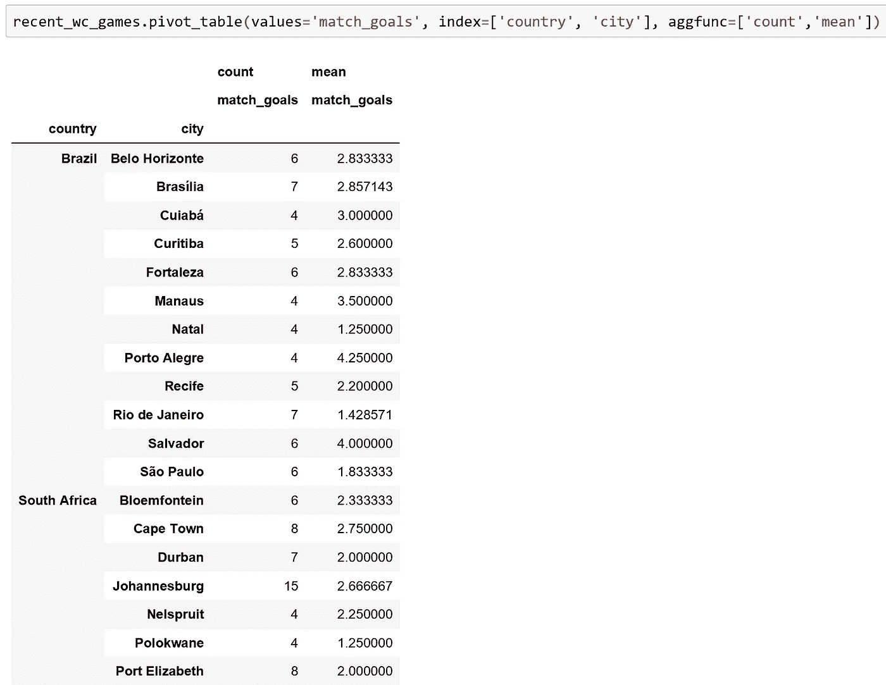
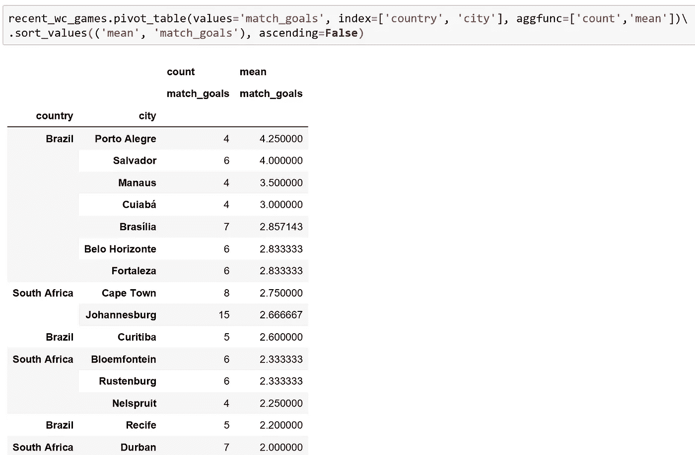
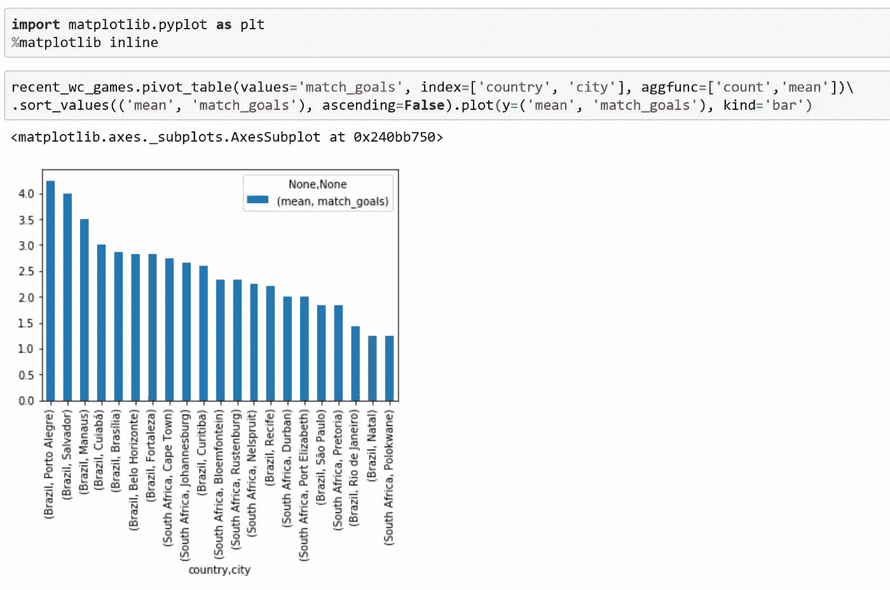
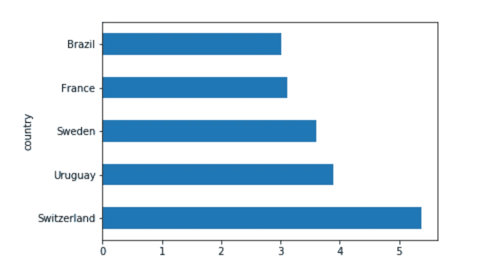
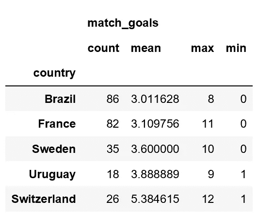
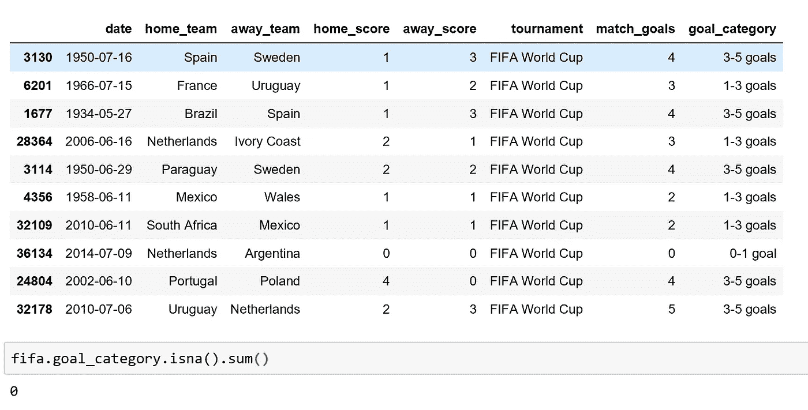

# 用于数据集处理的 8 个有用的 Pandas 特性

> 原文：<https://towardsdatascience.com/8-useful-pandas-features-for-data-set-handling-753e9d8ba8ff?source=collection_archive---------11----------------------->

# 世界杯和熊猫- **Joga bonito**

Image Courtesy of [Fauzan Saari](https://unsplash.com/@fznsr_) via Unsplash

# 介绍

本文展示了 8 个简单但有用的 Pandas 操作，展示了 Python 的 Pandas 库如何有效地用于数据集探索。我将在这篇教程中使用的数据集名为“【1872 年至 2019 年的国际足球成绩”，可以在这里找到[，以防出现任何想要测试的代码片段示例。](http://International football results from 1872 to 2019)

## 1.Pandas read_csv 方法的 parse_dates 参数。

通常，当我第一次导入数据集时，我使用 head()方法读取前 5 行。所示的示例通知我，我有一个日期列。理想情况下，对于基于日期-时间的操作，我希望该列具有日期-时间数据类型。

Before assigning the data-set to a variable name, I quickly view the columns to get a sense of the data-set

为了在我第一次导入数据集时做到这一点，您可以简单地使用 Pandas read_csv 方法的 parse_dates 可选参数。此参数采用一个列表，其中您希望作为日期时间数据类型的列名在列表中作为字符串列出。

- *如果要将多个列解析为 datetime 数据类型*，只需将每个列名传递到列表中，用逗号分隔。这可以防止使用 pd.to_datetime 方法重新分配现有列。例如，如果我只是读入数据，不包括 parse_dates 参数，我将不得不使用 pd.to_datetime 方法来获得相同的最终结果。

要确认该列已经成功转换为 datetime 数据类型序列，只需调用 DataFrame 上的 dtypes 属性，我在这里为它指定了变量 football。

*(注意:我已经创建了一个名为 match goals 的新列，将在后面的步骤中使用)*

The parse_dates parameter can simplify and cut down on the amount of code that needs to be written when parsing columns which require a datetime datatype. The pd.to_datetime is an equivalent way of executing this conversion.

## **2。熊猫系列**的中间方法

既然 date 列有 datetime 数据类型，我可以通过在数据集上使用 between 方法来利用这一点。

由于我关注的是 FIFA 世界杯，所以我过滤了足球数据帧，并创建了一个布尔序列，如果锦标赛列中的列值与“FIFA 世界杯”匹配，则返回真值。然后，我将这个布尔序列分配给一个名为世界杯比赛的变量，并使用这个布尔序列过滤足球数据帧。这给了我一个新的数据框架，为简单起见，我称之为世界杯。

我现在可以在我的 world_cup 数据帧中的日期列上使用 between 方法，找出在两个指定日期之间发生的比赛数量。

between 方法的第一个参数是下限字符串日期，第二个参数是上限字符串日期。between 方法返回一个布尔序列，我将它赋给变量 games_range。然后我用这个布尔序列过滤世界杯数据帧。

为了清楚起见，我选择了 2010 年 1 月 1 日和 2016 年 1 月 1 日之间的日期，因为我知道在这两个日期之间有两届世界杯；一次是 2010 年在南非，另一次是 2014 年在巴西。在现代形式下，每届世界杯都由 64 场比赛组成。我用来过滤世界杯数据帧的游戏范围变量应该返回 128 行。确实如此，如代码片段所示。

*注意:对于 between 方法，下限是包含性的，上限是排他性的。*

## 2.b 过滤日期

此外，在处理 datetime 数据类型时，可以使用比较运算符。在这里，我创建了一个布尔序列，如果“日期”大于 2018 年 1 月 1 日，则返回真值。我用这个布尔序列过滤我的 world_cup 数据帧，并使用 shape 属性快速检查它的形状。这告诉我，世界杯数据帧中的 64 行对应于 2018 年 1 月 1 日之后的日期。这在 2018 年俄罗斯世界杯发生在当年夏天的基础上是有道理的！

## 3.数据透视表方法

数据透视表方法非常适合于将值作为一个整体进行汇总。pivot_tables 方法直接在 DataFrame 上调用，这里是' recent_wc_games '(上一节的*，基于两届世界杯，参见下面注释掉的代码*)。在所示的示例中，我在“match_goals”列进行汇总，该列对应于每场比赛的比赛进球数。

这些值现在可以根据国家和城市进行分组。这些列作为字符串列表传递给 pivot table 方法的 index 参数，以创建多序列索引。然后，我选择希望对分组数据运行的聚合函数。这里，我将一个列表传递给 aggfunc 参数，它给出了分组数据的计数和平均值。

This data output requires some sorting, but shows how simply the data can be summarised

## 4.整理

*-当存在多索引列时，使用元组通过 sort_values 指定。*

现在，数据已经根据国家和城市进行了分组，以获得平均比赛进球数和比赛次数，我可以对数据进行排序，使其更易于理解。此外，我可以使用 Pandas 的一行程序来可视化数据。

我使用 sort_values 方法，但是*更重要的是，*要按比赛进球得分排序，我需要传入一个 tuple。我将 ascending 参数设置为 False，从最高平均匹配目标到最低平均匹配目标对数据进行排序。在这里，巴西的阿雷格里港似乎举办了 2014 年巴西世界杯最具娱乐性的比赛。

Porto Alegre, the best place to have watched a FIFA World Cup match?

## 5.测绘

*-记得导入 matplotlib。*

要通过平均匹配得分来绘制这些排序值，我只需在绘图方法中为 y 参数指定一个元组。元组中的第一个元素是最外面的列索引值，后面是内部列索引，如下所示。为了生成垂直条形图，我将 bar 作为参数传递给 kind 参数。

Certain version of the Jupyter Notebook may require the cell magic %matplotlib inline command, so I have included it in this example.

## 6.get_group 方法

为了利用 get_group 方法，我首先在最初引入的原始足球数据帧中创建锦标赛列的 groupby 对象。我给这个 groupby 对象分配了一个变量名‘锦标赛’。python len 函数和 nunique series 方法告诉我，在原始足球数据帧中有超过 40，000 行，但只有 109 个独特的比赛。

我现在在变量锦标赛上使用 get_group 方法，该方法指向 groupby 对象以返回一个数据帧，其中只有“FIFA World Cup”被列为锦标赛类型。在原始数据帧的 40839 行中，有 900 行对应于 FIFA 世界杯数据。

我现在可以使用这个新的数据帧(我称之为 fifa ),并在其上执行任何操作。例如，我可以按国家分组来确定比赛进球的平均数，如下面的代码片段所示。

get_group 方法在获取新的数据帧时非常好用。我同样可以编写 tournament . get(' Copa America ')，从原始足球数据帧中获取与该锦标赛对应的所有行。

To produce this output I have method chained, and ended with the head method. This explains why only 5 horizontal bar columns are shown.

## 7.单个列上的多个聚合函数。

通常需要对数据帧中的单个列执行多个聚合函数。在给出的例子中，我想确定每一个举办世界杯比赛的国家的记录数量，平均，最小和最大比赛进球得分。

为了做到这一点，我创建了一个 groupby 对象，并传递了 agg 方法(一个字典),其中键表示列，值表示我希望执行的聚合函数。如果我想对这个输出进行排序，就必须将一个*元组*传递给 sort_values 方法，其中第一个元素是列，第二个元素是我想要排序的聚合函数。

有趣的是，瑞士的一场世界杯比赛似乎上演了一场 12 球的惊悚片！瑞士也拥有最多的平均比赛进球数，平均每场比赛超过 5 个！对于感兴趣的人，我确实在 1954 年 T2 世界杯上检查了这些结果，因为结果甚至让我吃惊！

The output is sorted by the ‘mean’ aggregation function and the tail is shown, which defaults to the last 5 rows.

## 8.pd.cut 创建类别

最后，为了包含，可以方便地使用 pd.cut 方法将数据分类到用户定义的箱中。对于这个例子，我已经为那些离群游戏创建了一系列 4 个容器，-1 对 1 目标(第一个数字是唯一的，因此我不能从 0 开始容器)，1-3 目标，3-5 目标和 5-13 目标！

然后，我给每个 bin 一个相应的标签名，并创建一个名为“goal_category”的新系列。用于内部验证的随机抽样确认了色谱柱类别的正确分配。我想运行的最后一个检查是检查我的新列中是否有任何丢失的数据，(null 值/NaN)值。我通过在我创建的新系列上直接调用 isna()方法来实现这一点，这确认了没有丢失数据。

Random sampling for internal verification confirms that the column categories are correctly assigned

## 快速小结

本文展示了各种有用的方法及其参数，可以直观地用来研究数据集。有多种方法可以实现每个步骤，但是我经常坚持使用所示的方法来提高可读性。