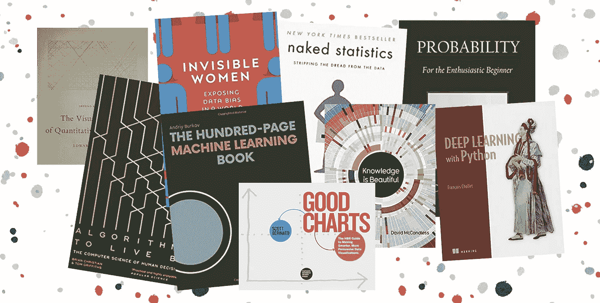
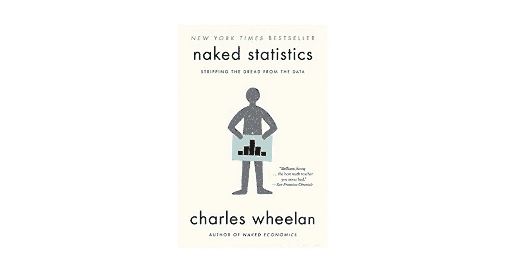
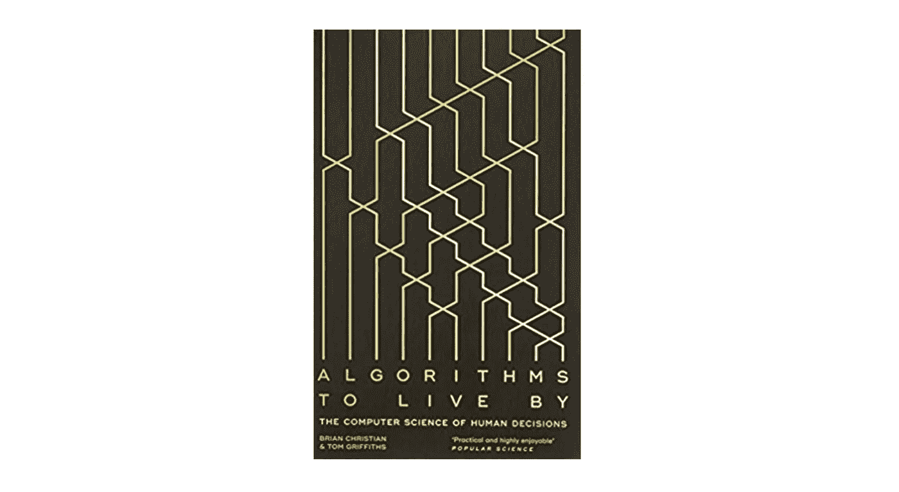
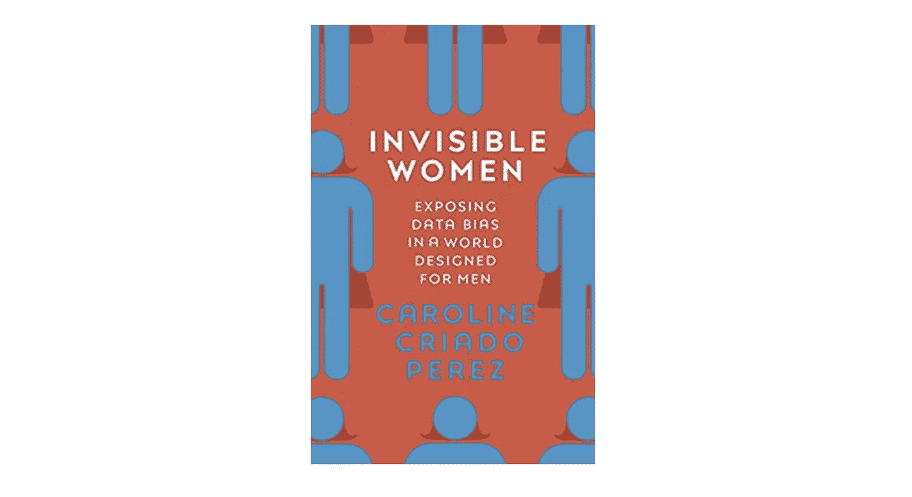
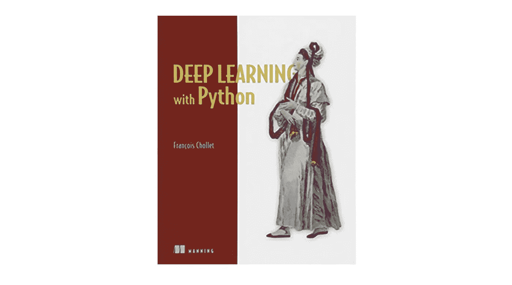
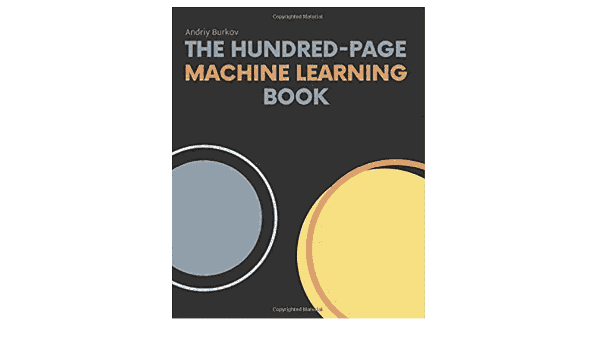
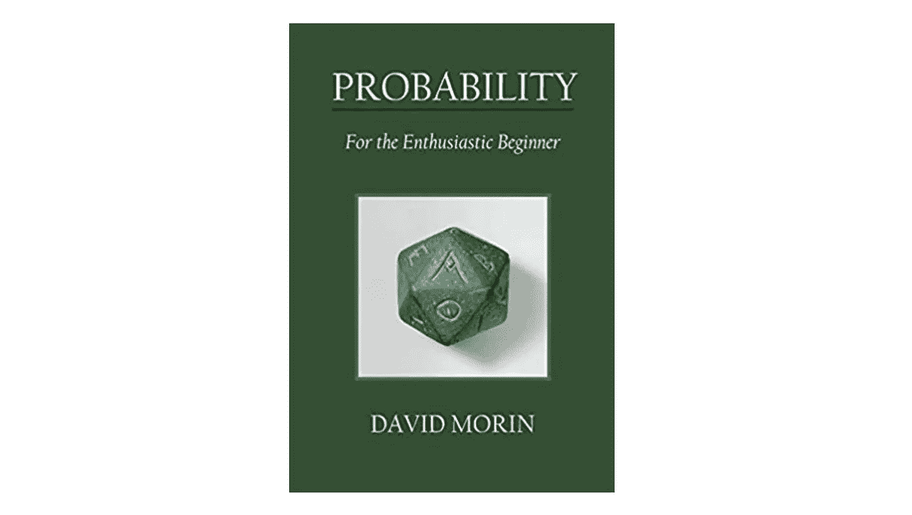
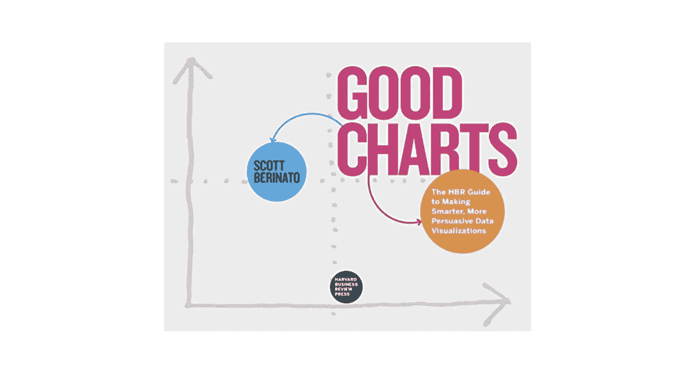
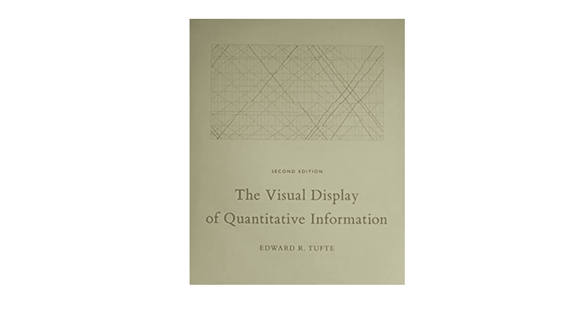
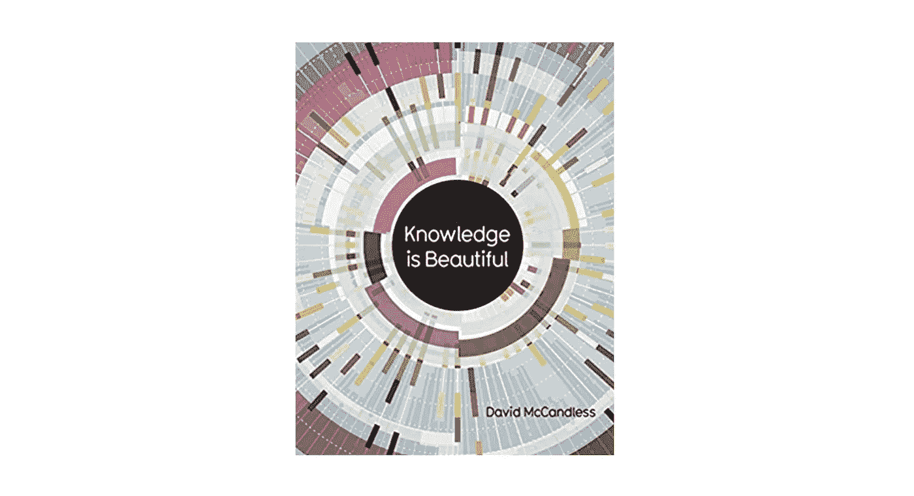

# 9 本数据科学相关书籍向圣诞老人索要圣诞礼物

> 原文：<https://towardsdatascience.com/9-data-science-related-books-to-ask-santa-for-christmas-37a1036478e9?source=collection_archive---------9----------------------->

Background source: [fevzizirhlioglu](https://pixabay.com/users/fevzizirhlioglu-3219056/) at Pixabay — free stock images

## 我最喜欢的几本书的汇编。

本周，我打算上传一个关于对分类变量进行适当编码的重要性的故事，但鉴于我们非常非常非常接近圣诞节，我认为删除一些关于我在这一年中发现的书籍的内容是一个好主意，我自己也会喜欢收到这些书籍作为礼物。

这些建议将分为以下几类:

*   非技术书籍
*   技术书籍
*   数据可视化书籍

你会发现每种都有 3 个，希望我会给你一些惊喜。

## 非技术书籍

[裸统计](https://www.amazon.co.uk/gp/product/039334777X/ref=ppx_yo_dt_b_search_asin_title?ie=UTF8&psc=1) —评分:5 分中的 4 分

尽管有些章节可能过于基础，但 Charles Wheelan 带领我们浏览了许多我们在日常生活中经常使用和提到的东西，展示了所有这些概念的经典错误和良好实践。如果你正在学习，但还没有在这个领域工作，获取一些技术概念的真实例子也很有趣。

关于它的更多信息:

> 曾经被认为乏味的统计学领域正在迅速演变成一门学科，谷歌首席经济学家哈尔·瓦里安称之为“性感”。从击球率和政治民意调查到游戏节目和医学研究，统计学在现实世界中的应用继续突飞猛进。怎样才能抓住在标准化考试中作弊的学校？网飞怎么知道你会喜欢哪部电影？是什么导致了自闭症发病率的上升？正如畅销书作家查尔斯·惠兰在《赤裸裸的统计》中向我们展示的那样，正确的数据和一些精心挑选的统计工具可以帮助我们回答这些问题以及更多问题。
> 
> 来源:http://goodreads.com/

[赖以生存的算法](https://www.amazon.co.uk/Algorithms-Live-Computer-Science-Decisions/dp/0007547994/ref=sr_1_1?crid=3LS0OKPCJHL3U&keywords=algorithms+to+live+by&qid=1576759720&s=books&sprefix=algorithms%2Cstripbooks%2C376&sr=1-1) —评分:4.5 分(满分 5 分)

开始时有点慢，有时甚至有点重复，但之后有一些真正令人惊叹的章节，这是一本你可能必须读几遍才能完全理解的书。对我来说，它给了我日常生活和工作的工具，也给了我完成这本书后进一步阅读的问题和灵感。

关于它的更多信息:

> 我们所有的生活都受到有限的空间和时间的限制，这些限制会产生一系列特殊的问题。在一天或一生中，我们应该做什么，或不做什么？我们应该接受多大程度的混乱？什么样的新活动和熟悉的最爱的平衡是最有成就感的？这些似乎是人类独有的困境，但事实并非如此:计算机也面临同样的限制，因此计算机科学家几十年来一直在努力解决他们版本的此类问题。他们找到的解决方案有很多值得我们学习的地方。
> 
> 来源:http://goodreads.com

[隐形女性:为男性设计的世界中的数据偏差](https://www.amazon.co.uk/Invisible-Women-Exposing-World-Designed/dp/1784741728/ref=sr_1_1?keywords=invisible+woman&qid=1576760211&s=books&sr=1-1) —评分:5 分

正如我的一个朋友对我说的那样:不要因为它是“关于女人”的就放弃，因为那意味着它也是关于男人的！我还没有完成这本书，但迄今为止，它已经显示出惊人的。Caroline Criado-Pérez 所做的研究确实令人印象深刻，它揭示了一个我们都应该处理的问题的真实事实。

关于它的更多信息:

> 想象一下这样一个世界，你的手机对你的手来说太大了，你的医生开了一种不适合你身体的药，在车祸中你受重伤的可能性增加了 47%，你每周无数小时的工作没有得到认可或重视。如果这些听起来很熟悉，很可能你是个女人。
> 
> 《看不见的女人》向我们展示了，在一个主要由男人建造并为男人服务的世界里，我们是如何系统地忽略了一半的人口。它暴露了性别数据差距——这是我们知识中的一个差距，是对妇女的长期、系统歧视的根源，并造成了普遍但无形的偏见，对妇女的生活产生了深远的影响。
> 
> 来源:http://goodreads.com

额外收获:如果你不想读完整本书，或者你只是想先睹为快，我的另一个朋友向我推荐了《99%隐形播客中的一集[，他们在那里采访了作者。](https://99percentinvisible.org/episode/invisible-women/)

## 技术书籍

[使用 Python 进行深度学习](https://www.amazon.co.uk/Deep-Learning-Python-Francois-Chollet/dp/1617294438/ref=sr_1_2?crid=2YIEQNWUCGVKD&keywords=deep+learning&qid=1567677140&s=books&sprefix=deep+lea%2Cstripbooks%2C154&sr=1-2) —评分:4 分(满分 5 分)

爱 Python？想了解更多关于深度学习的知识？Francois Chollet 是最广泛使用的库之一 Keras 的作者。这本书从背后的直觉，到概念的实际应用，展示例子，让读者享受。

关于它的更多信息:

> 深度学习适用于越来越多的人工智能问题，如图像分类、语音识别、文本分类、问答、文本到语音和光学字符识别。这是脸书和谷歌的照片标签系统、无人驾驶汽车、智能手机上的语音识别系统等等背后的技术。特别是，深度学习擅长解决机器感知问题:理解图像数据、视频数据或声音数据的内容。这里有一个简单的例子:假设您有一个很大的图像集合，并且您想要与每个图像相关联的标签，例如，“狗”、“猫”等。深度学习可以让你创建一个理解如何将这种标签映射到图像的系统，只从例子中学习。该系统可以应用于新的图像，自动完成照片标记的任务。深度学习模型只需要输入任务的示例，就可以开始在新数据上生成有用的结果。
> 
> 来源:http://goodreads.com

[百页机器学习书](https://www.amazon.co.uk/Hundred-Page-Machine-Learning-Book/dp/199957950X/ref=zg_bs_922530_1?_encoding=UTF8&psc=1&refRID=HNZ9FPPDQNYR6JCE1F61) —评分 5 分

我开始在网上零零碎碎地阅读这本书，每次我需要更好地理解一个概念，但发现它非常好，清晰和有帮助，最近决定买印刷版本放在家里。它贯穿了机器学习中所有最重要的概念和算法。从技术和非技术的角度解释它们是如何工作的。

关于它的更多信息:

> 监督和非监督学习、支持向量机、神经网络、集成方法、梯度下降、聚类分析和降维、自动编码器和转移学习、特征工程和超参数调整！数学，直觉，插图，都在短短一百页里！
> 
> 来源:http://themlbook.com/

额外收获:这本书有自己的网页，你可以找到不同的格式选项，以及不同人的评论和意见。

[概率:对于热情的初学者](https://www.amazon.co.uk/Probability-Enthusiastic-Beginner-David-Morin/dp/1523318678/ref=sr_1_2?keywords=Probability%3A+For+the+Enthusiastic+Beginner&qid=1576762472&sr=8-2) —评分:4 分(满分 5 分)

对自己的概率知识和技能感到有些生疏？那么这本书是给你的。它以一种非常友好的方式通过所有最重要的主题，充满了例子和解决的问题。重温概念，如组合学，概率规则，贝叶斯定理，期望值，方差，概率密度，共同分布，大数定律，中心极限定理，相关性和回归。关于这本书，你实际上没什么需要知道的。一本在家里就放在身边的方便的书。

## 数据可视化书籍

我发现数据可视化是数据科学如此重要的一部分，以至于不久前我发表了一篇文章，名为:'[改善你绘图的 10 个技巧。因为在现实生活的数据科学中，绘图确实很重要。在那篇文章中，我写了一点为什么我认为数据可视化如此重要，但是如果你有兴趣阅读更多关于它的内容并提高你的理解和技能，那么接下来的书肯定会帮助你实现这一点。](/10-tips-to-improve-your-plotting-f346fa468d18?source=friends_link&sk=b2f7a584a74badc44d09d5de04fe30d8)

[好图表](https://www.amazon.co.uk/Good-Charts-Smarter-Persuasive-Visualizations-ebook/dp/B01BO6QM9Q/ref=sr_1_1?keywords=Good+Charts%3A+The+HBR+Guide+to+Making+Smarter%2C+More+Persuasive+Data+Visualizations&qid=1576762926&sr=8-1) —评分:4.5 分(满分 5 分)

作为一本百页的机器学习书，我首先在网上找到了这本书，读了一些章节，并决定买下来放在家里。对任何图书馆来说都是一个很好的补充，不仅因为这是一本设计精美的书，还因为这是一本读起来非常愉快的书。

关于它的更多信息:

> 一个好的视觉化可以比任何其他形式的交流更有力地交流信息和想法的本质和潜在影响。(……)制作好的图表正迅速成为经理们必备的技能。如果你不这样做，其他经理也会这样做，他们会因此受到关注，并因对公司的成功做出贡献而受到表扬。在好的图表中，dataviz maven Scott Berinato 为可视化如何工作以及如何使用这种新语言来打动和说服提供了重要的指导。今天的 Dataviz 相当于 20 世纪 80 年代早期的电子表格和文字处理器，正处于改变我们工作方式的尖端。Berinato 展示了一个系统，用于通过对话、草图和原型制作过程进行视觉思考和构建更好的图表。
> 
> 来源:http://goodreads.com

[量化信息的直观显示](https://www.amazon.co.uk/Visual-Display-Quantitative-Information/dp/0961392142/ref=sr_1_1?keywords=The+Visual+Display+of+Quantitative+Data&qid=1574850185&sr=8-1) —评分:4 分，共 5 分

不像好的图表那样吸引眼球，但内容极其丰富。这本书于 1983 年首次出版，在一段时间内，它一直是数据可视化的圣经。虽然现在这本书里的一些东西确实过时了，但是它第一次出版了你今天可能正在使用的概念和工具。

关于它的更多信息:

> T 他关于统计图形、图表、表格的经典著作。数据图形设计的理论和实践，250 幅最好的(和一些最差的)统计图形的插图，详细分析了如何显示精确、有效、快速分析的数据。高分辨率显示器的设计，小倍数。编辑和改进图形。数据-油墨比率。时间序列，关系图，数据图，多元设计。图形欺骗的检测:设计变化与数据变化。欺骗的来源。美学和数据图形显示。
> 
> 来源:[http://goodreads.com](http://goodreads.com/)

[信息很美](https://www.amazon.co.uk/Knowledge-Beautiful-David-McCandless/dp/0007427921/ref=sr_1_2?crid=3UWH2TFR3TTEN&keywords=information+is+beautiful&qid=1576763986&sprefix=information+is+%2Caps%2C383&sr=8-2) —评分:4.5 分(满分 5 分)

这是我的一个朋友给我的推荐，所以尽管我不能给你我对这本书的看法，我还是把它的完整描述留在下面:

> 每一天，每一小时，每一分钟，我们都被来自电视，报纸，互联网的信息轰炸，我们沉浸在其中。我们需要一种与之相关的方式。David McCandless 和他令人惊叹的信息图表，以简单、优雅的方式与过于复杂或抽象的信息进行交互，除了视觉以外，无法掌握任何方式。McCandless 创造了视觉上令人惊叹的展示，将事实与它们的联系、上下文和关系融合在一起，使信息变得有意义、有趣和美丽。他的天才不仅在于寻找展示结果的新方法，还在于寻找新方法来令人兴奋地组合数据集。
> 
> 《知识是美丽的》是可视化数据世界的迷人旋转，所有这些都带有大卫·麦坎德莱斯突破边界的标志性风格。畅销书《视觉杂集》( Visual Miscellaneum)《知识是美丽的》( Knowledge is Beautiful)引人入胜的后续作品，对世界及其历史进行了更深入、更广泛的审视，页面之间有了更多的联系，对原因和后果进行了更深入的探索，以及更具包容性的全球视角。《知识是美丽的》( Knowledge is Beautiful)的一部分内容来自 McCandless 的国际追随者，它从历史和政治、科学事实、文学流等方面对关键问题进行了革命性和民主的审视。
> 
> 来源:http://goodreads.com

嗯，我想这就够了，至少对圣诞节来说。如果你确实购买并阅读了其中的任何一本书，或者如果你过去已经这样做了，请给我留下你自己的评论。我很想听听你的想法！

如果你喜欢这个故事，可以看看我的其他一些例子，比如[我在训练测试中犯的 6 个业余错误](/6-amateur-mistakes-ive-made-working-with-train-test-splits-916fabb421bb)或者[5 分钟内抓取网页](/web-scraping-in-5-minutes-1caceca13b6c)。所有这些都可以在[我的档案](https://medium.com/@g.ferreiro.volpi)中找到。

还有**如果你想直接在你的邮箱里收到我的最新文章，只需** [**订阅我的简讯**](https://gmail.us3.list-manage.com/subscribe?u=8190cded0d5e26657d9bc54d7&id=3e942158a2) **:)**

中号见！