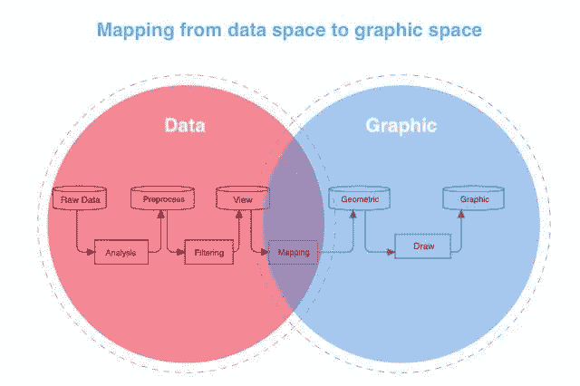

# 2021 年你不能错过的 9 个数据可视化工具

> 原文：<https://towardsdatascience.com/9-data-visualization-tools-that-you-cannot-miss-in-2019-3ff23222a927?source=collection_archive---------0----------------------->

在数据科学领域，数据可视化无疑是当今的热门词汇。无论你想分析什么数据，做数据可视化似乎都是必经的一步。但是很多人对数据可视化没有一个具体的概念，也不知道如何实现。因此，今天我将带您了解数据可视化的定义、概念、实施流程和工具。

# **1。** **什么是数据可视化？**

**科学可视化、信息可视化和可视化分析通常被视为可视化的三个主要分支。**由这三个分支结合而成的新学科“数据可视化”是可视化研究领域的新起点。

广义数据可视化涉及各种学科，如信息技术、自然科学、统计分析、图形、交互和地理信息。

## **1.1 科学可视化**

科学可视化是科学中一个跨学科的研究和应用领域，主要研究三维现象的可视化，如建筑、气象、医学或生物系统。它的目的是用图形说明科学数据，使科学家能够理解、解释和收集数据中的模式。

## **1.2 信息可视化**

信息可视化是对抽象数据的交互式视觉表示的研究，以增强人类的认知。抽象数据包括数字和非数字数据，如地理信息和文本。直方图、趋势图、流程图、树形图等图形都属于信息可视化，这些图形的设计将抽象的概念转化为可视化的信息。

## **1.3 视觉分析**

视觉分析是随着科学可视化和信息可视化的发展而发展起来的一个新领域，其重点是通过交互式视觉界面进行分析推理。

From [FineReport](http://www.finereport.com/en/?utm_source=medium&utm_medium=media&utm_campaign=blog&utm_term=9%20Data%20Visualization%20Tools%20That%20You%20Cannot%20Miss%20in%C2%A02019)

# **2。** **我们为什么需要数据可视化？**

人类通过视觉获得的信息量远远超过其他器官。数据可视化是利用人类的自然技能来提高数据处理和组织效率。

可视化可以帮助我们处理更复杂的信息，增强记忆力。

大多数人对统计数据了解不多，基本的统计方法(均值、中位数、极差等。)都不符合人类的认知本性。最著名的例子之一就是**安斯科姆的四重奏**。按照统计学方法很难看到规律，但是数据可视化的时候规律就很清晰了。

# **3。** **如何实现数据可视化？**

从技术上讲，对数据可视化最简单的理解就是从数据空间到图形空间的映射。

一个经典的可视化实现过程是处理和过滤数据，将其转换为可表达的可视化形式，然后将其呈现在用户可见的视图中。

## **可视化技术栈**

一般来说，专业的数据可视化工程师需要掌握以下技术栈:

**基础数学**:三角函数、线性代数、几何算法

**图形学** : Canvas，SVG，WebGL，计算图形学，图论

**工程算法**:基础算法、统计算法、常用布局算法

**数据分析**:数据清理、统计、数据建模

**设计美学**:设计原则、审美、色彩、交互、认知

**视觉基础**:视觉编码、视觉分析、图形交互

**可视化解决方案**:图表的正确使用，常见业务场景的可视化

# **4。** **常用数据可视化工具**

一般来说，学术界用的是 R 语言，ggplot2，Python。普通用户最熟悉的工具就是 Excel。商业产品有 Tableau、FineReport、Power BI 等。

## **1)**[**D3**](https://d3js.org/)

D3.js 是一个基于数据操作文档的 JavaScript 库。D3 结合了强大的可视化组件和数据驱动的 DOM 操作方法。

**评测** : D3 具有强大的 SVG 运算能力。它可以很容易地将数据映射到 SVG 属性，并且它集成了大量的数据处理、布局算法和计算图形的工具和方法。它有一个强大的社区和丰富的演示。但是，它的 API 太低级了。没有太多的可重用性，而学习和使用的成本很高。

## 2) [精细报告](http://www.finereport.com/en/?utm_source=medium&utm_medium=media&utm_campaign=blog&utm_term=9%20Data%20Visualization%20Tools%20That%20You%20Cannot%20Miss%20in%C2%A02019)

FineReport 是一个用纯 Java 编写的[企业级 web 报表工具](https://www.finereport.com/en/reporting-tools/best-reporting-tools-list.html)，结合了数据可视化和数据录入。它是基于“无代码开发”的概念设计的。通过 FineReport，用户可以制作复杂的报表和酷炫的仪表盘，并通过简单的拖放操作构建决策平台。

**评测** : FineReport 可以直接连接各类数据库，定制各种复杂报表，酷炫[仪表盘](/a-beginners-guide-to-business-dashboards-981a8192a967)，方便快捷。界面类似于 Excel 的界面。它提供了 19 个类别，超过 50 种风格的自研 HTML5 图表，具有酷炫的 3D 和动态效果。最重要的是它的个人版**完全免费**。

## **3)** [**高图表**](https://www.highcharts.com/)

HighCharts 是一个用纯 JavaScript 编写的图表库，让用户可以轻松方便地向 web 应用程序添加交互式图表。这是网络上使用最广泛的图表工具，商业使用需要购买商业许可证。

**评测**:使用门槛很低。HighCharts 具有良好的兼容性，并且已经成熟，应用广泛。但是样式陈旧，很难展开图表。商业使用需要购买版权。

## **4)**[**Echarts**](https://echarts.apache.org/en/index.html)

Echarts 是百度数据可视化团队推出的企业级图表工具。它是一个纯 Javascript 图表库，可以在 PC 和移动设备上流畅运行，并且兼容当前大多数浏览器。

**评测** : Echarts 拥有丰富的图表类型，涵盖了常规的统计图。但不如 Vega 等基于图形语法的图表库灵活，用户很难自定义一些复杂的关系图表。

## **5)** [**小叶**](https://leafletjs.com/)

传单是一个用于移动设备的交互式地图的 JavaScript 库。它拥有大多数开发者需要的所有映射特性。

**评测**:可以专门针对地图应用，与移动的兼容性好。API 支持插件机制，但功能相对简单。用户需要具备二次开发能力。

## **6)**[织女星 ](https://vega.github.io/vega/)

Vega 是一组交互式图形语法，它定义了从数据到图形的映射规则、公共交互语法和公共图形元素。用户可以自由组合 Vega 语法来构建各种图表。

**评测**:Vega 完全基于 JSON 语法，提供了从数据到图形的映射规则，支持通用交互语法。但是语法设计复杂，使用和学习成本高。

## **7)**[**deck . GL**](https://deck.gl/#/)

deck.gl 是基于 WebGL 的可视化类库，用于大数据分析。它是由优步的可视化团队开发的。

**评测** : deck.gl 侧重于 3D 地图可视化。内置地理信息可视化常见场景有很多。它支持大规模数据的可视化。但是用户需要有 WebGL 的知识，而且层扩展比较复杂。

## **8)** [**力量匕**](https://powerbi.microsoft.com/en-us/)

Power BI 是一套业务分析工具，可以提供组织内部的洞察力。它可以连接数百个数据源，简化数据准备并提供即时分析。组织可以在 web 和移动设备上查看 Power BI 生成的报告。

**评测** : Power BI 类似于 Excel 的桌面 BI 工具，而功能比 Excel 更强大。它支持多种数据源。价格不高。但它只能作为一个独立的 BI 工具，没有办法和现有系统集成。

## **9)** [**画面**](https://www.tableau.com/)

Tableau 是一个可视化分析数据的商业智能工具。用户可以创建和分发交互式和可共享的仪表板，以图形和图表的形式描绘数据的趋势、变化和密度。Tableau 可以连接文件、关系数据源和大数据源来获取和处理数据。

**评测** : Tableau 是桌面系统中最简单的商业智能工具。它不会强迫用户编写自定义代码。该软件允许数据混合和实时协作。但价格昂贵，在定制和售后服务方面表现不佳。

## **结论**

数据可视化是一个涉及许多学科的巨大领域。正是由于这种跨学科的性质，可视化领域充满了活力和机遇。

# 您可能也会对…感兴趣

[8 个最佳报告工具&改善您业务的软件](https://medium.com/p/bc06d11279ee?source=post_stats_page-------------------------------------)

[2021 年最受欢迎的 5 款商业智能工具](https://medium.com/p/4e060b98039a?source=post_stats_page-------------------------------------)

[4 个参数查询功能，让您的数据可视化互动](/4-parameter-query-functions-to-make-your-data-visualization-interactive-bbd84dd6bafb)

[制作销售仪表板的分步指南](/a-step-by-step-guide-to-making-sales-dashboards-34c999cfc28b)

[新手如何设计酷炫的数据可视化？](/how-can-beginners-design-cool-data-visualizations-d413ee288671)