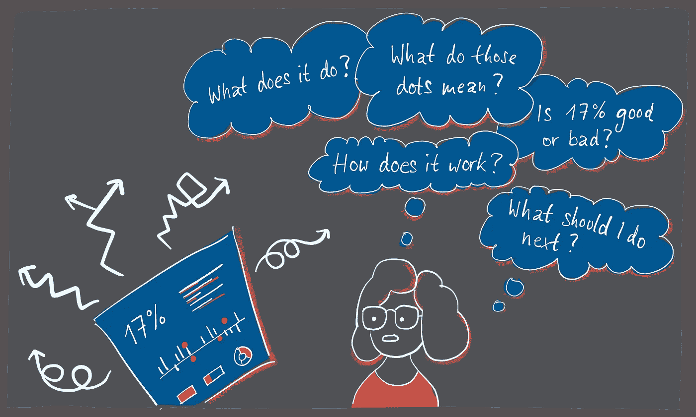
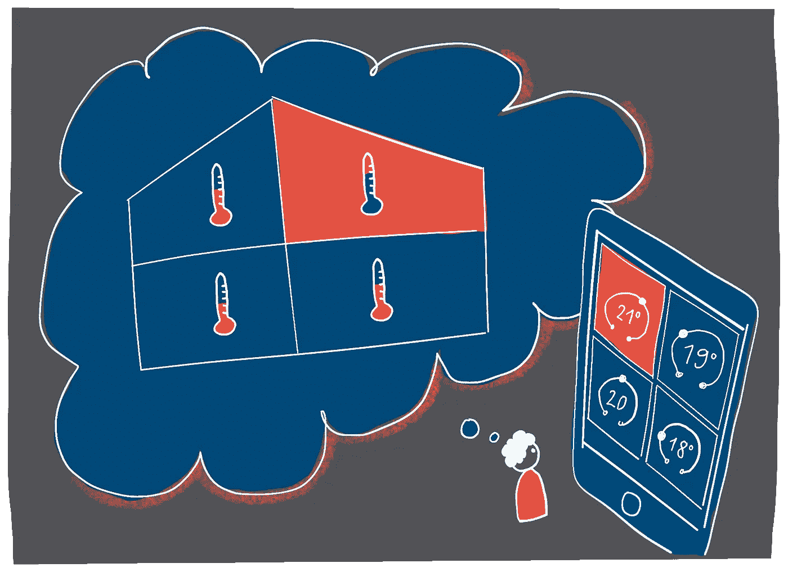

# 通往成功数据产品的 9 个设计陷阱

> 原文：<https://towardsdatascience.com/9-design-pitfalls-on-the-way-to-a-successful-data-product-6ea5a3e6842?source=collection_archive---------27----------------------->

The user has to do a lot of mental work in order to decode your data product. (Image credit: Evelyn Münster)

# 数据可视化产品是一个全新的领域，需要扩展的设计策略。

数据产品的用户界面的任务是使用户能够理解复杂性。任何想要构建需要与用户交流数据和复杂模型的数据产品的人都面临着一个特殊的挑战，这个挑战的难度出乎意料地高。

毕竟，数据产品不仅仅是另一种软件产品。85%的大数据和人工智能项目都失败了。原因？以我的经验，他们不是在技术上，而是在设计上。

我在 2010 年的第一个数据产品是一种在线营销的场景。它无情地失败了。从技术上来说，效果非常好。您可以连接任何数据源并配置自己的仪表板。从视觉上看，它看起来也很不错。但是几乎没有人想用它。

那确实使我沮丧。我想找出原因以及如何做得更好。我从事数据产品设计多年后的个人体会:成功的数据产品是可行的，如果你记住几件事。

那么，如何才能将成功的数据产品推向市场呢？答案与一种新的 UX 设计有很大关系。作为 UX 的设计师，我们正在处理几个传统软件产品通常没有的附加层:一个用户可能甚至不理解的非常复杂的系统，数据和数据可视化，可能是人工智能，最后但同样重要的是，一个完全不同类型的用户问题或要做的工作。

在开始设计数据 UX 之前，您应该问自己和您的团队以下 9 个问题。

# 1.你的产品到底解决了哪个用户问题？

指定类型根据用户需求或业务任务对数据产品进行分类:可操作的见解、绩效反馈循环、根本原因分析、知识创造和信任建立。这种情况下的本地化是有帮助的。上面的一些任务有[非线性用户旅程](https://medium.com/nightingale/what-video-games-have-to-teach-us-about-data-visualization-87c25ff7c62f)，这需要新的 UX 方法。

您的数据产品的具体任务必须在一会儿就能让用户清楚地看到。

# 2.这个系统到底是什么样子的？

Don’t rely on the assumption that users already know everything to interpret the data correctly. (Image credit: Evelyn Münster)

好吧，数据背后的系统可能非常复杂。无论是化工厂的优化，手术室的程序标准化，还是一个家庭中异构设备的无缝交互:不仅整个项目团队必须有一个共同的理解，而且你的用户也需要一个足够准确和正确的心智模型。

不要依赖用户已经知道一切的假设来正确解释数据。心智模型的测试和训练是必不可少的。

# 3.数据质量有多好？

可悲但真实的是:数据不是事实。甚至衡量什么或收集什么数据的决定本身也是人的决定。通常，这仅仅取决于技术或法律上的可行性。通常只使用那些已经存在的数据。有时会有测量误差和失败。有时，统计转换和汇总是错误的、误导的或矛盾的。

另一个方面:在最罕见的情况下，真正需要的信息实际上是经过测量的。

假设你想衡量一所大学的教育质量。遗憾的是，这不可能直接实现。相反，你只能间接测量:最终成绩，或不及格率。然而，这些仅仅是可能表明学习质量的代表，但也可能是误导性的。数据相当模糊！

因此，数据质量必须反映在用户界面上。我们不希望用户盲目信任我们的应用程序，也不希望用户从根本上怀疑所有数据。一个好的数据用户界面会让用户产生一种知情的、至关重要的信任。

# 4.你的用户的图形能力和计算能力有多高？

数据可视化最终是在图形中编码的数据。读者必须首先对图表进行解码才能访问数据。这就是所谓的图形化。点、线、颜色、位置或长度是什么意思？读者是否理解不太熟悉的图表类型，如直方图或散点图？

一旦数据被解密，它必须被解释。有数字的用户有多好？对于这种数据产品，他们需要克服哪些统计挑战？

通过用户测试，确保您的目标群体能够解码并正确解释数据和可视化。

# 5.我需要什么样的详细程度？

用户需要知道多少细节才能了解情况，从噪音中检测出信号？平均值和总和足够了吗，分布会更好吗？哪些时间间隔适合做时间线？

你还应该记住[汇总的数据通常过于抽象，无法与你自己的心智模型](https://www.designation.eu/figurative-prozessvisualisierung/)联系起来。不幸的是，“尽可能简单”太简单了。这是因为细节能够解释抽象的数据，而[能够建立信任](https://medium.com/sap-design/ux-for-ai-trust-as-a-design-challenge-62044e22c4ec)。另一方面，太多的细节会很快让人不知所措。

# 6.你在处理概率吗？

如果您想要交流的数据是基于预测、分类或样本，您应该警惕。询问数据科学家关于置信区间的问题，给她留下深刻印象。

天气应用的开发者似乎认为每个人都知道“60%的降雨概率”是什么意思。不幸的是，事实并非如此，因为概率很微妙，需要解释。

忽略所有不确定性的常见做法使得用户界面看似简单，但却很危险。这已经导致了许多误解和错误的决定。

# 7.设计团队里有数据可视化专家吗？

数据可视化的 UX 设计需要一套特殊的技能:数据 UX 设计人员的技能。从数据分析、数据设计工作流程、可视化工具和库到图表类型、调色板和数据故事——不一定是你作为 UX 设计师学到的东西。团队中有一个专家或者至少是一个触手可及的导师是件好事。

# 8.如何获得用户反馈？

一旦有了第一个原型，就应该通过用户测试来收集有价值的反馈。为此需要一个虚拟点击。但是，lorem ipsum 文本和虚拟数据并不特别适合数据产品。这是因为数据产品在功能和解决用户问题的方式方面通常是未知领域，即使对用户来说也是如此。

用户必须能够想象完成的应用程序将如何解决她的个人问题。只有这样，她才能评估价值主张并给出有用的反馈。

不连贯的随机数对于这个来说太抽象了。因此，所有的内容，尤其是数字和数据，都应该尽可能的真实和连贯。此外，通过点击虚拟物的交互路径应该讲述一个故事，例如一个问题是如何变得可见然后被解决的。因此，用户界面的许多元素将以优雅的方式不言自明。

# 9.用户界面能促进营销和销售吗？

如果用户界面清楚地传达了它是做什么的，过程是什么样的，它就有资格成为一份利润丰厚的兼职工作:它可以销售产品。有时候几乎无法用几句话来表达产品能做什么。尤其是如果还没有类似的已知产品。如果你是卖鞋的，在店门口放个牌子写着“鞋”就够了。大家都知道鞋子是什么，是做什么用的，怎么用。(这种情况下的重点是在竞争中脱颖而出。)

但是如果你想销售一个化工厂的预测维护系统，甚至客户的专家也不知道你的系统能做什么以及如何使用。但这正是一个做得好的用户界面能在一会儿时间内解释的。

# 我个人的结论

我们必须承认，数据产品是一个全新的领域。它们不仅仅是另一个软件产品，或者另一个商业智能仪表板。它也不仅仅是关于数据可视化。为了构建一个成功的数据产品，我们需要一个特殊的策略，一个先进的 UX 方法:数据 UX 设计。

想得到更多这样的数据设计内容？看看我的[图表博士数据设计学院](https://www.chartdoktor.com/?utm_source=medium-pitfalls&utm_medium=link&utm_campaign=permanent)或者关注我的 [LinkedIN](https://www.linkedin.com/in/evelynmuenster/) 。