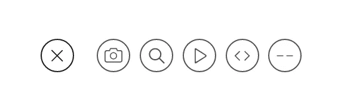
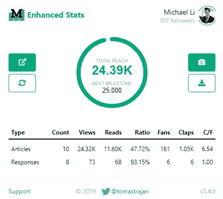
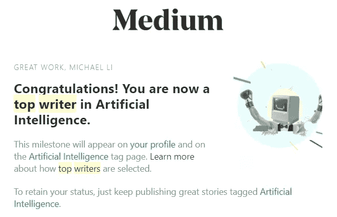

# 短短一个月，我从 Medium 博客中学到的 9 件事

> 原文：<https://towardsdatascience.com/9-things-i-learned-from-blogging-on-medium-for-the-first-month-2bace214b814?source=collection_archive---------8----------------------->

## 为什么媒体是交流思想的好平台

Photo by [Glenn Carstens-Peters](https://unsplash.com/@glenncarstenspeters?utm_source=medium&utm_medium=referral) on [Unsplash](https://unsplash.com?utm_source=medium&utm_medium=referral)

2019 年 9 月 5 日，我正式在 Medium 上写了我的第一个故事，今天差不多是我在 Medium 上的第一个月的尾声。在这一个月里，我发表了 **10 个**故事，获得了 **24K** 的浏览量，我的文章被阅读 **11K** 次，获得了 **167** 粉丝， **100** 关注者。因为我把我所有的故事都放到了[媒体合作伙伴计划](https://medium.com/creators)中，我的故事的会员合约给了我**134**美元的报酬。我也成为了[人工智能](https://medium.com/tag/artificial-intelligence/top-writers)和[教育](https://medium.com/tag/education?source=email-72c98619a048-1569804879522-top_writer)的**顶级编剧**。这不多，但对我来说，这是非常令人鼓舞的。

It ain’t much …

现在数据已经出来了，我想说总体来说我第一个月感觉很积极。当然，这不是我第一次写博客，但这是我的故事第一次有如此大的影响力，为此，我感谢 Medium 和它的团队给我这个机会。我想和你们分享我一路走来学到的一些东西。我希望这能帮助那些也想开始在媒体上写作的人更快更顺利地开始。

# 质量！质量！质量！

在我开始在 Medium 上写作之前，我已经阅读 Medium 有一段时间了。我一直很欣赏它提供的高质量内容。内容相关性、组织、布局、编辑标准、漂亮的图像和应用程序用户界面，所有这些都意味着质量**和**，让在媒体上消费内容成为一种享受。现在，我在内容创作方面，这里的高标准也鼓励我尽可能地保持好的质量给我的读者。这包括但不限于:

> 校对我的文章(我使用语法和人工校对)
> 
> 仔细挑选那些漂亮的、相关的、没有许可证的照片(不透明的图片是一个很好的来源，内置在 Medium 的编辑界面中)
> 
> 考虑一个好的标题/副标题，既吸引人又不俗套
> 
> 尽我所能创建我自己的 GIF 动画，为我的页面注入更多的“能量”。
> 
> 交叉引用资源并在相关的地方嵌入视频，以提供更丰富的背景知识。(当然也包括我自己的文章😉)
> 
> 充分利用 Medium 丰富的编辑和布局工具，像 emoji、' @ '、blockquote 等。让故事看起来不那么无聊，更有活力。
> 
> 思考好的标签是多样化的，也是与增加接触相关的。

这个列表还可以更长，没有一个故事可以涵盖其中的每一项，但是在写作的时候记住这一点是非常有益的。我觉得这和我记下的课文一样重要。我总是努力让故事的质量尽我所能。这最终是尊重我自己的时间和我的读者的时间，我相信这就是媒体作为一个独特的媒体所促进和奖励的。

还有一点要注意的是，不要做得太过。经过一些润色之后，有时你永远不会觉得你的文章可以发表了。不要被分析麻痹了，点击发布按钮，把你的内容推给你的读者。你总是可以在以后改进它们。写作是一个旅程，而不是目的地。

# 善用媒体编辑

我猜你总是可以用你最喜欢的软件/应用程序来写，然后把它们导入到 Medium 中，但是我发现只在 Medium 的网站编辑器 UI 上写就足够令人愉快和高效了。有了几年的 UI/UX 经验，我可以说媒体编辑器设计得很好，因为它不碍事。这就是我们所说的'[隐形设计](https://designmodo.com/invisible-design/)。它只在你需要帮助的时候出现，当你专注于手头的任务时，它就会消失在背景中。该界面被设计为整洁，但在需要时功能强大。我发现熟悉编辑器所提供的东西真的让我的写作经历变得流畅和愉快。花些时间通读媒体的[指南](https://help.medium.com/hc/en-us/articles/225168768-Write-post)大有帮助。

# 数字不会说谎

作为一个和数字打交道多年的人，统计总是我最感兴趣的。我自己做了大量的数据可视化和仪表板设计工作，我发现 Medium 的统计页面非常干净，易于阅读。布局设计很漂亮，层次分明，最重要的数字在前面和中间，其他的都在背景中。唯一的抱怨就是在背景中隐藏更多的细节。这样，更懂数据的人可以挖掘得更深，普通的作者可以享受极简主义。也许那是另一个时代的另一篇文章。

我发现自己访问统计页面有点太多了，喜欢看数字一点点上升(请不要评判我)。你不必做同样的事情，但我鼓励你不时地访问统计页面，它让你知道每篇文章做得有多好，当你尝试不同的写作风格、新主题或社交媒体策略时，它提供了一个坚实的基准，所以你可以相应地调整。例如，当我试图大力推广我在脸书的文章时，我确实发现我从脸书来的访问量增加了很多，但仍然没有媒体策划的多。很有见地！这种对什么可行什么不可行的洞察显然是非常有价值的。

此外，对于 Chrome 用户，我建议安装一个名为“ [Medium Enhanced Stats](https://chrome.google.com/webstore/detail/medium-enhanced-stats/jnomnfoenpdinfkpaaigokicgcfkomjo?hl=en) 的扩展，在统计页面上提供更好的 UI 和更多信息。

# 付费墙，还是不付费墙，这是个问题

这个争议比较大。很多人不喜欢付费墙。只要是付费墙，它就是坏的。不过，我对付费墙没什么感觉。只要你提供有价值的内容，作为一名作家获得报酬是非常合理的。这不亚于或更体面的任何其他业务。付费墙可能会降低你的影响力，但也会让你更加关注那些真正重视质量的人。至于 reach，我做了一些实验，发现 Medium 的 3 个免费付费故事实际上在大多数时候已经足够了。我在 Medium 上放了一篇免费文章和一篇付费文章，并在脸书推广。我看不出脸书的观点比两者有多大的不同。此外，Medium only 只负责策划付费墙后面的故事，而策划对扩大你的影响是巨大的。所以我最后把我所有的故事都放在付费墙后面，结果一点也不差。从我的文章中得到的报酬似乎不多，但它至少支付了我的媒体会员资格，这样我就可以自由地阅读所有伟大的内容。

你可以自己测试一下，如果你喜欢你的内容达到最大范围，那就尽一切办法把它设为免费内容。

# 顶级作家？顶级作家！

在我写了三四篇文章之后，[其中的一篇](https://medium.com/datadriveninvestor/thoughts-on-andrew-ngs-machine-learning-course-7724df76320f)得到了一些关注。当然不是病毒式的，但我的观点开始快速增长。它在一天内达到 2k，两天后，我收到一封来自 Medium 的电子邮件，说我现在是“人工智能”主题的顶级作家之一。我是多么的荣幸和卑微！我刚开始在媒体上写文章一个多星期，不到五篇文章，我已经成为我最关心的主题的顶级作家了！

一旦我从兴奋中稍微平静下来，我开始思考发生了什么以及为什么。当然，这是相当幸运的，我的一个故事得到了一些关注，或者被一些社交媒体推广。但这也表明了 Medium 独特的系统重视高质量、好内容，而不是你的业绩记录或品牌名称。因此，对于我和其他像我一样环保的人来说，流汗创作出伟大的内容实际上是一种优势:**你将因为你的高质量工作而得到认可和奖励。虽然这个头衔不是永久的，但我认为如果我停止制作热门内容，它就会消失，但这很好。这是一种很好的压力，促使我写出更好的故事。**

# 出版物事项

嗯，这是我第一次和出版物打交道。在我的第一个高质量的故事之后，数据科学的一个出版物找到我，问我是否想通过他们发表。在网上做了一些研究后，我发现出版对像我这样的新作家来说是有好处的，它可以增加我的影响力，还可以为我的写作提供一些建议等等。所以我欣然同意和他们一起发表我的一些故事。写了一些故事后，我觉得这本书确实帮助我引起了注意。我对其他更大的数据科学出版商做了一些研究，并开始向他们提交我的作品。

与不同的出版商出版实际上是可以的，我所做的是为了更严肃和重量级的文章，我会选择大出版商。对于更有趣和轻松的作品，我会提交给其他出版商，看看他们的反应如何。我仍处于“试错”过程中。我仍在探索与不同出版商的合作，一旦深入，我会分享更多的经验。

# 回应，而不是评论

我发现 Medium 的一个独特之处是响应系统。在 Medium 中，回复被视为**‘第一世界公民’**，这意味着它被视为一个故事。它将有自己的统计数据，人们可以在上面拍手，等等。正因为如此，我注意到人们真的在他们留下的回复上投入了更多的努力，导致了非常高质量的回复，这些回复经常启发我，或者指出我错过或错误的事情。我就是喜欢这个响应系统。它真的促进了高质量的交流和思想与观点的碰撞！

# 会员？算我一个！

媒体的会员费是固定的 **$5** 。它向你开放了整个媒体的内容，你可以自由地阅读它所提供的任何东西。对我来说，这完全值得。它不仅提高了我在写下我文章的第一个词之前做研究的能力(我说过 Medium 有高质量和相关内容吗？)，这也使我能够与其他成员互动，并更深入地融入社区。

# 如何在媒介上赚钱

嗯，我可能没有资格谈论这个，毕竟我一个月前才加入 Medium。然而，我仍然想分享我对此的一些想法。因为你已经喜欢做的事情而得到回报的感觉真的很棒。我认为，支付系统是建立在“会员参与”的基础上的。越多的会员参与到你的内容中，他们的月会员费就越多。我认为这很公平，对吗？所以这意味着你会因为你**感动**人的深度和广度而得到回报。否则，人们不会与你接触，他们不会费心鼓掌、回应、强调等。这进一步鼓励作者写出真实的内容，只有当你真正表达你所写的内容时，人们才能感受到你。

# 结论

总的来说，我认为 Medium 以会员为基础、以质量为中心的在线出版模式确实发挥了一些作用。它充满了聪明勤奋的作者和好奇认真的读者。

> 它是一种**媒介**，通过高质量的内容、漂亮的界面和精心设计的系统将我们联系在一起。

欢迎任何反馈或建设性的批评。你可以在推特 [@lymenlee](https://twitter.com/lymenlee) 或者我的博客网站【wayofnumbers.com[上找到我。](https://wayofnumbers.com/)