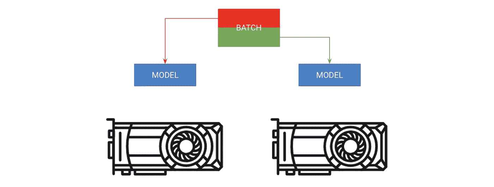

# 在 Pytorch 中训练快如闪电的神经网络的 9 个技巧

> 原文：<https://towardsdatascience.com/9-tips-for-training-lightning-fast-neural-networks-in-pytorch-8e63a502f565?source=collection_archive---------4----------------------->


Don’t let this be your Neural Network (Image credit: Monsters U)

面对现实吧，你的模型很可能还停留在石器时代。我敢打赌，你仍然在使用 32 位精度或* *GASP** 甚至可能只在单个 GPU 上训练**。**

**😱.**

**我明白了，虽然有 99 个加速指南，但清单不是 1？(是的，那刚刚发生了)。好吧，把这看作是**终极**，一步一步的指导，确保你挤压所有的(GP-Use)😂你的模型之外。**

**这份指南从最简单到最大的 PITA 修改，你可以做出最大限度地利用你的网络。我将展示 Pytorch 代码的例子和相关的标志，你可以在 [Pytorch-Lightning Trainer](https://williamfalcon.github.io/pytorch-lightning/Trainer/) 中使用，以防你不想自己编写这些代码！**

**这本指南是给谁的？任何在 Pytorch 中从事非平凡深度学习模型工作的人，如工业研究人员、博士生、学者等。我们在这里讨论的模型可能需要你花多天时间来训练，甚至几周或几个月。**

**我们将涵盖(从最简单到最皮塔饼)**

1.  **使用数据加载器。**
2.  **数据加载器中的工作线程数。**
3.  **批量大小。**
4.  **累积的梯度。**
5.  **保留图形。**
6.  **转移到单个 GPU。**
7.  **16 位混合精度训练。**
8.  **移动到多个 GPU(模型复制)。**
9.  **移动到多个 GPU 节点(8 个以上的 GPU)。**
10.  **我的思考模型加速的技巧**

# **py torch-闪电**

****

**你可以在 Pytorch 库 [Pytorch-Lightning](https://github.com/williamFalcon/pytorch-lightning) 中找到我在这里讨论的所有优化。Lightning 是 Pytorch 上的一个轻型包装器，它可以自动对研究人员进行培训，同时让他们完全控制关键的模型部件。查看[本教程，获取更强大的示例](https://github.com/williamFalcon/pytorch-lightning/blob/master/pytorch_lightning/examples/new_project_templates/single_gpu_node_template.py)。**

**Lightning 采用了最新的最佳实践，最大限度地减少了可能出错的地方。**

**我们将在这里为 MNIST [定义我们的照明模型，并使用训练器进行拟合。](https://pytorch-lightning.readthedocs.io/en/latest/lightning-module.html#module-pytorch_lightning.core)**

# **1.数据加载器**

****

**这可能是最容易获得一些速度增益的地方。保存 h5py 或 numpy 文件来加速数据加载的日子已经一去不复返了(等等…你们不会这么做吧？？).使用 [Pytorch dataloader](https://pytorch.org/tutorials/beginner/data_loading_tutorial.html) 加载图像数据很简单(对于 NLP 数据，查看 [TorchText](https://torchtext.readthedocs.io/en/latest/datasets.html)**

**在 lightning 中，你不需要指定训练循环，只需要定义数据加载器，训练器会在需要的时候[调用它们](https://williamfalcon.github.io/pytorch-lightning/LightningModule/RequiredTrainerInterface/#tng_dataloader)。**

# **2.数据加载器中的工作人员数量**

****

**加速的另一个神奇之处来自于允许批量并行加载。因此，您可以一次加载 nb_workers 批处理，而不是一次加载一个批处理。**

# **3.批量**

****

**在开始下一个优化步骤之前，将批处理大小提高到 CPU-RAM 或 GPU-RAM 允许的最大值。**

**下一节将重点关注如何帮助减少内存占用，以便您可以继续增加批处理大小。**

**记住，你可能需要再次更新你的学习率。一个很好的经验法则是，如果你的批量加倍，学习速度也会加倍。**

# **4.累积梯度**

****

**如果您的计算资源已经达到极限，并且您的批处理大小仍然太低(比如说 8)，那么我们需要模拟一个更大的批处理大小用于梯度下降，以提供一个好的估计。**

**假设我们想要达到 128 的批量。然后，在执行单个优化器步骤之前，我们将执行 16 次向前和向后传递，批处理大小为 8。**

**在 lightning 中，这一切都是为你而做的。只需设置[accumulate _ grad _ batches = 1](https://pytorch-lightning.readthedocs.io/en/latest/trainer.html#pytorch_lightning.trainer.Trainer)。**

# **5.保留图形**

****

**炸毁 RAM 的一个简单方法是不要释放指向计算图的指针，比如说……为了日志记录的目的存储您的损失**

```
losses = []...
losses.append(loss)print(f'current loss: {torch.mean(losses)'})
```

**上面的问题是**损失**还有图的副本。在这种情况下，调用。项()来释放它。**

```
# bad
losses.append(loss)# good
losses.append(loss.item())
```

**Lightning 特别注意确保它永远不会保留图形的副本。**

# **6.单 GPU 训练**

****

**一旦你完成了前面的步骤，就该进入 GPU 培训了。GPU 上的培训将在许多 GPU 核心上并行化数学计算。您获得的加速取决于您使用的 GPU 类型。我推荐个人用的 2080Ti 和公司用的 V100。**

**乍一看，这似乎令人不知所措，但你真的只需要做两件事:1)将你的模型移动到 GPU，2)每当你通过它运行数据时，将数据放在 GPU 上。**

**如果你使用 Lightning，你不需要对你的代码做任何事情。只需设置[训练器(GPU = 1)](https://pytorch-lightning.readthedocs.io/en/latest/trainer.html#pytorch_lightning.trainer.Trainer)。**

**在 GPU 上进行训练时，需要注意的主要问题是限制 CPU 和 GPU 之间的传输次数。**

```
# **expensive**
x = x.cuda(0)# **very** expensive
x = x.cpu()
x = x.cuda(0)
```

**例如，如果内存不足，不要将数据移回 CPU 以节省内存。在采取这种方法之前，尝试用其他方法优化您的代码，或者在 GPU 之间进行分配。**

**另一件要注意的事情是调用强制 GPU 同步的操作。一个例子就是清除内存缓存。**

```
# really bad idea. Stops all the GPUs until they all catch up
torch.cuda.empty_cache()
```

**但是，如果您使用 Lightning，唯一可能出现问题的地方是当您定义 Lightning 模块时。闪电特别注意不要犯这种错误。**

# **7.16 位精度**

**16 位精度是一个惊人的技巧，可以将内存占用减半。大多数模型都是使用 32 位精度数字进行训练的。然而，最近的研究发现，16 位的模型也能很好地工作。混合精度意味着对某些事情使用 16 位，但对权重等事情保持 32 位。**

**要在 Pytorch 中使用 16 位精度，请安装英伟达的 [apex 库](https://github.com/NVIDIA/apex)，并对您的模型进行这些更改。**

***amp* 套餐会帮你搞定大部分事情。如果梯度爆炸或变为零，它甚至会缩放损失。**

**在 lightning 中，启用 16 位很简单，不需要修改模型中的任何内容，也不需要做我上面写的事情。设置[训练器(精度=16)](https://pytorch-lightning.readthedocs.io/en/latest/trainer.html#pytorch_lightning.trainer.Trainer) 。**

# **8.移动到多个 GPU**

**现在，事情变得非常有趣了。有 3 个(可能更多？)多 GPU 训练的方法。**

****分批训练****

****

**A) Copy model on each GPU. B) Give each GPU a portion of the batch.**

**第一种方式应该叫做*分批*培训。这种策略将模型复制到每个 GPU 上，每个 GPU 获得一部分批次。**

**在 lightning 中，你可以增加你告诉教练的 GPU 数量，而不必做上述任何事情。**

****分割模型训练****

****

**Put different parts of the model on different GPUs. Batch moves sequentially**

**有时你的模型可能太大而不适合内存。例如，带有编码器和解码器的序列到序列模型在生成输出时可能会占用 20 GB 的 RAM。在这种情况下，我们希望将编码器和解码器放在不同的 GPU 上。**

**对于这种类型的训练，不要给闪电训练师任何 GPU。相反，把你自己的模块放到正确的 GPU 上的 LightningModule 中**

****混合两者****

**在上述情况下，编码器和解码器仍然可以从并行化每个 操作 ***中受益。我们现在可以变得更有创造力。*****

**使用多个 GPU 时需要考虑的注意事项**

*   **model.cuda()不会做任何事情，如果它已经在那个设备上的话。**
*   **始终将输入放在设备列表中的第一个设备上。**
*   **跨设备传输数据非常昂贵，请将此作为最后手段。**
*   **优化器和渐变将存储在 GPU 0 上。因此，GPU 0 上使用的内存可能会比其他内存大得多。**

# **9.多节点 GPU 培训**

****

**Every GPU on every machine gets a copy of the model. Each machine gets a portion of the data and trains only on that portion. Each machine syncs gradients with the other.**

**如果你已经做到了这一步，你现在已经进入了训练 Imagenet 的领域！这没有您想象的那么难，但是可能需要更多关于您的计算集群的知识。这些说明假设您正在集群上使用 SLURM。**

**Pytorch 通过跨每个节点复制每个 GPU 上的模型并同步梯度，允许多节点训练。因此，每个模型在每个 GPU 上独立初始化，本质上在数据分区上独立训练，只是它们都从所有模型接收梯度更新。**

**在高层次上:**

1.  **在每个 GPU 上初始化一个模型的副本(确保设置种子，使每个模型初始化为相同的**权重，否则会失败)。****
2.  **将数据集切割成子集(使用分布式采样器)。每个 GPU 只在自己的小子集上训练**。****
3.  **开着。backward()所有副本接收**所有**模型的渐变副本。这是模型之间唯一的一次交流。**

**Pytorch 有一个很好的抽象，叫做 DistributedDataParallel，可以帮你做到这一点。要使用 DDP，您需要做以下事情:**

**Pytorch 团队有一个[不错的教程](https://github.com/pytorch/examples/blob/master/imagenet/main.py)来看这个的全部细节。**

**然而，在 Lightning 中，这是为您提供的。只需设置节点数标志，剩下的事情就交给你了。**

**Lightning 还附带了一个 SlurmCluster 管理器，可以轻松地帮助您提交 SLURM 作业的正确细节([示例](https://github.com/williamFalcon/pytorch-lightning/blob/master/examples/new_project_templates/multi_node_cluster_template.py#L103-L134))。**

# **10.奖金！在单个节点上进行更快的多 GPU 训练**

**事实证明，分布式数据并行比数据并行快得多，因为它执行的唯一通信是梯度同步。因此，一个好的方法是用它代替 DataParallel，即使是在单台机器上训练时**

**在 Lightning 中，这很容易通过将 distributed_backend 设置为 **ddp** 并设置 GPU 的数量来实现。**

# **通过模型加速进行思考**

**虽然这个指南会给你一个提高网络速度的技巧列表，但是我会解释我是如何通过寻找瓶颈来思考的。**

**我将模型分成几个部分:**

**首先，我确保我的数据加载没有瓶颈。为此，我使用我描述的现有数据加载解决方案，但是如果没有一个适合您的需要，那么考虑离线处理并缓存到高性能数据存储中，比如 h5py。**

**接下来看看你在训练步骤中做了什么。确保你的向前传递是快速的，避免过多的计算，并尽量减少 CPU 和 GPU 之间的数据传输。最后，避免做降低 GPU 速度的事情(在本指南中讨论)**

**接下来，我尝试最大化我的批处理大小，这通常会受到 GPU 内存量的限制。这是一个关于跨 GPU 分布的游戏，同时最大限度地减少延迟，以有效地使用大批量(例如，在 Imagenet 上，我可能会尝试跨许多 GPU 获得 8，000+的有效批量。)**

**但是，您需要小心大批量。针对您的具体问题查阅文献，看看人们是如何解决的！**

****致谢****

**感谢 [Jeff Johnson](https://research.fb.com/people/johnson-jeff/) 带来的令人惊叹的 CUDA 洞察，感谢 Pytorch 团队帮助 DDP 工作(更不用说他们令人惊叹的框架和文档)。感谢我实验室成员的测试帮助(特别是[辛乔恩·雷斯尼克](https://deepai.org/machine-learning/researcher/cinjon-resnick))。**