# 反向传播的 10 行证明

> 原文：<https://towardsdatascience.com/a-10-line-proof-of-back-propagation-5a2cad1032c4?source=collection_archive---------18----------------------->

## 没有求和也没有索引的矢量证明。

Photo by [Tim Marshall](https://unsplash.com/@timmarshall?utm_source=medium&utm_medium=referral) on [Unsplash](https://unsplash.com?utm_source=medium&utm_medium=referral)

# TLDR

反向传播是深度学习的脊梁。虽然有大量关于这一主题的文献，但很少有人彻底解释反向传播所需的梯度公式(∂ *损耗* / ∂ **W** )从何而来。即使他们解释了，数学往往会变得很长，到处都是指数，因为问题的维度很高:你有一个样本数量的指数，一个层数的指数和一个每层神经元数量的指数。

所以每次我想更新我过去学到的机器学习概念时，我总是很难在不看教科书的情况下写出反向传播背后的数学。虽然我明白它是如何工作的，但我发现这些公式非常不直观，有时甚至令人困惑…

所以这篇文章的想法是用一种优雅的方式演示反向传播公式，只使用**的矢量化演算:所以没有索引 *i，j，k，…* 并且根本没有求和∑！** *(我们将使用的唯一索引是表示层。)*

# 介绍

假设我们有以下神经网络(NN)架构

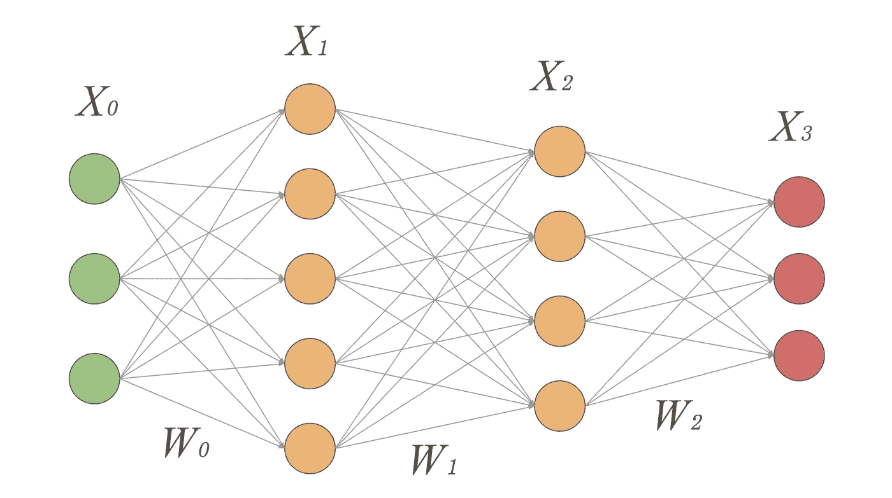

NN with 2 hidden layers and an output of 3 classes

我们的神经网络有两个隐藏层和一个三类输出层。我们将对所有层使用 [softmax 激活](https://en.wikipedia.org/wiki/Softmax_function)。

训练这个模型意味着最小化我们的损失函数，即交叉熵(对数损失)。由于我们有 3 个班，所以日志损失为:𝜉( **Y** 、 **X** 、 **W₁** 、 **W₂** 、 **W₃** ) = *总和* [ **Y** ○ *日志*(**x₃**)】
，其中:*总和*为所有"○"也被称为[哈达玛产品](https://en.wikipedia.org/wiki/Hadamard_product_(matrices))。

**X₀** 是一个 n×3 矩阵，n 是最小批量的大小。
w₀是一个 3×5 的矩阵。它具有从层 0 到层 1 的过渡的权重。 **X₁** 是一个 n×5 矩阵。它表示第一层的数据转换。 **W₁** 是一个 5×4 矩阵。它具有从第 1 层到第 2 层的过渡的权重。 **X₂** 是一个 n×4 矩阵。它表示第二层的数据转换。 **W₂** 是一个 4×3 矩阵。它具有从第 2 层到第 3 层过渡的权重。 **X₃** 是一个 n×3 矩阵。它表示第三层的数据转换。 **Y** 是一个 n×3 矩阵，3 是类的个数。

基本上，本文的目标是演示下面的差分表达式:(★)

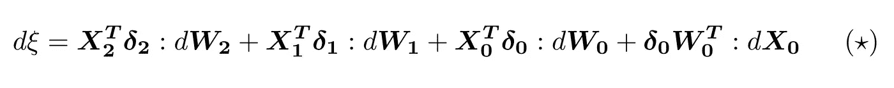

带着**𝜹₂**=**y**-**x₃** 和 **𝜹₁** = ( **𝜹₂。w₂**ᐪ**)**○**x₂**○(**1-x₂**)
和 **𝜹₀** = ( **𝜹₁。w₁**ᐪ**)**○**x₁**○(**1-x₁**)。
和○为[哈达玛产品](https://en.wikipedia.org/wiki/Hadamard_product_(matrices))。
和 **:** 为 [Frobenius 产品](https://en.wikipedia.org/wiki/Frobenius_inner_product)********

****这种差异特别有趣，因为它揭示了反向传播期间权重更新所需的所有梯度****

********

****因此，在每一步**中，Wᵢ** 更新如下:【**wᵢ**=**wᵢ**+𝛼***xᵢ**ᐪ**𝜹ᵢ****𝛼为学习率。******

******如果你对如何找到(★)感兴趣，那么这篇文章就是为你准备的！******

# ******关键结果需要证明******

## ******1.与多项式回归的联系******

******实际上，如果你取我们网络的最后两层，它基本上是一个多项逻辑回归，X₂作为输入数据，X₃作为输出预测。******

******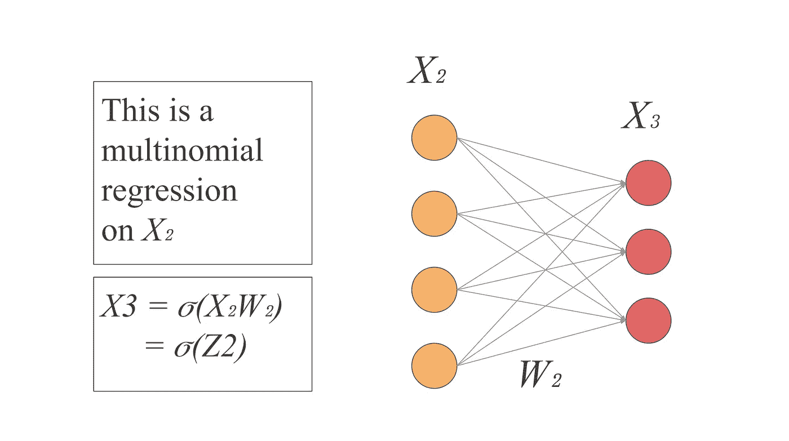******

******以 [𝜎为 softmax 函数](https://en.wikipedia.org/wiki/Softmax_function)，我们可以写出 **X₃** =𝜎( **X₂W₂** 。
用 **Z₂=X₂W₂，**我们可以写成 **X₃** =𝜎( **Z₂** 。******

****这样损失可以写成: **𝜉** = *总和* [ **Y** ○ *日志*(𝜎(**z₂**)]****

****所以如果我们同意这确实是一个[多项逻辑回归](https://en.wikipedia.org/wiki/Multinomial_logistic_regression)问题，那么我们就有以下结果:****

********

****为了使这篇文章简短，我们不会深入研究如何计算这些梯度的细节。但是如果你对这个证明感兴趣，那么让我知道，我会试着写一篇关于它的文章。****

****另一个要注意的有趣的事情是，由于我们对所有层使用 softmax 激活，那么我们可以推断:****

****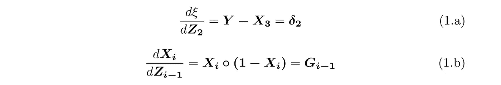****

****for i in 1,2,3****

## ****2.矩阵的微分函数****

****这一部分相当重要，因为它将为我们提供一种优雅的方式来揭示最终的表达(★)。****

******f:矩阵- >标量******

****我们假设 f 是一个函数，它取一个矩阵，输出一个标量。如果 f 是可微的，那么:****

********

****with X and D having the same shape****

****因此，f 的微分写为:****

****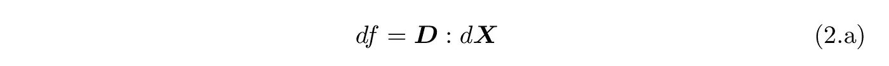****

****以“:”为 [Frobenius 产品](https://en.wikipedia.org/wiki/Frobenius_inner_product)[**a:b**=*trace*(**a**ᐪ**b**)]。****

******f:标量- >标量，按元素应用于矩阵******

****让我们假设 f 是一个简单的函数，它接受一个标量并输出一个标量。现在让我们用 F 来表示这个函数，它将 F 独立地应用于矩阵中的每个元素。如果 f 是可微的，那么:****

********

****with dF, dX and D having the same shape.****

****因此，f 的微分写为:****

****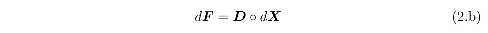****

****“○”是我们之前看到的 [hadamard 产品](https://en.wikipedia.org/wiki/Hadamard_product_(matrices))。****

## ****3.Hadamard 和 Frobenius 产品的性质****

****设 A、B 和 C 是三个形状相同的矩阵。****

*   ******哈达玛产品的特性:******

****除了矩阵之外，它与简单的标量乘法具有基本相同的性质。****

****可交换的***A***○***B = B***○***A***
联想的***A***○***(B***○***C)=(A*○***B)***○***C = A【A*********

*   ****Frobenius 产品的特性:****

**分配式超额加法***A:(B+C)= A:B+A:C*****

**下一个性质特别有趣，可以通过用 trace 公式替换“:”运算符来简单证明。**

**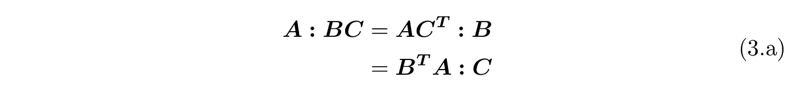**

****两个产品的联合性能:****

**运算顺序:
“○”比“:”优先级高，两者都比矩阵乘法优先级低。”**即:** **.”>"○">":**
由此，***A:B***○***C . D = A:(B***○***(C . D))*****

**这两个运算符之间最重要的属性如下:**

**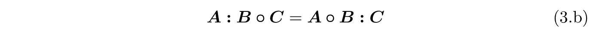**

**并且可以简单地通过用 trace 公式替换“:”操作符来演示。**

# **反向传播公式的证明**

## **1.区分损失**

**如果我们合并 1.a 和 2.a，我们有**

****

**由于 ***Z* ₂** 是一个矩阵乘法，其区别如下:**

****

**因此**

**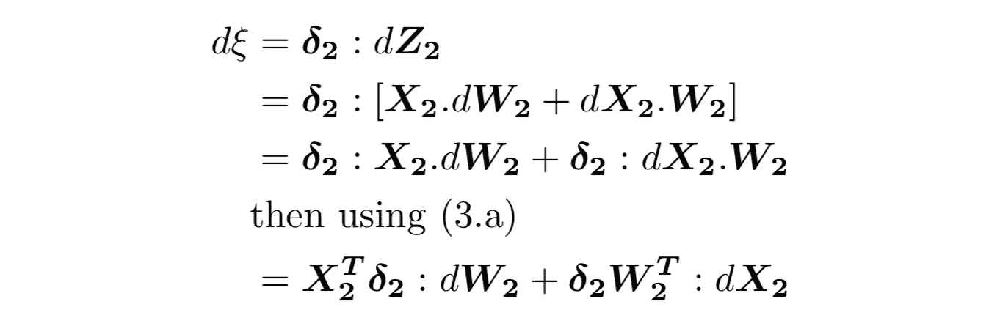**

**First 4 lines of the proof**

**我们现在有𝜉对 W₂和 X₂的 4 行证明。**

****

## **2.区分隐藏层**

**现在让我们通过最后一个隐藏层反向传播。如果我们把 1.b 和 2.b 结合起来，我们得到:**

****

**这样**𝜹₂w₂**ᐪ**:**d**x₂**就变成了**

**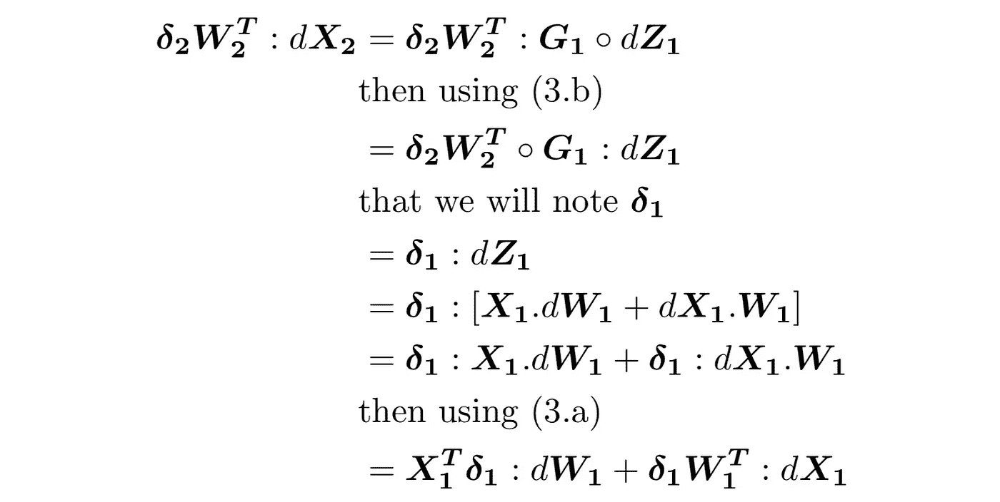**

**Last 6 lines of the proof**

**现在我们有了**𝜹₂w₂**ᐪ**:**d**x₂，**共 6 行证明的微分。**

**把这个放回 d𝜉给了我们**

****

****原来其实就是这样。剩下的就是对剩下的层重复这个步骤。****

**通过对**𝜹₁w₁**ᐪ**:**d**x₁**所做的与我们对**𝜹₂w₂**ᐪ**:**d**x₂**所做的相同，我们得到:**

****

## **3.把所有的放在一起**

**最后，把所有东西都放回 d𝜉，我们得到了最终的等式(★)**

**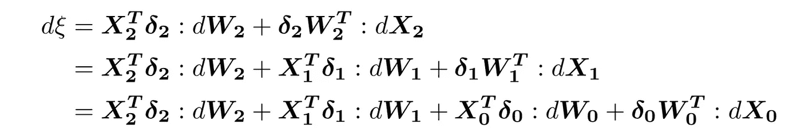**

**带着**𝜹₂**=**y**—**x₃** 和 **𝜹₁** = ( **𝜹₂。w₂**ᐪ**)**○**g₁**=(**𝜹₂。w₂**ᐪ**)**○**x₂**○(**1-x₂**)
和 **𝜹₀** = ( **𝜹₁。w₁**ᐪ**)**○g**₀**=(**𝜹₁。w₁**ᐪ**)**○**x₁**○(**1-x₁**)******************

****Tada！🎉****

# ****结论****

****就我个人而言，我发现这种证明更优雅，更容易从记忆中重现，而不需要看教科书。我希望你也是这样，我希望你喜欢这篇文章。****

## ****参考****

**** [## 多项式逻辑回归

### 在统计学中，多项逻辑回归是一种分类方法，将逻辑回归推广到…

en.wikipedia.org](https://en.wikipedia.org/wiki/Multinomial_logistic_regression)  [## Softmax 函数

### 在数学中，softmax 函数，也称为 softargmax 或归一化指数函数，[2] :198 是一个…

en.wikipedia.org](https://en.wikipedia.org/wiki/Softmax_function)  [## 哈达玛乘积(矩阵)

### 在数学中，哈达玛积(也称为舒尔积或熵积)是一种二元运算…

en.wikipedia.org](https://en.wikipedia.org/wiki/Hadamard_product_%28matrices%29)  [## Frobenius 内积

### 在数学中，Frobenius 内积是一种二元运算，它取两个矩阵并返回一个数。这是…

en.wikipedia.org](https://en.wikipedia.org/wiki/Frobenius_inner_product)****