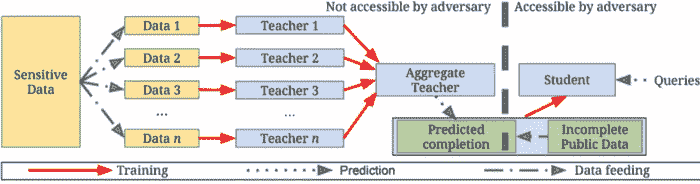

# 将差分隐私融入深度学习模型的 5 步指南

> 原文：<https://towardsdatascience.com/a-5-step-guide-on-incorporating-differential-privacy-into-your-deep-learning-models-7861c6c822c4?source=collection_archive---------19----------------------->

## 使用 PyTorch 和差分隐私对 MNIST 数字进行分类


Photo by [Farzad Nazifi](https://unsplash.com/@euwars?utm_source=unsplash&utm_medium=referral&utm_content=creditCopyText) on [Unsplash](https://unsplash.com/search/photos/technology?utm_source=unsplash&utm_medium=referral&utm_content=creditCopyText)

# 介绍

到目前为止，我们都知道差分隐私的好处，它如何在保护个人隐私的同时仍然提供对大型数据集的准确查询结果。这篇文章将阐述如何将差分隐私应用于 MNIST 数字分类问题，并使用一种称为**教师群体私人聚合(PATE)的技术对其进行分析。**

# 方法学

首先，我们将私有数据分成 N 个集合(在本例中为 100 个)，并在 N 个数据集的每一个上训练一个分类器。这些被称为**师**的量词。然后，我们将使用教师分类器来预测公共数据的标签。对于公共数据集中的每个图像，N 个分类器预测最多的标签将被认为是该图像的真实标签。

现在，使用**老师**分类器的预测作为我们公共数据的真实标签，我们将训练一个**学生**分类器，然后可以用来分类新的看不见的图像。



Figure 2: Overview of the approach: (1) an ensemble of teachers is trained on disjoint subsets of the sensitive data, (2) a student model is trained on public data labeled using the ensemble.

> *MNIST 训练数据将被视为私有数据，我们将在此基础上训练我们的教师模型。然后，通过组合教师模型的预测而获得的学生模型将在 MNIST 测试数据上被训练(90%的测试数据将用于训练模型，而剩余的 10%将用于测试其准确性)*

# 好吧，但是隐私部分在哪里起作用？

深度学习模型有过度拟合训练数据的趋势。神经网络可以学习个人的特征，而不是学习一般特征，然后对手可以利用这些特征来获取个人的私人信息。

通过不直接在私人数据上训练学生模型，我们防止它直接从数据集中学习单个人的关键个人特征。取而代之的是，由教师模型学习的概括特征和趋势被用于训练学生。

然而，有一个小警告。如果图像的标签可以通过移除单个教师的预测来改变，对手可以将搜索范围缩小到该模型。

为了避免这种情况，我们在选择预测最多的标签作为公共数据的真实标签之前，向教师模型的预测添加随机的 [**拉普拉斯噪声**](https://en.wikipedia.org/wiki/Laplace_distribution) 。通过这种方式，我们增加了一点随机性，并扭曲了最终结果，这样真正的标签就不会因为去掉一个老师而轻易改变。

# 使用 PyTorch 实现差分隐私

## **第一步:加载数据**

从 *torchvision* 和*导入 MNIST 数据，定义一个函数生成数据加载器。*

```
**import** **torch**

**from** **torchvision** **import** datasets, transforms
**from** **torch.utils.data** **import** Subset

*# Transform the image to a tensor and normalize it*
transform = transforms.Compose([transforms.ToTensor(),
                                transforms.Normalize((0.5,), (0.5,))])

*# Load the train and test data by using the transform*
train_data = datasets.MNIST(root='data', train=**True**, download=**True**, transform=transform)
test_data = datasets.MNIST(root='data', train=**False**, download=**True**, transform=transform)num_teachers = 100 *# Define the num of teachers*
batch_size = 32 *# Teacher batch size*

**def** get_data_loaders(train_data, num_teachers):
    *""" Function to create data loaders for the Teacher classifier """*
    teacher_loaders = []
    data_size = len(train_data) // num_teachers

    **for** i **in** range(data_size):
        indices = list(range(i*data_size, (i+1)*data_size))
        subset_data = Subset(train_data, indices)
        loader = torch.utils.data.DataLoader(subset_data, batch_size=batch_size)
        teacher_loaders.append(loader)

    **return** teacher_loaders

teacher_loaders = get_data_loaders(train_data, num_teachers)
```

现在，通过如上所述分割 MNIST 测试集来生成学生训练和测试数据。

```
*# Create the public dataset by using 90% of the Test data as train #data and remaining 10% as test data.*student_train_data = Subset(test_data, list(range(9000)))
student_test_data = Subset(test_data, list(range(9000, 10000)))

student_train_loader = torch.utils.data.DataLoader(student_train_data, batch_size=batch_size)
student_test_loader = torch.utils.data.DataLoader(student_test_data, batch_size=batch_size)
```

## 步骤 2:定义和培训教师模型

定义一个简单的 CNN 来分类 MNIST 数字。

```
**import** **torch.nn** **as** **nn**
**import** **torch.nn.functional** **as** **F**
**import** **torch.optim** **as** **optim**

**class** **Classifier**(nn.Module):
    *""" A Simple Feed Forward Neural Network.* 
 *A CNN can also be used for this problem* 
 *"""*
    **def** __init__(self):
        super().__init__()

        self.conv1 = nn.Conv2d(1, 10, kernel_size=5)
        self.conv2 = nn.Conv2d(10, 20, kernel_size=5)
        self.conv2_drop = nn.Dropout2d()
        self.fc1 = nn.Linear(320, 50)
        self.fc2 = nn.Linear(50, 10)

    **def** forward(self, x):
        x = F.relu(F.max_pool2d(self.conv1(x), 2))
        x = F.relu(F.max_pool2d(self.conv2_drop(self.conv2(x)), 2))
        x = x.view(-1, 320)
        x = F.relu(self.fc1(x))
        x = F.dropout(x, training=self.training)
        x = self.fc2(x)
        **return** F.log_softmax(x)
```

现在定义训练和预测函数

```
**def** train(model, trainloader, criterion, optimizer, epochs=10):
    *""" This function trains a single Classifier model """*
    running_loss = 0
    **for** e **in** range(epochs):
        model.train()

        **for** images, labels **in** trainloader:
            optimizer.zero_grad()

            output = model.forward(images)
            loss = criterion(output, labels)
            loss.backward()
            optimizer.step()

            running_loss += loss.item()**def** predict(model, dataloader):
    *""" This function predicts labels for a dataset* 
 *given the model and dataloader as inputs.* 
 *"""*
    outputs = torch.zeros(0, dtype=torch.long)
    model.eval()

    **for** images, labels **in** dataloader:
        output = model.forward(images)
        ps = torch.argmax(torch.exp(output), dim=1)
        outputs = torch.cat((outputs, ps))

    **return** outputs**def** train_models(num_teachers):
    *""" Trains *num_teacher* models (num_teachers being the number of teacher classifiers) """*
    models = []
    **for** i **in** range(num_teachers):
        model = Classifier()
        criterion = nn.NLLLoss()
        optimizer = optim.Adam(model.parameters(), lr=0.003)
        train(model, teacher_loaders[i], criterion, optimizer)
        models.append(model)
    **return** modelsmodels = train_models(num_teachers)
```

## 步骤 3:通过组合教师模型的预测来生成聚合的教师和学生标签。

现在，我们需要选择ε值，我们首先定义差分隐私的正式定义

这个定义并没有*创造*差异隐私，相反，它是一个查询 M 提供多少隐私的度量。具体来说，它是在数据库(x)和并行数据库(y)上运行查询 M 之间的比较。正如您所记得的，并行数据库被定义为与一个完整的数据库(x)相同，只是删除了一个条目/人。

因此，该定义指出，对于所有并行数据库，数据库(x)上的查询和数据库(y)上的相同查询之间的最大距离将是 e^epsilon，但有时该约束不适用于概率增量。因此，这个定理被称为“ε-δ”差分隐私。

## 我们应该增加多少噪音？

添加到查询输出中的噪声量是以下四个因素的函数:

*   噪声的类型(高斯/拉普拉斯)
*   查询/函数的敏感性
*   期望的ε
*   所需的增量(δ)

因此，对于我们添加的每种噪声，我们有不同的方法来计算添加多少，作为灵敏度、ε和δ的函数。我们将重点讨论拉普拉斯噪声。

拉普拉斯噪声根据“比例”参数 b 增加/减少。我们基于以下公式选择“b”。

b =敏感度(查询)/ε

换句话说，如果我们将 b 设置为这个值，那么我们知道我们将有一个隐私泄露的<= epsilon. Furthermore, the nice thing about Laplace is that it guarantees this with delta == 0\. There are some tunings where we can have very low epsilon where delta is non-zero, but we’ll ignore them for now.

```
**import** **numpy** **as** **np**

epsilon = 0.2**def** aggregated_teacher(models, dataloader, epsilon):
    *""" Take predictions from individual teacher model and* 
 *creates the true labels for the student after adding* 
 *laplacian noise to them* 
 *"""*
    preds = torch.torch.zeros((len(models), 9000), dtype=torch.long)
    **for** i, model **in** enumerate(models):
        results = predict(model, dataloader)
        preds[i] = results

    labels = np.array([]).astype(int)
    **for** image_preds **in** np.transpose(preds):
        label_counts = np.bincount(image_preds, minlength=10)
        beta = 1 / epsilon

        **for** i **in** range(len(label_counts)):
            label_counts[i] += np.random.laplace(0, beta, 1)

        new_label = np.argmax(label_counts)
        labels = np.append(labels, new_label)

    **return** preds.numpy(), labelsteacher_models = models
preds, student_labels = aggregated_teacher(teacher_models, student_train_loader, epsilon)
```

## Step 4: Create the Student model and train it using the labels generated in step 3.

```
**def** student_loader(student_train_loader, labels):
    **for** i, (data, _) **in** enumerate(iter(student_train_loader)):
        **yield** data, torch.from_numpy(labels[i*len(data): (i+1)*len(data)])student_model = Classifier()
criterion = nn.NLLLoss()
optimizer = optim.Adam(student_model.parameters(), lr=0.003)
epochs = 10
steps = 0
running_loss = 0
**for** e **in** range(epochs):
    student_model.train()
    train_loader = student_loader(student_train_loader, student_labels)
    **for** images, labels **in** train_loader:
        steps += 1

        optimizer.zero_grad()
        output = student_model.forward(images)
        loss = criterion(output, labels)
        loss.backward()
        optimizer.step()

        running_loss += loss.item()

        **if** steps % 50 == 0:
            test_loss = 0
            accuracy = 0
            student_model.eval()
            **with** torch.no_grad():
                **for** images, labels **in** student_test_loader:
                    log_ps = student_model(images)
                    test_loss += criterion(log_ps, labels).item()

                    *# Accuracy*
                    ps = torch.exp(log_ps)
                    top_p, top_class = ps.topk(1, dim=1)
                    equals = top_class == labels.view(*top_class.shape)
                    accuracy += torch.mean(equals.type(torch.FloatTensor))
            student_model.train()
            print("Epoch: **{}**/**{}**.. ".format(e+1, epochs),
                  "Training Loss: **{:.3f}**.. ".format(running_loss/len(student_train_loader)),
                  "Test Loss: **{:.3f}**.. ".format(test_loss/len(student_test_loader)),
                  "Test Accuracy: **{:.3f}**".format(accuracy/len(student_test_loader)))
            running_loss = 0
```

Here’s a snippet of the **训练损失**和**精度**实现。

```
Epoch: 9/10..  Training Loss: 0.035..  Test Loss: 0.206..  Test Accuracy: 0.941
Epoch: 9/10..  Training Loss: 0.034..  Test Loss: 0.196..  Test Accuracy: 0.949
Epoch: 10/10..  Training Loss: 0.048..  Test Loss: 0.204..  Test Accuracy: 0.943
Epoch: 10/10..  Training Loss: 0.046..  Test Loss: 0.203..  Test Accuracy: 0.943
Epoch: 10/10..  Training Loss: 0.045..  Test Loss: 0.203..  Test Accuracy: 0.945
Epoch: 10/10..  Training Loss: 0.049..  Test Loss: 0.207..  Test Accuracy: 0.946
Epoch: 10/10..  Training Loss: 0.032..  Test Loss: 0.228..  Test Accuracy: 0.941
Epoch: 10/10..  Training Loss: 0.030..  Test Loss: 0.252..  Test Accuracy: 0.939
```

## 步骤 5:让我们对聚合教师生成的学生标签执行 PATE 分析

```
**from** **syft.frameworks.torch.differential_privacy** **import** pate

data_dep_eps, data_ind_eps = pate.perform_analysis(teacher_preds=preds, indices=student_labels, noise_eps=epsilon, delta=1e-5)
print("Data Independent Epsilon:", data_ind_eps)
print("Data Dependent Epsilon:", data_dep_eps)
```

输出:

```
Data Independent Epsilon: 1451.5129254649705
Data Dependent Epsilon: 4.34002697554237
```

pate.perform_analysis 方法返回两个值——一个与数据无关的ε和一个与数据相关的ε。数据相关的 epsilon 是通过查看教师之间的一致程度而获得的 epsilon 值。在某种程度上，PATE 分析奖励用户构建彼此一致的教师模型，因为泄漏信息和跟踪个人信息变得更加困难。

# 结论

使用 PATE 分析方法指导的学生-教师架构是一种将差分隐私引入深度学习模型的好方法。然而，差分隐私仍处于早期阶段，随着该领域研究的深入，将会开发出更复杂的方法来减少隐私-准确性之间的权衡，以及差分隐私仅在大型数据集上表现良好的缺点。

# 参考

[1] Dwork，c .和 Roth，A. [《差分隐私的算法基础》](http://www.nowpublishers.com/article/Details/TCS-042) (2014)，*理论计算机科学的基础和趋势*，*9*(3–4)，第 211–407 页。

[2] Abadi，Martin 等，[具有差分隐私的深度学习](https://dl.acm.org/citation.cfm?id=2978318) (2016)，*2016 年 ACM SIGSAC 计算机与通信安全会议论文集*。ACM，2016。

[3]图 1，由[法尔扎德·纳兹菲](https://unsplash.com/@euwars?utm_source=unsplash&utm_medium=referral&utm_content=creditCopyText)在 [Unsplash](https://unsplash.com/search/photos/technology?utm_source=unsplash&utm_medium=referral&utm_content=creditCopyText) 上拍摄的照片

[4]图 2，Nicolas Papernot 等人，[PATE](https://arxiv.org/abs/1802.08908)(2018)的可扩展私人学习，在 2018 年 ICLR 会议上作为会议论文发表