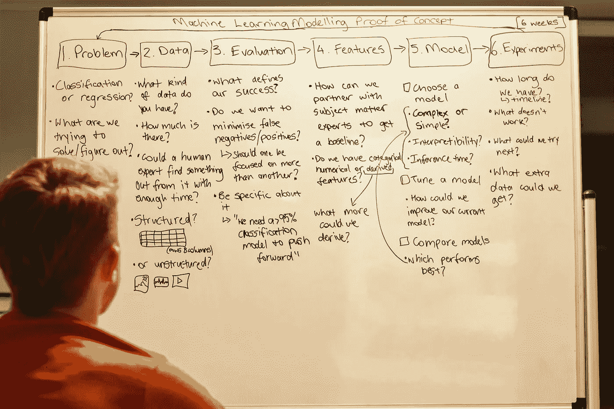
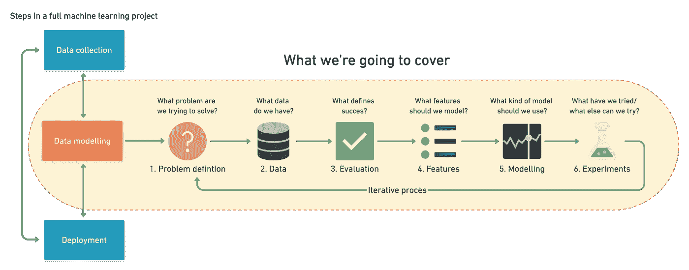
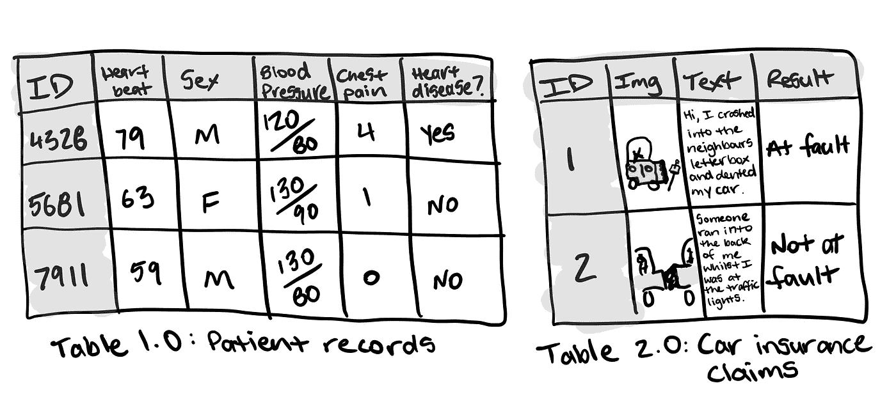
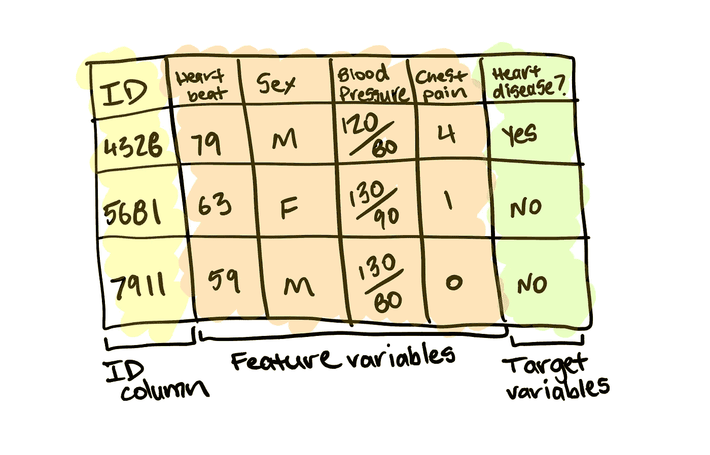
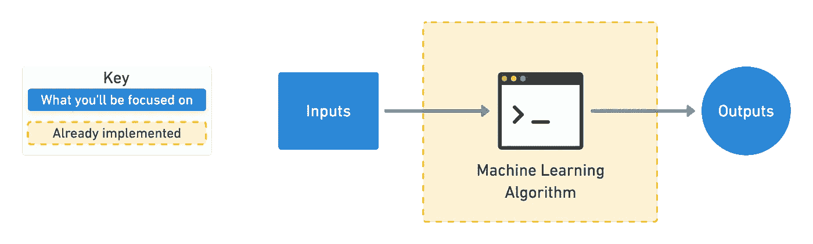

# 构建机器学习项目的 6 步现场指南

> 原文：<https://towardsdatascience.com/a-6-step-field-guide-for-building-machine-learning-projects-6e4554f6e3a1?source=collection_archive---------2----------------------->

## 有数据，想知道如何用它来使用机器学习？读读这个。

I listened to Korn’s new album on repeat for 6-hours the other day and wrote out a list of things I think about when it comes to the modelling phase of machine learning projects. The whiteboard sums it up. Thank you [Sam Bourke](https://www.instagram.com/sambourke_photography) for the photo.

机器学习是广义的。媒体让它听起来像魔术。阅读这篇文章将改变这一点。它将向你概述机器学习可以用来解决的最常见的问题类型。同时给你一个框架来处理你未来的机器学习概念验证项目。

首先，我们将澄清一些定义。

机器学习、人工智能和数据科学有什么不同？

这三个主题可能很难理解，因为没有正式的定义。即使做了一年多的机器学习工程师，这个问题我也没有很好的答案。我会怀疑任何声称他们知道的人。

为了避免混淆，我们将保持简单。对于本文，您可以将机器学习视为在数据中寻找模式的过程，以了解更多信息或预测某种未来事件。

下面的步骤偏向于构建一些东西并观察它是如何工作的。边做边学。

# 下一个机器学习项目的 6 个步骤

机器学习管道可以分为三个主要步骤。数据收集、数据建模和部署。所有这些都相互影响。

你可以通过收集数据开始一个项目，建模，意识到你收集的数据很差，回去收集数据，再次建模，找到一个好的模型，部署它，发现它不起作用，制作另一个模型，部署它，发现它不起作用，再次回到数据收集。这是一个循环。

等等，模型是什么意思？部署是什么意思？我如何收集数据？

很棒的问题。

你如何收集数据将取决于你的问题。我们一会儿会看一些例子。但是一种方法可以是你的客户在电子表格中的购买。

建模是指使用机器学习算法在你收集的数据中寻找见解。

正常算法和机器学习算法有什么区别？

就像你最喜欢的鸡肉菜肴的烹饪食谱一样，一个普通的算法是一组如何将一组配料变成蜂蜜芥末酱的指令。

让机器学习算法与众不同的是，你不是有一套指令，而是从配料和准备好的最后一道菜开始。然后，机器学习算法会查看配料和最终的菜肴，并制定出一套指令。

有许多不同类型的机器学习算法，有些算法在不同的问题上表现得比其他算法更好。但前提仍然是，他们都有在数据中寻找模式或指令集的目标。

部署就是获取您的指令集并在应用程序中使用它。这个应用程序可以是任何东西，从向在线商店的客户推荐产品到医院试图更好地预测疾病的存在。

这些步骤的细节对于每个项目都是不同的。但是每一个的原理都是相似的。

本文主要关注数据建模。它假设你已经收集了数据，并希望用它来建立一个机器学习的概念证明。让我们来分析一下你可能会怎么做。

Machine learning projects can be broken into three steps, data collection, data modelling and deployment. This article focuses on steps within the data modelling phase and assumes you already have data. [Full version on Whimsical](https://whimsical.com/9g65jgoRYTxMXxDosndYTB).

1.  **问题定义** —我们试图解决什么业务问题？怎么把它表述成机器学习问题？
2.  **数据** —如果机器学习正在从数据中获得洞察力，我们有什么数据？如何匹配问题定义？我们的数据是结构化的还是非结构化的？静态还是流？
3.  **评价**——什么定义了成功？一个 95%准确率的机器学习模型就足够好了吗？
4.  **特性** —我们的数据的哪些部分将用于我们的模型？我们已经知道的东西怎么会影响这个呢？
5.  **造型** —你该选择哪一款？怎么才能改善呢？怎么和其他车型比？
6.  实验——我们还能尝试什么？我们部署的模型是否如我们预期的那样？根据我们的发现，其他步骤有什么变化？

让我们更深入地研究一下。

# 1.问题定义——将您的业务问题重新表述为机器学习问题

为了帮助决定您的企业是否可以使用机器学习，第一步是匹配您试图解决机器学习问题的业务问题。

机器学习的四种主要类型是监督学习、非监督学习、迁移学习和强化学习(也有半监督的，但为了简洁起见，我省略了它)。商业应用中最常用的三种是监督学习、非监督学习和迁移学习。

## 监督学习

监督学习之所以被称为监督学习，是因为你有数据和标签。机器学习算法试图学习数据中的什么模式导致了标签。受监督的部分发生在训练期间。如果算法猜错了标签，它会尝试自我纠正。

例如，如果你试图预测一个新病人的心脏病。你可能有 100 名病人的匿名医疗记录作为数据，他们是否有心脏病作为标签。

机器学习算法可以查看医疗记录(输入)和患者是否患有心脏病(输出)，然后计算出医疗记录中的哪些模式会导致心脏病。

一旦你有了一个训练有素的算法，你就可以通过它传递一个新病人的医疗记录(输入),并预测他们是否患有心脏病(输出)。重要的是要记住这个预测是不确定的。它以概率的形式返回。

算法说，“根据我之前看到的，看起来这个新病人的医疗记录有 70%与心脏病患者一致。”

## 无监督学习

无监督学习就是你有数据但没有标签。这些数据可能是你的在线视频游戏商店顾客的购买历史。使用这些数据，您可能希望将相似的客户分组在一起，以便为他们提供专业的交易。你可以使用机器学习算法根据购买历史对你的客户进行分组。

检查完组后，您提供标签。可能有一群人对电脑游戏感兴趣，另一群人喜欢主机游戏，还有一群人只买打折的老游戏。这就是所谓的聚类。

这里需要记住的重要一点是，算法并没有提供这些标签。它发现了相似客户之间的模式，并利用你的领域知识，你提供了标签。

## 迁移学习

迁移学习是指获取现有机器学习模型学习到的信息，并根据自己的问题进行调整。

从头开始训练机器学习模型可能既昂贵又耗时。好消息是，你不必总是这样。当机器学习算法在一种数据中找到模式时，这些模式可以用于另一种类型的数据。

假设您是一家汽车保险公司，想要构建一个文本分类模型来分类提交车祸保险索赔的人是有过错(造成事故)还是没有过错(没有造成事故)。

你可以从一个现有的文本模型开始，这个模型已经阅读了整个维基百科，并且记住了不同单词之间的所有模式，例如，哪个单词更有可能一个接一个地出现。然后使用您的汽车保险索赔(数据)及其结果(标签)，您可以调整现有的文本模型来解决您自己的问题。

如果机器学习可以用于你的业务，它很可能属于这三种学习类型之一。

但是让我们把它们进一步分解为分类、回归和推荐。

*   **分类** —你想预测某样东西是一个东西还是另一个东西？比如一个客户会不会流失？或者病人有没有心脏病？注意，可以有两个以上的东西。两类称为二元分类，两类以上称为多类分类。多标签是指一个项目可以属于多个类别。
*   **回归** —你想预测某个事物的具体数字吗？比如房子会卖多少钱？或者下个月会有多少客户访问你的网站？
*   **推荐** —你想给某人推荐点什么吗？比如基于他们之前的购买来购买产品？或者基于他们的阅读历史来阅读的文章？

现在你知道了这些事情，你的下一步就是用机器学习的术语来定义你的业务问题。

让我们以之前的汽车保险为例。你每天会收到数千份索赔，你的员工会阅读这些索赔，并决定提交索赔的人是否有错。

但是现在，索赔的数量开始超过您的员工的处理速度。你有数以千计的过去索赔的例子，这些索赔被贴上有错或没有错的标签。

机器学习能有帮助吗？

你已经知道答案了。但是让我们看看。这个问题符合以上三个中的任何一个吗？分类回归还是推荐？

让我们换个说法。

> 我们是一家汽车保险公司，希望将收到的汽车保险索赔分为有过失或无过失。

看到关键词了吗？分类。

事实证明，这可能是一个机器学习分类问题。我说有可能是因为有可能行不通。

当把你的业务问题定义为机器学习问题时，从简单开始，多一句话就太多了。需要时增加复杂性。

# 2.数据——如果机器学习是从数据中获得洞察力，你有什么数据？

您拥有或需要收集的数据将取决于您想要解决的问题。

如果你已经有了数据，它很可能是两种形式之一。结构化或非结构化。在其中的每一个中，都有静态或流数据。

*   **结构化数据** —想象一个由行和列组成的表格，一个客户交易的 Excel 电子表格，一个病人记录的数据库。列可以是数字的，如平均心率，分类的，如性别，或序数的，如胸痛强度。
*   **非结构化数据** —任何不能立即转换为行列格式的数据，如图像、音频文件、自然语言文本等。
*   **静态数据** —已有的历史数据，不太可能发生变化。你公司的客户购买历史就是一个很好的例子。
*   **流数据** —不断更新的数据，旧记录可能会更改，新记录会不断添加。

有重叠的地方。

您的静态结构化信息表可能有包含自然语言文本和照片的列，并且会不断更新。

对于预测心脏病，一列可能是性别，另一列是平均心率，另一列是平均血压，另一列是胸痛强度。

对于保险索赔示例，一列可能是客户为索赔发送的文本，另一列可能是他们随文本一起发送的图像，最后一列是索赔的结果。该表每天都会更新新的索赔或旧索赔的变更结果。

Two examples of structured data with different kinds of data within it. Table 1.0 has numerical and categorical data. Table 2.0 has unstructured data with images and natural language text but is presented in a structured manner.

原则依然存在。你想利用你所拥有的数据来获得洞察力或预测某事。

对于监督学习，这包括使用特征变量来预测目标变量。用于预测心脏病的特征变量可以是性别，目标变量是患者是否患有心脏病。

Table 1.0 broken into ID column (yellow, not used for building machine learning model), feature variables (orange) and target variables (green). A machine learning model finds the patterns in the feature variables and predicts the target variables.

对于无监督学习，你不会有标签。但是你还是想找到模式。也就是说，将相似的样本组合在一起，并找出异常的样本。

对于迁移学习，你的问题仍然是一个监督学习问题，除非你利用机器学习算法从你自己的数据源以外的其他数据源学习的模式。

请记住，如果你使用客户数据来改善你的业务或为他们提供更好的服务，让他们知道是很重要的。这就是为什么你到处都能看到“这个网站使用 cookies”的弹出窗口。该网站利用你浏览网站的方式，很可能伴随着某种机器学习来改进他们的产品。

# 3.评估——成功的定义是什么？一个 95%准确率的机器学习模型就足够好了吗？

你已经用机器学习的术语定义了你的业务问题，并且你有数据。现在定义什么是成功。

分类、回归和推荐问题有不同的评价指标。你选择哪一个取决于你的目标。

> 为了使这个项目成功，无论某人是否有错，这个模型都需要达到 95%以上的准确率。

一个 95%准确的模型对于预测保险索赔中谁是错的听起来可能相当不错。但是对于预测心脏病，你可能想要更好的结果。

对于分类问题，你应该考虑的其他事情。

*   **假阴性** —模型预测为阴性，实际为阳性。在某些情况下，比如垃圾邮件预测，漏报并不太令人担心。但如果自动驾驶汽车的计算机视觉系统预测有行人时没有行人，这就不好了。
*   **假阳性** —模型预测为阳性，实际为阴性。预测某人有心脏病，而他们没有，这看起来似乎没问题。最好是安全的，对吗？如果这会对患者的生活方式产生负面影响，或者让他们接受他们并不需要的治疗计划，那就不会。
*   **真阴性** —模型预测阴性，实际阴性。这很好。
*   **真阳性** —模型预测阳性，实际阳性。这很好。
*   [**精度**](https://en.wikipedia.org/wiki/Precision_and_recall) —有多少比例的正面预测实际上是正确的？不产生假阳性的模型的精度为 1.0。
*   [**回忆**](https://en.wikipedia.org/wiki/Precision_and_recall) —实际阳性预测正确的比例是多少？不产生假阴性的模型的召回率为 1.0。
*   [**F1 评分**](https://en.wikipedia.org/wiki/F1_score)——精准与召回的结合。越接近 1.0 越好。
*   [**受试者工作特征(ROC)曲线&曲线下面积(AUC)**](/understanding-auc-roc-curve-68b2303cc9c5)—ROC 曲线是比较真阳性率和假阳性率的曲线图。AUC 指标是 ROC 曲线下的面积。预测 100%错误的模型的 AUC 为 0.0，预测 100%正确的模型的 AUC 为 1.0。

对于回归问题(你想要预测一个数字)，你会想要最小化你的模型预测值和实际值之间的差异。如果你试图预测房子的售价，你会希望你的模型尽可能接近实际价格。为此，请使用梅或 RMSE。

*   [**平均绝对误差(MAE)**](https://en.wikipedia.org/wiki/Mean_absolute_error) —模型预测值与实际值之间的平均差值。
*   [**【均方根误差(RMSE)**](https://en.wikipedia.org/wiki/Root-mean-square_deviation)-模型预测值与实际值之间的平均平方差的平方根。

如果希望较大的误差更显著，请使用 RMSE。例如，预测一栋房子将以 300，000 美元而不是 200，000 美元出售，而价格下降 100，000 美元，这比价格下降 50，000 美元要糟糕两倍以上。或者说，如果损失 10 万美元比损失 5 万美元要糟糕两倍。

推荐问题更难在实验中检验。一种方法是把你的一部分数据藏起来。当您的模型建立后，使用它来预测隐藏数据的建议，并查看它是如何排列的。

假设你正试图在网上商店向顾客推荐产品。您有 2010 年至 2019 年的历史购买数据。你可以根据 2010 年至 2018 年的数据建立一个模型，然后用它来预测 2019 年的购买量。然后，这就变成了一个分类问题，因为你试图对某人是否有可能购买一件商品进行分类。

然而，传统的分类标准并不适合推荐问题。精准和召回没有排序的概念。

如果你的机器学习模型返回一个 10 条建议的列表，在你的网站上显示给客户，你会希望最好的被首先显示，对吗？

*   [**Precision @ k(Precision up to k)**](https://en.wikipedia.org/wiki/Evaluation_measures_(information_retrieval)#Precision_at_K)—与常规精度相同，但是，您选择截止值 k。例如，精度为 5，意味着我们只关心前 5 个推荐。你可能有 10，000 个产品。但是你不能把它们都推荐给你的客户。

首先，你可能没有每一项的确切数字。但是知道你应该关注什么指标会让你知道如何评估你的机器学习项目。

# 4.要素-您的数据具有哪些要素，您可以使用哪些要素来构建模型？

并非所有的数据都是一样的。当你听到有人提到特性时，他们指的是数据中不同种类的数据。

三种主要类型的特征是分类的、连续的(或数字的)和衍生的。

*   **分类特征** —非此即彼。例如，在我们的心脏病问题中，病人的性别。或者对于在线商店来说，不管是否有人已经购买。
*   **连续(或数值)特征** —平均心率或登录次数等数值。
*   **衍生特征** —从数据中创建的特征。通常被称为特征工程。特征工程是主题专家如何将他们的知识编码到数据中。您可以将登录的次数与时间戳结合起来，形成一个称为“自上次登录以来的时间”的特性。或者把日期从数字变成“是工作日(是)”和“是工作日(否)”。

文本、图像和几乎任何你能想象到的东西也可以成为一个特征。无论如何，在机器学习算法可以对它们建模之前，它们都被转换成数字。

谈到特性时，需要记住一些重要的事情。

*   **在实验(训练)和生产(测试)期间保持相同** —机器学习模型应该在尽可能接近其在真实系统中的用途的特征上进行训练。
*   **与主题专家合作** —你对这个问题已经了解多少，这对你使用什么功能有什么影响？让你的机器学习工程师和数据科学家知道这一点。
*   **他们值得吗？** —如果只有 10%的样本具有某个特性，是否值得将它整合到模型中？偏好覆盖面最广的功能。很多样本都有数据。
*   **完美等于破碎** —如果你的模型实现了完美的性能，你很可能在某个地方有功能泄漏。这意味着你的模型训练的数据正被用来测试它。没有一种模式是完美的。

您可以使用特性来创建简单的基线度量。客户流失方面的主题专家可能知道某人有 80%的可能在 3 周不登录后取消他们的会员资格。

或者，知道房屋销售价格的房地产经纪人可能知道超过 5 间卧室和 4 间浴室的房屋售价超过 50 万美元。

这些都是简化的，不一定要精确。但这是你要用来看机器学习是否可以改进的。

# 5.建模——您应该选择哪种模型？怎么才能改善呢？怎么和其他车型比？

一旦你定义了你的问题，准备好你的数据，评估标准和特征，是时候建模了。

建模分为三个部分，选择一个模型，改进一个模型，和其他模型比较。

## 选择模型

选择模型时，您需要考虑可解释性和易于调试性、数据量、训练和预测限制。

*   **可解释性和易于调试** —为什么一个模型要做出它所做的决定？如何修复这些错误？
*   **数据量** —你有多少数据？这种情况会改变吗？
*   **训练和预测的局限性**——这个和上面有关系，你有多少时间和资源用于训练和预测？

要解决这些问题，从简单开始。最先进的模型很容易让人去接触。但是，如果它需要 10 倍的计算资源来训练，并且预测时间比评估指标提高 2%要长 5 倍，那么它可能不是最佳选择。

逻辑回归等线性模型通常比神经网络等更深入的模型更容易解释，训练速度非常快，预测速度也更快。

但很可能你的数据来自真实世界。来自真实世界的数据并不总是线性的。

然后呢？

决策树和梯度增强算法(花哨的词语，现在不重要的定义)的组合通常最适合结构化数据，如 Excel 表格和数据框架。查看[随机森林](/understanding-random-forest-58381e0602d2)、 [XGBoost](https://xgboost.ai/) 和 [CatBoost](https://catboost.ai/) 。

神经网络等深度模型通常最适用于图像、音频文件和自然语言文本等非结构化数据。然而，代价是它们通常需要更长的训练时间，更难调试，预测时间也更长。但这并不意味着你不应该使用它们。

迁移学习是一种利用深度模型和线性模型的方法。它包括采用一个预先训练好的深度模型，并使用它学习到的模式作为你的线性模型的输入。这大大节省了训练时间，让你更快地进行实验。

我在哪里可以找到预先训练好的模特？

在 [PyTorch hub](https://pytorch.org/hub) 、 [TensorFlow hub](https://www.tensorflow.org/hub) 、 [model zoo](https://modelzoo.co/) 和 [fast.ai 框架](https://github.com/fastai/fastai)内都有预训练的模型。这是构建任何类型的概念证明的首选位置。

其他种类的模型呢？

为了建立概念证明，你不太可能必须建立自己的机器学习模型。人们已经为这些写了代码。

你要关注的是准备好你的输入和输出，使它们可以用于现有的模型。这意味着严格定义你的数据和标签，并理解你试图解决什么问题。

To begin with, your main job will be making sure your inputs (data) lines up with how an existing machine learning algorithm expects them. Your next goal will be making sure the outputs are aligned with your problem definition and if they meet your evaluation metric.

## 调整和改进模型

一个模型的第一个结果并不是最后一个。就像调整汽车一样，机器学习模型可以被调整以提高性能。

调整模型涉及改变超参数，如学习率或优化器。或者特定于模型的架构因素，例如随机森林的树的数量以及神经网络的层数和类型。

这些曾经是从业者必须手动调整的东西，但是现在越来越自动化了。并且应该尽可能地。

通过迁移学习使用一个预先训练好的模型通常会有额外的好处。

调整和改进模型的首要任务应该是再现性和效率。有人应该能够重现你为提高绩效所采取的步骤。因为你的主要瓶颈将是模型训练时间，而不是改进的新想法，你的努力应该致力于效率。

## 比较模型

把苹果比作苹果。

*   模型 1，根据数据 X 训练，根据数据 y 评估。
*   模型 2，根据数据 X 训练，根据数据 y 评估。

其中模型 1 和 2 可以改变，但数据 X 或数据 y 不能改变

# 6.实验——我们还能尝试什么？根据我们的发现，其他步骤有什么变化？我们部署的模型是否如我们预期的那样？

这一步涉及所有其他步骤。因为机器学习是一个高度迭代的过程，你需要确保你的实验是可行的。

你最大的目标应该是最小化离线实验和在线实验之间的时间。

离线实验是你的项目还没有面向客户时采取的步骤。在线实验发生在你的机器学习模型投入生产的时候。

所有的实验都应该在数据的不同部分进行。

*   **训练数据集** —使用该数据集进行模型训练，你的数据的 70–80%是标准的。
*   **验证/开发数据集** —使用该数据集进行模型调整，10–15%的数据是标准数据。
*   **测试数据集** —使用该数据集进行模型测试和比较，10–15%的数据是标准数据。

这些数量可能会略有波动，这取决于您的问题和您拥有的数据。

训练数据表现不佳意味着模型没有正确学习。尝试不同的模型，改进现有的模型，收集更多的数据，收集更好的数据。

测试数据表现不佳意味着你的模型不能很好地概括。您的模型可能会过度拟合训练数据。使用更简单的模型或收集更多数据。

部署(在现实世界中)后的糟糕性能意味着您训练和测试模型的内容与实际发生的情况存在差异。重温步骤 1 和 2。确保您的数据与您试图解决的问题相匹配。

当你实施一个大的实验性改变时，记录下是什么和为什么。记住，就像模型调整一样，有人，包括你未来的自己，应该能够复制你所做的。

这意味着定期保存更新的模型和更新的数据集。

# 将它放在一起进行概念验证

许多企业听说过机器学习，但不确定从哪里开始。最好的起点之一是使用上面的六个步骤来构建概念证明。

概念验证不应该被视为从根本上改变你的业务运营方式的事情，而是探索机器学习是否能为你带来商业价值。

毕竟，你不是在追求花哨的解决方案来跟上炒作。您追求的是增值的解决方案。

在概念证明上放一个时间表，2、6 和 12 周是很好的量。有了好的数据，一个好的机器学习和数据科学从业者可以在相对较短的时间内获得 80–90%的最终建模结果。

让你的主题专家、机器学习工程师和数据科学家一起工作。没有什么比机器学习工程师建立一个伟大的模型来模拟错误的东西更糟糕的了。

如果网页设计师可以改善在线商店的布局，以帮助机器学习实验，他们应该知道。

请记住，由于概念证明的性质，机器学习可能不是您的企业可以利用的东西(不太可能)。作为项目经理，确保你意识到这一点。如果你是一名机器学习工程师或数据科学家，愿意接受你的结论。

但是并没有失去一切。

失败的价值在于你现在知道什么是失败的，并且可以把你的努力引向其他地方。这就是为什么为实验设定时间表是有帮助的。时间永远不够，但是最后期限创造了奇迹。

如果机器学习的概念证明结果很好，再走一步，如果不好，就后退一步。边做边学是一个比思考更快的过程。

# 本文遗漏的内容

这些步骤中的每一步都值得单独写一篇文章。我会努力的。

同时，有一些事情需要注意。

数据永远是最重要的。没有好的数据开始，任何机器学习模型都不会帮助你。如果你想在你的业务中使用机器学习，它从良好的数据收集开始。

**部署改变一切**。线下的好模式不一定代表线上的好模式。本文主要关注数据建模。一旦你部署了一个模型，就会有基础设施管理、数据验证、模型再训练、分析等等。任何云提供商都有这方面的服务，但把它们放在一起仍然是一种黑暗的艺术。给你的数据工程师高薪吧。如果你是数据工程师，分享你所知道的。

**数据收集和模型部署是机器学习管道中最长的部分。**本文只关注建模。即便如此，它也忽略了如何让你的数据做好建模准备的细节。

交易的工具各不相同。机器学习是由许多其他工具组成的大工具。从代码库和框架到不同的部署架构。做同一件事通常有几种不同的方法。最佳实践在不断变化。这篇文章关注的是不相关的东西。

这篇文章是基于[脸书的机器学习领域指南](https://research.fb.com/blog/2018/05/the-facebook-field-guide-to-machine-learning-video-series/)，混合了我自己的一些经验。