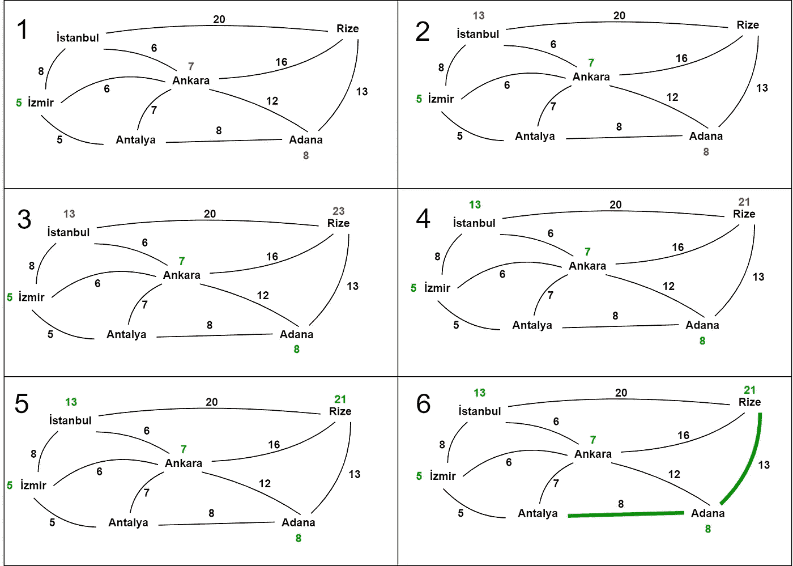
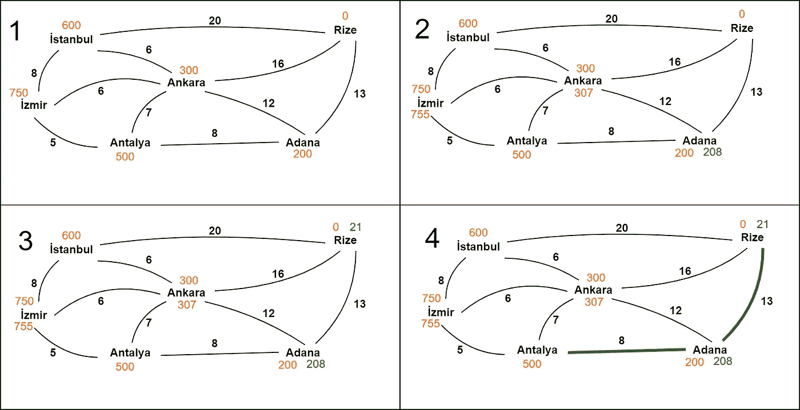
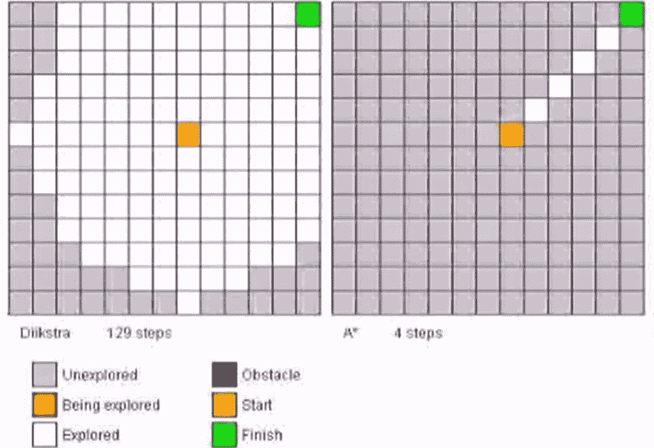

# A*:向 Dijkstra 添加启发式

> 原文：<https://towardsdatascience.com/a-adding-heuristics-to-dijkstra-9e4ddbeada35?source=collection_archive---------21----------------------->

## A*通过利用启发式算法来加速著名的 Dijkstra 算法。

# 介绍

假设我们有一个图 *G* 有两个以上的节点，从这个图中选择两个节点 *a* 和 *b* 。在连接这两个节点的所有路径中， *a* 和 *b* 之间的最短路径(SP)具有最小的总边权重。这种路径在许多情况下非常有用，例如在道路网络中查找最快的路径，其中边权重表示穿过道路所需的时间，或者在转运网络中查找将货物从其来源转运到其目的地所需的最小成本。

# Dijkstra 算法

Dijkstra 的算法可以说是最受欢迎的 SP 算法，它可以在任何具有非负边的图中工作。这是一种贪婪算法，寻找到达所有节点的最短路径，直到它到达目标。它盲目地从源顶点开始，从发现的最近的节点开始探索图形，直到该迭代。

为了在每次迭代中找到最近的节点，Dijkstra 首先假设所有节点都无限远离源。然后，它更新源节点邻居的距离信息(标签),因为它发现了一条比无穷大更短的路径。它挑选最近的邻居作为新的探测节点，并根据从源到该节点的路径长度更新其邻居的标签。如果一个节点已经有了一个标签，那么它的标签只有在新标签更小时才会更新。注意，在每一次迭代中，我们保证从源到探索节点的 SP 被发现，因为所有的边都是非负的，因此我们将不能在将来发现更短的路径。由于这一事实，标签更新会继续，直到目标成为新的浏览节点，当它停止时，会找到 SP。

举例来说，假设司机想在最短时间内从安塔利亚开车到里泽。如果我们从土耳其的城市构建一个图，其中边权重表示道路的估计交叉时间，使用 Dijkstra 和 Antalya 作为源，Rize 作为目标，我们可以找到所需的路径。

下图显示了 Dijkstra 对上述图表的迭代。在第一次迭代中，我们用边权重标记安塔利亚的邻居，发现伊兹密尔是最近的城市。我们用绿色标记伊兹密尔，并继续探索图形。然后我们标记安卡拉、阿达纳和伊斯坦布尔，找到通往里泽的道路。请注意，即使我们在第三次迭代中找到了一条到 Rize 的路径，我们也不会停止，因为我们还没有标记 Rize。在第四次迭代中，我们找到一条更短的路径，在第五次迭代中，我们标记 Rize。在最后一个例子中，我们展示了具有粗边的 SP。

Iterations of Dijkstra on the Turkish cities graph.

尽管 Dijkstra 设法发现了 SP，但直觉不同意 Dijkstra 的迭代。如果一个人被要求完成同样的任务，他/她可能不会搜索通过伊兹密尔和伊斯坦布尔的路径，因为它们是西部城市，而里泽在土耳其的东部。然而，Dijkstra 盲目地检查边权重并忽略图结构，即使它是可用的。

尽管算法与人类直觉相反不会造成问题，但是增加迭代次数会造成问题！通过考虑伊兹密尔和伊斯坦布尔，Dijkstra 浪费了一些迭代，因为这些城市不包括在 SP 中。为了减少浪费的迭代次数，我们将使用 **A*算法**。

# A*算法

Dijkstra 的问题源于它缺乏人的直觉。在 A*中，我们将使用启发式方法来克服这个问题。启发式算法是一种通知算法实现更有针对性的搜索的功能。在 A*中，使用试探法来决定每一步要考虑哪个节点。与 Dijkstra 仅通过到源节点的总距离来选择节点不同，A*将相同的标准与启发式函数相结合。

为了得到上图的启发，考虑在上图中寻找 SP 的人。我们说他/她将省略伊兹密尔和伊斯坦布尔，因为它们是西方城市。通过启发式，我们也可以驱动算法这样做！为了反映人类的直觉，让我们将每个节点的启发式算法定义为**欧几里德距离来 Rize** 。

使用这种启发式算法，A*将考虑两个标准:到 Antalya 的路径距离和到 Rize 的欧几里得距离。在每一步中，它将选择这两者总和最小的节点。为了最小化第一个标准，它会选择一个靠近安塔利亚的节点，就像在 Dijkstra 一样。另一方面，为了最小化第二个标准，它将选择一个靠近 Rize 的节点。请注意，这在 Dijkstra 中根本没有考虑到。

在下图中，我们看到每个城市都与其启发式的欧几里德距离相关联。我们看到 A*在更少的迭代中找到 SP。不考虑安卡拉、伊兹密尔、伊斯坦布尔，直接通过阿达纳到达里泽。

Iterations of A* on the Turkish cities graph.

让我们考虑另一种情况。假设我们有一个机器人在一个房间的中间，它想要到达角落里的一个目标。我们可以将房间建模为网格结构中的图形，并找到 SP 以最小化机器人的行进时间。

如果我们使用 Dijkstra 来寻找 SP，它将循环考虑每个单元，而带有欧几里得启发式的 A*将直接使用对角线。下图显示了这种情况。请注意迭代次数之间的巨大差异！你也可以参考更多网格场景的链接视频。

Dijkstra vs A* in a grid [1].

# 结论

A*算法是 Dijkstra 的一种有价值的替代方法，尤其是在可以定义合理的启发式算法时，应该考虑这种方法。从某种意义上来说，A*是一种灵活的算法，也可以在节点选择期间增加启发式函数的权重，以更加注重启发式，反之亦然。然而，大多数时候定义一个合理的启发是非常困难的。

## 参考

[1][https://www.youtube.com/watch?v=cSxnOm5aceA](https://www.youtube.com/watch?v=cSxnOm5aceA)