# A/B 测试设计和执行

> 原文：<https://towardsdatascience.com/a-b-testing-design-execution-6cf9e27c6559?source=collection_archive---------4----------------------->


## [使用 Python 实现数据驱动的增长](https://towardsdatascience.com/tagged/data-driven-growth)

## 如何以编程方式进行 A/B 测试

这一系列文章旨在解释如何以一种简单的方式使用 Python，通过将预测方法应用于您的所有行动来推动您公司的发展。它将是编程、数据分析和机器学习的结合。

我将在以下九篇文章中讨论所有主题:

1- [了解你的衡量标准](/data-driven-growth-with-python-part-1-know-your-metrics-812781e66a5b)

2- [客户细分](/data-driven-growth-with-python-part-2-customer-segmentation-5c019d150444)

3- [客户终身价值预测](/data-driven-growth-with-python-part-3-customer-lifetime-value-prediction-6017802f2e0f)

4- [流失预测](/churn-prediction-3a4a36c2129a)

[5-预测下一个购买日](/predicting-next-purchase-day-15fae5548027)

[6-预测销售额](/predicting-sales-611cb5a252de)

[7-市场反应模型](/market-response-models-baf9f9913298)

[8-隆起建模](/uplift-modeling-e38f96b1ef60)

**9- A/B 测试设计和执行**

文章有自己的代码片段，使您可以轻松地应用它们。如果你是编程的超级新手，你可以在这里很好地介绍一下 [Python](https://www.kaggle.com/learn/python) 和 [Pandas](https://www.kaggle.com/learn/pandas) (一个我们将在任何事情上使用的著名库)。但是仍然没有编码介绍，您可以学习概念，如何使用您的数据并开始从中产生价值:

> 有时候你必须先跑，然后才能走——托尼·斯塔克

作为先决条件，确保你的电脑上安装了 J [upyter Notebook](https://jupyter.readthedocs.io/en/latest/install.html) 和 P [ython](https://www.python.org/downloads/) 。代码片段只能在 Jupyter 笔记本上运行。

好吧，我们开始吧。

# 第 9 部分:A/B 测试设计和执行

作为一名(数据驱动的)增长黑客，主要职责之一是试验新的想法和维持持续的学习。实验是测试你的机器学习模型、新动作和改进现有动作的好方法。我们举个例子:

你有一个准确率高达 95%的客户流失模型。通过给可能流失的客户打电话，给他们一个有吸引力的报价，你假设他们中的 10%会留下来，每个人每月带来 20 美元。

假设太多了。分解一下:

*   该模型的准确率为 95%。真的吗？您已经根据上个月的数据训练了您的模型。接下来的一个月，会有新用户，新产品功能，营销&品牌活动，季节性等等。在这种情况下，历史准确性和实际准确性很难匹配。不经过测试是无法得出结论的。
*   通过查看之前活动的结果，您假设有 10%的转化率。并不能保证你的新动作会因为上述因素而有 10%的转化。此外，由于这是一个新的群体，他们的反应在一定程度上是不可预测的。
*   最后，如果这些客户今天每月带来 20 美元，这并不意味着他们会在你采取新行动后带来同样的收入。

为了了解将会发生什么，我们需要进行 A/B 测试。在本文中，我们将关注如何以编程方式执行测试，并报告测试背后的统计数据。在开始编码之前，有两个要点需要你在设计和 A/B 测试时考虑。

1-你的假设是什么？

继续上面的例子，我们的假设是，测试组将有更多的保留:

**A 组→报价→更高留存**

**B 组→无报价→低留成**

这也有助于我们测试模型的准确性。如果 B 组的留存率是 50%，显然说明我们的模式不行了。这同样适用于衡量来自这些用户的收入。

2-你的成功标准是什么？

在这种情况下，我们将检查两组的保留率。

## 程序性 A/B 测试

对于这个编码示例，我们将使用 numpy 库创建我们自己的数据集，并评估 A/B 测试的结果。

让我们从导入必要的库开始:

现在，我们将创建自己的数据集。数据集将包含以下各列:

*   **客户标识:****客户的唯一标识**
*   ****细分市场:**客户的细分市场；高价值还是低价值**
*   ****组:**表示客户是在测试组还是对照组**
*   ****purchase_count** :客户完成购买的数量**

**前三个很简单:**

```
df_hv = pd.DataFrame()
df_hv['customer_id'] = np.array([count for count in range(20000)])
df_hv['segment'] = np.array(['high-value' for _ in range(20000)])
df_hv['group'] = 'control'
df_hv.loc[df_hv.index<10000,'group'] = 'test'
```

**理想情况下，采购数量应该是泊松分布。将会有没有购买的客户，而购买次数高的客户将会减少。让我们使用 **numpy.random.poisson()** 来完成这项工作，并为测试组和对照组分配不同的分布:**

```
df_hv.loc[df_hv.group == 'test', 'purchase_count'] = np.random.poisson(0.6, 10000)
df_hv.loc[df_hv.group == 'control', 'purchase_count'] = np.random.poisson(0.5, 10000)
```

**让我们来看看我们的数据集:**

**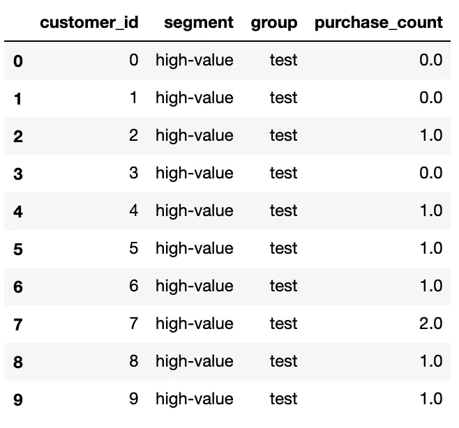****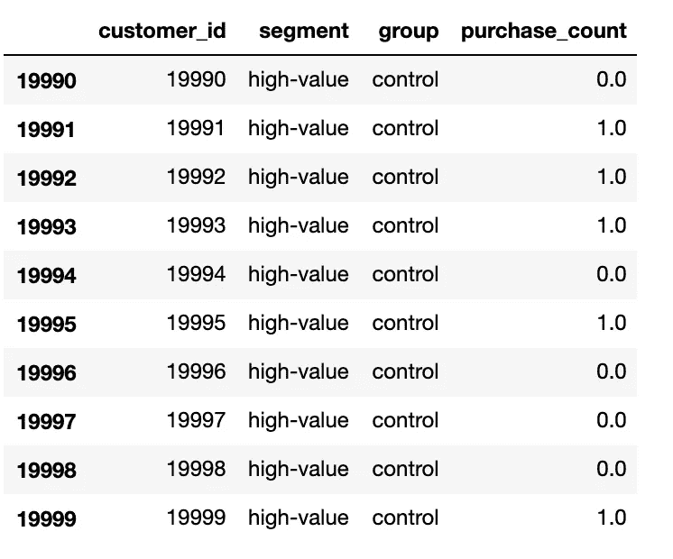**

**太棒了。我们有一切来评估我们的 A/B 测试。假设我们向 50%的高价值用户提供服务，并观察他们在给定时间内的购买行为。检查密度的最佳可视化方法是:**

**输出:**

**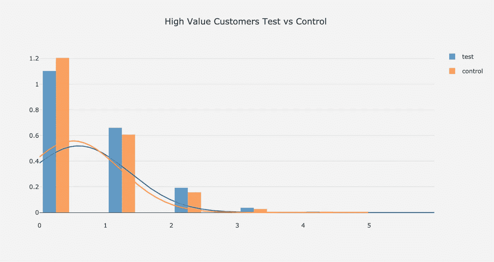**

**结果看起来很不错。测试组的购买密度从 1 开始比较好。但是我们怎么能肯定地说这个实验是成功的并且这种差异不是由于其他因素而发生的呢？**

**要回答这个问题，我们需要检查测试组的上升是否具有统计学意义。 **scipy** 库允许我们以编程方式检查这一点:**

```
from scipy import stats 
test_result = stats.ttest_ind(test_results, control_results)
print(test_result)
```

**输出:**

**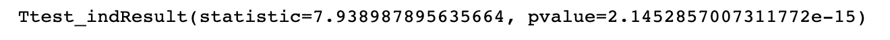**

****ttest_ind()** 方法返回两个输出:**

*   ****t-统计:**代表测试组和对照组的平均值之间的差异，单位为标准误差。更高的 t 统计值意味着更大的差异，支持我们的假设。**
*   ****p 值:**测量零假设为真的概率。**

**Ops，什么是**零假设？****

**如果零假设为真，这意味着测试组和对照组之间没有显著差异。所以 p 值越低意味着越好。作为行业标准，我们接受 **p 值< 5%** 使得结果具有统计显著性(但这取决于你的商业逻辑，也有人们用 10%甚至 1%的情况)。**

**为了了解我们的测试是否具有统计显著性，让我们构建一个函数并应用于我们的数据集:**

```
def eval_test(test_results,control_results):
    test_result = stats.ttest_ind(test_results, control_results)
    if test_result[1] < 0.05:
        print('result is significant')
    else:
        print('result is not significant')
```

**如果我们将此应用于数据集:**

**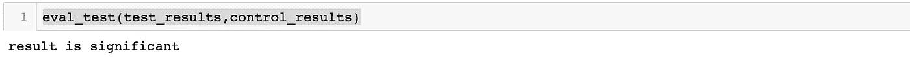**

**看起来很棒，但不幸的是，事情没那么简单。如果您选择一个有偏见的测试组，默认情况下，您的结果将具有统计学意义。举个例子，如果我们把更多的高价值顾客分配到测试组，把更多的低价值顾客分配到控制组，那么我们的实验从一开始就是失败的。这就是为什么选择小组是健康 A/B 测试的关键。**

## ****选择试验&对照组****

**选择测试和控制组最常见的方法是**随机抽样**。让我们看看如何通过编程来实现它。我们将首先从创建数据集开始。在这个版本中，它将拥有 2 万个高价值客户和 8 万个低价值客户:**

```
#create hv segment
df_hv = pd.DataFrame()
df_hv['customer_id'] = np.array([count for count in range(20000)])
df_hv['segment'] = np.array(['high-value' for _ in range(20000)])
df_hv['prev_purchase_count'] = np.random.poisson(0.9, 20000)df_lv = pd.DataFrame()
df_lv['customer_id'] = np.array([count for count in range(20000,100000)])
df_lv['segment'] = np.array(['low-value' for _ in range(80000)])
df_lv['prev_purchase_count'] = np.random.poisson(0.3, 80000)df_customers = pd.concat([df_hv,df_lv],axis=0)
```

**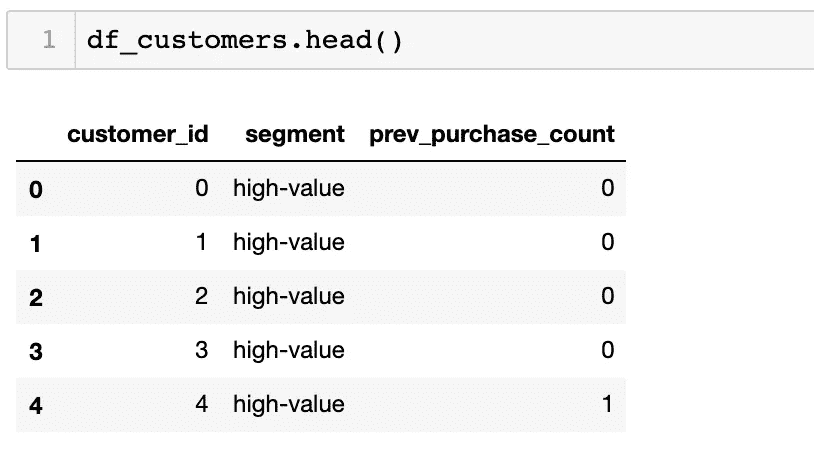****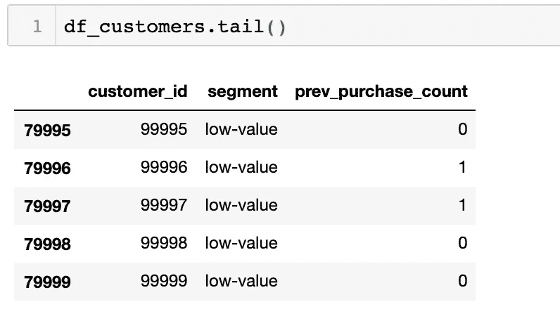**

**通过使用 pandas 的 **sample()** 函数，我们可以选择我们的测试组。假设我们有 90%的测试组和 10%的对照组:**

```
df_test = df_customers.sample(frac=0.9)
df_control = df_customers[~df_customers.customer_id.isin(df_test.customer_id)]
```

**在这个例子中，我们提取了整个组的 90%，并将其标记为*测试*。但是有一个小问题会毁了我们的实验。如果数据集中有明显不同的多个组(在本例中，高值&低值)，最好分别进行随机采样。否则，我们不能保证试验组和对照组的高值和低值的比率是相同的。**

**为了确保正确创建测试和控制组，我们需要应用以下代码:**

```
df_test_hv = df_customers[df_customers.segment == 'high-value'].sample(frac=0.9)
df_test_lv = df_customers[df_customers.segment == 'low-value'].sample(frac=0.9)df_test = pd.concat([df_test_hv,df_test_lv],axis=0)
df_control = df_customers[~df_customers.customer_id.isin(df_test.customer_id)]
```

**这使得分配对两者都是正确的:**

**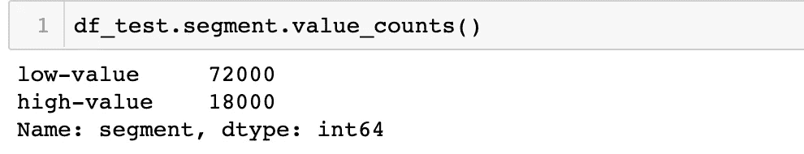****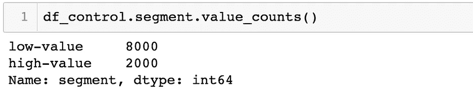**

**我们已经探讨了如何进行 **t 检验**以及选择测试组和对照组。但是如果我们像上面一样在多组上做 A/B/C 测试或者 A/B 测试呢？是时候引入方差分析测试了。**

## ****单因素方差分析****

**让我们假设我们在相同的组中测试 2 个以上的变体(例如，对低价值高价值客户的 2 个不同的报价和无报价)。然后我们需要应用单因素方差分析来评估我们的实验。让我们从创建数据集开始:**

**输出:**

**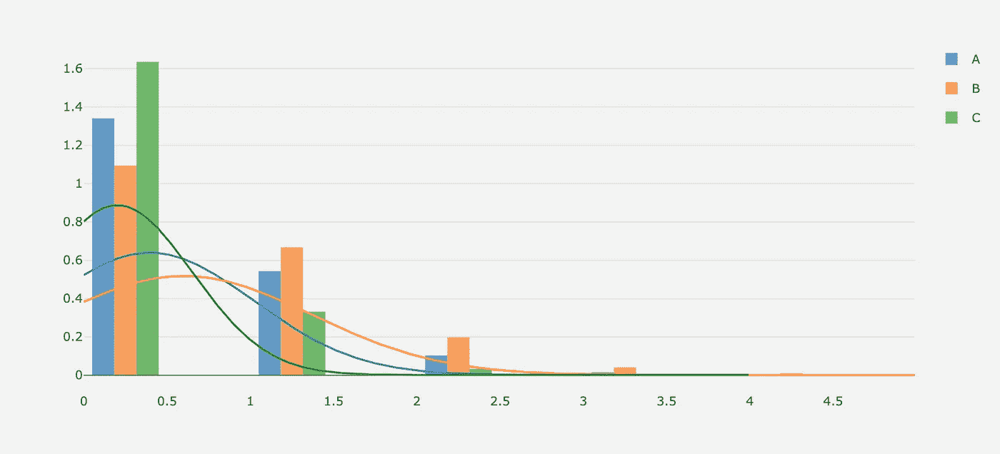**

**为了评估结果，我们将应用以下函数:**

```
def one_anova_test(a_stats,b_stats,c_stats):
    test_result = stats.f_oneway(a_stats, b_stats, c_stats)
    if test_result[1] < 0.05:
        print('result is significant')
    else:
        print('result is not significant')
```

**逻辑类似于 t_test。如果 p 值低于 5%，我们的测试变得有意义:**

**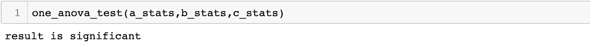**

**让我们看看如果两组之间没有差异，谁会是这个样子:**

```
df_hv.loc[df_hv.group == 'A', 'purchase_count'] = np.random.poisson(0.5, 10000)
df_hv.loc[df_hv.group == 'B', 'purchase_count'] = np.random.poisson(0.5, 10000)
df_hv.loc[df_hv.group == 'C', 'purchase_count'] = np.random.poisson(0.5, 10000)a_stats = df_hv[df_hv.group=='A'].purchase_count
b_stats = df_hv[df_hv.group=='B'].purchase_count
c_stats = df_hv[df_hv.group=='C'].purchase_counthist_data = [a_stats, b_stats, c_stats]group_labels = ['A', 'B','C']# Create distplot with curve_type set to 'normal'
fig = ff.create_distplot(hist_data, group_labels, bin_size=.5,
                         curve_type='normal',show_rug=False)fig.layout = go.Layout(
        title='Test vs Control Stats',
        plot_bgcolor  = 'rgb(243,243,243)',
        paper_bgcolor  = 'rgb(243,243,243)',
    )# Plot!
pyoff.iplot(fig)
```

**输出和测试结果:**

**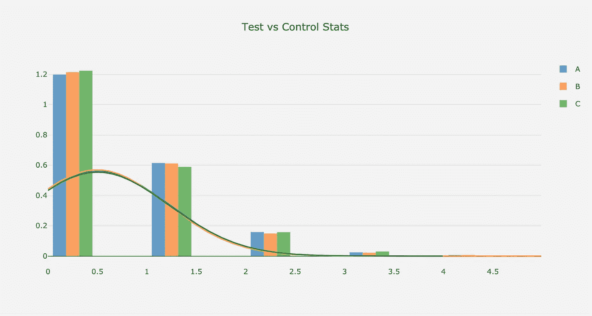****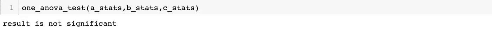**

**如果我们想知道 A 和 B 或者 C 之间是否有区别，我们可以应用我上面解释的 t_test。**

## **双向方差分析**

**假设我们正在对高价值和低价值客户进行相同的测试。在这种情况下，我们需要应用双向方差分析。我们将再次创建数据集，并构建我们的评估方法:**

**双向方差分析需要建立如下模型:**

```
import statsmodels.formula.api as smf 
from statsmodels.stats.anova import anova_lm
model = smf.ols(formula='purchase_count ~ segment + group ', data=df_customers).fit()
aov_table = anova_lm(model, typ=2)
```

**通过使用**段** & **组，**模型试图达到**购买 _ 计数。上面的 aov_table** 帮助我们了解我们的实验是否成功:**

**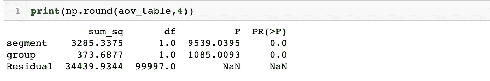**

**最后一列代表结果，向我们展示了显著的差异。如果不是，它将如下所示:**

**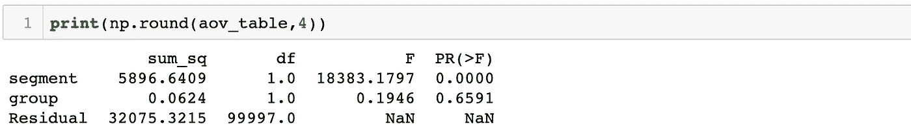**

**由此可见，**段**(高价值或低价值)显著影响采购数量，但**组**不影响，因为它几乎是 66%，远高于 5%。**

**现在我们知道如何选择我们的小组并评估结果。但是还有一个缺失的部分。为了达到统计显著性，我们的样本量应该足够了。让我们看看如何计算它。**

## **样本量计算**

**为了计算所需的样本量，首先我们需要理解两个概念:**

*   ****效应大小**:代表试验组和对照组平均值之间的差异大小。它是测试组和对照组之间平均值的方差除以对照组的标准偏差。**
*   ****功效:**这是指在你的测试中找到一个统计意义的概率。为了计算样本大小，0.8 是常用的值。**

**让我们构建数据集，并在一个示例中查看样本大小的计算:**

```
from statsmodels.stats import power
ss_analysis = power.TTestIndPower()#create hv segment
df_hv = pd.DataFrame()
df_hv['customer_id'] = np.array([count for count in range(20000)])
df_hv['segment'] = np.array(['high-value' for _ in range(20000)])
df_hv['prev_purchase_count'] = np.random.poisson(0.7, 20000)purchase_mean = df_hv.prev_purchase_count.mean()
purchase_std = df_hv.prev_purchase_count.std()
```

**在本例中，购买的平均值(purchase_mean)为 0.7，标准差(purchase_std)为 0.84。**

**假设我们想在这个实验中将 purchase_mean 增加到 0.75。我们可以如下计算效果大小:**

```
effect_size = (0.75 - purchase_mean)/purchase_std
```

**之后，样本量的计算就相当简单了:**

```
alpha = 0.05
power = 0.8
ratio = 1ss_result = ss_analysis.solve_power(effect_size=effect_size, power=power,alpha=alpha, ratio=ratio , nobs1=None) 
print(ss_result)
```

**α是统计显著性的阈值(5%)，我们的测试和控制样本大小的比率是 1(相等)。因此，我们需要的样本大小是(ss_result 的输出) **4868。****

**让我们构建一个函数，在任何我们想要的地方使用它:**

```
def calculate_sample_size(c_data, column_name, target,ratio):
    value_mean = c_data[column_name].mean()
    value_std = c_data[column_name].std()

    value_target = value_mean * target

    effect_size = (value_target - value_mean)/value_std

    power = 0.8
    alpha = 0.05
    ss_result = ss_analysis.solve_power(effect_size=effect_size, power=power,alpha=alpha, ratio=ratio , nobs1=None) 
    print(int(ss_result))
```

**对于这个函数，我们需要提供我们的数据集、表示值的 column_name(在我们的例子中是 purchase_count)、我们的目标平均值(在前面的例子中 0.75 是我们的目标)和比率。**

**在上面的数据集中，假设我们希望将购买计数平均值提高 5%，并且我们将保持两组的规模相同:**

```
calculate_sample_size(df_hv, 'prev_purchase_count', 1.05,1)
```

**那么结果就变成了 **8961。****

**你可以在这里找到这篇文章[的 Jupyter 笔记本。](https://gist.github.com/karamanbk/b90315dfee3625e84a6cf10c70592d68)**

**这是**数据驱动增长**系列的结束。希望你喜欢这些文章，并开始应用这里的实践。这些将被转换成电子书，并由一个全面的视频系列支持。敬请期待！**

**黑客快乐！**

**需要帮助来发展你的公司吗？点击这里与我一起预订免费课程[。](https://app.growthmentor.com/mentors/baris-karaman)**