# 时间序列分析基础指南

> 原文：<https://towardsdatascience.com/a-basic-guide-into-time-series-analysis-2ad1979c7438?source=collection_archive---------7----------------------->

## **利用时间序列分析 2014 年至 2017 年英国的日常事故**

## 介绍

线性回归是数据科学家非常常用的模型。一个结果或目标变量由一组特征来解释。有一种情况是，随着时间的推移收集相同的变量，我们使用了一系列定期测量该变量的方法。欢迎来到时间系列。与标准线性回归的一个区别是数据不一定是独立的，也不一定是同分布的。处理时间序列可能会令人沮丧，因为这意味着您必须找到任何先前值预测的滞后或误差与其本身之间的相关性。此外，顺序很重要，改变顺序会改变数据的含义。由于时间序列的复杂性，数据科学家在进行时间序列分析时有时会迷失方向。在这篇博客中，我将分享一个完整的时间序列分析，由一个著名的数据科学方法指导:OSEMIN。

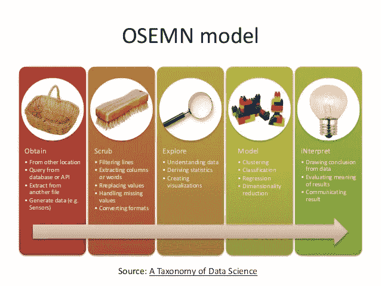

## 使用的上下文和数据

上面的图片展示了我在研究中从收集数据到得出结论的方法。

本次分析使用的数据包含了从 2014 年 1 月 1 日到 2017 年 12 月 31 日，英国每天发生的 1461 起事故的日期和数量。我在这个练习中使用了来自 Kaggle 的数据集。我下载了一个 CSV 文件，并使用一个流行的 python 代码‘PD . read _ CSV’将其存储到一个数据帧中。在这个分析中没有考虑其他独立变量，因为我关注的是时间序列。

本研究的主要目的是解释完整数据科学项目的不同步骤。其他目标是找出一天中的事故数量是否取决于任何给定一天中的事故数量。

这项研究试图回答的 3 个问题是:

1.  当天和前一天的事故数量之间有什么关系？
2.  有没有什么模式可以帮助预测(或预防)英国某一天的事故数量？
3.  一年中的哪一个月或一周中的哪一天与当月的事故数量有关吗？

## 处理数据

数据相对干净，随时可以使用。然而，出于分析目的，我必须做一些转换。

首先，我将包含日期的列更改为数据框的索引。在 Python 中处理时间序列数据时，务必确保日期被用作索引值，并被 Python 理解为真正的“日期”对象。

第二，检查任何丢失的数据是很重要的，因为它会极大地改变数据集。数据中未发现缺失值。

最后，为了执行相关的 EDA，我向我的数据中添加了三(3)列:一列分别用于月、日和工作日名称。这应该有助于我理解基于一年中的月份、一周中的日期的趋势。此外，我可以根据这些新功能对数据进行分组，以便更好地了解我的数据。

下面是我的数据经过处理和添加 3 列后的样子。

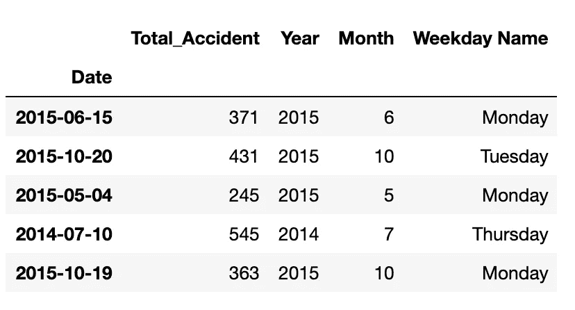

A sample of my data generated using: **data_cleaned_df.sample(5, random_state=0)**

## 探索我的数据

数据科学项目中最重要的步骤之一是 EDA。**探索性数据**分析( **EDA** )是一种分析**数据集**以总结其主要特征的方法，通常采用可视化方法。可以使用或不使用统计模型，但主要是为了查看**数据**在正式建模或假设检验任务之外能告诉我们什么。EDA 让我很好地理解了我的数据。

*快速展示我的数据:*

每天的事故数量从 2014 年的 400 起/天减少到 2017 年的 356 起。2017 年，每日事故达到 322 起的低点。与日均相比，标准偏差约为每天 17 起事故。(不到平均值的 5%)。

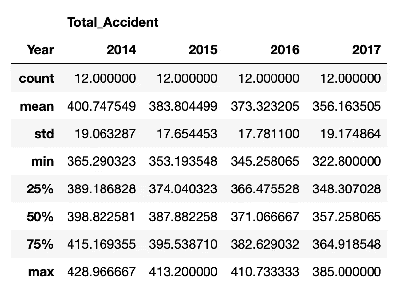

Descriptive statistics of the series provided by “df.describe”

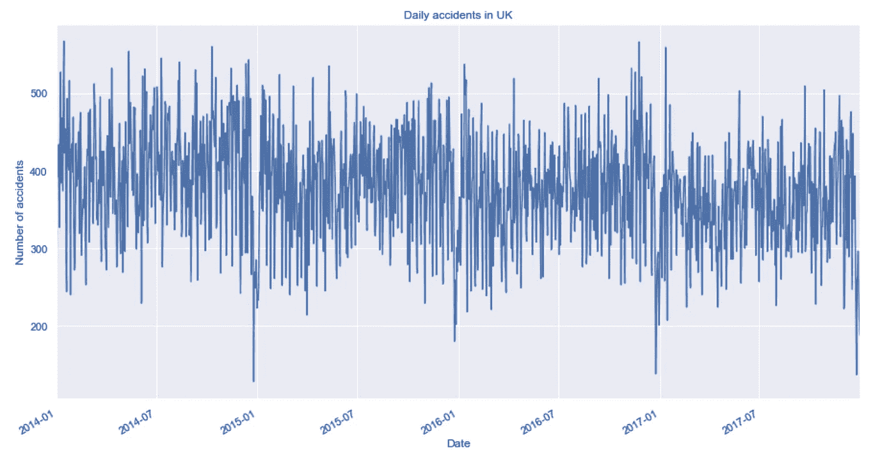

将数据绘制成直线可以显示任何现有趋势，而散点图是发现任何异常值的好方法。我们可以观察到，任何一天发生超过 475 起事故或者少于 200 起事故都是相当不正常的。然而，对于我的分析，我没有删除任何这些数字。此外，当数据在区间内有异常值时，箱线图是另一个很好的图形。

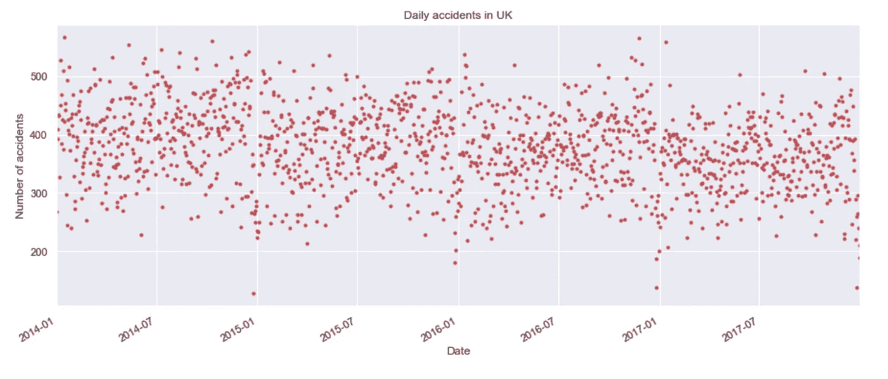

另外一些有趣的评论:如下图所示，事故数量在 12 月份一直在下降。当开始 EDA 时，我预计这个数字会因年终聚会而上升。然而，这可能是由于人们旅行或呆在家里花更多的时间与家人和朋友在一起。周日人数减少符合第二个假设。

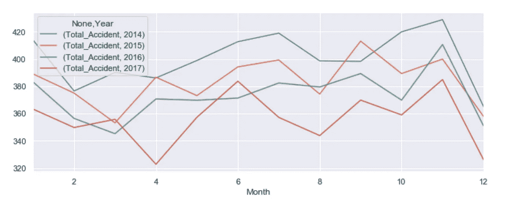

Daily accidents per year.

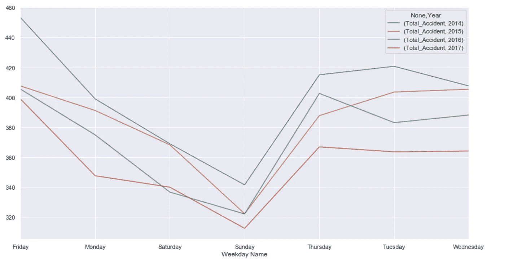

Daily accident per day of the week — don’t focus on the order of the days ;)

最后，用数据集构建直方图让我了解了数据的分布情况。很明显，事故的数量接近一个略微倾斜的正态分布。

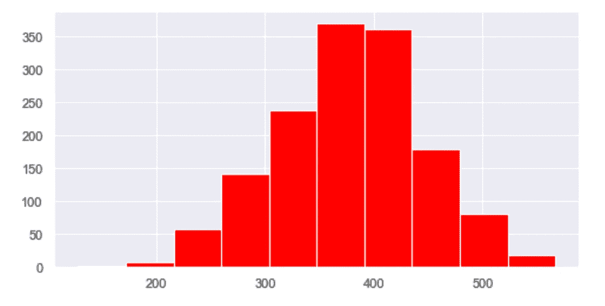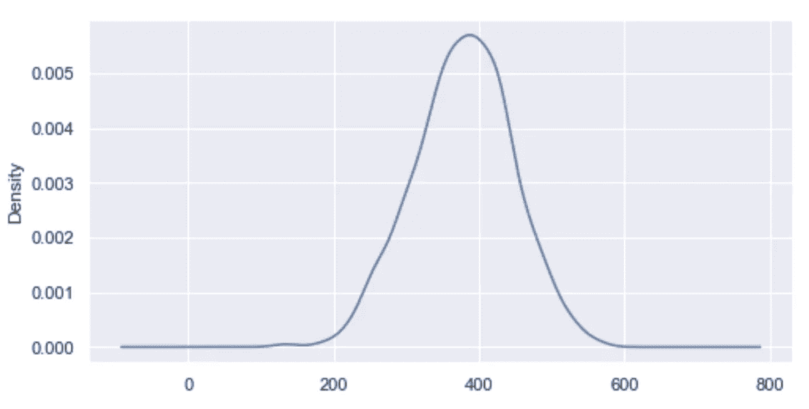

# 模型

在任何建模之前，我需要检查时间序列是否是平稳的。如果一个时间序列的统计特性(如均值、方差)在一段时间内保持不变，则称该时间序列是平稳的。由于大多数时间序列模型都假设**时间序列是稳定的，**验证该假设非常重要。对于一般的时间序列数据集，如果它在一段时间内表现出特定的行为，那么它在未来很有可能会遵循类似的行为。因此，很难找到正确的模型或进行任何预测。我将用任何趋势情况下的滚动平均值和滚动标准差来绘制数据。另外，我会进行迪基·富勒测试。

迪基富勒测试是一个测试平稳性的统计测试。检验的零假设是时间序列不是平稳的。因此，如果检验统计量小于临界值，我们拒绝零假设，并说序列是平稳的。

在进行了 Dickey Fuller 测试后，在 95%的置信水平下，我们拒绝了零假设。如下图所示，该系列是稳定的。

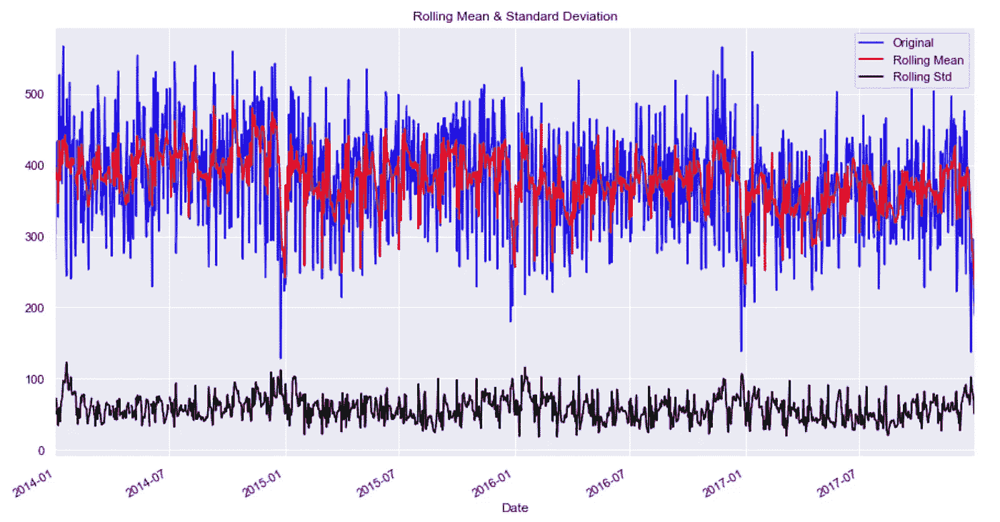

The data looks stationary. Also the Dickey Fuller test returns a p-value <0.05

在确认了序列的平稳性之后，我可以继续研究这个模型。我确保将我的数据分成训练集和测试集。测试集不用于建模过程，而是用于评估所选模型对未知数据的性能。

为了选择相关的时间序列模型，我构建了 ACF 和 PACF 来分别确定 ARIMA 的 q 值和 p 值。

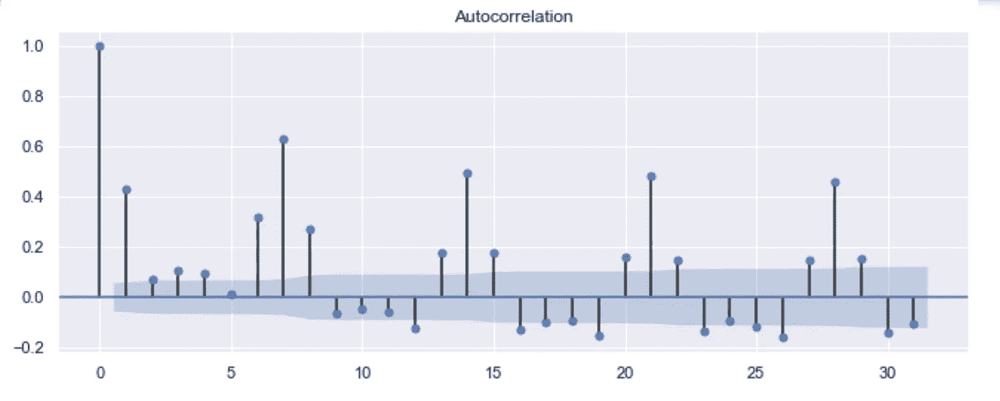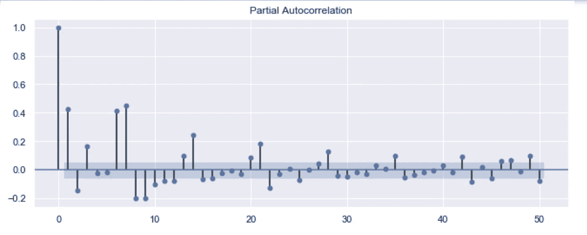

经过不同的迭代，我选择了一个 ARMA (2，3)来表示数据。对于每一步，每当我得到没有意义的系数时，我不得不转移到另一个模型。

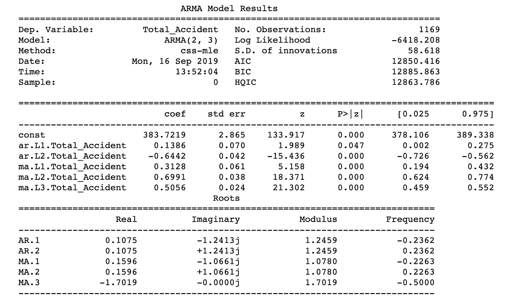

Based on this result, the number of accident would be explained by the number during two days prior and a moving average part (lag 3)

虽然这个模型的残差接近正态分布，但是 ARMA 发现在预测未知数据时失败了。记得我把我的数据分开并保留了一个测试集。通过将测试传递给模型，预测是可怕的。减少测试数据中的观察数量并没有提高预测的质量。我的结论是 ARMA 并不是代表数据的最佳方法。逻辑对吗？其他因素也会影响一天中的事故数量，如车辆类型、地区、司机年龄等。

## 结论和考虑

尽管我们没有得到一个“完美的模型”——无论如何对数据科学家来说都不是理想的——但一些问题通过 EDA 得到了回答。我们看到了一周中的日子与事故数量之间的关系，以及一年中的月份如何影响这些数字。这就是为什么在一个数据科学项目中，这一步不能被忽略。

在对我们的数据建模时，我们发现一天的事故值与前一天的事故数之间存在相关性。当然，如果你整合一些外生变量，我们的模型会表现得更好。那些应该使用领域知识和彻底的文献回顾来发现。ARIMAX 或 SARIMAX 更适合我们的活动。在这个过程中不断后退一两步可能会令人沮丧，但我确实相信这是数据科学的魅力之一，因为每一步都会带来更多的答案和更多的数字叙述。

任何想法，请给我留言，我们可以讨论。

我的代码、模型和使用的数据都在我的 GitHub 上。请使用下面的链接:

 [## FabriceMesidor/time series _ accident _ UK

### 一个简单的时间序列回归，以了解不同的步骤建模线性回归是一个非常常见的模型…

github.com](https://github.com/FabriceMesidor/TimeSeries_accident_UK)