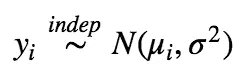

# 一种贝叶斯方法，用于估计内容和工作日对脸书页面上发布的帖子的影响

> 原文：<https://towardsdatascience.com/a-bayesian-approach-to-estimate-the-effect-of-a-content-and-a-weekday-on-the-post-published-on-a-7d31873d3c08?source=collection_archive---------27----------------------->

*   我假设读者有贝叶斯统计的知识
*   这里的样本代码是[这里的](https://github.com/kgulzina/statfam_codes/tree/master/bayesian_post)

如今，社交媒体已经成为一个互动平台，客户可以在这里交流想法并留下对产品的评论。根据市场统计数据，[18-34 岁的成年人最有可能使用社交媒体关注他们最喜爱的品牌(95%)](https://www.dreamgrow.com/21-social-media-arketing-statistics/) 。因此，这些成年人成为潜在客户和行业巨头的良好目标。几乎每个受欢迎的品牌都“理所当然”地使用这个工具，因为它:

对该品牌关于产品的新帖子印象深刻，该页面的追随者往往会通过“喜欢”来与该帖子“互动”，留下评论并与他们的联系人分享该帖子。交互的总数可以作为后影响的良好指标。可能会有巨大的影响，也可能完全没有影响。此外，影响的程度可能取决于其他因素，如帖子发布的工作日、其内容等。**我们的目标是帮助企业主对脸书广告做出更明智的决策，方法是确定某个内容或某个工作日对该帖子的总互动次数是否有影响。**为此，我们开发了**分层条件自回归(CAR)模型，该模型考虑了时间相关性**

我们使用的[数据集](http://www.math-evry.cnrs.fr/_media/members/aguilloux/enseignements/m1mint/moro2016.pdf)与某知名化妆品品牌 2014 年在脸书的页面上发布的帖子相关。


在分析中，我们选择“总互动”作为主要响应变量，定义如下:

```
(1)	Total interactions = (# of likes + # of comments + # of shares)
```

为了模拟后期影响，我们选择了分类变量“类型”和“后期工作日”。在这里，“类型”将文章分为链接、照片、状态和视频。所有这些指标在发布之前都是已知的。“Post weekday”表示帖子是在一周的哪一天发布的。

首先，描述性分析显示，平均而言，脸书用户与视频帖子互动最多，而链接被点击最少。如直方图所示,“总相互作用”的分布高度向右倾斜。


由于模型期望正态分布的数据，我们对响应变量进行了对数转换(通过添加一个小常数)以获得正态分布的数据。


对于对数转换的“总相互作用”的未来参考，使用以下:

```
(2)	y = log(Total Interactions)
```

帖子的影响力可以通过帖子发布当天的总互动次数、内容和星期几来衡量。因为变量“工作日”是邻域相关的，所以假设它对 **y** 具有空间随机影响。假设另一个分类变量“类型”对 **y** 有固定的影响。因此，我们在最终模型中加入汽车模型和线性趋势项。对于所有“类型”和“工作日”的组合，我们将计算一个给定组合的边际均值是否高于其他组合的后验概率:


对于 j = {1，2，…，n}/{i}，其中 n =“类型”和“工作日”组合的数量。此外，固定和随机效应参数的后验分布将帮助我们回答问题陈述问题。

# 模型

对于感兴趣的模型，让 **y_** i 为第 *i* 个帖子的值。设 *i* ，范围从 1 到 500，是某一天发表的具有特定内容的帖子。我们假设 **y_** i 是独立分布的。然后，对于给定的帖子， *i* = {1，2，3，…}:



其中平均值定义为:


其中天数的影响定义为:


此外，您可以看到我们如何在模型之前定义:


我们来分析一下。首先，作为标准差的扩散先验， **𝜎** ，我们选择了[半柯西先验](https://en.wikipedia.org/wiki/Cauchy_distribution)与正支持。第二，我们在所有固定效果参数**𝛽**=【𝛽1，𝛽2，𝛽3，𝛽4].】上选择了一致的先验 **𝛽** 的统一先验充分覆盖了线性趋势项的可能值，包括负趋势和正趋势。最后，假设汽车模型的参数 **𝜌** 具有均匀分布，受以下特征值的约束


我们使用 **Stan 和 R package“rstan”**从参数的后验分布中生成样本。采用了 4 链 MCMC，总共进行了 10000 次迭代和 5000 次老化迭代*(我们将在下一篇文章中讨论 MCMC)*。我们最终为 **𝜌** 、 **𝛽** 、 **𝛿** 和 **𝜎** 参数生成了 20000 个 MCMC 样本。下面给出了分裂链上潜在规模缩减系数。请注意，所有参数的 Rhat = 1，意味着 MCMC 正常收敛。


# 结果

在上表中，您还可以看到每个参数的后验中位数和 95%可信区间。此外，下面你可以找到 **𝛽** 、 **𝛿** 、 **𝜌** 、 **𝜎** 参数的后验分布。


利用 **𝛽** 和 **𝛿** 参数的所得后验概率，以及 **𝜇_𝑖** 的方程，我们计算了 **𝜇_𝑖** 的后验概率。之后，我们确定了每个 **𝜇_𝑖** 的边缘后中值和 95%可信区间。


我们的目标是确定帖子的内容或发布日期对帖子收集的总交互次数是否有影响。为了回答提出的问题，我们找到了后验概率，即对于给定的`type + weekday`，其边际均值是否高于其他均值(见上表)。`video + thursday`组合的后边缘均值最高，为 0.9529。这意味着如果一个帖子是周四发布的视频，那么它的影响力会更大。𝛿_𝑇ℎ𝑢**的后验值**比其他日子的值大，而 **𝛿_𝑆𝑢𝑛** 的后验值小。𝛿的可信区间很紧，在零附近，周四之后略微向左移动。


下图显示，平均而言，视频的总互动次数更高。状态和照片帖子收集几乎相似的互动。正如所料，链接帖子的总交互次数最少。


这种分析可以通过在模型中包括“类型”和“工作日”交互来进一步扩展。

*最初发布于*[*kgulzina . github . io*](https://kgulzina.github.io/A-Bayesian-approach-to-estimate-the-effect-of-a-content-and-a-weekday-on-the-post-published-on-a-Facebook-page/)*。*