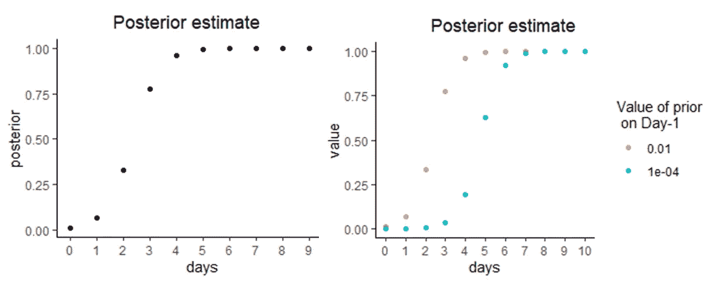
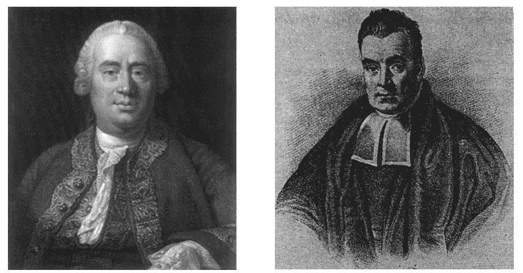

# 寻找上帝的贝叶斯探索

> 原文：<https://towardsdatascience.com/a-bayesian-quest-to-find-god-b30934972473?source=collection_archive---------5----------------------->

## 贝叶斯定理和所有问题中最基本问题的概率答案:“上帝存在吗？”

*The Creation of Adam* (*Creazione di Adamo*) —Michelangelo. Source: Wikipedia

**本文关注的不是公式和数字，而是一个有趣的故事，在这个故事中，贝叶斯定理在哲学、认识论和宗教中最具争议的讨论中确立了自己的地位。**

我们数据科学家和统计学家喜欢贝叶斯定理。

一个看似简单的想法:我们通过用新获得的信息更新我们的初始信念来获得更新和改进的信念，贝叶斯定理被吹捧为产生知识的最有力的方法之一。

Sheldon explaining how he is estimating his life expectancy, using Bayes’s theorem. Source: Scientific America

艾伦·图灵用贝叶斯破解了英格玛——德国海军的秘密代码。我们使用贝叶斯程序将垃圾邮件扔进垃圾箱(“朴素贝叶斯，有人知道吗？”)，评估我们的医疗记录，发现基因是如何控制和调节的，协助海岸警卫队和国土安全等。[1]它太受欢迎了，甚至在大爆炸定理上客串了一把。

有了如此丰富的实际应用，毫不奇怪，哲学家和神学家发现贝叶斯定理是一个新的框架，为一个古老而又不断引发争议的问题建立了新的理论基础:

> 我们能根据我们周围世界的证据对上帝做出理性的结论吗？

# **1。贝叶斯定理——概述:**

贝叶斯定理非常简单。它与条件概率有关，也就是说，某个理论或假设对某个已经发生的事件为真的概率。

这个想法体现在一个著名的等式中:

我不想浪费你的时间在这些方程式上。事实上，我已经写了大量关于贝叶斯定理以及如何用贝叶斯方法进行推理的文章。您可以在以下网址查看:

*   [贝叶斯统计如何说服我去健身房](/how-bayesian-statistics-convinced-me-to-hit-the-gym-fa737b0a7ac)

我接下来想做的是给出一个激励人心的例子来展示这个优雅公式的巨大预测洞察力。

## ***亚当(可能)是第一个使用贝叶斯定理的人***

想象一下，有人来到我们美丽的世界(亚当或者他来自柏拉图的洞穴)，第一次看到太阳升起。起初，他会认为这种现象是一种反常现象。然而，每一天他幸存下来并观察美丽的日出，他的信心增加，这是大自然的永久特征。这种推理的心理过程——通常被称为**归纳**——是如何发生的？

有两个令人感兴趣的事件:

*   太阳每天升起(X)
*   今天太阳升起了

亚当关心的是*太阳每天升起的条件概率*，给定今天太阳升起的观测值 P(X|Y)。现在，让我们指定一些数字来说明计算:

How Adam arrived at the conditional probability after the first sunrise

比方说，在第一次看到日出之前，亚当不相信，他认为太阳每天都升起***【X】***的概率只有 1%。当他看到日出时，他没有被说服，所以他分配了一个合理的机会，即今天的日出纯粹是巧合(即， ***P(Y|NX) = 1/7*** ，因为一周有 7 天，但它实际上可能是 1/30、1/365 或 1/10 ⁰).如果亚当知道并使用贝叶斯定理来计算这些数字，他分配给初始假设的概率会从 1%增加到 6.6%。

贝叶斯定理的巧妙之处在于，随着更多证据的出现，我们可以多次更新我们的概率估计。当亚当每天醒来，惊叹于壮丽的日出时，他不断更新他的*先验知识*，重新运行贝叶斯公式，并得到他的假设的条件概率的更新估计:

How Adam arrived at the conditional probability after the **second** sunrise

在观察第二次日出时，亚当变得更加确信他的假设，将他的条件概率从 6.6%增加到 33.1%。这一过程一次又一次地重复，尽管从数学上讲永远不会达到 100%,但后来从字面上讲，太阳只是偶然升起也是不可能的。

Left: the posterior conditional probability of the statement “The sun rises everyday” as Adam updates his belief daily. Right: Comparison between two different initial priors (1% vs 0.01%)

用一些简单的 R 代码，我重复了上面的计算，并说明了亚当如何更新他的信念。你可以在这里找到源代码[。他只需要短短 4 天就能在每天出现的日出中确信超过 99%。即使亚当更加怀疑(因为他应该反对蛇或撒旦 T.T ),并指定最初的信念只有 0.01%，仍然只需要 7 天就可以说服他。](https://github.com/tuangauss/Various-projects/blob/master/R/bayes_god.R)

# 2.贝叶斯定理和奇迹之神；

在这一节中，我将简化讨论(也就是彻头彻尾的欺骗):我们将专注于一个狭窄但同样有趣的话题，而不是检查上帝存在的概率性论点: ***我们能相信奇迹吗？***

我决定这样做有三个原因:

*   奇迹的合理性，通常被定义为“违反自然法则”，一直是哲学争论的热门话题。
*   从神学和哲学上来说，已经有很多关于奇迹的存在和神本身之间的直接联系的争论，所以我们离那不远了。
*   一旦你明白了这个原理，就相对容易地重复同样的关于上帝存在的论点。

> 根据人们的证词，我们能相信奇迹的存在吗？

对于著名的苏格兰哲学家大卫·休谟来说，答案是响亮的“不”:

> 没有证词足以建立一个奇迹，除非证词是这样一种，它的谎言会比事实更神奇，它努力建立[2]

这很令人困惑。我们可以尝试用许多方法来解读它，但最有趣(也是最流行)的解释之一是贝叶斯理论。

让我们建立一些事件的定义:一个特殊的奇迹发生(M)和这样的奇迹见证记录(T)。我们可以使用相同的贝叶斯框架来构建给定一些证据的情况下，奇迹 ***真的*** 发生的条件概率。

为了阅读休谟，我们需要作出简化的近似，即 ***P(T|M)≈ P(∼M)*** ，因为两项都接近 1。这将允许我们简单地表述为:

稍加代数学，我们很容易看出 ***P(M|T) > 0.5*** 当且仅当***P(M)>P(T | ~ M)***。这正是休谟所说的*“虚假[****【P(T | ~ M)****]比它试图建立的事实[****【P(M)****]更不可思议[小于]。”*

这是基于休谟回应耶稣复活的证词的论点:

> 当任何人告诉我，他看到一个死人恢复了生命，我立即考虑自己，是否更有可能，这个人应该欺骗或被欺骗，或者他所涉及的事实，应该真的发生了。我权衡一个奇迹和另一个；根据我发现的优势，我宣布我的决定，总是拒绝更大的奇迹。[2]

他持怀疑态度的依据是复活的概率***P(M =复活)*** 明显小于假见证的概率 ***P(见证|不复活)*** ，这就使得 ***P(复活|见证)< 0.5*** 。更一般地说，几乎不可能找到***【P(M)>【P(T | ~ M)】***的案例，所以我们永远无法可靠地将一个见证与一个原因——一个实际的奇迹——联系起来。

Left: David Hume. Right: Thomas Bayes — although many argues that it is not his portrait. Source: Wikipedia

我希望你能看到休谟论点的令人不安的本质。休谟认为，仅仅基于传统信仰、共存或证词，我们永远无法确定任何事情。在几篇震惊 1700 年欧洲知识界的文章中，休谟将这一观点发展得更远，他抨击了关于上帝存在的最古老的论点之一，即目的论论点。也就是说，*一个智慧的创造者被自然界中被感知的故意设计所证明，上帝是万物的第一因。通过证明我们的归纳很少是可靠的，并彻底批判因果概念，休谟破坏了基督教信仰的核心原则。*

# 3.休谟遗漏了什么:

这种解释的问题是，它没有认识到当我们听到奇迹的见证时，人类考虑的许多其他因素:

*   有多少独立的证词？根据约翰福音，至少有三个关于空坟墓的见证(抹大拉的马利亚、西门彼得和“耶稣所爱的另一个门徒”)
*   更大的问题是:我们需要多少不同的奇迹，才能确立上帝存在的条件概率？

让我们考虑多个独立证词的情况。**考虑这个问题的一个好方法是对每个新来的人使用贝叶斯更新并作证**。因此，*我们得出了一个与上一部分中的日出示例非常相似的结果——其中条件概率收敛到 1。*

在这里，让我们以稍微不同的方式处理这个问题，并尝试利用独立性假设来简化数学。假设对于一个特定的奇迹 M，一个人 *i* 将给出一个证词**T**I*，*我们为这个奇迹给出了 *n* 个证词建立了条件概率:

现在，假设这些证词是独立的(这是一个巨大的假设，我们知道在约翰的故事中这不是真的),并且有可能是真实的 ***p*** 或 ***P(T|M) = p*** 以及有可能是假的 **q** 或 ***P(T|~M) = q*** ，我们可以将这些术语简化如下:

这允许我们将条件概率简化为:

通常，我们会假设 ***q < p*** (即，当人们看到奇迹时，他们更有可能作证，而不是当他们没有看到奇迹时假装作证)，这意味着当 ***n — > 0，(q/p)^n — > 0*** 时，条件概率接近 1。

另一个很酷的事实是，即使***【P(M)***可以很小，你总能找到 ***n*** 使得条件概率 ***> 0.5***

关键是，无论你使用贝叶斯更新还是利用独立性假设，休谟的(已经有问题的)论点，即没有一个单独的证词是可靠的，并不排除合并证词是如此。

到目前为止，我所介绍的是用于对神学问题进行概率论证的基本结构。事实上，理查·斯温伯恩确实输入了一个数字，得出了一个令人欢呼的 97%的复活概率。我们可以很容易地把这个框架扩展到包括上帝的存在。例如，其中“ **G** ”代表“上帝存在”(其中“上帝”被经典地认为是创造了宇宙的最大力量、知识和善良的永恒存在)，我们可以假设***p(m|g)≫p(m |∞g)***和***p(m |∞g)= 0***或***p(m |∞g)***

这种概率论证的问题是，即使数学完全说服了你，根据假设和设置，你也可以得出完全相反的结论。

然而，这篇文章旨在欣赏贝叶斯系统是如何错综复杂的美丽。怀疑论者大卫·休谟认为，从过去的经验中得出任何因果推论都是徒劳的，因为我们需要将过去外推至未来，而这是我们无法确定的。另一方面，贝叶斯——他认为理性在本质上是概率性的——会告诉休谟，如果一个人太温顺而不能理解自然，就不要责备自然；如果你走出怀疑的外壳，大胆地对它的行为做一些预测，也许你会离真相更近一点。

你可以在这里找到示例[的源代码。](https://github.com/tuangauss/Various-projects/blob/master/R/bayes_god.R)

[1]麦克格雷因，莎伦·伯奇。不会消亡的理论:贝氏法则如何破解英格玛密码，追捕俄罗斯潜艇，并从两个世纪的争议中脱颖而出。耶鲁大学出版社，2011 年

[2]休谟，*一个关于人类理解的询问* X，I，86

[3]史文朋，理查德，*上帝化身的复活*，牛津大学出版社，2003