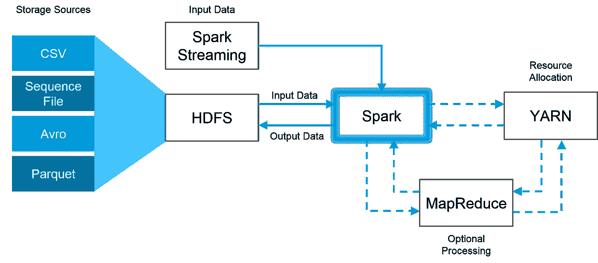
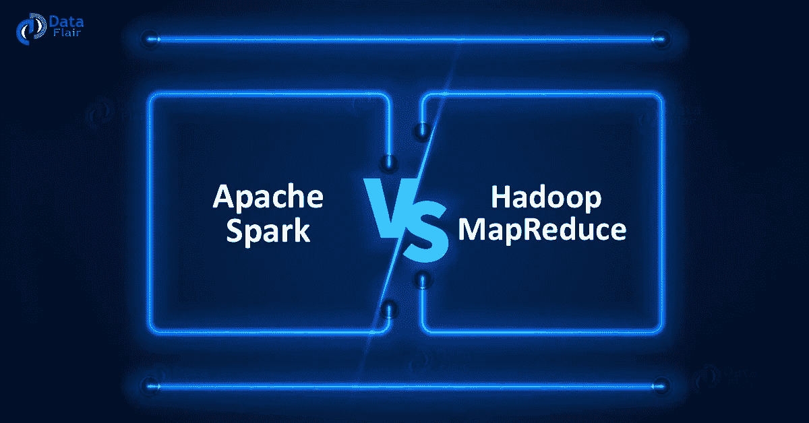
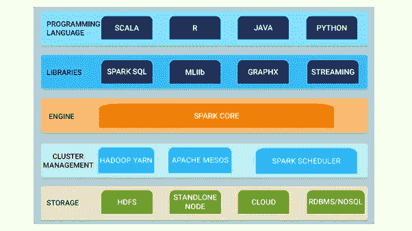

# Apache Spark 初学者指南

> 原文：<https://towardsdatascience.com/a-beginners-guide-to-apache-spark-ff301cb4cd92?source=collection_archive---------4----------------------->

Apache Spark 与 Hadoop MapReduce——优势、劣势以及何时使用

## 什么是阿帕奇火花？

由 Spark 的创造者创建的公司 Databricks 在他们的***Apache Spark 电子书*** ( *强烈推荐阅读本文末尾提供的 PDF 下载链接*)中最好地总结了它的功能:

> “Apache Spark 是一个统一的计算引擎和一组用于在计算机集群上进行并行数据处理的库。截至本文撰写之时，Spark 是针对该任务开发的最活跃的开源引擎；**让它成为任何对大数据感兴趣的开发人员或数据科学家的事实上的工具**。Spark 支持多种广泛使用的编程语言(Python、Java、Scala 和 R)，包括用于各种任务的库，从 SQL 到流和机器学习，并且可以在任何地方运行，从笔记本电脑到数千个服务器的集群。**这使得该系统易于启动，并可扩展至难以置信的大规模大数据处理**。”

## 什么是大数据？

让我们看看 Gartner 广泛使用的大数据定义，这样我们就可以理解 Spark 如何选择解决与大规模实时处理大数据相关的诸多挑战:

> “大数据是高容量、高速度和/或高多样性的信息资产，需要经济高效、创新的信息处理形式来增强洞察力、决策制定和流程自动化。”

The Complex World of Big Data

> **注意:**这里的关键要点是，大数据中的“大”不仅仅是指容量。你不仅会得到大量数据，而且这些数据还会以复杂的格式从各种来源实时、快速地向你袭来。因此，大数据有三个 v-**容量、速度和多样性。**

## 为什么大多数大数据分析公司在听说 spark 的所有有用功能时都会“眼前一亮”？

根据我的初步研究，似乎有三个主要因素使 Apache Spark 成为大规模高效处理大数据的领导者，这促使许多处理大量非结构化数据的大公司在其堆栈中采用 Apache Spark。

1.  **Spark 是处理大数据的统一一站式商店**—“Spark 旨在支持广泛的数据分析任务，从简单的数据加载和 SQL 查询到机器学习和流计算，通过相同的计算引擎和一致的 API 集。这一目标背后的主要观点是，现实世界的数据分析任务——无论是 Jupyter 笔记本等工具中的交互式分析，还是生产应用程序的传统软件开发——往往会结合许多不同的处理类型和库。Spark 的统一性质使得这些任务编写起来更加容易和高效”( *Databricks 电子书*)。例如，如果您使用 SQL 查询加载数据，然后使用 Spark 的 ML 库对机器学习模型进行评估，引擎可以将这些步骤合并为对数据的一次扫描。此外，**数据科学家** **在建模时可以从一组统一的库(例如 Python 或 R)中受益**，而 **Web 开发人员可以从 Node.js 或 Django 等统一框架中受益**。
2.  **Spark 优化了其核心引擎的计算效率**——“我们的意思是 Spark 只处理从存储系统加载数据并在其上执行计算，而不是永久存储本身。Spark 可以用于各种各样的持久存储系统，包括云存储系统，如 Azure Storage 和亚马逊 S3，分布式文件系统，如 Apache Hadoop，键值存储，如 Apache Cassandra，以及消息总线，如 Apache Kafka。然而，Spark 本身既不长期存储数据，也不支持其中任何一种。这里的主要动机是大多数数据已经驻留在混合存储系统中。移动数据的成本很高，因此 Spark 专注于对数据进行计算，无论数据位于何处”( *Databricks 电子书*)。Spark 对计算的专注使其不同于早期的大数据软件平台，如 Apache Hadoop。Hadoop 包括一个存储系统(Hadoop 文件系统，设计用于 Spark 4 商用服务器集群上的低成本存储)和一个计算系统(MapReduce)，它们紧密集成在一起。然而，这种选择使得很难在没有其他系统的情况下运行一个系统，或者更重要的是，很难编写访问存储在其他地方的数据的应用程序。虽然 Spark 在 Hadoop 存储上运行良好，但它现在也广泛用于 Hadoop 架构没有意义的环境，如公共云(存储可以与计算分开购买)或流媒体应用。
3.  Spark 的库为它提供了非常广泛的功能 —如今，Spark 的标准库是开源项目的主体。自首次发布以来，Spark core 引擎本身几乎没有什么变化，但这些库已经发展到提供越来越多类型的功能，将其转变为多功能数据分析工具。Spark 包括 SQL 和结构化数据(Spark SQL)、机器学习(MLlib)、流处理(Spark 流和较新的结构化流)和图形分析(GraphX)的库。除了这些库，还有数百个开源外部库，从各种存储系统的连接器到机器学习算法。

## Apache Spark vs . Hadoop MapReduce…应该用哪个？

简短的回答是——这取决于您的业务的特定需求，但根据我的研究，似乎 10 次中有 7 次答案是——火花。 ***对庞大数据集的线性处理*** 是 Hadoop MapReduce 的优势，而 Spark 则提供了 ***快速性能*** 、 ***迭代处理、*** ***实时分析、图形处理、机器学习等更多*** 。

好消息是，Spark 与 Hadoop 生态系统完全兼容，并且可以与 ***Hadoop 分布式文件系统(HDFS)*** 、Apache Hive 等顺利协作。因此，当数据太大，Spark 无法在内存中处理时，Hadoop 可以通过其 HDFS 功能帮助克服这一障碍。下面是 Spark 和 Hadoop 如何协同工作的可视化示例:

[https://www.quora.com/What-is-the-difference-between-Hadoop-and-Spark](https://www.quora.com/What-is-the-difference-between-Hadoop-and-Spark)

上图演示了 Spark 如何通过 ***HDFS*** 读取和存储数据、 **MapReduce** 进行可选处理、 **YARN** 进行资源分配，从而利用 Hadoop 的最佳部分。

接下来，我将通过在两个**之间进行一个简短的**面对面的比较**，来尝试突出 Spark 相对于 Hadoop MapReduce 的诸多优势。**

Source: [https://data-flair.training/blogs/spark-vs-hadoop-mapreduce/](https://data-flair.training/blogs/spark-vs-hadoop-mapreduce/)

# 速度

*   ***Apache Spark —*** 它是一个快如闪电的[集群](https://data-flair.training/blogs/apache-spark-cluster-managers-tutorial/)计算工具。与 Hadoop 相比，Spark 通过减少对磁盘的读写周期数并在内存中存储中间数据，在内存和磁盘上运行应用的速度分别提高了 100 倍和 10 倍。
*   ***Hadoop MapReduce***—MapReduce***从磁盘读写，减缓了*** 的处理速度和整体效率。

# 易用性

*   ***Apache Spark***—Spark 的许多库通过 ***(弹性分布式数据集)*** 方便了许多主要高级操作符的执行。
*   ***Hadoop*** —在 MapReduce 中，开发人员需要手工编码每一个操作，这使得它更难以用于大规模的复杂项目。

# 处理大量数据

*   ***Apache Spark***—由于 Spark 通过将大部分数据存储在内存中而不是磁盘上来优化速度和计算效率，**当数据变得如此之大以至于 RAM 不足成为一个问题时，它的性能可能不如 Hadoop MapReduce** **。**
*   ***Hadoop***—Hadoop MapReduce 允许并行处理海量数据。它将一个大数据块分成几个小数据块，在不同的数据节点上分别处理。如果结果数据集大于可用 RAM，Hadoop MapReduce 可能会优于 Spark。**如果处理速度不重要** **并且任务可以通宵运行**以便在第二天早上生成结果，这是一个很好的解决方案。

# 功能

> ***阿帕奇 Spark*** 是这一类无可争议的赢家。以下是 Spark 优于 Hadoop 的许多大数据分析任务列表:

*   **迭代处理。**如果任务是反复处理数据——Spark 打败 Hadoop MapReduce。Spark 的弹性分布式数据集(rdd)支持内存中的多个地图操作，而 Hadoop MapReduce 必须将临时结果写入磁盘。
*   **接近实时处理。**如果企业需要即时洞察，那么他们应该选择 Spark 及其内存处理。
*   **图形处理。** Spark 的计算模型适用于图形处理中常见的迭代计算。Apache Spark 有 GraphX——一个用于图形计算的 API。
*   **机器学习**。Spark 有 ml lib——内置的机器学习库，而 Hadoop 需要第三方提供。MLlib 有现成的算法，也可以在内存中运行。
*   **连接数据集。**由于其速度，Spark 可以更快地创建所有组合，尽管如果需要加入需要大量洗牌和排序的非常大的数据集，Hadoop 可能会更好。

## Spark 的众多功能及其与其他大数据引擎和编程语言的兼容性的直观总结如下:

source: [https://www.quora.com/Is-Spark-a-component-of-the-Hadoop-ecosystem](https://www.quora.com/Is-Spark-a-component-of-the-Hadoop-ecosystem)

1.  **Spark Core** — Spark Core 是大规模并行和分布式数据处理的基础引擎。此外，构建在核心之上的附加库允许流、SQL 和机器学习的不同工作负载。它负责内存管理和故障恢复，调度、分发和监控与存储系统交互的集群上的作业。
2.  **集群管理** —集群管理器用于获取执行作业的集群资源。Spark core 运行在不同的集群管理器上，包括 Hadoop YARN、Apache Mesos、Amazon EC2 和 Spark 的内置集群管理器。集群管理器处理 Spark 应用程序之间的资源共享。另一方面，Spark 可以访问 HDFS、Cassandra、HBase、Hive、Alluxio 和任何 Hadoop 数据源中的数据
3.  **Spark Streaming**—Spark Streaming 是 Spark 的组件，用于处理实时流数据。
4.  **Spark SQL** : Spark SQL 是 Spark 中的一个新模块，它将关系处理与 Spark 的函数式编程 API 集成在一起。它支持通过 SQL 或 Hive 查询语言查询数据。Spark SQL 的数据帧和数据集 API 为结构化数据提供了更高层次的抽象。
5.  GraphX 是用于图形和图形并行计算的 Spark API。因此，它用弹性分布式属性图扩展了火花 RDD。
6.  **MLlib** (机器学习):MLlib 代表机器学习库。Spark MLlib 用于在 Apache Spark 中执行机器学习。

# 结论

随着大数据的大规模爆炸和计算能力的指数级增长，Apache Spark 和其他大数据分析引擎等工具将很快成为数据科学家不可或缺的工具，并将迅速成为实时执行大数据分析和解决大规模复杂业务问题的行业标准。对于那些有兴趣深入研究所有这些功能背后的技术的人，请点击下面的链接并下载 Databricks 的电子书—“Apache Spark 的一个温和介绍”、“Apache Spark 的一个温和介绍”或“Apache Spark 的大数据分析”，下面是“T21”。

 [## Apache Spark 简介

### 编辑描述

pages.databricks.com](https://pages.databricks.com/gentle-intro-spark.html?utm_source=databricks&utm_medium=homev2tiletest&_ga=2.185801641.1051240058.1550856188-1502813917.1547430685)  [## Apache Spark 上的大数据分析

### Apache Spark 凭借其先进的内存编程模型成为大数据分析的事实框架…

link.springer.com](https://link.springer.com/article/10.1007/s41060-016-0027-9)