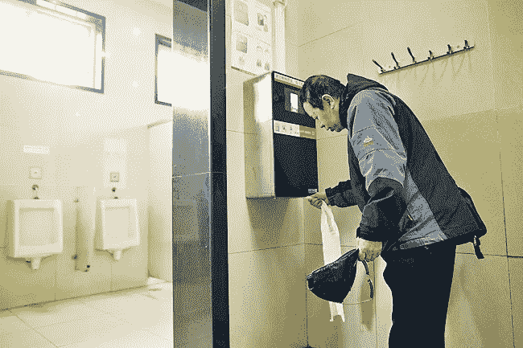
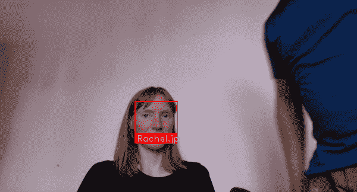
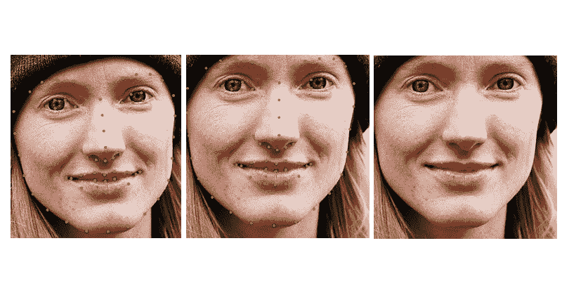
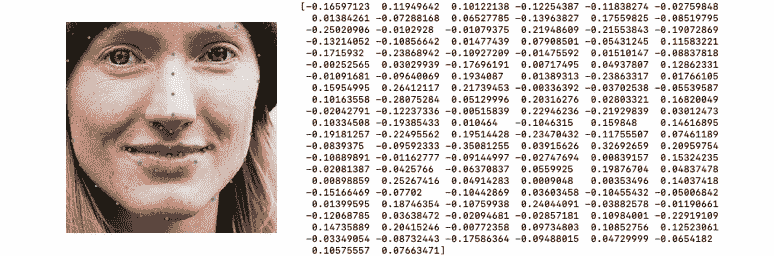

# 初学者指南，建立自己的面部识别系统，让你的朋友溜出来

> 原文：<https://towardsdatascience.com/a-beginners-guide-to-building-your-own-face-recognition-system-to-creep-out-your-friends-df3f4c471d55?source=collection_archive---------5----------------------->

人脸识别系统正稳步进入我们的日常生活。基于人工智能，它们可以(以不同程度的准确性)从人群中挑出你，并将你识别为导致各种后果的个体。根据你生活在世界的哪个地方，他们可以解锁你的手机屏幕，[支付你的鸡肉](https://www.theguardian.com/technology/2017/jan/11/china-beijing-first-smart-restaurant-kfc-facial-recognition)，[让你被捕](https://www.independent.co.uk/news/uk/home-news/facial-recognition-london-inaccurate-met-police-trials-a8898946.html)，[让你远离泰勒斯威夫特](https://www.rollingstone.com/music/music-news/taylor-swift-facial-recognition-concerts-768741/)和[找到你的梦中情人](https://www.bbc.co.uk/news/av/technology-40555753/dating-app-tech-finds-celebrity-lookalikes)。



A toilet paper dispenser at a public toilet in Beijing deploys facial recognition to stop toilet paper thieves (Image source: AFP)


Poster for Metropolitan Police Facial Recognition trial in Central London (Image Source: Metropolitan Police)


Dating app Badoo showing profile matches for Jake Gyllenhall and Kendall Jenner (Image Source: Badoo)

但是这些系统实际上是如何工作的，它们有多精确，谁有权限部署它们？为了找到答案，让我们用免费的开源软件和朋友的照片自己做一个。



# 设置它——下载程序运行所需的一切

1.  下载文本编辑器 [Sublime Text](https://www.sublimetext.com/3) ，完成后，打开它并遵循安装说明。我们将在这里编写代码，这些代码将成为程序。
2.  查看您的计算机上是否已经安装了 Python 3。这是我们将要编写的编程语言。要为 MAC 打开终端(在应用程序的“实用工具”文件夹中)或 Windows 打开命令提示符(按 Windows + X 并选择命令提示符)执行此操作。然后键入以下内容并按 enter 键:

```
python3 -- version
```

如果它说 Python 3.7.3，忽略步骤 3。否则继续。

3.下载 [Python 3](https://www.python.org/downloads/) 。对于 Windows，下载完成后，打开 python.exe 文件，在“修改”菜单下，确保勾选“pip”和“将 Python 添加到环境变量”，然后按“安装”。

4.再次进入终端或命令提示符，键入以下命令，在每一行后按 enter 键，安装我们需要的软件包。第四行“dlib”可能需要一段时间。

```
pip3 install cmake
pip3 install face_recognition
pip3 install numpy
pip3 install dlib
pip3 install opencv-python
```

如果最后一个命令要求您安装 Xcode(适用于 MAC)，请前往 App Store 并安装。这可能需要一段时间，因为它非常大。然后重新输入最后一行(pip3 install opencv-python)并回车。

# 制作和运行程序

1.将这段开源代码复制并粘贴到 Sublime 文本中。点击图片底部的“查看原始数据”可能更容易做到这一点。

2.将此文件以 recognise _ face.py 的名称保存在计算机的桌面文件夹中，并创建一个名为 known_people 的文件夹(确保该文件夹也在桌面文件夹中)。

3.现在，我们可以通过在 known_people 文件夹中保存他们的面部图像来添加我们希望识别的人的照片。确保这个人面向前方，并且是照片中的唯一一个人(如果需要的话，修剪)。我们将每个文件命名为这个人的名字，因为我们希望它出现在屏幕上。在这种情况下，只有。将使用 jpg 文件。


4.现在，我们可以通过返回到终端(Mac)或命令提示符(Windows)来运行程序，编写以下内容并按 enter 键

```
cd Desktop
python3 recognise_face.py
```

如果出现错误消息，请尝试:

```
python recognise_face.py
```

在选择终端窗口的情况下按 Ctrl + c 将退出程序。

# 这里发生了什么事？

[这篇由 Adam Geitgey](https://medium.com/@ageitgey/machine-learning-is-fun-part-4-modern-face-recognition-with-deep-learning-c3cffc121d78) 撰写的博客文章详细解释了这个系统是如何工作的(而且非常好)。

总而言之，人脸识别过程可以分为四个步骤。

1.  检测帧中出现的任何人脸。


A Visualisation of a History of Gradients (HOG) algorithm for detecting faces

2.定位面部的特定点，例如鼻尖和每只眼睛的角落，以创建遮罩。然后移动蒙版，使其面向正前方，只使用保持原始形状的变换，如旋转和缩放。



Face goes through transforms to become aligned

3.编码。这一阶段是关于识别面部的关键部分(通过计算机的眼睛),对于同一个人的任何照片，这些关键部分都是相似的，而对于其他任何人的图像，这些关键部分都是不同的。对于人类来说，这可能是眼睛的颜色、发型、鼻子的形状等，但对于计算机视觉来说，有一个非常有效的 128 个测量值的集合，称为嵌入。这些测量是使用机器学习通过比较成千上万张标记人脸的图像发现的。然后，我们可以访问由该过程生成的预训练网络，以找到我们需要的测量值。



128 measurements to identify my face

4.将步骤 1 中检测到的人脸的 128 个测量值与 known_people 文件夹中图像的所有测量值进行比较。如果在这个文件夹中找到足够相似的一组测量值，那就是匹配！

# **这有多准确？**

对于一组大约 30 张要识别的人脸，这种方法仍然有效。但是如果你刮下你所有脸书朋友的照片呢？由于普通用户有 338 个，这是一个更大的比较集，肯定会导致歧义？在下一篇博文中，我们将对此进行测试，考虑制作和利用这种应用程序的合法性，并进一步研究人脸识别技术的当前应用。