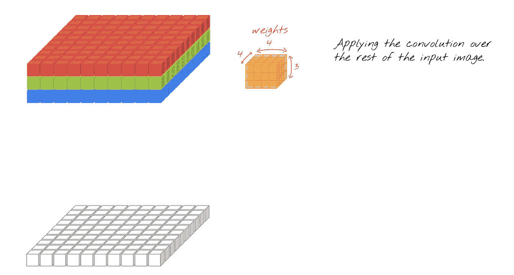
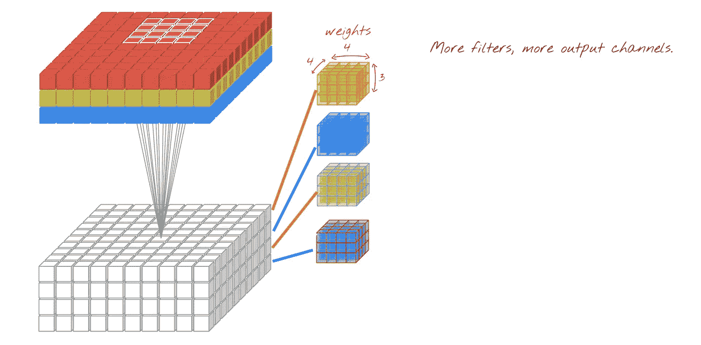

# 卷积神经网络初学者指南

> 原文：<https://towardsdatascience.com/a-beginners-guide-to-convolutional-neural-networks-cnns-14649dbddce8?source=collection_archive---------3----------------------->

# **什么是卷积？**

卷积是滤波器修改输入的方式。在卷积网络中，采用多个滤波器来分割图像，并逐个映射它们，学习输入图像的不同部分。想象一下，一个小滤镜从左到右从上到下滑过图像，移动的滤镜正在寻找，比如说，一个黑色的边缘。每次找到一个匹配，它就被映射到输出图像上。

[https://www.cs.columbia.edu/education/courses/course/COMSW4995-7/26050/](https://www.cs.columbia.edu/education/courses/course/COMSW4995-7/26050/)

例如，有一张 Eileen Collins 的照片，红色箭头上方的矩阵用作卷积来检测暗边缘。因此，我们看到的图像只强调了暗边。

请注意，图像的宽度和高度是二维的。如果图像是彩色的，它被认为具有 RGB 颜色的多一个维度。因此，2D 卷积通常用于黑白图像，而 3D 卷积用于彩色图像。

# 2D 卷积

让我们从没有填充的(4 x 4)输入图像开始，我们使用(3 x 3)卷积滤波器来获得输出图像。

第一步是用滤镜将输入图像中的黄色区域相乘。每个元素都与相应位置的一个元素相乘。然后你把所有的结果相加，就是一个输出值。

数学上是(2 * 1)+(0 * 0)+(1 * 1)+(0 * 0)+(0 * 0)+(0 * 0)+(0 * 0)+(0 * 1)+(1 * 0)= 3

然后，重复相同的步骤，将过滤器移动一列。你得到第二个输出。

请注意，您只移动了一列过滤器。滤光器滑过图像的步长称为**步幅**。这里，步幅是 1。重复相同的操作以获得第三个输出。步幅大于 1 将总是缩小图像。如果大小为 1，图像的大小将保持不变。

最后，您将得到最终的输出。

我们看到输出图像的尺寸小于输入图像的尺寸。事实上，大多数情况下都是如此。

# 3D 卷积

3D 卷积就像 2D，除了你要做 3 次 2d 工作，因为有 3 个颜色通道。

[https://twitter.com/martin_gorner](https://twitter.com/martin_gorner)

通常，输出的宽度会变小，就像 2D 案例中输出的大小一样。

[https://twitter.com/martin_gorner](https://twitter.com/martin_gorner)

如果您想要保持输出图像的宽度和高度不变，而不减小滤镜大小，您可以使用零向原始图像添加填充，并对图像进行卷积切片。

[https://twitter.com/martin_gorner](https://twitter.com/martin_gorner)

我们可以应用更多的填充！

[https://twitter.com/martin_gorner](https://twitter.com/martin_gorner)

完成后，结果如下所示:

[https://twitter.com/martin_gorner](https://twitter.com/martin_gorner)

当您添加更多滤镜时，它会增加输出图像的深度。如果输出图像的深度为 4，则使用 4 个滤镜。每一层对应于一个滤波器，并学习一组权重。当它在图像上滑动时，它不会在各步之间改变。

[https://twitter.com/martin_gorner](https://twitter.com/martin_gorner)

卷积的输出通道被称为**特征图**。它对其检测到的特征的存在与否和存在程度进行编码。注意，与之前的 2D 滤波器不同，每个滤波器连接到每个输入通道的**。(问题？与 2D 不同，每个滤波器连接到每个输入通道是什么意思？)这意味着它们可以计算复杂的特征。最初，通过查看 R、G、B 通道，但是之后，通过查看诸如各种边缘、形状、纹理和语义特征的学习特征的组合。**

# 平移不变量

另一个有趣的事实是，CNN 在某种程度上抵抗平移，例如图像移动一点，这将具有与移动前相似的激活图。这是因为卷积是一个特征检测器，如果它检测的是暗边缘，并且图像被移动到底部，那么暗边缘将不会被检测到，直到卷积被向下移动。

# 特例——1D 卷积

1D 卷积包括在这里，因为它通常解释不足，但它有值得注意的好处。

[https://github.com/GoogleCloudPlatform/tensorflow-without-a-phd](https://github.com/GoogleCloudPlatform/tensorflow-without-a-phd)

它们用于减少深度(通道数)。在这种情况下，宽度和高度保持不变。如果要减少水平维度，可以使用池，增加卷积的步幅，或者不添加填充。1D 卷积计算输入通道或特征的加权和，这允许**选择某些对下游有用的特征组合。1D 卷积压缩，因为只有一个它有相同的效果**

# 联营

请注意，池化是与卷积分开的一个步骤。池用于减少图像的宽度和高度。请注意，深度由通道的数量决定。顾名思义，它所做的就是在一定大小的窗口中选择最大值。尽管它通常在空间上用于减少图像的 x，y 维度。

# **最大池**

最大池用于通过取窗口中元素的最大值，将给定窗口的大小映射到单个结果来减小图像大小。

[http://cs231n.github.io/convolutional-networks/](http://cs231n.github.io/convolutional-networks/)

# 平均池

它与 max-pooling 相同，只是它对窗口进行平均，而不是选择最大值。

[http://cs231n.github.io/convolutional-networks/](http://cs231n.github.io/convolutional-networks/)

# **普通设置**

为了实现 CNN，大多数成功的架构使用一个或多个具有 relu 激活的卷积+池层堆栈，然后是平坦层，然后是一个或两个密集层。

随着我们在网络中移动，要素地图在空间上变得更小，在深度上变得更深。要素变得越来越抽象，失去了空间信息。例如，网络知道图像包含一只眼睛，但不确定它在哪里。

这是一个典型的美国有线电视新闻网在喀拉斯的例子。

这是你做 model.summary()时的结果

让我们将这些层分解开来，看看我们如何获得这些参数值。

## Conv2d_1

过滤器尺寸(3 x 3) *输入深度(1) *过滤器数量(32) +偏差 1/过滤器(32) = 320。这里，输入深度是 1，因为它是针对 MNIST 黑白数据的。请注意，在 tensorflow 中，默认情况下，每个卷积层都添加了偏差。

## 最大池 2d 1

池图层没有参数

## Conv2d_2

过滤器尺寸(3 x 3) *输入深度(32) *过滤器数量(64) +偏差，每个过滤器 1(64)= 18496

## 扁平化 _1

它将上面的卷拆分成一个数组。

[https://github.com/GoogleCloudPlatform/tensorflow-without-a-phd](https://github.com/GoogleCloudPlatform/tensorflow-without-a-phd)

## 密集 _1

输入维度(128) *输出维度(10) +每个输出神经元一个偏置(10) = 1290

# 摘要

卷积神经网络(CNN)是一种深度神经网络(DNN ),广泛用于计算机视觉或 NLP。在训练过程中，为了使网络达到最佳性能并尽可能准确地对图像和对象进行分类，网络的构建模块被反复改变。

# 来源

本教程基于约书亚·戈登在哥伦比亚大学的应用深度学习课程的讲座。令人惊叹的 3d 图像来自[马丁·戈纳](https://twitter.com/martin_gorner)。