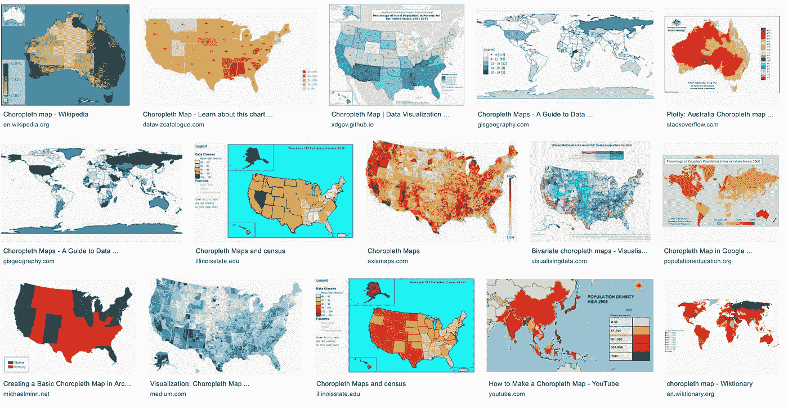
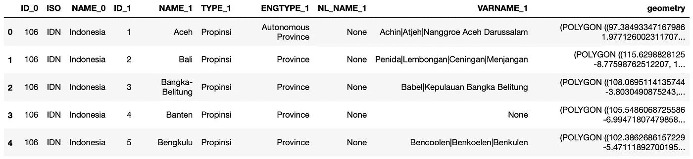
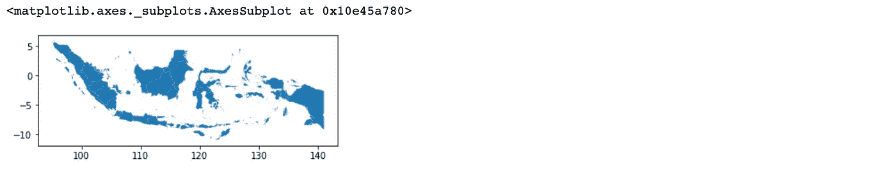
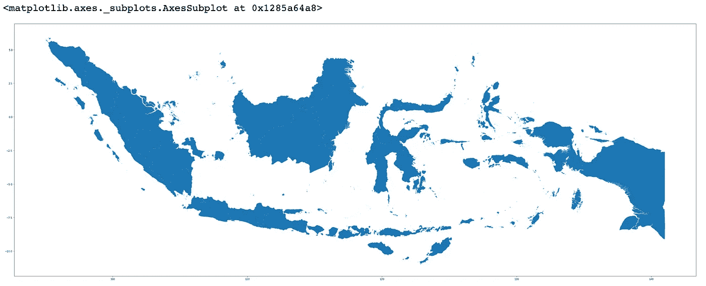
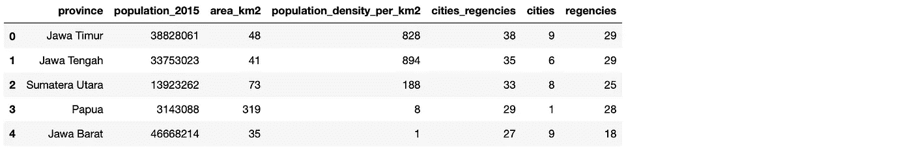
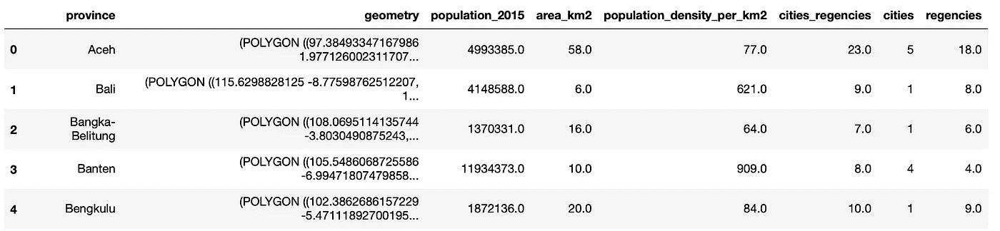
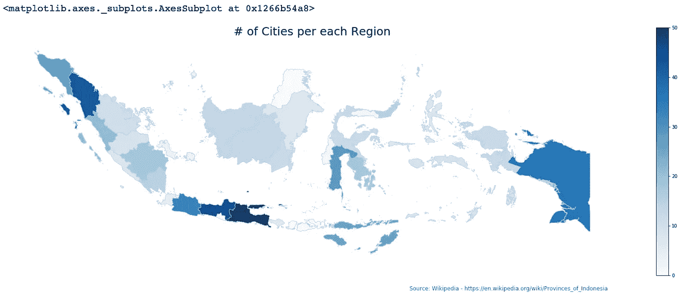
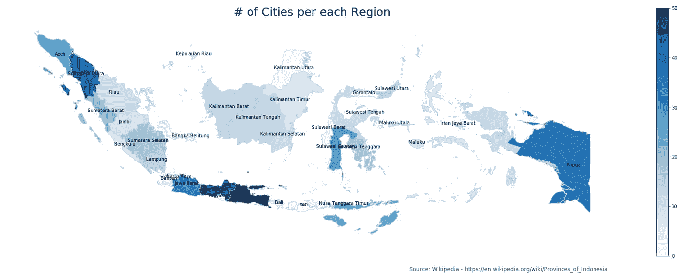
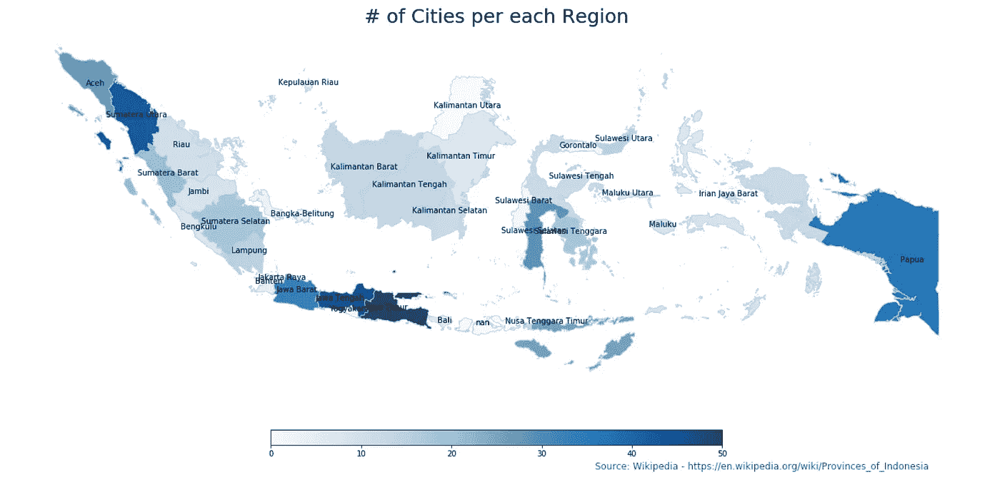

# 使用 GeoPandas 和 Matplotlib 在 Python 中创建 Choropleth 地图的初学者指南

> 原文：<https://towardsdatascience.com/a-beginners-guide-to-create-a-cloropleth-map-in-python-using-geopandas-and-matplotlib-9cc4175ab630?source=collection_archive---------2----------------------->

在搜索和展示重要见解时，数据可视化是一项重要的技能。有许多视觉效果可以用来展示你的数据。最有趣的数据图像之一是 choropleth 地图。

什么是 choropleth 地图？

> **choropleth map** (源自希腊语χῶρος“区域/地区”和πλῆθος“大众”)是一种专题地图，其中区域根据地图上显示的统计变量(如人口密度或人均收入)的测量值成比例地进行阴影化或图案化。【https://en.wikipedia.org/wiki/Choropleth_map】来源:T4



Google Image search — choropleth

为什么这是如此有趣的视觉效果？a)它很漂亮，b)它告诉我们我们感兴趣的数据的确切位置，以及 c)它很漂亮！

介绍完毕后，让我们开始编写代码(以及代码的准备工作)。

**第一步:安装所需的 Python 库**

让我们安装几个在这个练习中需要的包。GeoPandas 是一个令人惊叹的包，它允许解析地理空间数据，从而将`pandas`的数据框架提升到了一个新的水平。它将使用笛卡尔坐标生成 Matplotlib 图。

```
pip install descartes
pip install geopandas
pip install matplotlib
pip install numpy
pip install pandas
```

**第二步:获取数据**

在这个练习中，我们需要两种数据:

1.  数据将被映射到位置/区域/地区等。我们可以免费使用大量的开放数据，其中一个来自维基百科(数据的准确性和有效性没有保证，但对于这个学习练习来说，没问题！).在这个练习中，我们将使用印度尼西亚每个省的城市和地区的数量。如果你愿意，你可以在这里检查它，但是我建议你只从我的 Github repo 下载它，因为需要一些手工操作(改变列名，数据格式等)。)这个我们就懒得在这里讨论了。
2.  第二个数据是我们想要制作的地图的 shapefile。它基本上是一个几何位置列表(点、线或多边形)。由于我们想要绘制印度尼西亚的省份地图，我们将在这里下载印度尼西亚的行政区域[，或者再次在我的](http://www.diva-gis.org/gdata) [Github repo](https://github.com/mrakelinggar/data-stuffs/tree/master/cloropleth_python) 中下载。

**第三步:开始编码**

现在，让我们直接进入代码

1.  加载必要的库

```
import pandas as pd
import numpy as np
import geopandas as gpd
import matplotlib.pyplot as plt
```

2.加载并查看 shapefile 数据

```
fp = "IDN_adm/IDN_adm1.shp"
map_df = gpd.read_file(fp)
# check the GeoDataframe
map_df.head()
```



好的，如你所见，我们在下载的 shapefile 中有几个数据字段。我们感兴趣的是列`NAME_1`(省名)和`geometry`(省的形状)。您也可以看到，shapefile 以多边形的形式存储位置信息。让我们画出来，好吗

```
map_df.plot()
```



所以我们有印度尼西亚的地图，但是它看起来太小了，让我们调整它的大小

```
plt.rcParams['figure.figsize'] = [50, 70] #height, width
map_df.plot()
```



好多了，

3.加载省数据

```
province = pd.read_csv("data_province.csv", sep=";")
province.head()
```



如你所见，我们有各省、2015 年人口、城市数量和其他几个有趣的数字。我们现在要做的就是将数据与 shapefile 合并，然后我们就可以开始可视化这些数字了

4.合并并显示地图

```
# join the geodataframe with the csv dataframe
merged = map_df.merge(province, how='left', left_on="NAME_1", right_on="province")
merged = merged[['province', 'geometry', 'population_2015', 'area_km2', 'population_density_per_km2', \
                'cities_regencies', 'cities', 'regencies']]merged.head()
```



酷，我们有了最清晰的数据格式，让我们来绘图

```
# set the value column that will be visualised
variable = 'cities_regencies'# set the range for the choropleth values
vmin, vmax = 0, 50# create figure and axes for Matplotlib
fig, ax = plt.subplots(1, figsize=(30, 10))# remove the axis
ax.axis('off')# add a title and annotation
ax.set_title('# of Cities per each Region', fontdict={'fontsize': '25', 'fontweight' : '3'})
ax.annotate('Source: Wikipedia - [https://en.wikipedia.org/wiki/Provinces_of_Indonesia', xy=(0.6,](https://en.wikipedia.org/wiki/Provinces_of_Indonesia',xy=(0.6,) .05), xycoords='figure fraction', fontsize=12, color='#555555')# Create colorbar legend
sm = plt.cm.ScalarMappable(cmap='Blues', norm=plt.Normalize(vmin=vmin, vmax=vmax))# empty array for the data range
sm.set_array([]) # or alternatively sm._A = []. Not sure why this step is necessary, but many recommends it# add the colorbar to the figure
fig.colorbar(sm)# create map
merged.plot(column=variable, cmap='Blues', linewidth=0.8, ax=ax, edgecolor='0.8')
```



很好，对吧？但还可以更好。例如，我们知道哪些位置的每个区域的城市数量多，哪些位置的每个区域的城市数量少。为了让情节更清晰，我们给它加上省份标签。在上述代码的底部添加以下代码。

```
# Add Labels
merged['coords'] = merged['geometry'].apply(lambda x: x.representative_point().coords[:])
merged['coords'] = [coords[0] for coords in merged['coords']]for idx, row in merged.iterrows():
    plt.annotate(s=row['province'], xy=row['coords'],horizontalalignment='center')
```



好吧，这样更好。如果我们仔细看看，我们可以看到，根据维基百科，与其他省份相比，贾瓦人腾格里省每个地区的城市数量非常多。

我们可以做的另一个调整是将彩色地图图例的方向改为水平，以防您希望上面的空间集中在地图上。

只要修改这个代码

```
fig.colorbar(sm)
```

对此

```
fig.colorbar(sm, orientation="horizontal", fraction=0.036, pad=0.1, aspect = 30)
```



Final tweak

5.省省吧！

既然我们已经制作了 choropleth 地图，我们需要做的最后一件事就是以友好的流行格式保存它，比如。png

```
fig.savefig(‘map.png’, dpi=300)
```

就这些了，希望这个帖子有用。

# 你自己试试

你可以在我的 Github repo [这里](https://github.com/mrakelinggar/data-stuffs/tree/master/cloropleth_python)下载这个练习的笔记本文件以及清理过的省份数据和印度尼西亚 shapefiles。

## 信用

这篇文章的灵感来自本杰明·库利的文章。

[](/lets-make-a-map-using-geopandas-pandas-and-matplotlib-to-make-a-chloropleth-map-dddc31c1983d) [## 让我们做一张地图吧！利用 Geopandas、pandas 和 Matplotlib 制作 Choropleth 地图

### 所以你想用 Python 做地图。我们开始吧！

towardsdatascience.com](/lets-make-a-map-using-geopandas-pandas-and-matplotlib-to-make-a-chloropleth-map-dddc31c1983d) 

我对进一步学习和做一些事情很感兴趣，并且喜欢这些结果，因此我在这里分享它。:)