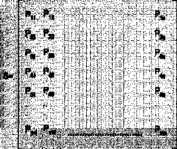
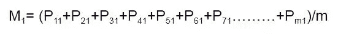
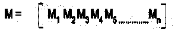
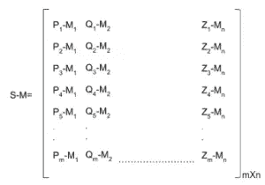
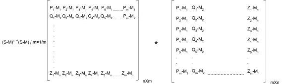
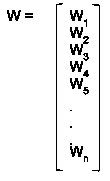
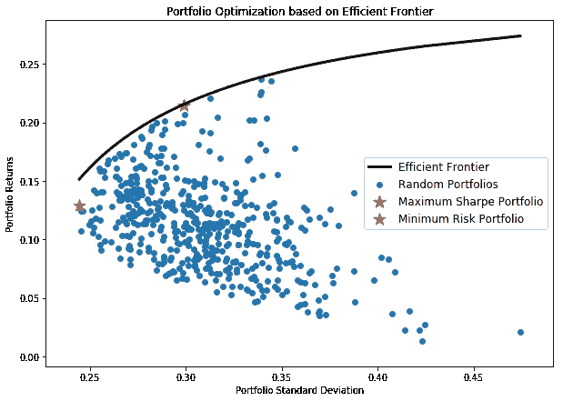

# 项目组合管理过程中的数据科学初学者指南

> 原文：<https://towardsdatascience.com/a-beginners-guide-to-data-science-in-the-portfolio-management-process-56d559a3d39?source=collection_archive---------20----------------------->

## 随着对工作中的统计计算的深入理解，投资组合优化变得简单。

Photo by [Markus Spiske](https://unsplash.com/@markusspiske?utm_source=medium&utm_medium=referral) on [Unsplash](https://unsplash.com?utm_source=medium&utm_medium=referral)

一位潜在客户打电话来，要求投资 10，000，000 美元。投资组合经理/顾问如何决定股票、债券、现金、黄金、比特币或其他资产的适当组合？这位经理如何确保她所做的事情比猴子向镖靶投掷飞镖所取得的结果更好，或者更重要的是，更适合她的客户？

这些都是数据科学可以帮助回答的问题！

在投资组合管理过程的开始，投资组合经理需要理解他们客户的目标和约束，以便构建适当的资产分配。审查客户的目标和限制包括了解她的风险/回报偏好、流动性需求、投资时间范围、税收情况(资产位置可能是一个强有力的工具！)、特殊情况以及任何当前的法律问题。有了对这些目标和约束的坚实理解，项目组合的构建就可以开始了。

分析诸如流动性需求(无、当前、未来等)等分类输入。)、时间跨度(短期、长期等。)，或者税收(纳税或者不纳税)在决策过程中融合在一起不在本博客讨论范围之内。相反，我写这篇博客的目的是探索关键的静态计算，如均值、协方差、相关性和标准差，它们与适当的投资组合构建/优化密切相关。

# 一个双资产投资组合的例子

考虑两只股票:A 和 B。管理投资组合 Z 是通过购买价值 60，000 美元的 A 和价值 40，000 美元的 B 构建的。我们如何使用我们对 A 和 B 的了解来预测 Z 的未来表现？暂且忽略风险，这很简单。

让我们将 A 和 B 的预期收益(分别表示为 E(A)和 E(B ))定义为 A 和 B 的总体均值。换句话说，E(A)等于自 A 首次公开发行以来 A 的平均回报率。

我们如何利用这些信息来预测我们管理的投资组合的预期回报，我们知道我们投资组合的权重是 60% A 和 40% B？公式是:

> E(Z)= WA * E(A)+WB * E(B)；其中 WX 是资产 X 在投资组合中的权重百分比。

为了便于说明，我们假设 E(A) = 15%，E(B) = 17.5%，这样我们管理的投资组合的预期回报率为 16%。

现在让我们关注风险。我们将使用标准差作为投资组合风险的代表。要理解标准差，我们首先需要理解什么是相关系数。相关系数是对两个数据集(在我们的示例 A 和 B 的性能中)之间线性关系强度的度量，其范围从-1 到 1。相关系数为 1 意味着存在完全正的线性关系(随着 A 的增加，B 也会增加)，相关系数为-1 意味着存在完全负的线性关系(随着 A 的增加，B 会减少)。中间某处的相关值表示与指示方向的符号的线性关系的强度(或缺乏强度)。

那么，相关系数是怎么计算的呢？如果我们将相关系数表示为 p，则 p 计算如下:

> p(x，y) = cov(x，y) / (std_x * std_y)

值得一提的是，cov(x，y)是随机变量 x 和 y 之间的协方差的缩写。根据符号，协方差显示 x 和 y 之间的线性关系的趋势(即变量显示相似的行为)。通过除以(std_x*std_y)，我们对协方差进行标准化，以使其具有可比性(即，我们更关心线性关系的强度，而不是关系的趋势)。

一旦我们有了 p，求解我们投资组合的标准差(通过求方差的平方根)就很简单了。我们将投资组合的标准差表示为 rZ，因此投资组合的方差为:

> r Z = Wx * r x+Wy * r y+2(Wx * rx)(Wy * ry)p(x，y)

为了便于说明，我们假设 A 的标准偏差为 20%，B 的标准偏差为 10%，A 和 B 的相关性为 0.85。使用我们上面的 rZ 公式，我们计算出我们管理的投资组合的预期标准差为 15.5%。

# 如果你有两项以上的资产呢？

买电脑。手工很难做到。也就是说，我们应该理解一个计算机程序在幕后做什么。

下面是在有效边界生成投资组合背后的方法，Investopedia 将其定义为:

> …一组风险资产的最优投资组合，它们在规定的风险水平下提供最高的预期回报，或者在给定的预期回报水平下提供最低的风险。

## 让我们首先定义我们的*输入*参数:

1.  **stock _ price _ data**= m×n(读作“m 乘 n”)m 只股票的 m 个收盘价的矩阵

Matrix by [Varun Divakar](https://www.linkedin.com/in/varun-divakar-b862a667/)

2. **avg_stock_price** =每只股票平均价格的 1 X n 矩阵。

Matrix by [Varun Divakar](https://www.linkedin.com/in/varun-divakar-b862a667/)

3.**股票 _ 贬低** =单个股票价格的 m×n 矩阵减去该股票的平均价格。这给了我们一个衡量每个数据点离均值有多远的标准。

Matrix by [Varun Divakar](https://www.linkedin.com/in/varun-divakar-b862a667/)

4.**协方差 _ 矩阵**= m×n 矩阵，即股票 _ 降级矩阵乘以其[转置](https://en.wikipedia.org/wiki/Transpose)的乘积。我们只关心结果矩阵的对角线(从左上到右下)。

Matrix by [Varun Divakar](https://www.linkedin.com/in/varun-divakar-b862a667/)

*注:协方差矩阵从左上到右下的对角线代表个股的方差，如下图所示。*

Matrix by [Varun Divakar](https://www.linkedin.com/in/varun-divakar-b862a667/)

5. **asset_weights** =每个风险资产的分配权重的 n×1 矩阵

Matrix by [Varun Divakar](https://www.linkedin.com/in/varun-divakar-b862a667/)

## 计算投资组合的预期收益和预期风险

使用我们上面定义的输入，我们可以使用以下公式(z =投资组合)通过一些矩阵乘法计算预期投资组合回报和预期投资组合方差:

> *E(z) = M*W*
> 
> *r z = Wt *(协方差矩阵)* W；其中 Wt =的转置*
> 
> *rz = sqrt(r z)*

现在，我们已经计算了投资组合的预期收益和预期标准差，我们可以通过改变矩阵 W 中的各个权重来生成数万个投资组合，并将这些投资组合绘制在散点图上，如下图所示:

Graph by [Varun Divakar](https://www.linkedin.com/in/varun-divakar-b862a667/)

使用上面的散点图，投资组合经理可以很容易地获得最符合其客户风险/回报目标的投资组合权重。最后，需要注意的是，寻求最佳风险调整回报的积极型经理应该关注上面用红星标出的投资组合(夏普比率最高的投资组合)。

# 一锤定音

投资组合的构建/优化起初看起来令人望而生畏。然而，通过对数学的扎实理解，人们可以轻松地理解什么是适当的分配。

***来自《走向数据科学》编辑的提示:*** *虽然我们允许独立作者根据我们的* [*规则和指导方针*](/questions-96667b06af5) *发表文章，但我们并不认可每个作者的贡献。你不应该在没有寻求专业建议的情况下依赖一个作者的作品。详见我们的* [*读者术语*](/readers-terms-b5d780a700a4) *。*