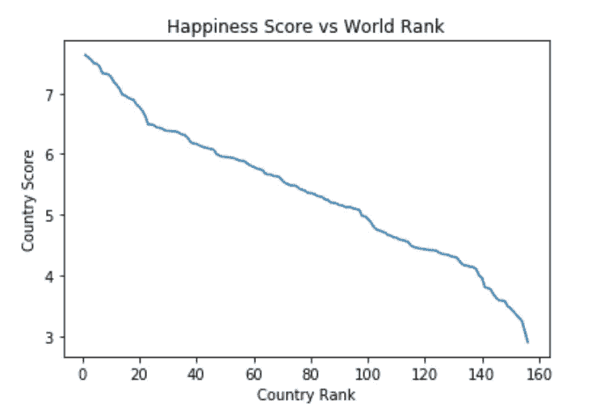
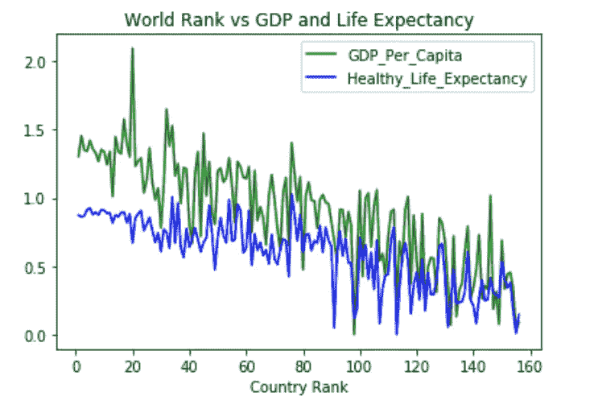
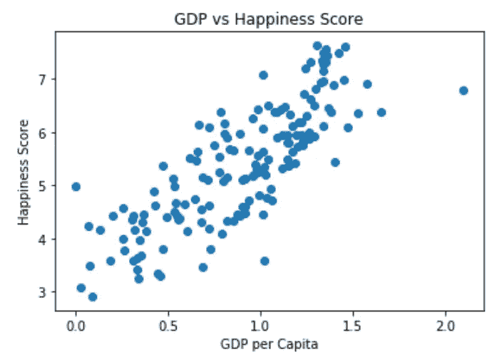
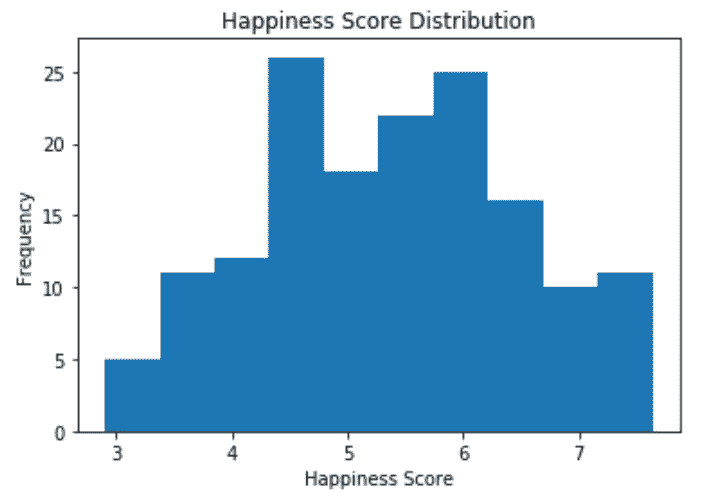

# 使用 Matplotlib 进行数据可视化的初学者指南

> 原文：<https://towardsdatascience.com/a-beginners-guide-to-data-visualization-using-matplotlib-22b15a0b090?source=collection_archive---------20----------------------->

## 如何创建和解释基本的数据可视化

## 介绍

本文的目的是简要介绍如何使用 Matplotlib，这是 Python 中最常用的绘图库之一。在本演练结束时，您将知道如何制作几种不同的可视化效果，以及如何处理一些情节的美感。本教程中使用的数据可以在[这里](https://www.kaggle.com/njlow1202/world-happiness-report-data-2018)找到。这个特定的数据集来自世界卫生组织收集的数据，它包含用于计算特定国家幸福得分的信息，如一个国家的 GDP、预期寿命和人民对该国政府腐败程度的看法。

在创建图表之前，让我们导入必要的库并检查数据集:

```
import pandas as pd
import matplotlib.pyplot as pltdf = pd.read_csv('WorldHappiness2018_Data.csv')
df.head()
```


由此，我们看到数据集是根据该国在幸福指数方面的总体排名排序的。“得分”之后的其余几栏，包括“残差”在内(此处未显示),相加得出一个国家的幸福总分。那么，期望每一栏中的值越高，通常表明一个国家的总体幸福指数越高，这是有道理的。

## 曲线图

线图可能是使用 Matplotlib 创建的最简单的图形。让我们创建一个图表来看看一个国家的排名和他们的幸福得分之间的关系。我们预计，排名最高的国家(排名最接近 1)幸福指数最高，排名最低的国家幸福指数最低。我们可以用四行简单的代码创建这个可视化。

```
rank = df['Rank']
score = df['Score']
```

这两行代码是数据帧的子集。第一个创建了一个只包含每个国家总体排名的序列。第二个创建了一个只包含每个国家幸福指数的序列。因为这些信息是从数据帧中提取的，所以您可以假设所有数据都将保存在它们的原始索引中，然后这些数据将正确地排列起来。

```
plt.plot(rank, score)
plt.show()
```

接下来的两行代码创建了实际的绘图。`plt.plot()`命令创建一个折线图，传入的参数告诉函数使用什么数据。第一个，*排名*，将绘制在 x 轴上，第二个，*得分*，将绘制在 y 轴上。需要调用`plt.show()` 才能将图形实际打印到屏幕上。运行时，输出如下:


创建这个图表非常简单，它向我们展示了我们期望看到的东西。然而，这个图表有几个问题。如果你不是创建它的人，或者如果你在创建它一段时间后回头看它，你将不知道这个图表实际上显示的是什么。幸运的是，添加标题和轴标签非常简单。

```
plt.plot(rank, score)
plt.title('Happiness Score vs World Rank')
plt.xlabel('Country Rank')
plt.ylabel('Country Score')
plt.show()
```

这些命令非常简单明了，结果比第一个图表更容易理解。



向原始线图添加标签和标题非常简单，并且极大地改善了它的外观。有一个带标签的图表不仅更专业，而且更容易理解图表向我们展示了什么，几乎不需要额外的上下文或额外的解释。现在，如果我们想在同一张图表上考察多个变量与一个国家排名的关系，会发生什么呢？您所要做的就是用您想要作为 x 值的参数传递的两个不同的系列调用`plt.plot()`两次，如下所示:

```
gdp = df['GDP_Per_Capita']
lifeExp = df['Healthy_Life_Expectancy']plt.plot(rank, gdp)
plt.plot(rank, lifeExp)
plt.show()
```

此代码输出以下视觉效果:


就像我们制作的第一张图表一样，我们并不知道这张图表告诉了我们什么。此外，我们不知道哪一行代表我们传入的哪个 x 参数。有两种可能的方法来处理这个问题。第一个将添加一个图例来告诉我们什么颜色的线代表哪个变量。

```
# Option 1
plt.plot(rank, gdp)
plt.plot(rank, lifeExp)
plt.title('World Rank vs GDP and Life Expectancy')
plt.xlabel('Country Rank')
plt.legend()
plt.show()# Option 2 plt.plot(rank, gdp, color = 'green')
plt.plot(rank, lifeExp, color = 'blue')
plt.title('World Rank vs GDP and Life Expectancy')
plt.xlabel('Country Rank')
plt.legend()
plt.show()
```

注意:为了获得两个输出，这些选项应该彼此分开运行。



现在我们知道哪条颜色线代表哪个变量。无论您是否选择为每个变量设置颜色，在可视化中包含一个图例几乎总是一个好主意，以便您可以快速识别哪条线代表哪个变量。从这个图表中，我们还可以直观地识别一个趋势。当我们进入较低的国家行列时，人均国内生产总值和预期寿命的值都较低，这对一个国家的整体幸福得分有所贡献。此外，我们可以看到，很多时候，当一个国家的人均国内生产总值达到峰值时，这个国家的预期寿命也会达到峰值。人均 GDP 和预期寿命的下降也是如此。

## 散点图

散点图是可视化两个变量之间关系的一种很好的方式，而没有我们可能从线形图中得到的疯狂趋势线的可能性。就像折线图一样，在 Matplotlib 中创建散点图只需要几行代码，如下所示。

```
plt.scatter(gdp, score)
plt.title('GDP vs Happiness Score')
plt.xlabel('GDP per Capita')
plt.ylabel('Happiness Score')
plt.show()
```

如果不添加标题和轴标签，只需两行代码就可以创建一个散点图。此代码创建以下散点图:



正如我们所料，人均 GDP 得分越高，某个国家的幸福指数越高。然而，这个图表有一个小问题。按照惯例，图表轴应该总是从 0 开始，只有少数例外。正如我们在这里看到的，这个图的最低 y 刻度为 3，这是误导。幸运的是，这很容易解决。我们所要做的就是在调用 `plt.show()`之前添加一行 `plt.ylim(0, 8)` ，这个问题就解决了，如下所示:


这个图表给我们的理解与我们构建的第一个散点图略有不同。我们可以在人均 GDP 为 0 的情况下拥有幸福指数 3。如果你不注意第一张图中的 y 轴，你可能会认为人均 GDP 接近 0 意味着幸福指数接近 0，但事实并非如此。这告诉我们，影响一个国家幸福得分的还有其他因素，也是应该考察的。

散点图有助于识别数据中存在的线性关系。然而，在 Matplotlib 中，在散点图上添加回归线并不容易。我的下一篇文章将告诉您如何使用 Seaborn 轻松做到这一点。

## 直方图

直方图显示了数据的特定特征的分布。更简单地说，它向我们展示了有多少个观察值取某个值。就像线形图和散点图一样，基本的直方图很容易创建。

```
plt.hist(score)
plt.title('Happiness Score Distribution')
plt.xlabel('Happiness Score')
plt.ylabel('Frequency')
plt.show()
```



这个直方图是用五行简单的代码创建的。它告诉我们有多少个国家有各自的幸福指数。因为幸福指数是一个连续的数值范围，所以我们不能只看它就得到精确的数据，但是我们可以得到一个大概的概念。例如，大约有 15 个国家的幸福指数在 3 到 4 之间，幸福指数在 4.5 左右的国家数量最多(大约 25 个)。换个方式说，最常见的幸福分值是 4.5 左右的数值。

## 条形图

在 Matplotlib 中构建条形图比您想象的要稍微困难一些。这可以用几行代码来完成，但是理解这段代码在做什么很重要。

```
roundedHappinessScore = score.apply(int)
count = roundedHappinessScore.value_counts()
hapScore = count.indexplt.bar(hapScore, count)
plt.title('Happiness Scores')
plt.xlabel('Score')
plt.ylabel('Count')
plt.show()
```

最后五行代码非常简单，但是前三行发生了什么呢？第一行将所有的幸福分数转换成一个整数，这样幸福分数只能取几个离散值。第二行得到每个分数出现的次数。该计数将用作我们的条形图的高度。然后，第三行得到与每个计数相关的分数，它需要作为我们图表的 x 轴。运行时，此代码会生成以下条形图:


这个图表给出了一个与我们上面创建的柱状图略有不同的故事。解释起来要容易得多，我们在这里可以看到，有最多的观察结果的幸福指数为 5。因为我们使用 *int()* 函数进行了“四舍五入”，这意味着分数 5 可以是范围 5 ≤ x < 6 中的任何值。

## 结论

正如您所看到的，Matplotlib 是一种非常快速地创建简单可视化的好方法。大多数图形只需要几行代码就可以创建，并且可以通过美学上的修改使它们变得更好。有关 Matplotlib 的更多信息，请点击这里查看 API。本文使用的所有代码都可以在我的 [Github](https://github.com/reillymeinert/DataVisualizations) 中找到。本文是关于创建数据可视化的简短系列文章的第一篇，请继续关注关于使用 Seaborn 和 Plotly 创建可视化的教程。