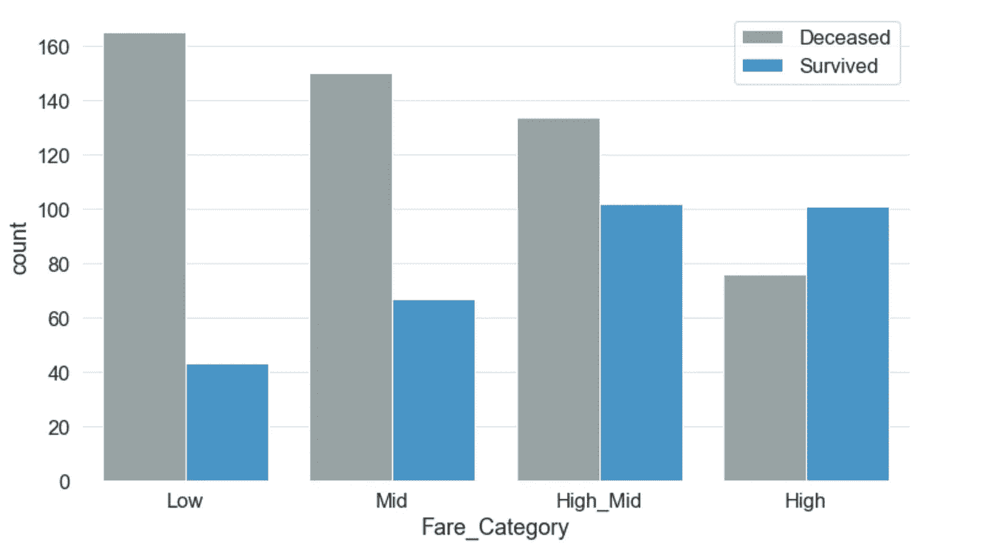

# 卡格尔泰坦尼克号问题初学者指南

> 原文：<https://towardsdatascience.com/a-beginners-guide-to-kaggle-s-titanic-problem-3193cb56f6ca?source=collection_archive---------1----------------------->


Image source: Flickr

因为这是我的第一篇文章，这里简单介绍一下我一直在做的事情:

我是一名软件开发人员，后来变成了数据爱好者。我最近开始了解数据科学的本质。当我开始通过 Udemy、Coursera 等网站上的视频和课程学习时，最突出的挑战之一就是。这让我变得被动，我听得更多，做得更少。我没有实践经验，尽管我能理解大部分理论。

就在那时，我遇到了 Kaggle，这是一个由多家大型科技公司(如谷歌)主办的网站，提供一系列数据科学问题和竞赛。在世界范围内，Kaggle 以其有趣、具有挑战性和非常非常令人上瘾的问题而闻名。其中一个问题是泰坦尼克号数据集。

总而言之，泰坦尼克号问题是基于 1912 年初“不沉之船”泰坦尼克号的沉没。它给你提供关于多人的信息，比如他们的年龄、性别、兄弟姐妹数量、登机点以及他们是否在灾难中幸存。基于这些特征，你必须预测泰坦尼克号上的任意一名乘客是否能在沉没中幸存。

听起来很简单，对吧？

没有。

问题陈述仅仅是**的冰山一角。**

# *使用的库*

1.  *熊猫*
2.  *海生的*
3.  *Sklearn*
4.  *WordCloud*

# *铺设土地*

*初始阶段处理完整数据集的特征。在这里，我没有试图塑造或收集这些特征，只是观察它们的品质。*

## *1.聚合*

*我最初聚集了来自训练和测试数据集的数据。得到的数据集有 1309 行和 12 列。每一行代表了 RMS 泰坦尼克号上的一个独特的乘客，每一列描述了每个乘客不同的有价值的属性。*

```
*trd = pd.read_csv('train.csv')
tsd = pd.read_csv('test.csv')td = pd.concat([trd, tsd], ignore_index=True, sort  = False)*
```

## *2.缺少值*

*数据集有几列缺少值。“Cabin”属性缺少 1014 个值。描述通勤者登机点的列“已登机”总共有 2 个缺失值。属性“Age”有 263 个缺失值，列“Fare”有一个缺失值。*

```
*td.isnull().sum()sns.heatmap(td.isnull(), cbar = False).set_title("Missing values heatmap")*
```

**

## *3.种类*

*此外，为了理解分类和非分类特性，我查看了每一列中唯一值的数量。属性“性别”和“幸存”有两个可能的值，属性“上船”和“Pclass”有三个可能的值。*

```
*td.nunique()PassengerId    1309
Survived          2
Pclass            3
Name           1307
Sex               2
Age              98
SibSp             7
Parch             8
Ticket          929
Fare            281
Cabin           186
Embarked          3
dtype: int64*
```

# *特征*

*在对数据集的不同方面有了更好的理解后，我开始探索这些特征以及它们在旅行者的生存或死亡中所起的作用。*

## *1.幸存*

*第一个特写报道了一个旅行者的生死。一项比较显示超过 60%的乘客已经死亡。*

## *2.Pclass*

*此功能呈现乘客分区。游客可以选择三个不同的区域，即一级、二级和三级。第三类的通勤人数最多，其次是第二类和第一类。三等舱的游客人数比一等舱和二等舱的乘客人数加起来还多。一级旅行者的生存机会高于二级和三级旅行者。*

**

## *3.性*

*大约 65%的游客是男性，其余 35%是女性。然而，女性幸存者的比例高于男性幸存者。超过 80%的男性通勤者死亡，相比之下，约 70%的女性通勤者死亡。*

## *4.年龄*

*船上最小的旅行者大约两个月大，最大的旅行者 80 岁。船上游客的平均年龄不到 30 岁。显然，**10 岁以下儿童存活的比例比死亡的比例大。或其他年龄组，伤亡人数高于幸存者人数。20 至 30 岁年龄组中有超过 140 人死亡，而同年龄组中只有大约 80 人幸存。***

**

## *5.SibSp*

*SibSp 是船上一个人的兄弟姐妹或配偶的数量。最多有 8 名兄弟姐妹和配偶与其中一名旅行者同行。**超过 90%的人独自或与他们的兄弟姐妹或配偶之一一起旅行。如果一个人和两个以上的兄弟姐妹或配偶一起旅行，生存机会会急剧下降。***

**

## *6.烤*

*与 SibSp 类似，该功能包含每位乘客同行的父母或孩子的数量。最多有 9 名父母/子女与其中一名旅行者同行。*

*我添加了“Parch”和“SibSp”值的数量，以存储在名为“Family”的新列中*

```
*td['Family'] = td.Parch + td.SibSp*
```

*此外，当一个旅行者独自旅行时，生存的机会会直线上升。创建了另一列，Is_Alone，如果“Family”列中的值为 0，则赋值为 True。*

```
*td['Is_Alone'] = td.Family == 0*
```

## *7.票价*

*通过把车费分成四类，很明显，费用和生存之间有很强的联系。游客支付的费用越高，生存的机会就越大。*

*我将分离的费用存储到一个新的列 Fare_Category 中*

```
*td['Fare_Category'] = pd.cut(td['Fare'], bins=[0,7.90,14.45,31.28,120], labels=['Low','Mid',                                                                                   'High_Mid','High'])*
```

**

## *8.从事*

*apollowed 暗示旅行者从哪里出发。Embark 有三个可能的值— **南安普敦、瑟堡和皇后镇**。超过 70%的人是从南安普敦上船的。不到 20%的乘客从瑟堡登机，其余的从皇后镇登机。从瑟堡登船的人比从南安普敦或皇后镇登船的人有更高的生还机会。*

**

*值得注意的是，我们没有使用“Ticket”列。*

# *数据插补*

*数据插补是用一些替代值替换缺失数据的做法。可以使用多种替代方法。我用它们中的一些来弥补缺失的值。*

## *1.从事*

*由于“登船”只有两个缺失值，并且从南安普敦登船的通勤者人数最多，因此从南安普敦登船的概率更高。所以，我们用南安普敦来填充缺失的值。然而，我们不是手动输入 Southampton，而是找到 apollowed 列的模式并用它替换丢失的值。众数是一个序列中出现频率最高的元素。*

```
*td.Embarked.fillna(td.Embarked.mode()[0], inplace = True)*
```

## *2.小木屋*

*因为“小屋”一栏有很多缺失的数据。我决定将所有缺失的数据归为不同的类别。我把它命名为 NA。我用这个值给所有缺失的值赋值。*

```
*td.Cabin = td.Cabin.fillna('NA')*
```

## *3.年龄*

*年龄是最难填写的一栏。年龄有 263 个缺失值。我最初是根据人们的称呼来给他们分类的。一个基本的 Python 字符串分割足以从每个名字中提取标题。有 18 个不同的标题。*

```
*td['Salutation'] = td.Name.apply(lambda name: name.split(',')[1].split('.')[0].strip())*
```

*然后，我将这些标题按照性别和类别进行了分类。*

```
*grp = td.groupby(['Sex', 'Pclass'])*
```

*然后在缺失的行中替换该组的中间值。*

```
*grp.Age.apply(lambda x: x.fillna(x.median()))
td.Age.fillna(td.Age.median, inplace = True)*
```

# *编码*

*由于字符串数据不适合机器学习算法，我需要将非数字数据转换成数字数据。我用 LabelEncoder 对“性别”一栏进行了编码。标签编码器会用某个数字代替“男性”值，用某个不同的数字代替“女性”值。*

```
*td['Sex'] = LabelEncoder().fit_transform(td['Sex'])*
```

*对于其他分类数据，我使用熊猫的假人。它添加对应于所有可能值的列。因此，如果有三个装载值——Q、C、S，get_dummies 方法将创建三个不同的列，并根据装载点分配值 0 或 1。*

```
*pd.get_dummies(td.Embarked, prefix="Emb", drop_first = True)*
```

# *删除列*

*此外，我删除了预测中不需要的列以及通过创建虚拟列而编码的列。*

```
*td.drop(['Pclass', 'Fare','Cabin', 'Fare_Category','Name','Salutation', 'Deck', 'Ticket','Embarked', 'Age_Range', 'SibSp', 'Parch', 'Age'], axis=1, inplace=True)*
```

# *预言；预测；预告*

*这是一个分类问题的例子，我试着用两种算法预测—*

1.  *随机森林*
2.  *高斯朴素贝叶斯*

*我对结果感到惊讶。高斯朴素算法表现不佳，而另一方面，随机森林的预测准确率始终在 80%以上。*

```
*# Data to be predicted
X_to_be_predicted = td[td.Survived.isnull()]
X_to_be_predicted = X_to_be_predicted.drop(['Survived'], axis = 1)
# X_to_be_predicted[X_to_be_predicted.Age.isnull()]
# X_to_be_predicted.dropna(inplace = True) # 417 x 27#Training data
train_data = td
train_data = train_data.dropna()
feature_train = train_data['Survived']
label_train  = train_data.drop(['Survived'], axis = 1)##Gaussian
clf = GaussianNB()
x_train, x_test, y_train, y_test = train_test_split(label_train, feature_train, test_size=0.2)
clf.fit(x_train,  np.ravel(y_train))
print("NB Accuracy: "+repr(round(clf.score(x_test, y_test) * 100, 2)) + "%")
result_rf=cross_val_score(clf,x_train,y_train,cv=10,scoring='accuracy')
print('The cross validated score for Random forest is:',round(result_rf.mean()*100,2))
y_pred = cross_val_predict(clf,x_train,y_train,cv=10)
sns.heatmap(confusion_matrix(y_train,y_pred),annot=True,fmt='3.0f',cmap="summer")
plt.title('Confusion_matrix for NB', y=1.05, size=15)*
```

**

```
*##Random forest
clf = RandomForestClassifier(criterion='entropy', 
                             n_estimators=700,
                             min_samples_split=10,
                             min_samples_leaf=1,
                             max_features='auto',
                             oob_score=True,
                             random_state=1,
                             n_jobs=-1)
x_train, x_test, y_train, y_test = train_test_split(label_train, feature_train, test_size=0.2)
clf.fit(x_train,  np.ravel(y_train))
print("RF Accuracy: "+repr(round(clf.score(x_test, y_test) * 100, 2)) + "%")result_rf=cross_val_score(clf,x_train,y_train,cv=10,scoring='accuracy')
print('The cross validated score for Random forest is:',round(result_rf.mean()*100,2))
y_pred = cross_val_predict(clf,x_train,y_train,cv=10)
sns.heatmap(confusion_matrix(y_train,y_pred),annot=True,fmt='3.0f',cmap="summer")
plt.title('Confusion_matrix for RF', y=1.05, size=15)*
```

**

```
*RF Accuracy: 78.77%
The cross validated score for Random forest is: 84.56*
```

*最后，我创建了一个提交文件来存储预测的结果。*

```
*result = clf.predict(X_to_be_predicted)
submission = pd.DataFrame({'PassengerId':X_to_be_predicted.PassengerId,'Survived':result})
submission.Survived = submission.Survived.astype(int)
print(submission.shape)
filename = 'Titanic Predictions.csv'
submission.to_csv(filename,index=False)
print('Saved file: ' + filename)*
```

*下面的代码行特别重要，因为如果幸存值不是 int 数据类型，Kaggle 会认为预测是错误的*

```
*submission.Survived = submission.Survived.astype(int)*
```

**

*Submission result*

*完整的实现 Jupyter 笔记本可以在我的 [GitHub](https://github.com/sumitmukhija/Titanic) 或者 [Kaggle](https://www.kaggle.com/sumukhija/top-8-tip-of-the-iceberg-eda-prediction) 上找到。提交的作品让我进入了前 8%的参赛者。这并不容易，我尝试了 20 多次才到达那里。我会说关键是要善于分析，玩转分析，凭直觉去尝试一切，不管这听起来有多荒谬。*