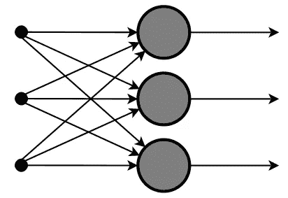
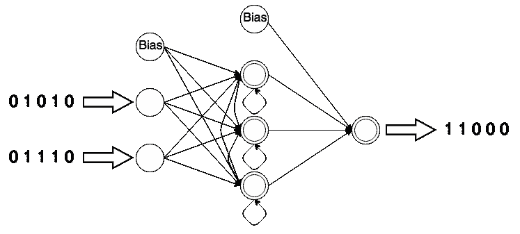
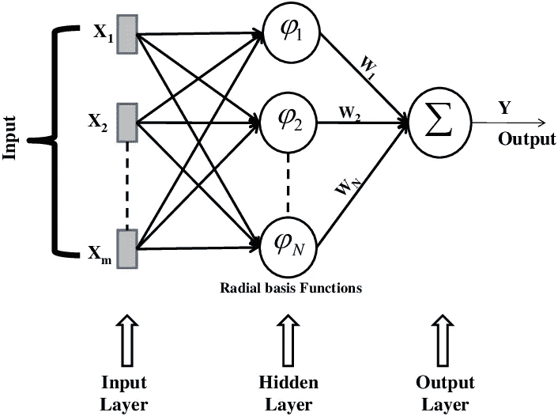
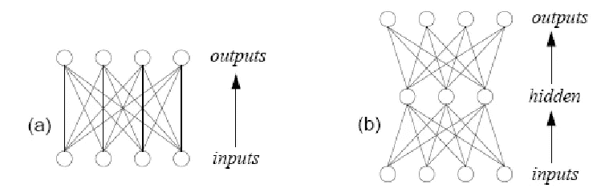

# 神经网络初学者指南

> 原文：<https://towardsdatascience.com/a-beginners-guide-to-neural-networks-d5cf7e369a13?source=collection_archive---------9----------------------->

## 用每个非技术人员都能理解的术语进行分解

Photo by [Fré Sonneveld](https://unsplash.com/@fresonneveld?utm_source=medium&utm_medium=referral) on [Unsplash](https://unsplash.com?utm_source=medium&utm_medium=referral)

> “神经网络是一种技术，它不是一种算法，而是一个有权重的网络，你可以调整权重，以便它学习。你通过试验来教授它。”—霍华德·莱茵戈德

Ai 来了，AI 来了。

这就是这些天我们所听到的，以及它将如何严重影响每个人的生活。工作将会失去，人类将会被各行各业的机器所取代，还有许多其他在杂志和博客上写的末日预言。

有多少人知道世界上有哪些人工智能？

这篇文章将涵盖其中的一个方面，神经网络初学者指南。我们将看看什么是神经网络，它们如何运作，有哪些不同的类型，以及它们如何能够并将如何影响我们的生活。

让我们先来看看这些网络是什么。

# 什么是神经网络

[人工神经网络](https://en.wikipedia.org/wiki/Artificial_neural_network) (ANN)是受构成动物大脑的生物神经网络启发但又不完全相同的计算系统。这种系统通过考虑例子来“学习”执行任务，通常没有用特定于任务的规则来编程。

他们通过观察一个物体的例子来学习，比如一只猫或一幅画，并识别某些特征，这样他们就可以在其他图像中确定这个物体。这些网络不需要知道它们正在分析的对象的任何信息。他们足够聪明，可以查看一些例子，并快速对事物进行分类，做出预测等。

现在你知道什么是神经网络，让我们看看它们是如何工作的。

# 它们是如何工作的？

神经网络由神经元驱动，神经元是排列在一系列相互连接的层中的微小单元。其中一层被称为输入单元，它被设计用来从外界接收不同形式的信息，然后进行识别、解释和分类。另一个单元是输出，位于网络的另一端，等待处理的结果。在输入和输出之间是隐藏的单元，它们执行大部分工作，决定如何处理输入的信息。

一个单位和另一个单位之间的联系称为权重，可以是正的，也可以是负的。每个单元从其左侧的单元接收输入，这些输入乘以它们所经过的连接的权重。每个单元将它接收到的所有输入相加，如果总和超过某个阈值，该单元就会“触发”并触发它所连接的单元。

神经网络通过接收反馈并告诉它是对还是错来学习。根据反馈，网络将进行调整以纠正错误。想想棒球中的一名击球手面对一名投手，他挥棒三振出局。他将回到休息区，思考他做错了什么。下次他站起来面对投手时，他会记得自己做错了什么，并做出相应的调整。

神经网络具有极强的适应性，学习能力强，并且有多种多样的类型，我们接下来会讲到。

# 神经网络的类型

根据原理、参数和数学运算，神经网络有许多不同的类型。他们每个人都有自己的长处和短处，学习的东西也不一样。我们探索当今最常用的类型以及它们的用途。

1.**前馈神经网络**–这可能是最简单的网络，也最容易理解。数据从输入端只向一个方向前进，直到到达输出端。在此过程中，计算输入和权重的乘积之和。最终结果被传递到输出端进行处理。

这些主要用于面部识别和计算机视觉，并被配备来处理包含大量噪声的数据。

2.**递归神经网络(RNN)长短期记忆**——这个网络保存特定层的输出，并将其反馈到输入中。第一层以与前馈神经网络相同的方式形成，计算输入和权重的总和。然而，在之后的层中，循环过程开始了。

在每一步中，节点将记住它在前一步中拥有的一些信息。它在计算和执行操作时充当存储单元。神经网络开始时与前馈网络一样，但记住信息以备后用。

这种类型的神经网络在语音到文本转换技术中非常有效。

3.**径向基函数神经网络**–该网络考虑了任意点相对于中心的距离。它们有两层，内层和外层。内层具有结合径向基函数的特征。径向基函数是实值函数，其值取决于输入和某个固定点(原点或中心)之间的距离。接下来，在下一时间步计算相同的输出时，考虑这些特征的输出。

径向基函数神经网络主要用于电力恢复系统。多年来，电力系统变得越来越大，越来越复杂，使得这个网络更加复杂。

可以看到，径向基函数神经网络和递归神经网络以相同的方式处理项目。

4.**卷积神经网络(CNN)**——这些网络的主要目的是从输入图像中提取特征。卷积通过使用输入数据的小正方形来学习图像特征，从而保留像素之间的空间关系。它由一个或多个卷积层和使用绑定权重和池层的完全连接层组成。

这些网络用于计算机视觉应用、物体识别应用，如机器视觉和自动驾驶车辆。

5.**感知器**–是一种二进制分类器的监督学习算法，使神经元能够一次一个地学习和处理训练集中的元素。换句话说，它执行计算来检测特征，并决定输入是否属于某个特定的类别。感知器主要有两种:单层感知器和多层感知器。它们都被归类为前馈神经网络，因为它们只向一个方向移动。

**a.** **单层感知器**–不具有任何输入的先验知识，因此初始权重是随机分配的。感知器将所有加权输入相加，如果总和高于阈值，则认为感知器被激活。将输入值呈现给感知器，如果预测输出与期望输出相同，则认为性能令人满意，并且不对权重进行改变。但是，如果输出与所需输出不匹配，则需要更改权重以减少误差。

**b.** **多层感知器**——结构与单层相同，但增加了一个或多个隐藏层。该算法由两个阶段组成:前向阶段，其中激活从输入层传播到输出层；后向阶段，其中输出层中观察到的实际值和请求的标称值之间的误差向后传播，以便修改权重和偏差值。

# 这些神经网络是如何使用的？

我们上面讨论的所有神经网络都是为发现数据中的模式而设计的。整理这些模式的具体任务是聚类、分类和预测。所有这些任务都解决了可用于许多领域的特定问题，例如财务、销售、营销和安全。

从预测股市每天的表现到使用面部识别软件抓住罪犯，一切都是通过神经网络来完成的。

这些网络可以利用聊天机器人、目标营销和市场细分等工具用于营销目的。我在前面的文章中提供了一些真实世界的例子，以及在哪里实现它。

在接下来的几年里，神经网络将在生物医学系统中实现，用于追踪疾病或预测一个人有多大比例可能倾向于某种遗传特征或异常。

# 结论

就像保罗·里维尔(Paul Revere)著名的骑马警告人们英国人来了一样，人工智能不仅在路上，而且就在这里。但是不像红色外套的到来，没有人会担心他们的生命。

这是对这些不断发展的技术的介绍，它告诉你什么是神经网络，它们是如何工作的，不同的类型以及它们今天是如何被使用的。我们都应该从这些网络所提供的东西中受益，而不要害怕一些我们不熟悉的技术的影响。