# Q-Learning 初学者指南

> 原文：<https://towardsdatascience.com/a-beginners-guide-to-q-learning-c3e2a30a653c?source=collection_archive---------0----------------------->

## 决定性的反思

## 无模型强化学习

一旦你的狗犯了错误，你是否曾经责备或惩罚它？或者你有没有训练过一只宠物，你要求的每一个正确的命令都会奖励它？如果你是宠物主人，可能你的答案会是“是”。你可能已经注意到，一旦你从它年轻的时候就经常这样做，它的错误行为就会一天天地减少。同样，它会从错误中学习，训练自己。

作为人类，我们也经历了同样的事情。你还记得吗，在我们上小学的时候，一旦我们把功课做好了，老师就会奖励我们星星。:D

这正是在**强化学习(RL)** 中发生的事情。

> 强化学习是人工智能中最美的分支之一

RL 的目标是 ***通过响应动态环境*** 采取一系列行动来最大化代理人的报酬。

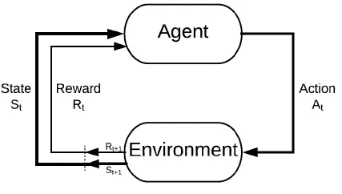

There are 4 basic components in Reinforcement Learning; agent, environment, reward and action.

强化学习是利用经验做出最佳决策的科学。分解一下，强化学习的过程包括以下简单的步骤:

1.  观察环境
2.  使用某种策略决定如何行动
3.  相应地行动
4.  接受奖励或惩罚
5.  吸取经验教训，完善我们的战略
6.  迭代直到找到最优策略

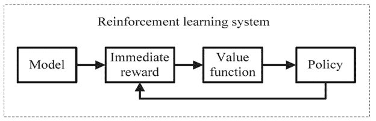

Source: [link](http://H. Nguyen and H. La, "Review of Deep Reinforcement Learning for Robot Manipulation," in 2019 Third IEEE International Conference on Robotic Computing (IRC), Naples, Italy, 2019, pp. 590–595)

有两种主要类型的 RL 算法。分别是*和 ***无模型*** 。*

****无模型*** 算法是一种不使用或估计环境的动态性(转移和奖励函数)而估计最优策略的算法。然而，基于 ***模型的*** 算法是使用转移函数(和回报函数)来估计最优策略的算法。*

# *进入 Q-Learning*

****Q*-学习**是一种 ***无模型*** 强化学习算法。*

*Q-learning 是一种基于 ***值的*** 学习算法。基于值的算法基于等式(尤其是贝尔曼等式)更新值函数。而另一种类型， ***基于策略的*** 利用从上次策略改进中获得的贪婪策略来估计值函数。*

*Q-learning 是一个 ***非策略学习者*** 。意味着它独立于代理的行为学习最优策略的值。另一方面， ***基于策略的学习器*** 学习代理正在执行的策略的值，包括探索步骤，并且考虑到策略中固有的探索，它将找到最优的策略。*

## *这个‘Q’是什么？*

*Q-learning 中的“Q”代表质量。质量在这里代表了一个给定的行为在获得未来回报中的有用程度。*

## ***Q-学习定义***

*   ***Q*(s，a)** 是在状态 s 下做 a，然后遵循最优策略的期望值(累计贴现报酬)。*
*   *Q-learning 使用**时间差异(TD)** 来估计 Q*(s，a)的值。时间差异是一个主体在事先没有环境知识的情况下通过片段从环境中学习。*
*   *代理维护一个 **Q[S，A]** 表，其中 **S** 是**状态**的集合， **A** 是**动作**的集合。*
*   *Q[s，a]表示其对 Q*(s，a)的当前估计。*

## *q-学习简单示例*

*在本节中，Q-learning 已经通过演示进行了解释。*

*假设一个智能体必须沿着一条有障碍的路径从起点移动到终点。智能体需要以最短的路径到达目标，而不碰到障碍物，并且他需要沿着障碍物覆盖的边界前进。为了方便起见，我在一个定制的网格环境中做了如下介绍。*

*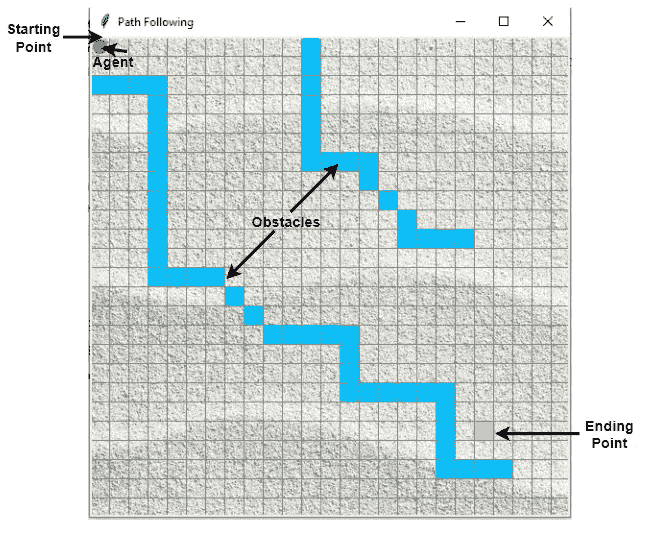*

*Agent and its Environment*

## ***介绍 Q 表***

*Q-Table 是用于计算每个状态下行动的最大预期未来回报的数据结构。基本上，这张表将指导我们在每个状态下的最佳行动。为了学习 Q 表的每个值，使用 Q 学习算法。*

## ***Q 功能***

*Q 函数使用贝尔曼方程并接受两个输入:状态(s)和动作(a)。*

*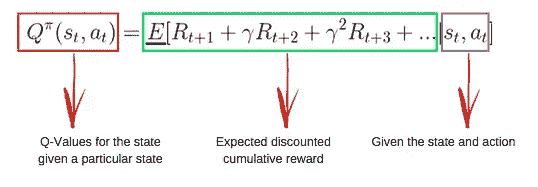*

*Bellman Equation. Source: [link](https://www.freecodecamp.org/news/an-introduction-to-q-learning-reinforcement-learning-14ac0b4493cc/)*

## *q-学习算法过程*

*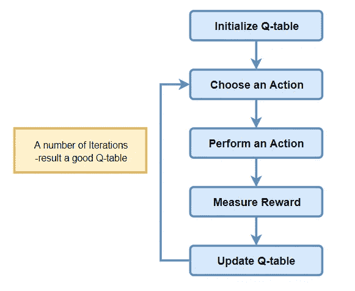*

*Q-learning Algorithm*

## ***步骤 1:初始化 Q 工作台***

*首先要建立 Q 表。有 n 列，其中 n=动作的数量。有 m 行，其中 m=状态数。*

*在我们的例子中，n =向左、向右、向上和向下，m=开始、空闲、正确路径、错误路径和结束。首先，让我们将值初始化为 0。*

*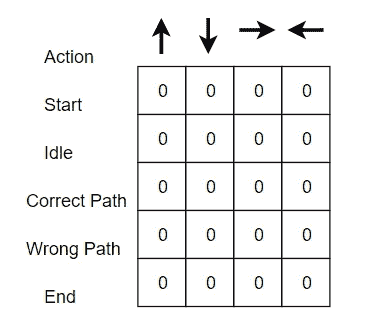*

*Initial Q-table*

## ***第二步:选择一个动作***

## ***步骤 3:执行一个动作***

*步骤 2 和 3 的组合执行不确定的时间量。这些步骤会一直运行，直到训练停止，或者训练循环按照代码中的定义停止。*

*首先，基于 Q 表选择状态中的动作(a)。注意，如前所述，当剧集开始时，每个 Q 值都应该是 0。*

*然后，使用上面陈述的贝尔曼方程更新在起点和向右移动的 Q 值。*

****ε贪婪策略*** 的概念在这里发挥了出来。开始时，ε比率会更高。代理将探索环境并随机选择行动。这在逻辑上是这样发生的，因为代理对环境一无所知。当代理探索环境时，ε速率降低，代理开始利用环境。*

*在探索的过程中，代理在估计 Q 值时逐渐变得更有信心。*

*在我们的代理示例中，当代理的训练开始时，代理完全不知道环境。因此，让我们说，它采取了一个随机行动，其'正确'的方向。*

*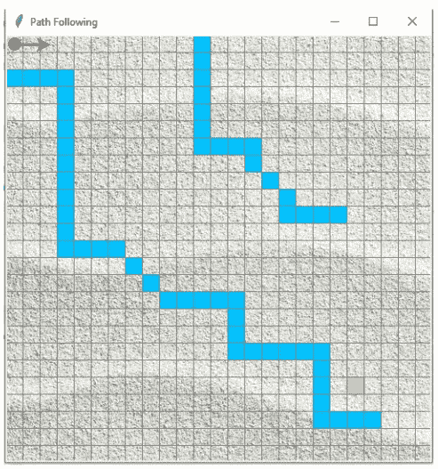*

*Action : Agent follows ‘right’*

*现在，我们可以使用贝尔曼方程更新位于起点并向右移动的 Q 值。*

*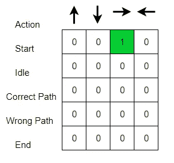*

*Updated Q-table*

***第四步:衡量奖励***

*现在我们已经采取了一项行动，并观察到了一个结果和奖励。*

***第五步:评估***

*我们需要更新函数 Q(s，a)。*

*这个过程反复重复，直到学习停止。这样，Q 表被更新，并且值函数 Q 被最大化。这里 Q(state，action)返回该状态下该行为的**预期未来回报**。*

*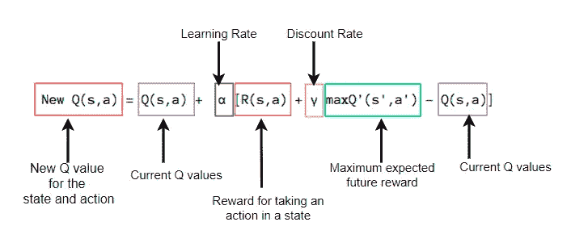*

*Bellman Equation Explanation for the episodes*

*在示例中，我输入了如下奖励方案。*

> *当离目标更近一步时奖励= +1*
> 
> *击中障碍物时的奖励=-1*
> 
> *空闲时奖励=0*

*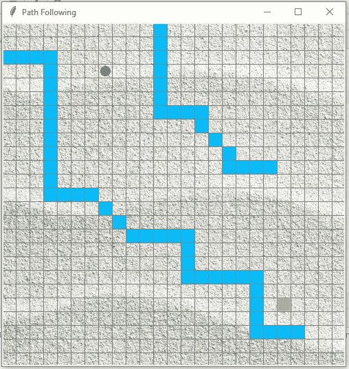**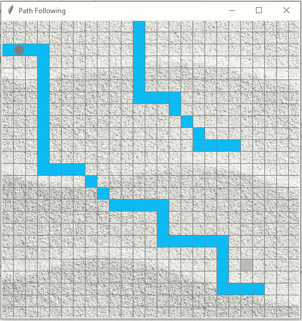**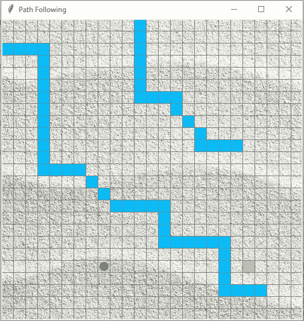*

*Figure (a) Positive Reward, (b) & (c) Negative Rewards*

*最初，我们探索代理的环境并更新 Q 表。当 Q 表准备好时，代理开始利用环境并开始采取更好的行动。最终 Q 表可能如下所示(例如)。*

*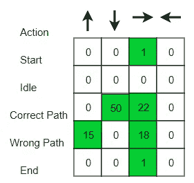*

*Example final Q-table*

*以下是培训后代理实现目标的最短路径的结果。*

*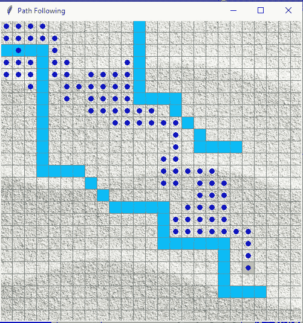*

*Agent’s navigation towards the goal*

*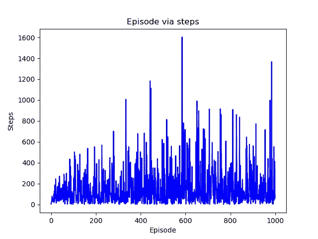**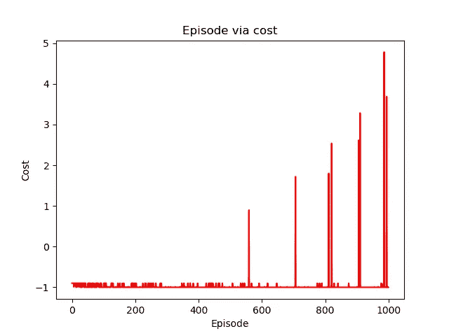*

**Plotting the results for the number of steps (a) Episode via steps, (b) Episode via cost**

# *履行*

*请投邮件掌握 python 实现代码的概念解释。*

# *参考*

*[1] H. Nguyen 和 H. La，“机器人操纵的深度强化学习综述”，载于 *2019 年第三届 IEEE 机器人计算国际会议(IRC)* ，意大利那不勒斯，2019 年，第 590–595 页。*

*[2][https://www . freecodecamp . org/news/an-introduction-to-q-learning-reinforcement-learning-14 ac0 b 4493 cc/](https://www.freecodecamp.org/news/an-introduction-to-q-learning-reinforcement-learning-14ac0b4493cc/)*

*[3][https://courses . cs . ut . ee/mtat . 03.292/2014 _ spring/uploads/Main/Q-learning . pdf](https://courses.cs.ut.ee/MTAT.03.292/2014_spring/uploads/Main/Q-learning.pdf)*

*[4]https://towards data science . com/introduction-to-variable-reinforcement-learning-algorithms-I-q-learning-sarsa-dqn-ddpg-72 a5 E0 CB 6287*

*[5][https://blog.dominodatalab.com/deep-reinforcement-learning/](https://blog.dominodatalab.com/deep-reinforcement-learning/)*

*希望你通过这篇博文对 Q-learning 有一个清晰的认识。如果你对这篇博文有任何问题或评论，请在下面留下你的评论。*

**

*干杯，学习愉快！*