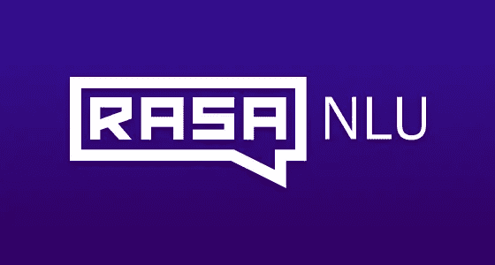

# Rasa NLU 意图分类和命名实体识别初学者指南

> 原文：<https://towardsdatascience.com/a-beginners-guide-to-rasa-nlu-for-intent-classification-and-named-entity-recognition-a4f0f76b2a96?source=collection_archive---------1----------------------->



Image taken from [https://givemechallenge.com/wp-content/uploads/2017/01/rasa-NLU.png](https://givemechallenge.com/wp-content/uploads/2017/01/rasa-NLU.png)

本文的目的是探索使用 Rasa NLU 进行意图分类和命名实体识别的新方法。从版本 1.0.0 开始，Rasa NLU 和 Rasa 核心已经合并到一个框架中。因此，培训流程和可用功能有一些小的变化。首先也是最重要的是， [Rasa](http://rasa.com/docs/rasa/user-guide/installation/) 是一个开源的机器学习框架，用于自动化基于文本和语音的对话。换句话说，你可以使用 Rasa 来建立类似于智能聊天机器人的上下文和分层对话。在本教程中，我们将专注于框架的自然语言理解部分，以捕捉用户的意图。

截至 2020 年 10 月，Rasa 已正式发布 2.0 版本(Rasa 开源)。与版本 1 相比，数据训练格式发生了显著变化。查看我关于[聊天机器人和 Rasa 2.0 新功能](https://medium.com/better-programming/chatbots-and-whats-new-in-rasa-2-0-a51c61ca3c33)的最新文章，了解更多信息。

本教程有 5 个部分:

1.  设置和安装
2.  数据准备和格式
3.  培训和测试
4.  运行 NLU 服务器
5.  结论

# [第 1 节]设置和安装

我使用的是安装在 Windows 操作系统虚拟环境中的 Python 3.6.7。建议将其安装在干净的虚拟环境中，因为有相当多的 python 模块需要安装。

## Python 模块

为了简单起见，我们将只安装一个可用于所有语言的标准管道。在官方文档中，团队建议使用 spaCy 管道，但我们将使用基于 Tensorflow 的**监督嵌入**管道。激活虚拟环境并运行以下命令:

```
pip install rasa
```

模块安装和升级可能需要一段时间。完成后，指向您选择的目录并运行以下命令:

```
rasa init --no-prompt
```

您将能够看到使用默认数据的 nlu 和 core 的培训过程。将创建以下文件:

1.  **__init__。py** :一个空文件，帮助 python 找到你的动作。
2.  **actions.py** :定制动作的代码
3.  **config.yml** :您的 NLU 和核心机型的配置
4.  **credentials.yml** :连接其他服务的详细信息
5.  **data/nlu.md** :你的 nlu 训练数据
6.  **data/stories.md** :你的故事
7.  **domain.yml** :您助手的域
8.  **endpoints.yml** :连接端点通道详情
9.  **型号/ <时间戳> .tar.gz** :你的初始型号。时间戳的格式为 YYYYMMDD-hhmmss。仅限 NLU 的型号前面会有 nlu 前缀。

其实你已经训练出了一个完整的模型，可以用于意图分类。让我们继续下一部分，了解更多有关培训数据格式的信息。

# [第二节]数据准备和格式

如果您想使用自己的定制数据来训练它，您可以准备 markdown 或 json 格式的数据。我将在本教程中使用 markdown，因为它是最简单的。请参考下面的[链接](http://rasa.com/docs/rasa/nlu/training-data-format/)，了解所有可用培训数据格式的更多信息。打开*数据/nlu.md* 数据，根据自己的用例开始修改内容。

## 目的

您可以使用## intent:name_of_intent 指定意图，后跟一个意图问题列表(每个意图之间有空格):

```
## intent:goodbye
- bye
- goodbye
- see you around
- see you later
- talk to you later## intent:ask_identity
- who are you
- what is your name
- how should i address you
- may i know your name
- are you a bot
```

## 实体

您可以指定每个问题中的实体，如下所示[值](实体名称):

```
## intent:ask_shop_open
- does the shop open on [monday](weekday)
- does the shop open on [wednesday](weekday)
- does the shop open on [friday](weekday)
```

在这种情况下，weekday 是实体的名称，而 monday 是值。为了抓住实体，你需要提供大量的例子。请注意**上盒**和**下盒**影响精度。星期一和星期一不一样。因此，建议在评估过程中，将所有数据训练为小写，并将输入数据解析为小写。

## 查找表

如果单个实体有一个很长的值列表，建议包括一个查找表，而不是作为例句填写所有的值。有两种方法可以做到。第一种是将它们包含在内:

```
## lookup:weekday
- monday
- tuesday
- wednesday
- thursday
- friday
```

第二种方法是在一个文本文件中列出它，并内嵌路径。让我们用一个名为“国家”的新实体来试试:

```
## lookup:countries
path/to/countries.txt
```

在 *countries.txt* 中，你可以在新的一行中指定每个元素如下:

```
singapore
malaysia
vietnam
indonesia
thailand
```

就像 weekday 实体一样，你必须提供几个例子让它进行概括。

```
## intent:inform_country_of_origin
- i am from [malaysia](countries)
- i am from [vietnam](countries)
- i came from [thailand](countries)
```

## 同义词

Rasa 还提供了一种识别同义词并将其映射回单个值的方法。第一种方法是像[synonym1](entity:value)一样内联添加它:

```
## intent:ask_eaten
- what did you have for [breakfast](meal)
- what did you have for [break fast](meal:breakfast)
- what did you have for [breakfat](meal:breakfast)
```

第二种方法如下:

```
## synonym:breakfast
- brekfast
- brokefast
```

synonym 与查找表的不同之处在于，synonym 将实体的值映射到单个值(本例中为早餐)。换句话说，同义词是捕捉拼写错误和首字母缩略词的好方法，而查找表是概括例子的好方法。

## 正则表达式

还有一个支持正则表达式的特性叫做 regex。

```
## intent:inform_zipcode
- my zipcode is [12345](zipcode)
- my zipcode is [33456](zipcode)
- my zipcode is [94056](zipcode)## regex:zipcode
- [0-9]{5}
```

我附上了一个示例文本文件供您参考:

## 转换数据格式

Markdown 可以说是初学者创建数据的最安全的选择。然而，可能存在训练数据是自动的或来自其他来源的情况，例如 LUIS 数据格式、WIT 数据格式、Dialogflow 数据格式和 json。Rasa 还为您提供了一种转换数据格式的方法。查看以下[链接](http://rasa.com/docs/rasa/user-guide/command-line-interface/#convert-data-between-markdown-and-json)了解更多。确保虚拟环境已激活，并运行以下命令(它将 md 转换为 json):

```
rasa data convert nlu --data data/nlu.md --out data/nlu.json -f json
```

1.  **-数据**是包含拉莎·NLU
    数据的文件或目录的路径。
2.  **- out** 是以 Rasa 格式保存训练数据的文件名。
3.  **-f** 是训练数据应该转换成的输出格式
    。接受 json 或 md。

一旦你有了所有需要的数据，将它移动到**数据**文件夹并删除任何现有的。让我们继续下一部分。

# [第 3 节]培训和测试

## 培训模式

要训练 nlu 模型，您只需运行以下命令:

```
rasa train nlu
```

如官方文件所述，它将在**数据**文件夹中查找 NLU 训练数据文件，并将一个训练好的模型保存在**模型**文件夹中。记住从**数据**文件夹中移除任何不必要的数据文件。模型的名称将以 nlu-为前缀，以表明这是一个仅 nlu 的模型。话虽如此，您可以使用- data 参数指定路径。完整的参数列表可在处[找到。](http://rasa.com/docs/rasa/user-guide/command-line-interface/#train-a-model)

## 测试模型

您可以通过以下命令运行交互式 shell 模式来测试模型:

```
rasa shell nlu
```

如果您有多个 nlu 模型，并且想要测试一个特定的模型，请使用下面的命令。

```
rasa shell -m models/nlu-20190515-144445.tar.gz
```

检查以下[链接](http://rasa.com/docs/rasa/user-guide/command-line-interface/#talk-to-your-assistant)，了解更多关于附加参数的信息。你可以输入你的文本并按回车键。shell 将返回一个 json 来表明意图和可信度。

# [第 4 节]运行 NLU 服务器

## 运行服务器

Rasa 还为您提供了一种启动 nlu 服务器的方法，您可以通过 HTTP API 调用该服务器。运行以下命令(相应地修改模型的名称):

```
rasa run --enable-api -m models/nlu-20190515-144445.tar.gz
```

您应该会看到以下输出:

```
Starting Rasa Core server on http://localhost:5005
```

您可以通过在命令中一起指定参数来修改一些设置。查看以下[链接](http://rasa.com/docs/rasa/user-guide/command-line-interface/#start-a-server)了解更多信息。对于 cors 参数，它接受 URL 列表。它允许跨源资源共享，即告诉浏览器让在一个源(域)上运行的 web 应用程序有权访问来自不同源的服务器的选定资源。您可以使用“*”将所有域列入白名单。

```
rasa run --enable-api -m models/nlu-20190515-144445.tar.gz --cors "*"
```

在撰写本文时，似乎没有办法停止或中断服务器。我确实试过 Ctrl+C，但它只是偶尔有效。如果你遇到这样的问题，唯一的办法就是终止进程。只需点击关闭命令提示符，并重新运行它。一旦服务器开始运行，您就可以使用 curl 测试结果。打开一个新的命令提示符并运行以下行:

```
curl localhost:5005/model/parse -d '{"text":"hello"}'
```

您应该能够获得一个 json 结果，表明如下所示的意图和置信度:

```
{"intent":{"name":"greet","confidence":0.9770460725},"entities":[],"intent_ranking":[{"name":"greet","confidence":0.9770460725},{"name":"mood_unhappy","confidence":0.0257926807},{"name":"ask_identity","confidence":0.0009481288},{"name":"mood_great","confidence":0.0},{"name":"inform_identity","confidence":0.0},{"name":"goodbye","confidence":0.0}],"text":"hello"}
```

## HTTP API

Rasa 还附带了自己的 HTTP API，如果您打算通过 AJAX 调用它，这个 API 会很有用。请参考完整的名单[这里](http://rasa.com/docs/rasa/api/http-api/)。在本教程中，我们将只关注一个 API 调用，它用于预测发送到端点的消息的意图和实体。您只需将 POST 呼叫发送到以下 URL:

```
[http://localhost:5005/model/parse](http://localhost:5005/model/parse)
```

下面是一个通过 AJAX POST 调用的例子:

最新的框架取消了在单个服务器中调用多个模型的能力。在前面的框架中，我们可以指定自己的模型作为参数，以指示哪个模型用于分类。现在，它正式成为每台服务器一个型号。

# [第五节]结论

就这样，伙计们！让我们回顾一下，我们已经学习了如何使用 Rasa NLU 来训练我们自己的意图分类和实体提取模型。下一步是微调和进行进一步的培训，以优化当前的模型。如果您打算拥有一个基于故事进行回复的羽翼丰满的聊天机器人框架，您也可以选择查看 Rasa Core。另一方面，如果你已经为你的聊天机器人使用了其他框架，那么只使用 NLU 可以为你提供更大的灵活性。如果你有兴趣在信息平台中建立聊天机器人，请点击下面的[链接](http://rasa.com/docs/rasa/user-guide/messaging-and-voice-channels/)。感谢您的阅读，祝您愉快！

# 参考

1.  [http://rasa.com/docs/rasa/user-guide/installation/](http://rasa.com/docs/rasa/user-guide/installation/)
2.  [http://rasa.com/docs/rasa/user-guide/rasa-tutorial/](http://rasa.com/docs/rasa/user-guide/rasa-tutorial/)
3.  [http://rasa.com/docs/rasa/api/http-api/](http://rasa.com/docs/rasa/api/http-api/)
4.  http://rasa.com/docs/rasa/user-guide/command-line-interface
5.  【http://rasa.com/docs/rasa/nlu/training-data-format/ 
6.  [http://rasa.com/docs/rasa/nlu/using-nlu-only/](http://rasa.com/docs/rasa/nlu/using-nlu-only/)
7.  [http://rasa . com/docs/rasa/user-guide/messaging-and-voice-channels/](http://rasa.com/docs/rasa/user-guide/messaging-and-voice-channels/)