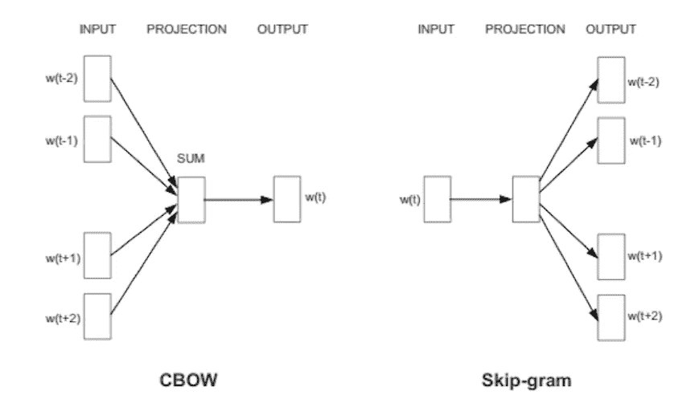
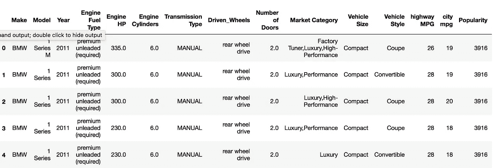
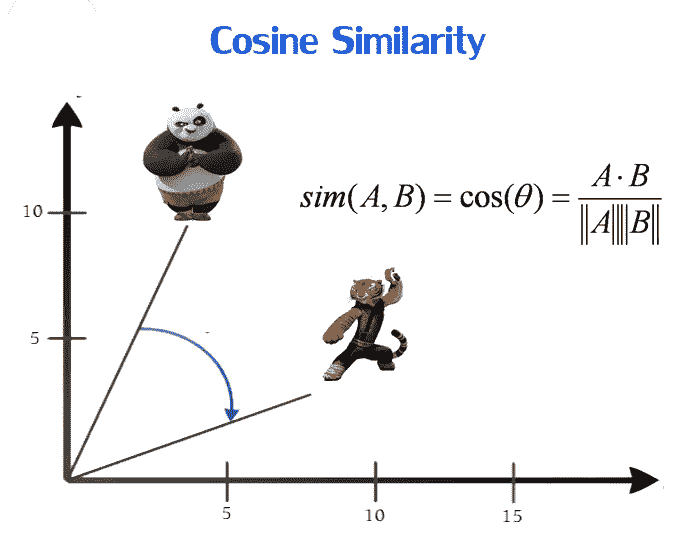
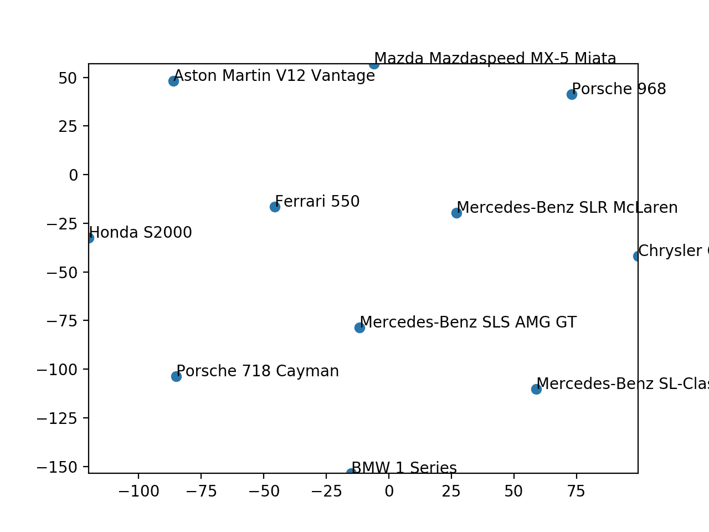

# 用 Gensim Word2Vec 模型嵌入单词的初学者指南

> 原文：<https://towardsdatascience.com/a-beginners-guide-to-word-embedding-with-gensim-word2vec-model-5970fa56cc92?source=collection_archive---------1----------------------->


> 单词嵌入是自然语言处理(NLP)中最重要的技术之一，其中单词被映射到实数的向量。单词嵌入能够捕获文档中单词的含义、语义和句法相似性以及与其他单词的关系。它还被广泛用于推荐系统和文本分类。本教程将简要介绍 genism word2vec 模型，并给出一个为 vehicle make 模型生成单词嵌入的例子。

## 目录

*   [1。Word2vec](https://medium.com/p/5970fa56cc92#702d) 简介
*   [2。Gensim Python 库介绍](https://medium.com/p/5970fa56cc92#b513)
*   [3。用 Gensim Word2Vec 模型实现单词嵌入](https://medium.com/p/5970fa56cc92#9a6d)
*   [3.1 数据预处理:](https://medium.com/p/5970fa56cc92#ffb7)
*   [3.2。Genism word2vec 模型训练](https://medium.com/p/5970fa56cc92#e71b)
*   [4。计算相似度](https://medium.com/p/5970fa56cc92#9731)
*   [5。T-SNE 可视化技术](https://medium.com/p/5970fa56cc92#23fc)

# 1.Word2vec 简介

Word2vec 是使用两层神经网络学习单词嵌入的最流行的技术之一。它的输入是一个文本语料库，输出是一组向量。通过 word2vec 嵌入单词可以使自然语言变得计算机可读，然后对单词进一步执行数学运算可以用来检测它们的相似性。一组训练有素的单词向量会将相似的单词彼此靠近地放置在那个空间中。例如，单词“女人”、“男人”和“人类”可能聚集在一个角落，而“黄色”、“红色”和“蓝色”则聚集在另一个角落。



word2vec 有两种主要的训练算法，一种是连续单词包(CBOW)，另一种叫做 skip-gram。这两种方法的主要区别在于 CBOW 使用上下文来预测目标单词，而 skip-gram 使用单词来预测目标上下文。通常，与 CBOW 方法相比，skip-gram 方法可以具有更好的性能，因为它可以捕获单个单词的两种语义。例如，它将有两个代表苹果的向量，一个代表公司，另一个代表水果。关于 word2vec 算法的更多细节，请查看[这里](https://arxiv.org/pdf/1301.3781.pdf)。

# 2.Gensim Python 库简介

Gensim 是一个用于自然语言处理的开源 python 库，由捷克自然语言处理研究员[拉迪姆·řehůřek](https://www.linkedin.com/in/radimrehurek/)开发和维护。Gensim 库将使我们能够通过在自定义语料库上训练我们自己的 word2vec 模型来开发单词嵌入，或者使用跳格算法的 CBOW。

首先，我们需要安装 genism 包。Gensim 可以在 Linux、Windows 和 Mac OS X 上运行，并且应该可以在任何其他支持 Python 2.7+和 NumPy 的平台上运行。Gensim 依赖于以下软件:

*   [**Python**](https://www.python.org/) > = 2.7(用 2.7、3.5、3.6 版本测试)
*   [](http://www.numpy.org/)**>= 1 . 11 . 3**
*   **[](https://www.scipy.org/)**>= 0 . 18 . 1****
*   ****[**六**](https://pypi.org/project/six/) > = 1.5.0****
*   ****[**smart _ open**](https://pypi.org/project/smart_open/)>= 1 . 2 . 1****

****有两种安装方式。我们可以在终端上运行下面的代码来安装 genism 包。****

```
**pip install --upgrade gensim**
```

****或者，对于 *Conda* 环境:****

```
**conda install -c conda-forge gensim**
```

# ****3.用 Gensim Word2Vec 模型实现单词嵌入****

****在本教程中，我将通过一个具体的例子展示如何使用 genism 生成单词嵌入。我在本教程中使用的数据集来自 [Kaggle 数据集](https://www.kaggle.com/CooperUnion/cardataset)。****

********

****该车辆数据集包括汽车的品牌、型号、年份、发动机和其他属性等特征。我们将使用这些特征来为每个制造模型生成单词嵌入，然后比较不同制造模型之间的相似性。完整的 python 教程可以在这里找到[。](https://github.com/zhlli1/Genism-word2vec/blob/master/Genism%20Word2Vec%20Tutorial.ipynb)****

```
**>>> df = pd.read_csv('data.csv')
>>> df.head()**
```

********

## ****3.1 数据预处理:****

****由于本教程的目的是学习如何使用 genism 库生成单词嵌入，为了简单起见，我们将不为 word2vec 模型进行 EDA 和特性选择。****

****Genism word2vec 要求用于训练的“列表列表”格式，其中每个文档都包含在一个列表中，并且每个列表都包含该文档的标记列表。首先，我们需要生成一个“列表列表”的格式来训练 make 模型单词嵌入。更具体地说，每个制造模型都包含在一个列表中，每个列表都包含该制造模型的特征列表。****

****为了实现这一点，我们需要做以下事情:****

****a.为制作模型创建新列****

```
**>>> df['Maker_Model']= df['Make']+ " " + df['Model']**
```

****b.为每个品牌车型生成一个具有以下特征的“列表列表”格式:发动机燃料类型、变速器类型、从动轮、市场类别、车辆尺寸、车型。****

```
**# Select features from original dataset to form a new dataframe 
>>> df1 = df[['Engine Fuel Type','Transmission Type','Driven_Wheels','Market Category','Vehicle Size', 'Vehicle Style', 'Maker_Model']]# For each row, combine all the columns into one column
>>> df2 = df1.apply(lambda x: ','.join(x.astype(str)), axis=1)# Store them in a pandas dataframe
>>> df_clean = pd.DataFrame({'clean': df2})# Create the list of list format of the custom corpus for gensim modeling 
>>> sent = [row.split(',') for row in df_clean['clean']]# show the example of list of list format of the custom corpus for gensim modeling 
>>> sent[:2]
[['premium unleaded (required)',
  'MANUAL',
  'rear wheel drive',
  'Factory Tuner',
  'Luxury',
  'High-Performance',
  'Compact',
  'Coupe',
  'BMW 1 Series M'],
 ['premium unleaded (required)',
  'MANUAL',
  'rear wheel drive',
  'Luxury',
  'Performance',
  'Compact',
  'Convertible',
  'BMW 1 Series']]**
```

## ****3.2.Genism word2vec 模型培训****

****我们可以使用自己的自定义语料库训练 genism word2vec 模型，如下所示:****

```
**>>> model = Word2Vec(sent, min_count=1,size= 50,workers=3, window =3, sg = 1)**
```

****让我们试着去理解这个模型的超参数。****

******size** :嵌入的维数，默认为 100。****

******窗口**:目标单词与其周围单词的最大距离。默认窗口是 5。****

******min_count** :训练模型时要考虑的最小字数；出现次数少于此计数的单词将被忽略。min_count 的默认值为 5。****

******工人**:培训时分区数量，默认工人为 3。****

******sg** :训练算法，CBOW(0)或 skip gram(1)。默认的训练算法是 CBOW。****

****在训练 word2vec 模型之后，我们可以直接从训练模型中获得单词嵌入，如下所示。****

```
**>>> model['Toyota Camry']array([-0.11884457,  0.03035539, -0.0248678 , -0.06297892, -0.01703234,
       -0.03832747, -0.0825972 , -0.00268112, -0.09192555, -0.08458661,
       -0.07199778,  0.05235871,  0.21303181,  0.15767808, -0.1883737 ,
        0.01938575, -0.24431638,  0.04261152,  0.11865819,  0.09881561,
       -0.04580643, -0.08342388, -0.01355413, -0.07892415, -0.08467747,
       -0.0040625 ,  0.16796461,  0.14578669,  0.04187112, -0.01436194,
       -0.25554284,  0.25494182,  0.05522631,  0.19295982,  0.14461821,
        0.14022525, -0.2065216 , -0.05020927, -0.08133671,  0.18031682,
        0.35042757,  0.0245426 ,  0.15938364, -0.05617865,  0.00297452,
        0.15442047, -0.01286271,  0.13923576,  0.085941  ,  0.18811756],
      dtype=float32)**
```

# ****4.计算相似度****

****现在，我们甚至可以通过调用 model.similarity()并传入相关单词，使用 Word2vec 来计算词汇表中两个 Make 模型之间的相似性。例如，model . similarity(' Porsche 718 Cayman '，' Nissan Van ')这将为我们提供 Porsche 718 Cayman 和 Nissan Van 之间的欧几里得相似性。****

```
**>>> model.similarity('Porsche 718 Cayman', 'Nissan Van')
0.822824584626184>>> model.similarity('Porsche 718 Cayman', 'Mercedes-Benz SLK-Class')
0.961089779453727**
```

****从上面的例子中，我们可以看出保时捷 718 Cayman 比日产 Van 更像奔驰 SLK 级。我们还可以使用内置函数 model.most_similar()来获得一组基于欧氏距离的最相似的 make 模型。****

```
**>>> model1.most_similar('Mercedes-Benz SLK-Class')[:5][('BMW M4', 0.9959905743598938),
 ('Maserati Coupe', 0.9949707984924316),
 ('Porsche Cayman', 0.9945154190063477),
 ('Mercedes-Benz SLS AMG GT', 0.9944609999656677),
 ('Maserati Spyder', 0.9942780137062073)]**
```

****然而，欧几里德相似性不能很好地用于高维单词向量。这是因为欧几里德相似性会随着维数的增加而增加，即使嵌入这个词代表不同的意思。或者，我们可以使用余弦相似性来度量两个向量之间的相似性。在数学上，它测量的是在多维空间中投影的两个向量之间的角度余弦。余弦相似度捕捉单词向量的角度，而不是幅度。在余弦相似度下，没有相似度被表示为 90 度角，而总相似度 1 处于 0 度角。****

********

****以下函数显示了如何基于余弦相似度生成最相似的 make 模型。****

```
**def cosine_distance (model, word,target_list , num) :
    cosine_dict ={}
    word_list = []
    a = model[word]
    for item in target_list :
        if item != word :
            b = model [item]
            cos_sim = dot(a, b)/(norm(a)*norm(b))
            cosine_dict[item] = cos_sim
    dist_sort=sorted(cosine_dict.items(), key=lambda dist: dist[1],reverse = True) ## in Descedning order 
    for item in dist_sort:
        word_list.append((item[0], item[1]))
    return word_list[0:num]# only get the unique Maker_Model
>>> Maker_Model = list(df.Maker_Model.unique()) # Show the most similar Mercedes-Benz SLK-Class by cosine distance 
>>> cosine_distance (model,'Mercedes-Benz SLK-Class',Maker_Model,5)[('Mercedes-Benz CLK-Class', 0.99737006),
 ('Aston Martin DB9', 0.99593246),
 ('Maserati Spyder', 0.99571854),
 ('Ferrari 458 Italia', 0.9952333),
 ('Maserati GranTurismo Convertible', 0.994994)]**
```

# ****5.T-SNE 可视化****

****很难直接将嵌入这个词形象化，因为它们通常有 3 个以上的维度。T-SNE 是一种有用的工具，通过降维来可视化高维数据，同时保持点之间的相对成对距离。可以说，T-SNE 正在寻找一种新的数据表示方法，在这种方法中，邻域关系被保留下来。下面的代码显示了如何用 T-SNE 图绘制单词 embedding。****

```
**def display_closestwords_tsnescatterplot(model, word, size):

    arr = np.empty((0,size), dtype='f')
    word_labels = [word]close_words = model.similar_by_word(word)arr = np.append(arr, np.array([model[word]]), axis=0)
    for wrd_score in close_words:
        wrd_vector = model[wrd_score[0]]
        word_labels.append(wrd_score[0])
        arr = np.append(arr, np.array([wrd_vector]), axis=0)

    tsne = TSNE(n_components=2, random_state=0)
    np.set_printoptions(suppress=True)
    Y = tsne.fit_transform(arr)x_coords = Y[:, 0]
    y_coords = Y[:, 1]
    plt.scatter(x_coords, y_coords)for label, x, y in zip(word_labels, x_coords, y_coords):
        plt.annotate(label, xy=(x, y), xytext=(0, 0), textcoords='offset points')
    plt.xlim(x_coords.min()+0.00005, x_coords.max()+0.00005)
    plt.ylim(y_coords.min()+0.00005, y_coords.max()+0.00005)
    plt.show()>>> display_closestwords_tsnescatterplot(model, 'Porsche 718 Cayman', 50)** 
```

********

****该 T-SNE 图以二维空间展示了与保时捷 718 Cayman 相似的前 10 款车型。****

# ****关于我****

****我是旧金山大学数据科学专业的硕士生。我热衷于使用机器学习来解决商业挑战。也可以通过 [Linkedin](https://www.linkedin.com/in/zhi--li/) 找到我。****