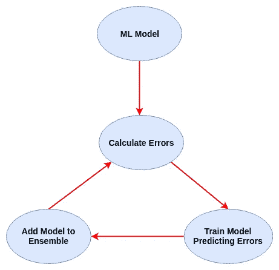

# XGBoost 初学者指南

> 原文：<https://towardsdatascience.com/a-beginners-guide-to-xgboost-87f5d4c30ed7?source=collection_archive---------0----------------------->

## 这篇文章会有树…很多树


Trees… lots of them

> 想获得灵感？快来加入我的 [**超级行情快讯**](https://www.superquotes.co/?utm_source=mediumtech&utm_medium=web&utm_campaign=sharing) 。😎

XGBoost 是一个开源库，提供了梯度提升决策树的高性能实现。底层的 C++代码库与顶层的 Python 接口相结合，构成了一个极其强大而又易于实现的包。

XGBoost 的性能不是开玩笑的——它已经成为赢得许多 Kaggle 比赛的首选库。它的梯度增强实现是首屈一指的，随着该库继续获得好评，只会有更多的实现。

在这篇文章中，我们将介绍 XGBoost 库的基础知识。我们将从梯度增强如何实际工作的实际解释开始，然后通过一个 Python 例子来说明 XGBoost 如何使它变得如此快速和简单。

# 助推树木

对于常规的机器学习模型，如决策树，我们只需在数据集上训练一个模型，并使用它进行预测。我们可能会对参数稍加改动或增加数据，但最终我们仍然使用单一模型。即使我们建立了一个集合，所有的模型都被单独训练和应用于我们的数据。

**助推，另一方面，**采取一种更加*迭代*的方法。从技术上来说，这仍然是一种合奏技术，因为许多模型被组合在一起以完成最终的一个，但采用了一种更聪明的方法。

boosting 不是孤立地训练所有模型，而是连续训练模型，每个新模型都被训练来纠正前一个模型所犯的错误。模型按顺序添加，直到不能再进一步改进。

这种迭代方法的优点是，添加的新模型专注于纠正由其他模型引起的错误。在标准的集成方法中，模型是独立训练的，所有的模型最终可能会犯同样的错误！

**梯度推进**特别是一种训练新模型来预测先前模型的残差(即误差)的方法。我在下面的图表中概述了这种方法。



# XGBoost 入门

让我们开始使用这个强大的库— XGBoost。

我们要做的第一件事是安装库，这是通过 pip 最容易做到的。在 [Python 虚拟环境](/how-to-setup-a-python-environment-for-machine-learning-354d6c29a264)中这样做也可能更安全。

```
pip install xgboost
```

## 用 XGBoost 设置数据

在余下的教程中，我们将使用鸢尾花数据集。我们可以使用 Scikit Learn 将它加载到 Python 中。同时，我们还将导入新安装的 XGBoost 库。

```
*from* sklearn *import* datasets
*import* xgboost *as* xgb

iris = datasets.load_iris()
X = iris.data
y = iris.target
```

让我们把所有的数据都准备好。我们将从创建一个训练测试分割开始，这样我们就可以看到 XGBoost 执行得有多好。这次我们要 80%-20%的分成。

```
from sklearn.model_selection import train_test_split

X_train, X_test, Y_train, Y_test = train_test_split(X, y, test_size=0.2)
```

为了让 XGBoost 能够使用我们的数据，我们需要将它转换成 XGBoost 能够处理的特定格式。这种格式被称为**数据矩阵**。将 numpy 数组的数据转换为 DMatrix 格式非常简单:

```
D_train = xgb.DMatrix(X_train, label=Y_train)
D_test = xgb.DMatrix(X_test, label=Y_test)
```

## 定义 XGBoost 模型

现在我们的数据都加载了，我们可以定义我们的梯度推进系综的参数。我们在下面设置了一些最重要的，让我们开始。对于更复杂的任务和模型，可能的参数的完整列表可以在官方 [XGBoost 网站](https://xgboost.readthedocs.io/en/latest/parameter.html)上获得。

```
param = {
    'eta': 0.3, 
    'max_depth': 3,  
    'objective': 'multi:softprob',  
    'num_class': 3} 

steps = 20  # The number of training iterations
```

最简单的参数是 *max_depth* (被训练的决策树的最大深度) *objective* (正在使用的损失函数)，以及 *num_class* (数据集中的类的数量)。 *eta* 算法需要特别注意。

从我们的理论来看，梯度推进包括顺序地创建决策树并将其添加到集成模型中。创建新的树来校正来自现有集合的预测中的残留误差。

由于集合的性质，即，将几个模型放在一起形成本质上非常大的复杂模型，使得该技术易于过度拟合。 **eta** 参数为我们提供了一个防止过度拟合的机会

eta 可以更直观地认为是一个学习率*。不是简单地将新树的预测添加到具有全权重的集合中，而是将 eta 乘以所添加的残差以减少它们的权重。这有效地降低了整个模型的复杂性。*

通常具有 0.1 至 0.3 范围内的小值。这些残差的较小权重仍将帮助我们训练一个强大的模型，但不会让该模型陷入更可能发生过度拟合的深度复杂性。

## 培训和测试

我们最终可以像使用 Scikit Learn 那样训练我们的模型:

```
model = xgb.train(param, D_train, steps)
```

现在让我们进行评估。同样，该过程与 Scikit Learn 中的培训模型非常相似:

```
*import* numpy *as* np
*from* sklearn.metrics *import* precision_score, recall_score, accuracy_score

preds = model.predict(D_test)
best_preds = np.asarray([np.argmax(line) *for* line *in* preds])

print("Precision = {}".format(precision_score(Y_test, best_preds, average='macro')))
print("Recall = {}".format(recall_score(Y_test, best_preds, average='macro')))
print("Accuracy = {}".format(accuracy_score(Y_test, best_preds)))
```

厉害！

如果到目前为止你已经遵循了所有的步骤，你应该得到至少 90%的准确率！

# XGBoost 的进一步探索

这就概括了 XGBoost 的基本知识。但是，还有一些更酷的功能可以帮助您充分利用您的模型。

*   **gamma** 参数也有助于控制过度拟合。它指定了在树的叶节点上进行进一步划分所需的损失的最小减少量。也就是说，如果创建一个新节点不能减少一定数量的损失，那么我们根本不会创建它。
*   **助推器**参数允许你设置你将在构建合奏时使用的模型类型。默认的是 *gbtree* ，它构建了一个决策树集合。如果你的数据不太复杂，你可以使用更快更简单的 *gblinear* 选项，它构建了一个线性模型集合。
*   设置任何 ML 模型的最佳超参数都是一项挑战。那么为什么不让 Scikit Learn 帮你做呢？我们可以很容易地将 Scikit Learn 的网格搜索与 XGBoost 分类器结合起来:

```
*from* sklearn.model_selection *import* GridSearchCV

clf = xgb.XGBClassifier()
parameters = {
     "eta"    : [0.05, 0.10, 0.15, 0.20, 0.25, 0.30 ] ,
     "max_depth"        : [ 3, 4, 5, 6, 8, 10, 12, 15],
     "min_child_weight" : [ 1, 3, 5, 7 ],
     "gamma"            : [ 0.0, 0.1, 0.2 , 0.3, 0.4 ],
     "colsample_bytree" : [ 0.3, 0.4, 0.5 , 0.7 ]
     }

grid = GridSearchCV(clf,
                    parameters, n_jobs=4,
                    scoring="neg_log_loss",
                    cv=3)

grid.fit(X_train, Y_train)
```

如果你有时间的话，只在大数据集上这样做——进行网格搜索本质上是多次训练决策树的集合！

*   一旦您的 XGBoost 模型经过训练，您就可以将它的可读描述转储到一个文本文件中:

```
model.dump_model('dump.raw.txt')
```

这是一个总结！

# 喜欢学习？

在 twitter 上关注我，我会在这里发布所有最新最棒的人工智能、技术和科学！也在 LinkedIn 上与我联系！