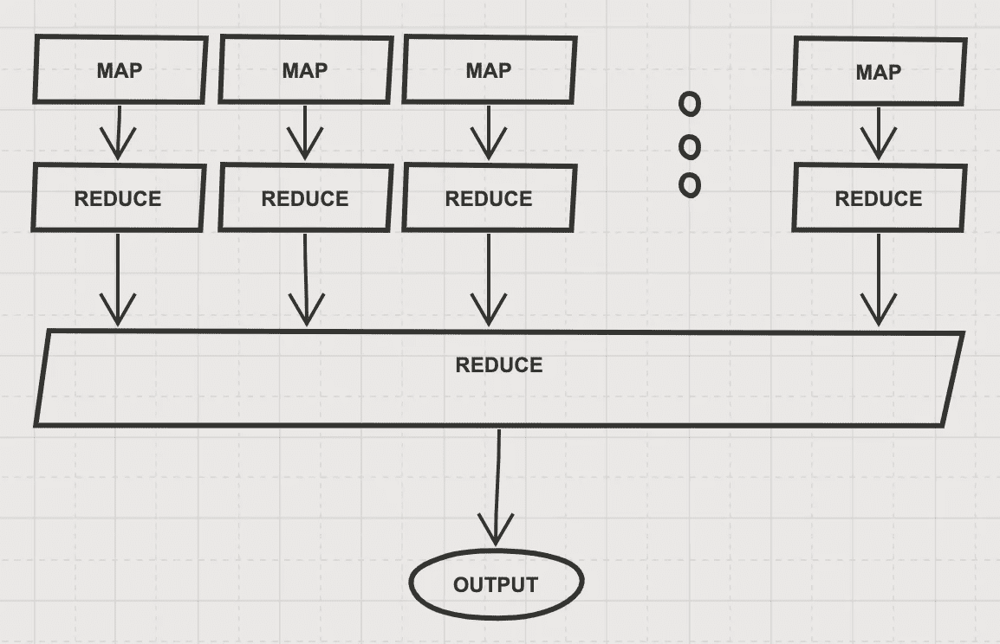

# MapReduce 初学者入门

> 原文：<https://towardsdatascience.com/a-beginners-introduction-into-mapreduce-2c912bb5e6ac?source=collection_archive---------2----------------------->


很多时候，作为数据科学家，我们必须处理海量数据。在这种情况下，许多方法都不起作用或不可行。大量的数据是好的，非常好，我们希望尽可能地利用这些数据。

这里我想介绍 MapReduce 技术，这是一种用于处理大量数据的广泛技术。MapReduce 的实现有很多，包括著名的 Apache Hadoop。这里，我就不说实现了。我将尝试以最直观的方式介绍这个概念，并给出玩具和现实生活中的例子。

让我们从一些简单的任务开始。给你一个字符串列表，你需要返回最长的字符串。在 python 中这很容易做到:

```
def find_longest_string(list_of_strings):
    longest_string = None
    longest_string_len = 0     for s in list_of_strings:
        if len(s) > longest_string_len:
            longest_string_len = len(s)
            longest_string = s return longest_string
```

我们一个接一个地检查字符串，计算长度并保留最长的字符串，直到我们完成。

对于小列表，它的工作速度相当快:

```
list_of_strings = ['abc', 'python', 'dima']%time max_length = print(find_longest_string(list_of_strings))OUTPUT:
python
CPU times: user 0 ns, sys: 0 ns, total: 0 ns
Wall time: **75.8 µs**
```

即使对于包含 3 个以上元素的列表，它也能很好地工作，这里我们尝试使用 3000 个元素:

```
large_list_of_strings = list_of_strings***1000**%time print(find_longest_string(large_list_of_strings))OUTPUT:
python
CPU times: user 0 ns, sys: 0 ns, total: 0 ns
Wall time: **307 µs**
```

但是如果我们尝试 3 亿个元素呢？

```
large_list_of_strings = list_of_strings***100000000**
%time max_length = max(large_list_of_strings, key=len)OUTPUT:
python
CPU times: user 21.8 s, sys: 0 ns, total: 21.8 s
Wall time: **21.8 s**
```

这是一个问题，在大多数应用中，20 秒的响应时间是不可接受的。改善计算时间的一个方法是购买更好更快的 CPU。通过引入更好更快的硬件来扩展您的系统被称为“垂直扩展”。这当然不会永远有效。不仅找到一个工作速度快 10 倍的 CPU 不是一件小事，而且，我们的数据可能会变得更大，我们不想每次代码变慢时都升级我们的 CPU。我们的解决方案不可扩展。相反，我们可以进行“水平扩展”，我们将设计我们的代码，以便它可以并行运行，当我们添加更多处理器和/或 CPU 时，它将变得更快。

为此，我们需要将代码分解成更小的组件，看看如何并行执行计算。直觉如下:1)将我们的数据分成许多块，2)对每个块并行执行`find_longest_string`函数，3)在所有块的输出中找到最长的字符串。

我们的代码非常具体，很难破坏和修改，所以我们不使用`find_longest_string`函数，而是开发一个更通用的框架，帮助我们在大数据上并行执行不同的计算。

我们在代码中做的两件主要事情是计算字符串的`len`,并将其与迄今为止最长的字符串进行比较。我们将把代码分成两步:1)计算所有字符串的`len`，2)选择`max`值。

```
%%time# step 1:
list_of_string_lens = [len(s) for s in list_of_strings]
list_of_string_lens = zip(list_of_strings, list_of_string_lens)#step 2:
max_len = max(list_of_string_lens, key=lambda t: t[1])
print(max_len)OUTPUT:
('python', 6)
CPU times: user 51.6 s, sys: 804 ms, total: 52.4 s
Wall time: 52.4 s
```

(我正在计算字符串的长度，然后`zip`将它们放在一起，因为这比在一行中计算并复制字符串列表要快得多)

在这种状态下，代码实际上比以前运行得更慢，因为我们不是对所有的字符串执行一次，而是执行两次，首先计算`len`，然后找到`max`的值。为什么这对我们有好处？因为现在我们的“步骤 2”得到的输入不是原始的字符串列表，而是一些预处理过的数据。这允许我们使用另一个“步骤二”的输出来执行步骤二！我们稍后会更好地理解这一点，但首先，让我们给这些步骤起个名字。我们称“第一步”为“映射器”,因为它将一些值映射到另一些值，我们称“第二步”为缩减器，因为它得到一个值列表并产生一个值(在大多数情况下)。以下是映射器和缩减器的两个辅助函数:

```
mapper = lendef reducer(p, c):
    if p[1] > c[1]:
        return p
    return c
```

映射器就是`len`函数。它获取一个字符串并返回它的长度。缩减器获取两个元组作为输入，并返回长度最大的一个。

让我们使用`map`和`reduce`重写我们的代码，在 python 中甚至有内置函数(在 python 3 中，我们必须从`functools`导入它)。

```
%%time#step 1
mapped = map(mapper, list_of_strings)
mapped = zip(list_of_strings, mapped)#step 2:
reduced = reduce(reducer, mapped)print(reduced)OUTPUT:
('python', 6)
CPU times: user 57.9 s, sys: 0 ns, total: 57.9 s
Wall time: 57.9 s
```

代码做完全相同的事情，它看起来有点花哨，但它更通用，将帮助我们并行化。让我们更仔细地看看它:

步骤 1 使用 mapper 函数将我们的字符串列表映射到元组列表中(这里我再次使用`zip`以避免重复字符串)。

步骤 2 使用 reducer 函数，检查来自步骤 1 的元组并逐个应用它。结果是一个具有最大长度的元组。

现在，让我们将输入分成块，并在进行任何并行化之前理解它是如何工作的(我们将使用`chunkify`将一个大列表分成大小相等的块):

```
data_chunks = chunkify(list_of_strings, number_of_chunks=30)#step 1:
reduced_all = []
for chunk in data_chunks:
    mapped_chunk = map(mapper, chunk)
    mapped_chunk = zip(chunk, mapped_chunk)

    reduced_chunk = reduce(reducer, mapped_chunk)
    reduced_all.append(reduced_chunk)

#step 2:
reduced = reduce(reducer, reduced_all)print(reduced)OUTPUT:
('python', 6)
```

在第一步中，我们检查我们的块，并使用 map 和 reduce 找到该块中最长的字符串。在第二步中，我们获取第一步的输出，这是一个缩减值的列表，并执行最终的缩减以获得最长的字符串。我们使用`number_of_chunks=36`是因为这是我机器上的 CPU 数量。

我们几乎可以并行运行我们的代码了。我们唯一可以做得更好的是将第一个`reduce`步骤添加到单个映射器中。我们这样做是因为我们想把我们的代码分成两个简单的步骤，因为第一个`reduce`在单个块上工作，我们也想把它并行化。它看起来是这样的:

```
def chunks_mapper(chunk):
    mapped_chunk = map(mapper, chunk) 
    mapped_chunk = zip(chunk, mapped_chunk)
    return reduce(reducer, mapped_chunk)%%timedata_chunks = chunkify(list_of_strings, number_of_chunks=30)#step 1:
mapped = map(chunks_mapper, data_chunks)#step 2:
reduced = reduce(reducer, mapped)print(reduced)OUTPUT:
('python', 6)
CPU times: user 58.5 s, sys: 968 ms, total: 59.5 s
Wall time: 59.5 s
```

现在我们有了一个好看的两步代码。如果我们按原样执行它，我们将获得相同的计算时间，但是，现在我们可以通过使用`pool.map`函数而不是常规的`map`函数，使用`multiprocessing`模块来并行化步骤 1:

```
from multiprocessing import Poolpool = Pool(8)data_chunks = chunkify(large_list_of_strings, number_of_chunks=8)#step 1:
mapped = pool.map(mapper, data_chunks)#step 2:
reduced = reduce(reducer, mapped)print(reduced)OUTPUT:
('python', 6)
CPU times: user 7.74 s, sys: 1.46 s, total: 9.2 s
Wall time: 10.8 s
```

我们可以看到它运行速度快了两倍！这不是一个巨大的改进，但好消息是我们可以通过增加进程的数量来改进它！我们甚至可以在多台机器上进行，如果我们的数据非常大，我们可以使用几十台甚至几千台机器，使我们的计算时间尽可能短(几乎)。

我们的架构是使用两个函数构建的:`map`和`reduce`。每个计算单元映射输入数据并执行初始归约。最后，某个集中式单元执行最终的归约并返回输出。看起来是这样的:



这种架构有两个重要优势:

1.  它是可扩展的:如果我们有更多的数据，我们唯一需要做的就是添加更多的处理单元。不需要更改代码！
2.  它是通用的:这种架构支持各种各样的任务，我们可以用几乎任何东西代替我们的`map`和`reduce`函数，这样就可以以可扩展的方式计算许多不同的东西。

需要注意的是，在大多数情况下，我们的数据会非常大并且是静态的。这意味着每次分割成块是低效的，实际上是多余的。因此，在现实生活中的大多数应用程序中，我们从一开始就将数据存储在块(或碎片)中。然后，我们将能够使用 MapReduce 技术进行不同的计算。

现在来看一个更有趣的例子:字数！

假设我们有一个非常大的新闻文章集，我们想找到不包括停用词的前 10 个常用词，我们该如何做呢？首先，让我们得到数据:

```
from sklearn.datasets import fetch_20newsgroups
data = news.data*10
```

在这篇文章中，我把数据放大了 10 倍，这样我们就可以看到不同之处。

对于数据集中的每个文本，我们希望对其进行标记化、清理、删除停用词，并最终计算单词数:

```
def clean_word(word):
    return re.sub(r'[^\w\s]','',word).lower()def word_not_in_stopwords(word):
    return word not in ENGLISH_STOP_WORDS and word and word.isalpha()

def find_top_words(data):
    cnt = Counter()
    for text in data:
        tokens_in_text = text.split()
        tokens_in_text = map(clean_word, tokens_in_text)
        tokens_in_text = filter(word_not_in_stopwords, tokens_in_text)
        cnt.update(tokens_in_text)

    return cnt.most_common(10)
```

让我们看看不使用 MapReduce 需要多长时间:

```
%time find_top_words(data)OUTPUT:[('subject', 122520),
 ('lines', 118240),
 ('organization', 111850),
 ('writes', 78360),
 ('article', 67540),
 ('people', 58320),
 ('dont', 58130),
 ('like', 57570),
 ('just', 55790),
 ('university', 55440)]CPU times: user 51.7 s, sys: 0 ns, total: 51.7 s
Wall time: 51.7 s
```

现在，让我们写出我们的`mapper`、`reducer`和`chunk_mapper`:

```
def mapper(text):
    tokens_in_text = text.split()
    tokens_in_text = map(clean_word, tokens_in_text)
    tokens_in_text = filter(word_not_in_stopwords, tokens_in_text)
    return Counter(tokens_in_text)def reducer(cnt1, cnt2):
    cnt1.update(cnt2)
    return cnt1def chunk_mapper(chunk):
    mapped = map(mapper, chunk)
    reduced = reduce(reducer, mapped)
    return reduced
```

`mapper`获取一个文本，将它分割成记号，清理它们，过滤无用的单词和非单词，最后，它计算这个文本文档中的单词数。`reducer`函数获取 2 个计数器并将它们合并。`chunk_mapper`得到一个块，并对其进行 MapReduce 操作。现在，让我们使用我们构建的框架来运行它，看看:

```
%%timedata_chunks = chunkify(data, number_of_chunks=36)#step 1:
mapped = pool.map(chunk_mapper, data_chunks)#step 2:
reduced = reduce(reducer, mapped)print(reduced.most_common(10))OUTPUT:
[('subject', 122520),
 ('lines', 118240),
 ('organization', 111850),
 ('writes', 78360),
 ('article', 67540),
 ('people', 58320),
 ('dont', 58130),
 ('like', 57570),
 ('just', 55790),
 ('university', 55440)]CPU times: user 1.52 s, sys: 256 ms, total: 1.77 s
Wall time: **4.67 s**
```

这快了 10 倍！在这里，我们能够真正利用我们的计算能力，因为任务要复杂得多，需要更多。

综上所述，MapReduce 是一种令人兴奋的、对于大型数据处理来说必不可少的技术。它可以处理大量的任务，包括计数、搜索、监督和非监督学习等等。今天有很多实现和工具可以让我们的生活更加舒适，但我认为理解基础知识非常重要。