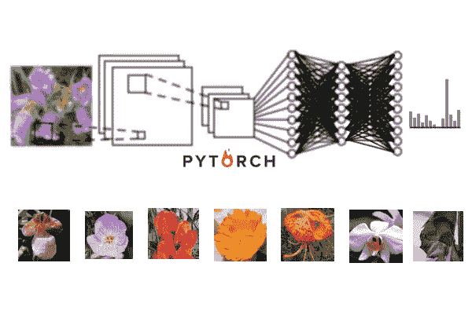

# 使用 PyTorch 构建人工智能图像分类器的初学者教程

> 原文：<https://towardsdatascience.com/a-beginners-tutorial-on-building-an-ai-image-classifier-using-pytorch-6f85cb69cba7?source=collection_archive---------4----------------------->

这是一个逐步建立图像分类器的指南。人工智能模型将能够学习标记图像。我用 Python 和 Pytorch。



# 步骤 1:导入库

当我们写一个程序时，手动编码我们执行的每个小动作是一个巨大的麻烦。有时候，我们想要使用别人已经写好的代码包。这些打包的例程被称为库，可以通过导入它们并在代码中引用该库来添加到我们的程序中。

我们通常在程序开始时导入所有的库。

当我们引用这个库时，不用输入它的长名字，我们可以用“as”把它缩写成我们选择的名字。

```
# Import Libraries
import torch
import torchvision.transforms as transforms
import torchvision.datasets as datasets
import torchvision.models as models
import torch.nn as nn
import torch.optim as optim
import numpy as np
from PIL import Image
import numpy as np
import matplotlib.pyplot as plt
```

# 步骤 2:定义转换

接下来，我们要导入我们的 AI 模型将从中学习的图片数据。

但是在此之前，我们需要指定我们想要在这些图片上执行的更改——因为导入它们的同一个命令也会转换数据。

这些转换是使用 torchvision.transforms 库完成的。理解转换的最佳方式是阅读文档[这里的](https://pytorch.org/docs/stable/torchvision/transforms.html)。但是我将简要介绍每个命令的作用。

*   **变换花样。Compose** 让我们将多个转换组合在一起，这样我们就可以使用多个转换。
*   **变换花样。Resize((255))** 调整图像大小，使最短边的长度为 255 像素。另一侧被缩放以保持图像的纵横比。
*   **变换。中心裁剪(224)** 裁剪图像的中心，使其成为 224×224 像素的正方形图像。

我们做这两个步骤，所以所有进入我们的人工智能模型的图像都有相同的大小(人工智能模型不能处理不同大小的输入)

*   **变身。ToTensor()** 将我们的图像转换成数字。它是怎么做到的？
*   它将我们图片的每个像素所包含的三种颜色分开:红色、绿色和蓝色。这实质上是将一幅图像变成三幅图像(一幅红色，一幅绿色，一幅蓝色)。
*   然后，它将每个着色图像的像素转换为其颜色的亮度，从 0 到 255。这些值除以 255，因此它们可以在 0 到 1 的范围内。我们的图像现在是一个 Torch 张量(一个存储大量数字的数据结构)。
*   **变换。Normalize(mean=[0.485，0.456，0.406]，std=[0.229，0.224，0.225])** 从每个值中减去平均值，然后除以标准差。
*   我们将使用一个预先训练好的模型，所以我们需要使用 Pytorch 指定的均值和标准差。在平均值和标准偏差中有三个值来匹配每个 RGB 图片。

```
# Specify transforms using torchvision.transforms as transforms
# librarytransformations = transforms.Compose([
    transforms.Resize(255),
    transforms.CenterCrop(224),
    transforms.ToTensor(),
    transforms.Normalize(mean=[0.485, 0.456, 0.406], std=[0.229, 0.224, 0.225])
])
```

# 步骤 3:导入我们的数据并将其放入数据加载器

最后，我们可以将我们的图片导入程序。我们使用 torchvision.datasets 库。

[看这里](https://pytorch.org/docs/stable/torchvision/datasets.html)。

我们指定了两个不同的数据集，一个用于 AI 学习的图像(训练集)，另一个用于我们用来测试 AI 模型的数据集(验证集)。

**数据集。ImageFolder()** 命令期望我们的数据按照以下方式组织:root/label/picture.png .换句话说，图片要按照文件夹排序。例如，所有蜜蜂的图片应该放在一个文件夹里，所有蚂蚁的图片应该放在另一个文件夹里，等等。

我们下命令

1.  所有文件夹和的路径
2.  我们在上一步中指定的转换。

```
# Load in each dataset and apply transformations using
# the torchvision.datasets as datasets librarytrain_set = datasets.ImageFolder("root/label/train", transform = transformations)val_set = datasets.ImageFolder("root/label/valid", transform = transformations)
```

然后，我们希望将导入的图像放入数据加载器。

Dataloader 能够吐出我们数据的随机样本，因此我们的模型不必每次都处理整个数据集。这使得训练更有效率。

我们指定一次需要多少张图片作为我们的 batch_size(所以 32 意味着我们一次需要 32 张图片)。我们还想打乱我们的图像，这样它就可以随机输入到我们的人工智能模型中。

[点击此处了解数据加载器](https://pytorch.org/docs/stable/data.html)。

```
# Put into a Dataloader using torch librarytrain_loader = torch.utils.data.DataLoader(train_set, batch_size=32, shuffle=True)val_loader = torch.utils.data.DataLoader(val_set, batch_size =32, shuffle=True)
```

# 步骤 4:创建我们的模型

人工智能模型需要在大量数据上训练才能有效。由于我们没有那么多数据，我们希望采用一个预训练的模型(之前已经在许多图像上训练过的模型)，但对其进行定制以识别我们的特定图像。这个过程叫做迁移学习。

图像识别模型有两个部分:

1.  卷积部分和
2.  分类器部分

我们希望保留预训练的卷积部分，但放入我们自己的分类器。原因如下:

我们模型的卷积/池部分用于识别图像内部的特征。它首先识别边缘，然后利用边缘识别形状，再利用形状识别物体。

但是，训练这一部分需要大量数据，可能比我们拥有的还要多，因此，我们可以使用默认的预训练卷积层。这些预先训练的卷积层被训练成能够很好地识别这些特征，不管你有什么样的图像。

卷积层之间也有池层，将图像提取到更小的尺寸，这样就可以很容易地输入到我们的分类器中。

模型的最后一部分是分类器。分类器在卷积部分提取从照片中提取的所有信息，并使用它来识别图像。这是我们希望替换的预训练模型的一部分，并根据我们自己的图像进行训练。这使得模型能够识别我们给它的图像。

我们使用 torchvision.models 库来下载预训练的模型。我们可以下载许多不同的型号，更多信息可以在[这里](https://pytorch.org/docs/stable/torchvision/models.html)找到。我选择了一个名为 densenet161 的模型，并指定我们希望通过设置 pretrained=True 对它进行预训练。

然后，我们要确保我们不要训练这个模型，因为它已经被训练过了，我们只想训练我们接下来要放入的分类器。我们告诉模型不要计算任何参数的梯度，因为这只是为了训练。

```
# Get pretrained model using torchvision.models as models librarymodel = models.densenet161(pretrained=True)# Turn off training for their parametersfor param in model.parameters():
    param.requires_grad = False
```

现在我们想用我们自己的分类器替换模型的默认分类器。分类器是全连接的神经网络，要做到这一点，首先要建立自己的神经网络。

神经网络只是一种在输入和输出的数字之间寻找复杂模式和联系的方法。在这种情况下，需要通过卷积部分突出显示的图像特征来确定图像是某个标签的可能性。

我们要做的第一件事是确定输入到我们神经网络的数字数量。这必须与之前部分(卷积部分)输出的数字数量相匹配。由于我们根本没有改变卷积部分，在我们的分类器中输入的数字量应该与模型的默认分类器相同。

接下来，我们要确定输出的数量。这个数字应该与您拥有的图像类型相匹配。该模型会给你一个百分比列表，每个百分比对应于图片对该标签的确定程度。所以如果你有蜜蜂、蚂蚁和苍蝇的图像，有三个标签。输出层中应该有 3 个数字，每个数字对应于输入是蜜蜂、蚂蚁或苍蝇的概率。

一旦我们有了这些细节，我们就使用 torch.nn 库来创建分类器。信息可以在[这里](https://pytorch.org/docs/stable/nn.html)找到。

*   **nn。顺序**可以帮助我们将多个模块组合在一起。
*   **nn。Linear** 指定两层之间的交互。我们给它 2 个数字，指定两层中的节点数。
*   比如在第一个 nn 里。线性，第一层是输入层，我们可以在第二层选择想要多少个数字(我用的是 1024)。
*   **nn。ReLU** 是隐藏层的激活功能。激活函数帮助模型学习输入和输出之间的复杂关系。我们在除了输出之外的所有层上使用 ReLU。

我们对任意多个隐藏层重复此操作，每个层中有任意多个节点。

*   **nn。LogSoftmax** 是输出的激活功能。softmax 函数将输出的数字转换为每个标签的百分比，并应用 log 函数来加快计算速度。我们必须指定输出层是一个列，因此我们将 dimension 设置为 1。

创建我们自己的分类器后，我们替换模型的默认分类器。

```
# Create new classifier for model using torch.nn as nn libraryclassifier_input = model.classifier.in_features
num_labels = #PUT IN THE NUMBER OF LABELS IN YOUR DATAclassifier = nn.Sequential(nn.Linear(classifier_input, 1024),
                           nn.ReLU(),
                           nn.Linear(1024, 512),
                           nn.ReLU(),
                           nn.Linear(512, num_labels),
                           nn.LogSoftmax(dim=1))# Replace default classifier with new classifiermodel.classifier = classifier
```

现在模型已经创建好了！接下来，我们只需要训练它。

# 步骤 5:训练和评估我们的模型

在 GPU 上训练模型比 CPU 快很多。因此，为了确定哪个设备对您可用，我们使用 Torch 来检查。如果有兼容的 GPU，我们将变量设置为 GPU，如果没有，则坚持使用 CPU。然后我们把模型移到这个设备上。

```
# Find the device available to use using torch librarydevice = torch.device("cuda" if torch.cuda.is_available() else "cpu")# Move model to the device specified abovemodel.to(device)
```

在训练时，我们需要确定我们的模型有多“偏离”。为了评估我们模型的误差量，我们使用*神经网络。NLLLoss* 。这个函数接收我们模型的输出，为此我们使用了神经网络。LogSoftmax 函数。

为了训练我们的模型，我们采用我们的误差，看看我们如何调整我们的数字乘以权重，以获得最小的误差。计算我们如何调整我们的体重并将其应用于我们的体重的方法被称为亚当。我们使用 [torch.optim](https://pytorch.org/docs/stable/optim.html) 库来使用这个方法，并给它我们的参数。

```
# Set the error function using torch.nn as nn librarycriterion = nn.NLLLoss()# Set the optimizer function using torch.optim as optim libraryoptimizer = optim.Adam(model.classifier.parameters())
```

现在我们训练。我们希望我们的模型多次遍历整个数据集，所以我们使用 for 循环。每一次它检查了整组图像，就被称为一个时期。在一个时期内，我们希望模型通过训练集和验证集。

## 我们从训练集开始。

我们首先将模型设置为训练模式，并使用 for 循环遍历每幅图像。

在将图像和标签移动到适当的设备之后，我们需要通过声明 *optimizer.zero_grad()* 来清除权重的调整。

然后，在给定图像的情况下，我们可以计算模型的输出，以及在给定输出和正确答案的情况下，我们的模型有多“偏离”。

然后，我们可以通过调用 *loss.backward()* 找到我们需要进行的调整以减少这个错误，并通过调用 *optimizer.step()* 使用我们的优化器来调整权重。

当我们训练时，我们想知道事情进展如何，所以我们记录我们计算的总误差并打印出训练的进度。

## 我们转到验证集。

我们将模型设置为评估模式，并使用 for 循环遍历集合中的所有图像。

我们重复对训练集采取的步骤，以获得我们的模型的输出以及我们的模型与真实标签“偏离”了多少。

为了提高计算速度，我们的模型使用了 LogSoftmax 函数，但是现在我们想要的是真实的百分比，而不是对数百分比。所以我们用 *torch.exp* 来反转 log 函数。然后我们想看看模型为我们的图像猜测了哪个类。*。topk* 给出了我们猜测的顶级类，以及它猜测的百分比——我们只关心这个类，所以我们可以忽略这个百分比。

为了确定它猜对了多少图像，我们检查哪些猜测的类等于真实的类。然后，我们可以对整批进行平均，以确定我们的模型的准确性(猜对的图像数除以图像总数)。

在检查完训练集和验证集之后，我们希望打印两者的错误以及验证集的准确性。

```
epochs = 10
for epoch in range(epochs):
    train_loss = 0
    val_loss = 0
    accuracy = 0

    # Training the model
    model.train()
    counter = 0
    for inputs, labels in train_loader:
        # Move to device
        inputs, labels = inputs.to(device), labels.to(device) # Clear optimizers
        optimizer.zero_grad() # Forward pass
        output = model.forward(inputs) # Loss
        loss = criterion(output, labels) # Calculate gradients (backpropogation)
        loss.backward() # Adjust parameters based on gradients
        optimizer.step() # Add the loss to the training set's rnning loss
        train_loss += loss.item()*inputs.size(0)

        # Print the progress of our training
        counter += 1
        print(counter, "/", len(train_loader))

    # Evaluating the model
    model.eval()
    counter = 0
    # Tell torch not to calculate gradients
    with torch.no_grad():
        for inputs, labels in val_loader:
            # Move to device
            inputs, labels = inputs.to(device), labels.to(device) # Forward pass
            output = model.forward(inputs) # Calculate Loss
            valloss = criterion(output, labels) # Add loss to the validation set's running loss
            val_loss += valloss.item()*inputs.size(0)

            # Since our model outputs a LogSoftmax, find the real 
            # percentages by reversing the log function
            output = torch.exp(output) # Get the top class of the output
            top_p, top_class = output.topk(1, dim=1) # See how many of the classes were correct?
            equals = top_class == labels.view(*top_class.shape) # Calculate the mean (get the accuracy for this batch)
            # and add it to the running accuracy for this epoch
            accuracy += torch.mean(equals.type(torch.FloatTensor)).item()

            # Print the progress of our evaluation
            counter += 1
            print(counter, "/", len(val_loader))

    # Get the average loss for the entire epoch
    train_loss = train_loss/len(train_loader.dataset)
    valid_loss = val_loss/len(val_loader.dataset) # Print out the information
    print('Accuracy: ', accuracy/len(val_loader))
    print('Epoch: {} \tTraining Loss: {:.6f} \tValidation Loss: {:.6f}'.format(epoch, train_loss, valid_loss))
```

# 步骤 5:实际使用我们的模型

太棒了！你刚刚建立了一个人工智能图像分类器。但是，现在我们想实际使用它——我们想给它一个随机图像，看看它认为这是哪个标签。

首先，我们为评估模式设置模型。

```
model.eval()
```

然后我们创建一个可以处理图像的函数，这样它就可以输入到我们的模型中。

我们打开图像，通过保持纵横比但使最短边仅为 255 px 来调整其大小，并通过 224px 裁剪中心 224px。然后，我们将图片转换成一个数组，并通过转置数组来确保颜色通道的数量是第一维，而不是最后一维。接下来，我们通过除以 255 来转换 0 和 1 之间的每个值。然后，我们通过减去平均值并除以标准偏差来标准化这些值。最后，我们将数组转换为 Torch 张量，并将值转换为 float。

这些步骤与我们在步骤 2 中指定的步骤相同，但是这一次我们必须手动编码命令，而不是依赖于转换库。

```
# Process our image
def process_image(image_path):
    # Load Image
    img = Image.open(image_path)

    # Get the dimensions of the image
    width, height = img.size

    # Resize by keeping the aspect ratio, but changing the dimension
    # so the shortest size is 255px
    img = img.resize((255, int(255*(height/width))) if width < height else (int(255*(width/height)), 255))

    # Get the dimensions of the new image size
    width, height = img.size

    # Set the coordinates to do a center crop of 224 x 224
    left = (width - 224)/2
    top = (height - 224)/2
    right = (width + 224)/2
    bottom = (height + 224)/2
    img = img.crop((left, top, right, bottom))

    # Turn image into numpy array
    img = np.array(img)

    # Make the color channel dimension first instead of last
    img = img.transpose((2, 0, 1))

    # Make all values between 0 and 1
    img = img/255

    # Normalize based on the preset mean and standard deviation
    img[0] = (img[0] - 0.485)/0.229
    img[1] = (img[1] - 0.456)/0.224
    img[2] = (img[2] - 0.406)/0.225

    # Add a fourth dimension to the beginning to indicate batch size
    img = img[np.newaxis,:]

    # Turn into a torch tensor
    image = torch.from_numpy(img)
    image = image.float()
    return image
```

处理完图像后，我们可以构建一个函数来使用我们的模型预测标签。我们将图像输入到我们的模型中，并获得输出。然后，我们反转在输出层应用的 LogSoftmax 函数中的日志，并返回模型预测的顶级类及其猜测的确定程度。

```
# Using our model to predict the label
def predict(image, model):
    # Pass the image through our model
    output = model.forward(image)

    # Reverse the log function in our output
    output = torch.exp(output)

    # Get the top predicted class, and the output percentage for
    # that class
    probs, classes = output.topk(1, dim=1)
    return probs.item(), classes.item()
```

最后，我们想要显示图像。我们将图像转换回一个数组，并通过乘以标准偏差并加回平均值来取消标准化。然后我们使用 matplotlib.pyplot 库来绘制图片。

```
# Show Image
def show_image(image):
    # Convert image to numpy
    image = image.numpy()

    # Un-normalize the image
    image[0] = image[0] * 0.226 + 0.445

    # Print the image
    fig = plt.figure(figsize=(25, 4))
    plt.imshow(np.transpose(image[0], (1, 2, 0)))
```

现在，我们可以使用所有这些函数来打印我们的模型的猜测和它有多确定！

```
# Process Image
image = process_image("root/image1234.jpg")# Give image to model to predict output
top_prob, top_class = predict(image, model)# Show the image
show_image(image)# Print the results
print("The model is ", top_prob*100, "% certain that the image has a predicted class of ", top_class  )
```

就是这样！