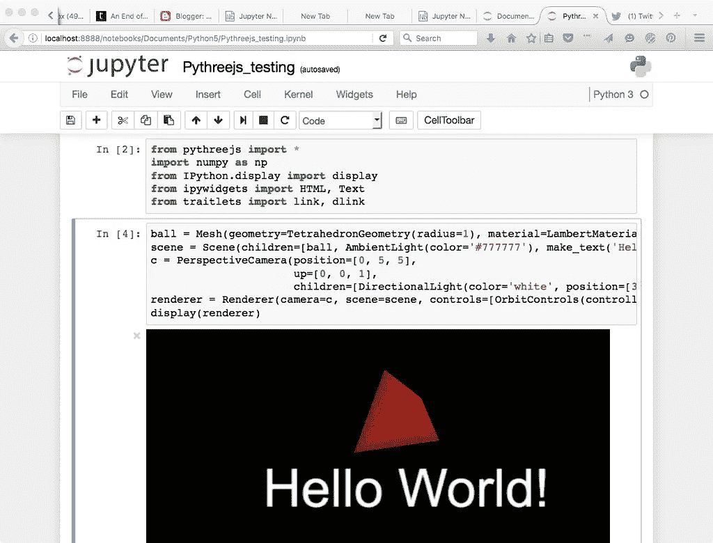
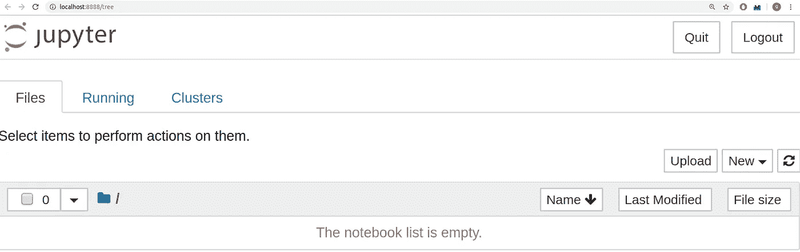
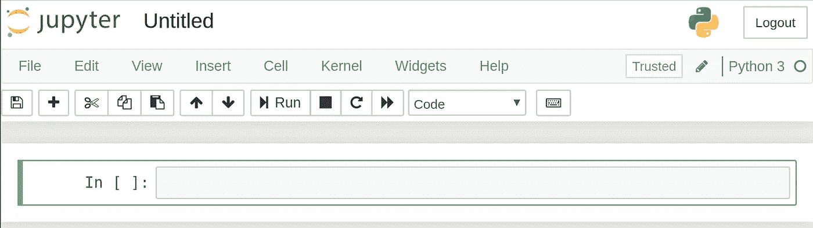
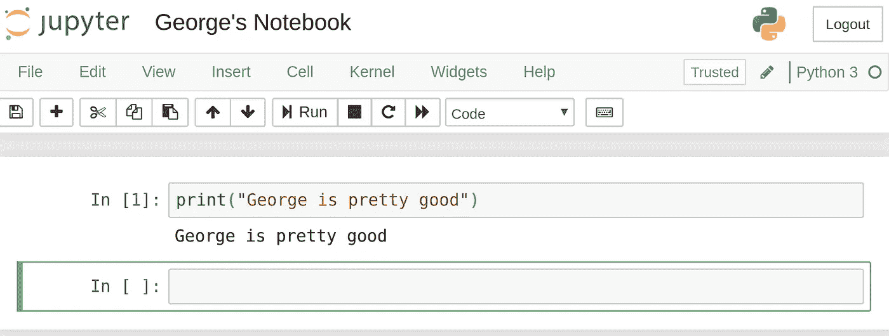
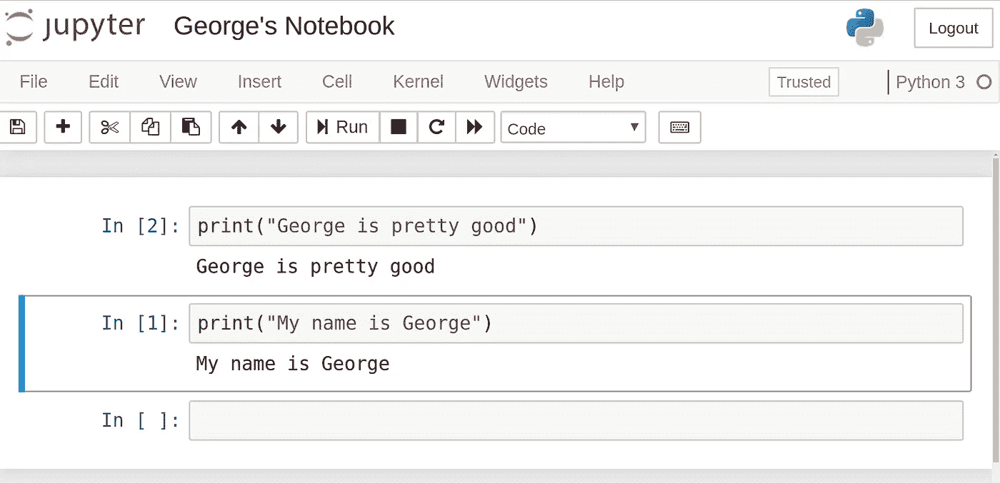
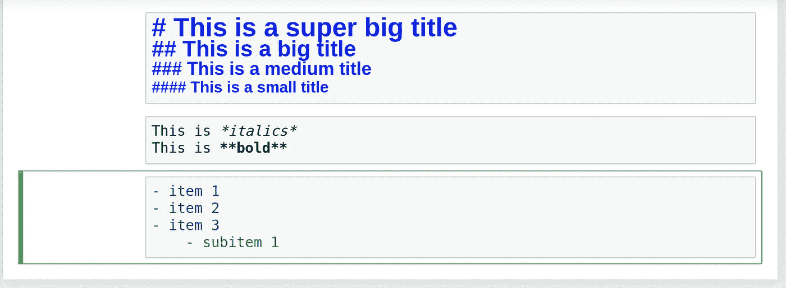
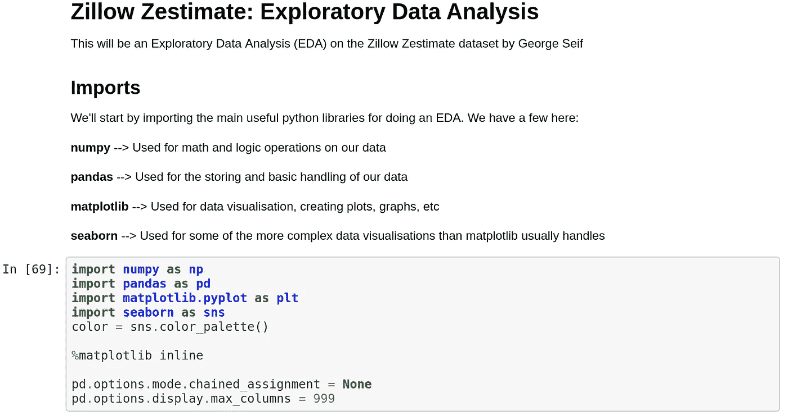
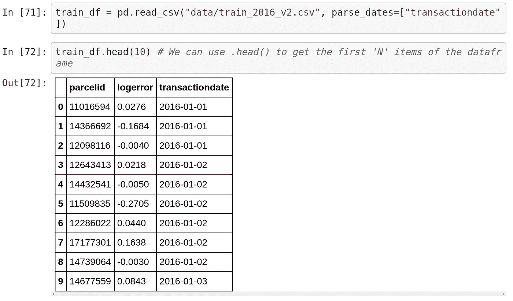
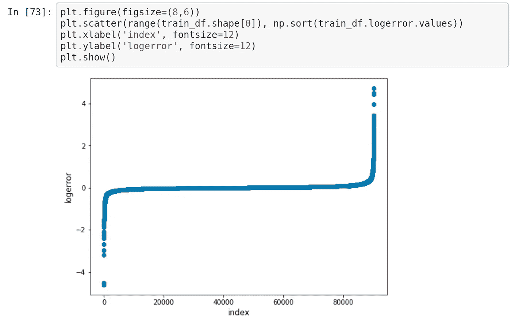

# Jupyter 笔记本初学者教程

> 原文：<https://towardsdatascience.com/a-beginners-tutorial-to-jupyter-notebooks-1b2f8705888a?source=collection_archive---------3----------------------->

## 使用 Jupyter 笔记本进行交互式数据科学项目

> 想获得灵感？快来加入我的 [**超级行情快讯**](https://www.superquotes.co/?utm_source=mediumtech&utm_medium=web&utm_campaign=sharing) 。😎

Jupyter 笔记本是交互式开发和展示数据科学项目的强大工具。Jupyter 笔记本将您的代码及其输出集成到一个单独的文档中。该文档将包含文本、数学方程以及代码直接在同一页面上生成的可视化效果。

这种循序渐进的工作流程促进了快速、迭代的开发，因为代码的每个输出都会立即显示出来。这就是为什么笔记本电脑在过去几年越来越受欢迎，尤其是在数据科学领域。 [Kaggle 内核](https://www.kaggle.com/kernels?sortBy=voteCount&group=everyone&pageSize=20)如今几乎都是用 Jupyter 笔记本做的。



本文的目标读者是希望开始使用 Jupyter 笔记本的初学者。我们将从头到尾地讲解:安装、基本使用以及如何创建一个交互式数据科学项目！

# 设置 Jupyter 笔记本

要开始使用 Jupyter 笔记本，您需要从 Python 安装 Jupyter 库。最简单的方法是通过 pip:

```
pip3 install jupyter
```

这些天我一直推荐使用`pip3`而不是`pip2`，因为从 2020 年 1 月 1 日开始 Python 2 将不再被支持。

现在你已经安装了 Jupyter，让我们来学习如何使用它！首先，使用您的终端进入您想要使用`cd`命令工作的文件夹(Linux 或 Mac)。然后使用以下命令启动 Jupyter:

```
jupyter notebook
```

这将启动一个 Jupyter 服务器，并且您的浏览器将打开一个指向以下 URL 的新标签:[http://localhost:8888/tree](http://localhost:8888/tree)。它看起来有点像这样:



太好了！我们已经启动并运行了 Jupyter 服务器。现在我们可以开始构建我们的笔记本，并用代码填充它！

# Jupyter 笔记本的基本知识

要创建笔记本，点击右上角的“新建”菜单，选择“Python 3”。此时，您的网页将如下所示:



你会注意到在你页面的顶部，在 *Jupyter* 图标旁边有一个单词*Untitled*——这是你笔记本的标题。让我们把它改成更具描述性的。只需将鼠标移到无标题的单词*上，然后点击文本。您现在应该会看到一个浏览器内对话框，您可以在其中重命名笔记本。我把我的叫做*乔治的笔记本。**

让我们开始写一些代码吧！

注意你笔记本的第一行旁边是如何标有`In []`的。该关键字指定您将要键入的内容是一个输入。让我们试着写一个简单的打印语句。回想一下，您的 print 语句必须具有 Python 3 语法，因为这是一个 Python 3 笔记本。一旦您在单元格中写下您的打印声明，按下*运行*按钮。



厉害！看看输出是如何直接打印在笔记本上的。这就是我们如何通过看到过程中每一步的输出来做一个交互式项目。

还要注意，当您运行单元格时，旁边有一个`In []`的第一行现在已经变成了`In [1]`。方括号内的数字表示单元运行的顺序；第一个单元有一个`1`，因为这是我们运行的第一个单元。我们可以随时单独运行每个单元，这些数字会发生变化。

我们举个例子。我们将设置两个单元格，每个单元格都有不同的打印语句。我们将首先运行第二个 print 语句，然后运行第一个 print 语句。看看方括号内的数字是如何变化的。



当您的笔记本中有多个单元格并且按顺序运行这些单元格时，您可以跨单元格共享变量和导入。这使得将代码分成相关的部分变得容易，而不需要在每个单元格中重新创建变量。只是要确保你以正确的顺序运行你的单元格，这样所有的变量在使用前就被创建了。

# 向笔记本添加描述性文本

Jupyter 笔记本附带了一套很棒的工具，用于向您的笔记本添加描述性文本。你不仅可以写评论，还可以添加标题、列表、粗体和斜体。所有这些都是以超级简单的降价形式完成的。

首先要做的是改变单元格类型——单击上面写着“Code”的下拉菜单，将其更改为“Markdown”。这改变了我们正在研究的细胞类型。

让我们尝试几个选项。我们可以使用`#`符号来创建标题。一个单独的`#`将会成为最大的标题，增加更多的`#`将会产生越来越小的标题。

我们可以在文本的两边使用单星形来倾斜文本，或者使用双星形来加粗文本。用一个简单的破折号`-`和每个列表项旁边的空格创建一个列表很容易。



# 交互式数据科学

让我们快速演示一下如何创建一个交互式数据科学项目。这个笔记本和代码来自我做的一个实际项目。

我从一个 Markdown 单元格开始，通过使用一个`#`用最大的标题显示一个标题。然后，我创建了一个列表，并描述了我将要导入的所有重要库。

接下来是导入所有相关库的第一个代码单元。这将是标准的 Python 数据科学代码，除了一个额外的项目:为了在笔记本中直接查看您的 Matplotlib 可视化，您需要添加以下行:`%matplotlib inline`。



接下来，我将从 CSV 文件导入数据集，并打印出前 10 项。请注意下面的截图，Jupyter 如何自动将`.head()`函数的输出显示为表格——Jupyter 与 Pandas 库配合得非常好！



现在，我们将创建一个图形，并将其直接绘制在笔记本上。由于我们已经在上面添加了行`%matplotlib inline`，任何时候我们运行`plt.show()`我们的数字将直接显示在我们的笔记本上！

还要注意，只要我们按下前面单元格上的“运行”按钮，前面单元格中的所有变量，尤其是我们从 CSV 中读取的数据帧，是如何传递到未来单元格的。



瞧啊。这是创建交互式数据科学项目的简单方法！

# 菜单

Jupyter 服务器有几个菜单，您可以使用它们来充分利用您的项目。这些菜单使您能够与笔记本进行交互，访问流行 Python 库的文档，并将项目导出为外部演示格式。

**文件**菜单允许你创建、复制、重命名和保存你的笔记本到文件。文件菜单中最引人注目的项目是*下载为*下拉菜单，它允许您下载各种格式的笔记本，包括 pdf、html 和幻灯片——非常适合创建演示文稿！

**编辑**菜单让你可以剪切、复制和粘贴代码。您还可以在这里重新排列单元格，如果您正在为交互式演示创建一个笔记本，并希望以某种顺序向您的观众展示内容。

**视图**菜单可以让你随意操作，比如显示行号和修改工具栏。该菜单中最好的功能无疑是*单元格工具栏*，在这里您可以为每个单元格添加标签、注释和附件。如果您将笔记本变成幻灯片放映，您甚至可以为该单元格选择想要的格式！

**插入**菜单仅用于在当前选中单元格的上方或下方插入单元格。**单元格**菜单是您按特定顺序运行单元格或更改单元格类型的地方。

最后，你有**帮助**菜单，这是我个人的最爱之一！“帮助”菜单让您可以直接访问重要的文档。您将能够了解所有 Jupyter 笔记本快捷方式，以加快您的工作流程。您还可以方便地链接到一些最重要的 Python 库的文档，包括 Numpy、Scipy、Matplotlib 和 Pandas！

# 喜欢学习？

在[推特](https://twitter.com/GeorgeSeif94)上关注我，我会在那里发布所有最新最棒的人工智能、技术和科学！也在 [LinkedIn](https://www.linkedin.com/in/georgeseif/) 上和我联系吧！