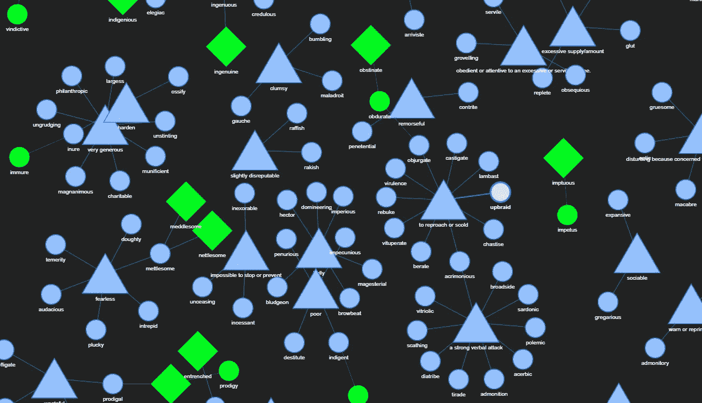
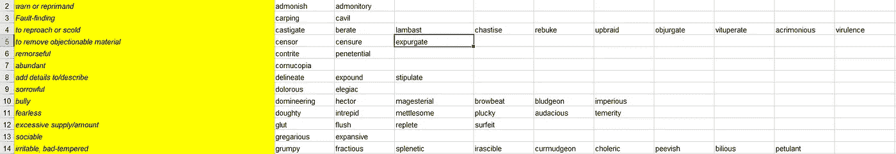
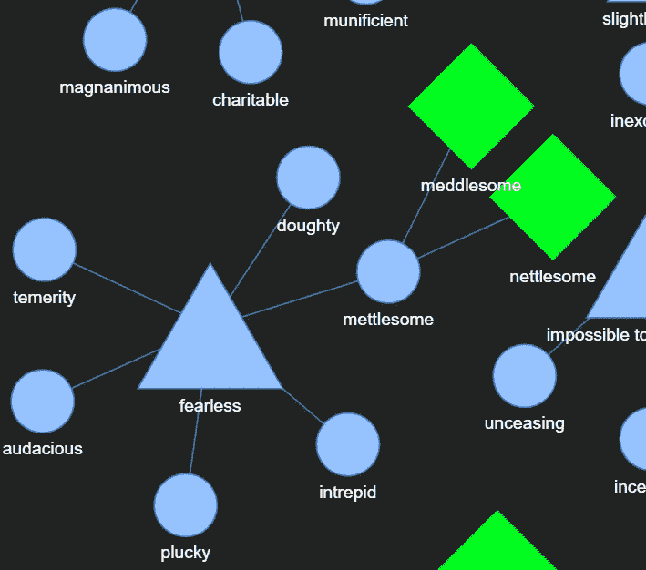

# 使用 PyViz、Jupyter 和 NetworkX 实现 GREVerbal 的更好方法

> 原文：<https://towardsdatascience.com/a-better-approach-to-the-greverbal-using-pyviz-jupyter-networkx-a9720b940fc8?source=collection_archive---------44----------------------->

The GreVisualizer!

你 10 天后要参加 GRE 普通考试。这次考试的分数将在决定你被哪个研究生院录取的过程中起到至关重要的作用。你很紧张。你在死记硬背那些高频词，但你的大脑现在已经饱和了。大约一个月前，当我准备 GRE 考试时，我就处于这种情况。

我心想，肯定有更好的方法来做这件事。可以应用一种更具交互性和可视化的方法。人类保留视觉和声音的时间比简单的纯文本要长得多。我有一个 Excel 表格，是我在准备过程中填充的。这有两种说法。一组包含同义词，而另一组包含经常混淆的单词。率真而巧妙。Excel 表格是一个天真的方法，我需要一个巧妙的方法。

This is mundane, bleh.

This is fun!

我决定将这些单词组建模为图中的网络。在同义词的情况下，中心节点将是单词的含义，所有具有该含义的单词都将被附加到它上面。在常见的混淆词的情况下，它们都是相连的，如果你悬停在节点上，你会得到它们的意思。我使用 [pyViz](https://pyvis.readthedocs.io/en/latest/) 和 [NetworkX](https://networkx.github.io/) 从我的原始 Excel 文件中模拟这些图表。

在这之前一切都很好，我非常兴奋地分享这个可视化工具。不过，我有一个大问题。我如何向公众公布？我在 Jupyter 笔记本中用 python 代码生成的输出是一个交互式 HTML 文件。我找不到在网上免费分享的好方法。我反复考虑这个问题，陷入了僵局，直到…

PyData NYC, 2019!

我坐在纽约微软会议中心的五楼，参加 2019 年 PyData NYC 的教程。该教程名为[快速将 Jupyter 笔记本变成漂亮的网络应用](https://pydata.org/nyc2019/schedule/presentation/58/swiftly-turn-jupyter-notebooks-into-pretty-web-apps/)。这是一次信息丰富、引人入胜的会议。我对我的可视化工具部署问题提出了多种可能的解决方案。

我一回到印度，就开始着手这项工作。我希望用户体验是无缝的，并主要关注于探索图形，而不是强调底层代码。为此，我使用了 Jupyter 的 RISE 首先将我的笔记本转换为幻灯片(是的！).这使得对于那些对代码不感兴趣，只是为了文字而来的人来说更加友好！我还希望最终用户的设置时间和工作量为零。为了实现这一点，我使用 Binder 来部署我的笔记本。在那之后，我简单地把活页夹的标志放在我的 Github 库上，做了一个演示 GIF 并分享给我的网络！

[https://github . com/array layer/the revigualizer/raw/master/demo/demo . gif](https://github.com/arrayslayer/theGREvisualizer/raw/master/demo/demo.gif)

这个项目还有很多工作要做。一些功能包括用户添加新链接的能力，搜索单词，并从单词数据库中提出问题。这就是我开源代码的原因，我鼓励任何感兴趣的人都来帮忙。你可以试试这个可视化工具，如果你愿意的话，甚至可以为它做点贡献，[这里](https://github.com/arrayslayer/theGREvisualizer)。