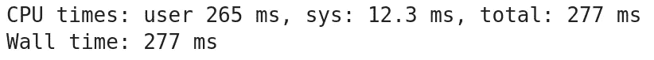
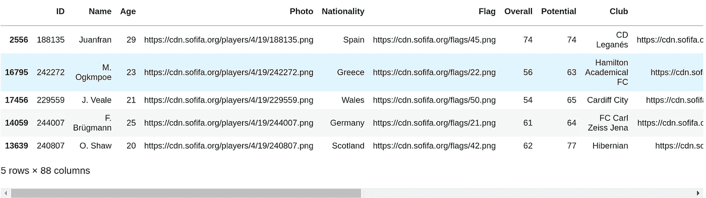
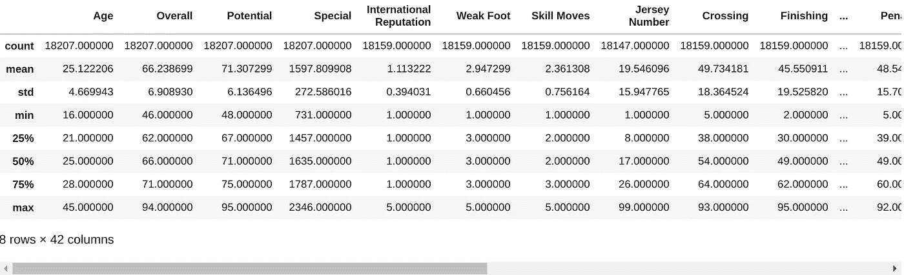
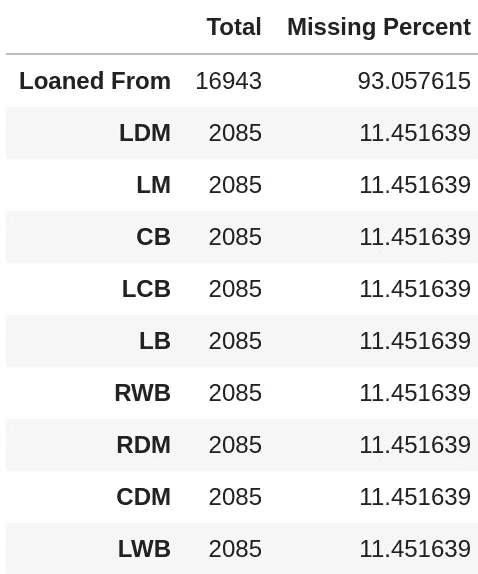
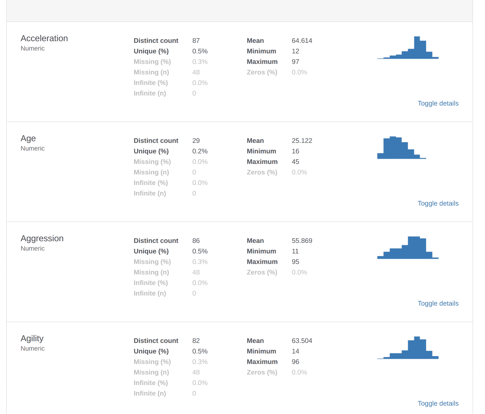
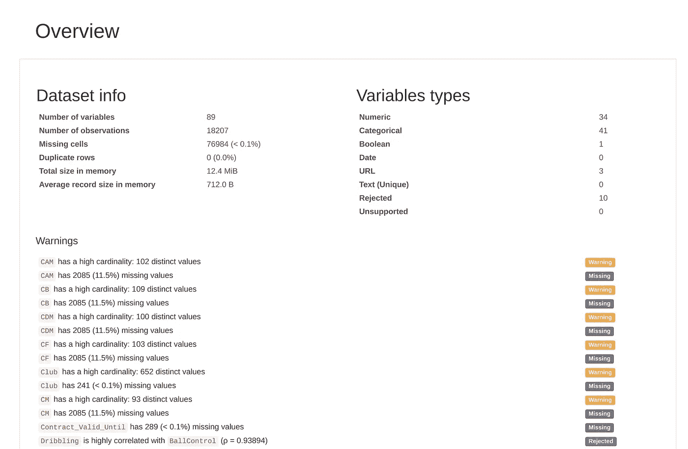

# 一个更好的带有熊猫轮廓的 EDA

> 原文：<https://towardsdatascience.com/a-better-eda-with-pandas-profiling-e842a00e1136?source=collection_archive---------1----------------------->

## 探索性数据分析已死，熊猫万岁——剖析！事半功倍，完美概述您的数据。


U[nsplash](https://unsplash.com/photos/hpjSkU2UYSU)

# 一个充满坏数据的世界

大多数情况下，在**数据科学**中，我们收集的数据不像互联网上可用的数据集那样干净和完整，它们是为机器学习模型的应用而设计和准备的。大多数情况下，数据来自外部来源，没有良好的结构或者只是不完整，而您的工作就是让这些数据受欢迎和可用！

虽然数据科学家意识到了**数据质量**的重要性，但对于企业领导者来说却不一定如此。他们更关注尽早采用技术以保持竞争优势，但通常对实际方面了解甚少。这意味着人们使用他们数据集中的所有东西，并希望得到最好的结果，借口是数量可以补偿质量。


由于这种思维方式的差异，**一个数据科学家在建模之前要花 80%的时间准备数据集**。

为什么他 80%的时间？有**缺失值**、**不平衡数据**、**没有任何意义的列名**、**重复数据**、**过期数据**等原因。人们最近才意识到数据的重要性。因此，即使趋势逆转，数据也很难容易获取且结构良好。

[](https://medium.com/@danberdov/dealing-with-missing-data-8b71cd819501) [## 处理缺失数据

### 几乎所有真实世界的数据集都有缺失值，这不仅仅是一个小麻烦，而是一个严重的问题…

medium.com](https://medium.com/@danberdov/dealing-with-missing-data-8b71cd819501) 

一个坏的数据集的后果是简单而合乎逻辑的:用这些数据集制作的预测模型将具有**低准确性**和**低效率。用不正确的数据训练一个模型会产生偏差，你的结果会与现实相差甚远。一个坏的模型是一个不能被部署的模型，所以对于开发这个模型的公司来说，这是一个金钱的损失。用生锈的零件制造的汽车将无法正常行驶，甚至根本无法行驶……而且没有人愿意使用或购买生锈的汽车！**


[Stock.io](https://www.stockio.com/free-photo/antique-99)

所以，你的数据集是你项目的关键。它在技术和经济上的成功取决于你所选择的数据的质量。在一个机器学习项目中，跳过这个数据评估步骤可能会导致相当大的时间浪费，并且您将不得不从头开始重新开始您的项目。现在看来，数据科学家花了这么多时间调查和准备数据集！

[](https://becominghuman.ai/bad-data-is-ruining-machine-learning-heres-how-to-fix-it-31ae9f4cef3f) [## 坏数据正在破坏机器学习，下面是如何修复它

becominghuman.ai](https://becominghuman.ai/bad-data-is-ruining-machine-learning-heres-how-to-fix-it-31ae9f4cef3f) 

> 低质量的数据只会导致低质量的结果。

# 上帝创造了 EDA，探索性数据分析

## 概念方法

为了确保我们的数据集是有用的，一个好的做法是 EDA，**探索性数据分析**。

EDA 是一种让你熟悉数据集的方式。通过这种反射工作，这是使用有趣的、连贯的和干净的数据的保证。这一步非常直观，基于汇总统计数据和图形表示。

通过一个 **EDA** ，**数据科学家**可以发现哪些特性是重要的或者它们之间的相关性。另一方面，**EDA 允许您发现错误或缺失的值，检测异常或拒绝假设**。特征变量的选择将在以后用于机器学习。

一般来说，**探索性数据分析**之后是**特征工程/数据扩充**步骤，在该步骤中，您对初始数据进行处理，为其带来附加值

[](/exploratory-data-analysis-8fc1cb20fd15) [## 什么是探索性数据分析？

### 当我在考虑我应该开始写博客的第一个话题是什么的时候，EDA 突然出现了…

towardsdatascience.com](/exploratory-data-analysis-8fc1cb20fd15) 

## EDA 的一个基本示例:

对于这个例子，我取了一个非常适合 EDA 的数据集， [FIFA 19 完整球员数据集](https://www.kaggle.com/karangadiya/fifa19)。数据包含**多种数据类型**、**缺失值**和**许多指标**都适用。关于该数据集的几个完整分析可在[此处](https://www.kaggle.com/karangadiya/fifa19/kernels?sortBy=voteCount&group=everyone&pageSize=20&datasetId=73041)获得。我使用 [**JupyterLab**](https://jupyterlab.readthedocs.io/en/stable/) 作为 IDE，因为它的灵活性和用户友好的界面。

让我们从使用 **Pandas** 库从 CSV 文件导入数据开始:



装载速度很快。现在概述一下`data.sample(5)`，一种随机选择 5 行的方法。如果你不知道你的数据是如何排序的，那么使用`.sample()`比`.head()`更好。



用`.describe()`来做一些描述性统计吧。这种方法“总结了数据集分布的集中趋势、分散和形状，不包括`NaN`值”。



现在我们有了描述性统计数据，我们将检查缺失值。我们将只打印缺失值超过 10%的 10 个有序要素:



如您所见，对于数据科学家来说，在笔记本电脑上进行 EDA 既方便又高效。尽管如此，视觉仍然是总结，并按指标打印。现在，让我们看看如何用 Pandas-profiling 动态地打印这些信息，并且花费更少的精力。

> 我们通过观察来学习

# 熊猫侧写，我们的救星

## 这个概念

> Github 描述:“从熊猫数据框架中生成个人资料报告”

[**Pandas-profiling**](https://pandas-profiling.github.io/pandas-profiling/docs/) 将所有砖块集合到一个完整的 EDA 中:**最频繁值**、**缺失值**、**相关性**、**分位数和描述性统计数据**、**数据长度**等等。得益于这些指标，您将很快看到数据的**分布**和**差异**。这些信息对于了解数据是否对未来有用至关重要。

[](https://github.com/pandas-profiling/pandas-profiling) [## 熊猫简介/熊猫简介

### 从 pandas DataFrame 对象创建 HTML 分析报告—pandas-profiling/pandas-profiling

github.com](https://github.com/pandas-profiling/pandas-profiling) 

## 指标呈现在交互式 HTML 报告中。

Pandas-profiling 通过 HTML 报告以结构化的方式呈现不同的指标。由于它的交互作用，很容易从一个特性切换到另一个特性并访问它的指标。



让我们看看如何使用它:

```
pip install pandas-profiling
```

使用我们之前的 FIFA 数据集:

```
import pandas as pd
import pandas_profilingdata_fifa = pd.read_csv('fifa.csv')
profile = data_fifa.profile_report(title='Pandas Profiling Report')
profile.to_file(output_file="fifa_pandas_profiling.html")
```

在上面的代码中，我们只导入 pandas 和 pandas-profiling 依赖项，读取我们的 CSV 文件并调用`profile_report()`方法，因为`pandas_profiling`用`data_fifa.profile_report()`扩展了 pandas 数据帧。然后，我们用`.to_file()`将我们的`ProfileReport`对象导出为一个 HTML 文件。

瞧！这里，我们的 HTML 文件位于文件夹的根目录:



上图显示了报告的“概述”部分。这一部分简要介绍变量类型、缺失值或数据集大小的信息。

**Pandas-profiling** 使用 **matplotlib** 图形库和 **jinja2** 作为其界面的模板引擎。

作为一名自由职业者，当我不得不为客户处理一个新的数据集时，我总是首先制作一个熊猫简介，这有助于我吸收数据集。这个实践允许我量化数据集的处理时间。有多少特征看起来是正确的？有多少包含缺失值？每个功能占多大比例？哪个变量依赖于另一个变量？

此外，该报告还可以作为一个界面，为客户提供数据健康的全局信息。这份报告不是在你的 **Jupyter 笔记本**上展示你的分析，而是一个接一个的图表，并在**之间用代码隔开，而是按照特性**集中指标，并有一个更加**的用户友好界面**。我的客户希望对我为他们执行的任务有一个完整的跟踪，并希望定期了解我的进展。我经常使用这个报告来给出数据的健康状态。这一步之后是更深入的数据分析和可视化的第二步。


# 结论

**大数据**的潜力一直在增长。充分利用意味着公司必须将分析和预测系统纳入其战略愿景，并利用它做出更好、更快的决策。通常，我们检索的数据包含错误或缺失的数据。为了真正有效，这些数据必须经过**分析**和**处理**。这就是**数据科学家**的角色。有了 **pandas-profiling** ，数据科学家能够以更少的努力产生快速的**探索性数据分析**报告。该报告清晰、易于使用，任何具有基本统计技能的人都可以阅读。

有了对眼前情况的全面了解，你就有了进一步分析的思路，开始处理数据或寻找外部数据源来提高数据质量。**预处理数据并提高其质量至关重要，因为我们的预测机器学习模型的质量与我们输入模型的数据质量直接相关。**

我希望你喜欢这个熊猫简介——简介！这是我在 medium 上写的第一篇文章，我对任何评论和改进都感兴趣！

[圣甲虫的消息](https://medium.com/u/52eb891e229c?source=post_page-----e842a00e1136--------------------------------)

[](https://medium.com/@ScarabNews/membership) [## 用我的推荐链接加入媒体-圣甲虫的新闻

### 作为一个媒体会员，你的会员费的一部分会给你阅读的作家，你可以完全接触到每一个故事…

medium.com](https://medium.com/@ScarabNews/membership) [](https://medium.com/subscribe/@ScarabNews) [## 每当圣甲虫的新闻出版的时候得到一封电子邮件。

### 每当圣甲虫的新闻出版的时候得到一封电子邮件。通过注册，您将创建一个中型帐户，如果您还没有…

medium.com](https://medium.com/subscribe/@ScarabNews)