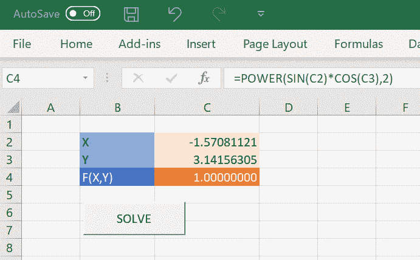
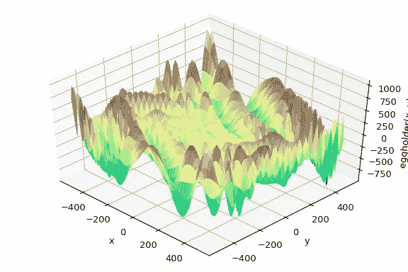

# 用 Python 实现更好的 Excel 目标搜索

> 原文：<https://towardsdatascience.com/a-better-excel-goal-seek-using-python-fb6aff56e9f2?source=collection_archive---------7----------------------->



Solving has been artifically slowed down for visualization.

微软 Excel 有一个很棒的功能，在*数据/假设…* 菜单下的“Goal Seek”。给定一个公式，它将计算输入需要什么，以便该公式等于一个特定的结果。这是一个非常强大但简单的工具。

标准的“目标搜索”功能虽然在许多情况下很有用，但却有一定的局限性。它只能求解单个输入像元，并且无法控制所使用的算法。

还有更复杂的“规划求解”插件，它也是 Excel 的一部分。这就像是打了兴奋剂的“寻根问底”！它可以处理多元函数、约束，并有多种优化算法可供选择。

如果这还不够呢？对于更复杂的问题，如全局优化或大规模优化，“规划求解”加载项中的默认算法可能不够。

# Python 和 scipy.optimize

Python 是许多数据科学家的首选工具，理由很充分！对于超越 Excel 中简单的“目标求解”或“规划求解”解决方案的优化问题，Python 包 [scipy.optimize](https://docs.scipy.org/doc/scipy/reference/tutorial/optimize.html) 提供了一系列更全面的算法。

如果您的模型可以很容易地用 Python 重写，那么使用 scipy.optimize 是一个很好的解决方案。但是，如果您的模型已经在 Excel 中，或者您更喜欢留在 Excel 中，仍然可以在 Excel 中利用 scipy.optimize 函数。



如果你是 Python 的新手并且想学习，你可以在这里下载免费的电子书《VBA 开发者的 Python 终极指南》:

[https://www . pyxll . com/ultimate-python-guide-for-VBA-developers . html](https://www.pyxll.com/ultimate-python-guide-for-vba-developers.html)

# Python Excel 与 PyXLL 的集成

如果你是一个 Excel 用户，你想使用 Python 作为工作簿的后端，或者如果你是一个 Python 用户，你想使用 Excel 作为 Python 代码的前端，你可以使用 [PyXLL，Python Excel 插件](https://www.pyxll.com)。

没有必要在 Excel 的交互性和 Python 的强大功能和生产力之间做出选择，因为您可以将 Python 集成到 Excel 中，甚至使用 [Python 作为 VBA](https://www.pyxll.com/docs/userguide/vba.html) 的完全替代。

PyXLL 允许你编写工作表函数(UDF)，Excel 宏，菜单函数，功能区工具栏，RTD 函数等等，全部使用 Python——不需要 VBA。

# 从 Excel 调用 scipy.optimize

随着 Python 在 Excel 中运行，我们现在可以直接在 Excel 中使用 scipy.optimize。

要在 Python 中执行与 Excel 的 Goal Seek 等效的操作，我们应该执行如下操作:

```
**from** scipy.optimize **import** minimizeminimize(objective_func, X)
```

其中 X 是*目标函数*输入的初始值。目标函数是我们试图最小化的东西，在我们的例子中是一个 Excel 公式。

我们的目标函数需要在 Excel 中包装我们的模型。与我们使用 Goal Seek 时一样，我们的模型只是一组输入单元和一个输出单元。我们的目标函数将设置输入单元格的值，计算工作表，然后读回输出单元格的值。

一个简单的例子是，输入在 C2 和 C3，输出在 C4。PyXLL 使访问 Excel 应用程序对象和访问单元格值变得简单，就像在 VBA 中一样:

```
**from** pyxll **import** xl_app **def** objective_func(arg): xl **=** xl_app() # Copy argument values to input range xl.Range('C2').Value **=** float(arg[0]) xl.Range('C3').Value **=** float(arg[1]) # Calculate after changing the inputs xl.Calculate() # Return the value of the output cell result **=** xl.Range("C4").Value **return** result
```

现在我们有了一个目标函数，我们需要一些调用优化器的方法。我们可以通过 PyXLL 的@xl_macro decorator 使用 Python 编写的 Excel 宏来实现这一点。

```
**from** pyxll **import** xl_macro, xl_app@xl_macro(shortcut**=**'Ctrl+Alt+P')**def** optimize():
    # Get the initial values of the input cells xl **=** xl_app() x **=** xl.Range("C2").Value y **=** xl.Range("C3").Value X **=** np.array([x, y]) # run the minimization routine minimize(obj_func, X, method**=**'nelder-mead')
```

该宏可以分配给按钮，也可以通过指定的快捷键调用。

# 进一步阅读

在这篇博客文章中，有更多关于使用 Python 的 scipy . optimize from Excel with PyXLL 的技术细节和深入解释:

https://www.pyxll.com/blog/a-better-goal-seek/

有关 PyXLL 的更多详细信息，请参见

【https://www.pyxll.com】T4。

如果您是 Python 的新手，并且想学习 Python，请在此下载免费电子书“VBA 开发者 Python 终极指南”:

[https://www . pyxll . com/ultimate-python-guide-for-VBA-developers . html](https://www.pyxll.com/ultimate-python-guide-for-vba-developers.html)

请在这里查看 scipy.optimize 文档

[https://docs.scipy.org/doc/scipy/reference/optimize.html](https://docs.scipy.org/doc/scipy/reference/optimize.html)