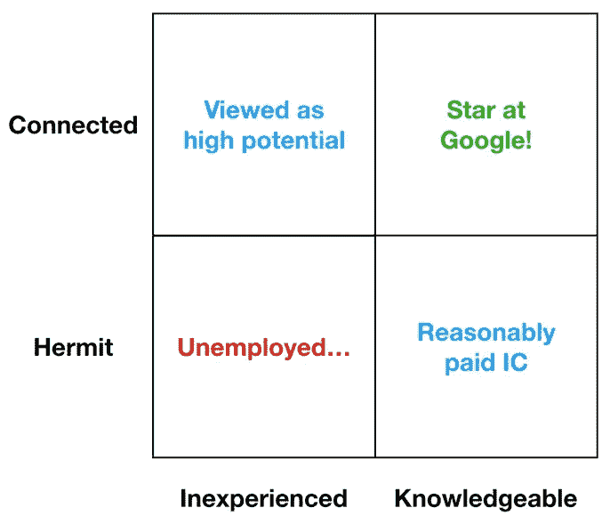
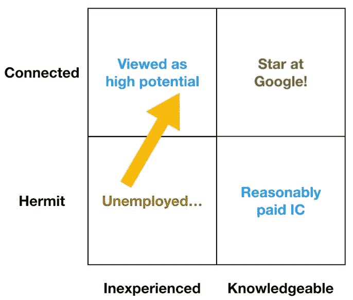

# 提高技能的更好方法

> 原文：<https://towardsdatascience.com/a-better-way-to-skill-up-b2e5ee87dd0a?source=collection_archive---------25----------------------->

## 头脑风暴如何提高教育即服务行业的客户投资回报率

如今，教育作为一种服务行业正在蓬勃发展。MOOCS(大规模开放在线课程)、在线硕士课程、训练营，甚至 YouTube 视频都为今天好奇的学习者提供了大量高质量的选择。

所以提高技能和找到一份好工作应该很容易，对吗？不对！堆积完成证书和在线学位可能感觉很棒，但它通常不会让你更接近你的梦想工作——尤其是如果那份工作是在另一个行业。

在今天的帖子中，我们将探讨为什么尽管高质量的教育内容真的激增，但没有传统学位(在他们渴望工作的领域)的学习者仍然面临着一场艰苦的战斗。我们还将讨论如何绕过这一障碍，以便为新毕业生和转行者提供更多的入门机会。

# 关系很重要…非常重要！

因为这个世界上所有重要的事情都可以放入一个 2×2 的矩阵中(开玩笑，只有管理顾问才会这么想)，这里有一个将员工分成四类的方法:

1.  **有关系但缺乏经验**——你缺乏经验，但在你渴望为之工作的公司里认识很多人。因为你善于交际，善于交际，雇主喜欢你，认为你潜力巨大，值得一赌。
2.  **人脉广、知识丰富**——这里不用担心工作，只要继续把这些股份投给谷歌(或者脸书、Airbnb 或 Lyft)就行了。
3.  隐士和没有经验的人——你在寒冷贫瘠的苔原上被无情地拒绝(一份无推荐的工作申请)。当你最终获得面试机会时，招聘经理会瞄准你缺乏相关经验的情况，迅速粉碎你获得高薪工作的梦想。
4.  作为个人贡献者(IC)，你多年来来之不易的经验为你赢得了合理而稳定的薪水。

The drivers of gainful employment

因此，如果你被困在没有经验的隐士盒子里，你有两种主要的方法可以摆脱:

1.  **结识相关人士**，与他们一拍即合，有希望去他们的公司工作。
2.  获得教育和知识来增加你获得有报酬工作的机会。请注意，虽然经验胜于知识，但有一个“先有鸡还是先有蛋”的问题，我需要一份工作来获得找工作所需的经验。

# 如今教育即服务的问题是

如今的教育即服务产品主要关注技能提升。他们试图教你当下最受欢迎的技能，让你朝着下面的黄金箭头方向前进——从失业、缺乏经验的隐士变成有知识、有工作能力的同事。

Education as a service tries to move you in this direction

朝这个方向前进的问题是，真的很难。仅仅学习这些是不够的，你还必须:

*   获得一份向雇主表明你知识渊博的证书——而且必须是一份他们听说过并尊重的证书。
*   **展示将你的知识**实际应用于解决商业问题的能力(最好是通过签约或实习等实际付费经历)。如果你的证书不是顶级的，这就变得特别重要。

你看出问题了吗？**一切都是为了赢得信誉，目前只有两种主要的方式来赢得信誉——大学和公司。**因为我经常写关于数据科学的文章，所以让我们以它为例。试图进入该领域的有抱负的数据科学家可以通过以下两种方式之一获得一些街头信誉:

1.  上一所受人尊敬的大学，获得数据科学学位(最好是更高的学位)。
2.  说服一家受人尊敬的公司给你报酬，让你从事与数据相关的工作。

另一方面，MOOCs、训练营和其他替代项目无法为你赢得必要的信誉。他们可能会教你必要的技能(根据我的经验，他们在这方面做得相当不错)。但这有点像古老的哲学陈词滥调:

> 如果一棵树倒在森林里，周围没有人听到，它会发出声音吗

即使我通过阅读书籍、博客、一两个 MOOC 和训练营，对机器学习和统计学有了深刻的理解，我仍然有可能被我想要的工作拒绝。雇主只是不太相信结业证书。

**从雇主的角度来看，这是一场赌博:鉴于你没有数据科学工作经历，也没有人能保证你真正了解自己的东西，他们只能相信你的话。**不幸的是，并不是每个雇主都愿意这么做——人们，包括招聘经理，通常都不愿意承担风险，愿意为安全、“可靠”的候选人支付额外费用(从生产率和财务角度来看，雇佣错误的人都是痛苦的)。

是的，我知道。如果你充满动力和主动性，你可以参加 Kaggle 比赛，在会议和聚会上结识业内人士，自己建立一个令人敬畏的数据科学项目组合，并为早期创业公司无偿工作(所有这些都在面试时进行)。但这并不适合所有人。Bootcamps 和他们的教育即服务竞争对手，虽然比传统的大学学位便宜，但在时间和金钱方面仍然花费相当多(15，000 到 20，000 美元的学费和至少几个月的时间)。他们还在营销中强调你毕业后的就业能力。但是，如果没有人脉或者足够有声望的认证(即使是最好的训练营也缺乏这种认证)，你完成这个项目就像是一棵树倒在一片荒芜的森林里，周围没有雇主看到或者关心它。

# 我们如何解决这个问题？

我同意雇主应该更加开明。应该给转行者和来自非传统背景的候选人更多证明自己的机会，应该更加平等地看待自我获得的知识(和经验)和声望学位。但遗憾的是，尽管我们希望如此，雇主们可能不会改变他们的招聘方式(即使他们会改变，也是非常缓慢的)。

因此，这取决于教育即服务行业，它仍然相当年轻，以找出如何提供最大的影响。回到我们的 2 乘 2 矩阵，我要建议的应该是很明显的(我们可以移动的方式只有这么多):

Focus on moving up and modestly right

请注意箭头现在是如何向上并适度向右移动的。是的，知识构建部分仍然很重要，但我们(从现在开始我将使用皇家“我们”这个词，因为一遍又一遍地将教育作为服务行业是很累的)需要找到一种方法，为非传统学习者提供更多更好的渠道给雇主。

潜在的解决方案必须符合以下标准:

1.  **减少雇佣非传统学习者的耻辱和风险**(从雇主的角度)。
2.  **增加从事信誉和知识建设项目的机会。**这些项目必须是一般招聘经理实际上认为合法的项目。
3.  **增加指导和网络建设的机会。此外，应该鼓励导师和业内人士帮助毕业生。依靠他人的善意只能让我们走到这一步。**

现在有几个有趣的模型。我发现最有趣的两个是[洞察奖学金项目](https://www.insightdatascience.com/)和[最敏锐的头脑](https://www.sharpestminds.com/)。

Insight 是一个声望很高、选择性很强的 7 周训练营(基本上是数据科学训练营的斯坦福)，与雇主有很好的联系。你可以从它的时间表中看出它的联系有多紧密，因为 Insight fellows 花了整个第 5-7 周(将近一半的时间)访问并向潜在雇主展示他们的数据项目(他们在第 5 周之前开发的)。此外，在整个训练营中，他们有机会与导师和校友互动。所以 Insight 符合我们的所有标准。问题是，它只接受博士(数据科学奖学金)，所以它的典型候选人是一个非常传统的学习者，可能很少甚至不需要工作帮助。事实上，我认为 Insight 就像一个热门市场中的房地产经纪人——只是坐在买家(雇主)和卖家(有抱负的数据科学家)之间，从每笔交易中抽取佣金，而没有增加多少实际价值。

最敏锐的思维可能是两者中更好的长期解决方案。该公司运营一个平台，将导师与有抱负的数据科学家联系起来。导师指导学生完成一个数据项目，提供面试准备，并向学生开放他或她自己的网络。导师提供帮助的动机来自收入共享协议——如果导师帮助学生找到相关工作，导师将获得学生第一年工资的一小部分。

We need a marketplace for connecting learners with legit projects (Photo by [Krisztina Papp](https://www.pexels.com/@almapapi?utm_content=attributionCopyText&utm_medium=referral&utm_source=pexels) from [Pexels](https://www.pexels.com/photo/group-of-people-in-a-street-market-2276796/?utm_content=attributionCopyText&utm_medium=referral&utm_source=pexels))

# 还缺什么？

但我认为我们还可以做得更好。洞察力太有选择性，主要为那些不需要帮助的人提供帮助。与此同时,“最敏锐的头脑”过于依赖导师和他们的个人能力来为学生开拓机会。在我看来，还有一种相对未开发的资源——公司本身。

我的提议是一个平台，将有抱负的数据科学家与来自实际公司的为期 3 个月的付费数据科学项目相匹配。以下是我心中想法的大致轮廓(我对此的想法非常初步):

*   想要成为平台一部分的学习者(有抱负的数据科学家)必须提交他们在业余时间完成的数据科学项目的代码和书面报告。它不一定是一个完美的项目，但它必须表现出一些主动性，创造性和激情。
*   **学习者的教育背景和以前的工作经历被掩盖(匹配后才暴露)。公司必须完全根据学员申请的项目，或者(如果适用的话)该平台上以前的项目来选择学员。这使得学习者的选择更加择优。**
*   一个项目最多可以有 7 个人参与。他们可以作为一个团队或独立工作，这取决于公司的愿望。你说为什么独立？一家公司可能希望看到多种独立的方法来解决一个特别棘手的问题，并选择它最喜欢的一种(较少人这样想)。项目完成后支付定义的里程碑和机密。
*   公司有动力提供项目，因为他们可以获得数据科学和分析自由职业者的工作，比雇佣经验丰富的承包商(他们收取很高的时薪以弥补福利的缺乏)、更昂贵的顾问或全职员工要便宜得多。这使得他们可以将低成本、饥渴的人才投入到高选择率的问题中。如果学习者解决了问题，那就太棒了，如果没有，那也很好，因为成本太低了。因此，对公司来说，这是一个低风险、高回报的机会。
*   随着项目的进展，公司和学习者有机会互相评价，保持双方的诚实。如果任何人的评级低于最低阈值，他或她将被禁止进入该平台(包括公司)。
*   提供高评级项目或定期从学员库中招聘人员的公司可以在项目费率上获得折扣，并获得他们选择的学员。
*   同样，在新项目和面试机会(平台上的公司)方面，评级高的学习者有优先权。
*   需要考虑一下公司支付给学习者的费用的算法。它应该是公司评级和学习者评级(基于他们的应用项目和平台上的其他项目)的函数，但也必须做好供需平衡的合理工作。然而，考虑到价值至少在最初是向学习者倾斜的，在早期阶段，学习者很可能比项目多得多(比率应该反映这一点，但不能太低以至于阻碍学习者的参与)。

通过这种方式，学习者可以提高技能并建立自己的投资组合，从而在平台内外赢得真正的信誉(和金钱)。与真实的公司互动和展示也应该提供有价值的网络机会。

另一方面，公司有机会在一个真正的项目(或多个项目)期间评估潜在候选人，并获得稳定的充满激情的人才渠道。

**最后，公司无法看到学习者的背景，这保证了选拔将基于优点**(匹配前名字可能也需要隐藏，否则公司可以在 LinkedIn 上查找学习者)。

这个随机启动的想法肯定仍然是一个正在进行的工作，我希望在不久的将来继续完善我的想法。感谢您的阅读，也请与我分享您的观点。干杯！

***更多数据科学、职业、教育相关岗位由我:***

[*数据科学家是做什么的？*](/what-do-data-scientists-do-13526f678129)

[*数据科学家面临自动化的风险吗*](/is-the-data-science-profession-at-risk-of-automation-ae162b5f052f)

[*拿到了数据科学的工作？*](/got-data-science-jobs-552e39d48da2)

[*数据科学家挣多少钱？*](/how-much-do-data-scientists-make-cbd7ec2b458)

[*数据科学家赚多少钱第二部*](/how-much-do-data-scientists-make-part-2-cb959a0d05f)

[*我的 Metis 数据科学训练营经历*](/how-i-feel-about-data-science-and-the-metis-bootcamp-experience-398b171289d0)