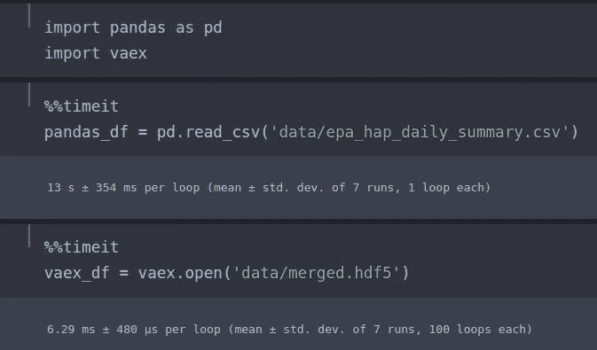
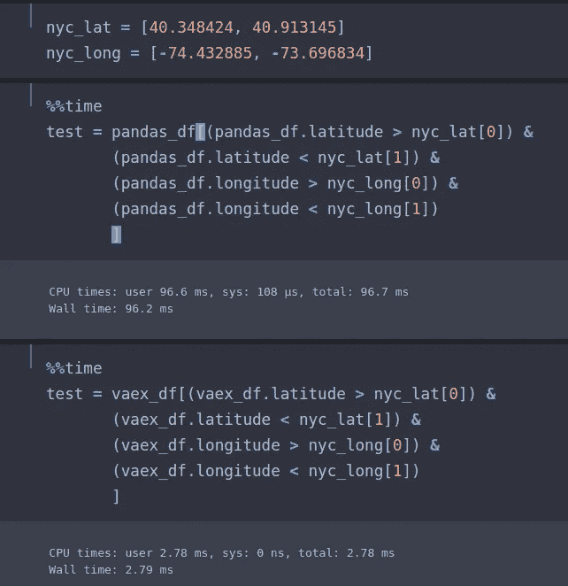

# 每秒十亿行

> 原文：<https://towardsdatascience.com/a-billion-rows-a-second-36b7a2066175?source=collection_archive---------11----------------------->

## 与大人物合作！Python 中的数据。

你是否曾经开始一个新项目，得到原始数据集，并意识到数据比你的机器所能处理的要大得多？你有没有用 Python 写过一个运行到要花无限多天的脚本？

这两个问题都有解决方案，但对于那些不关注大数据的人来说，没有一个是容易实施的。直到现在。

我最近偶然发现了一个名为 [Vaex](https://github.com/vaexio/vaex/blob/master/docs/source/index.ipynb) 的新库，简而言之——它非常有用。Vaex 作者 Maarten Breddels 在他的[介绍文章](/vaex-out-of-core-dataframes-for-python-and-fast-visualization-12c102db044a)中完美地描述了这一点:

> *如果你可以立即加载一个 1tb 的数据文件，只读取你需要的部分，用一个聪明的内核程序员花了几十年优化的策略，那不是很好吗？*
> 
> 在提出疯狂请求的同时，我们为什么不请求一个感觉有点像熊猫的、我们都在使用的 API 呢？哦，对了，请不要在我的 2013 MacBook Air 上占用太多内存。因为现在是 2018 年，我们都在 Jupyter 笔记本上工作，所以也让它工作，好吗？请确保我所有打开的笔记本也共享该数据集的内存。

# 驯服野兽

对于我们这些没有在 Hadoop 生态系统中工作十年经验的人(或者我们这些已经……咳咳……让软件工程师“帮助”解决困难部分的人)来说，处理海量数据集是极其痛苦的。如果你习惯于和熊猫一起工作，Vaex 并不完全是现成的，所以我想在这里降低准入门槛。

# 数据类型

首先，我们需要谈谈数据类型。在引擎盖下，Vaex 包装了一组 numpy 数组。大多数数据集以 CSV 文件的形式出现，这是许多数据科学家习惯使用的格式。但是，您是否尝试过将 20gb 的文件读入内存？对于大多数计算机来说，这是不可能的。

因此，我们希望将我们的文件转换成 Vaex 喜欢的格式(HDF5 ),而不是让 Vaex 通过 Pandas 进行转换。大型 CSV 文件的典型情况是将它们分解成部分文件，所以我想编写一个 bash 脚本来处理这两种情况。

对于我们的示例文件，我们将使用一个关于空气质量的 [Kaggle 数据集](https://www.kaggle.com/epa/hazardous-air-pollutants) (~2.5GB 解压缩)，并且我们将删除大部分字符串列。这给我们留下了大约 1GB 的文件。就数据而言很小，但对这个演示来说很好。

1.  首先，你需要下载一个名为 [Topcat](http://www.star.bris.ac.uk/~mbt/topcat/#standalone) 的方便的文件转换工具。如果你没有使用的经验。jar 文件，你可以在这里阅读它们[。](https://en.wikipedia.org/wiki/JAR_(file_format))
2.  将 jar 复制到 CSV 文件的目录中(您也可以只有一个 jar 文件的中心目录，但我将把它留给读者)。
3.  现在，我们使用一个定制的 bash 脚本将 CSV 高效地转换为 HDF5

我们已经准备好测试 Vaex。由于 Vaex 实际上并不将数据集加载到内存中，所以它几乎是即时的。

让我们进行一个相对简单的计算和比较。我们的数据集包含每个数据点的经度和纬度(总共有大约 900 万行。假设我们想要找到包含在纽约市内的所有点。

一个粗略的方框可能给出以下内容:

*   nyc_lat = [40.348424，40.913145]
*   nyc_long = [-74.432885，-73.696834]

这是 Vaex 和熊猫的对比。

对于这个简单的操作，Vaex 几乎快了 25 倍。请记住，数据集越大，需要进行的数学计算就越多，Vaex 带来的好处就越多。

此外，使用一个名为 Numba 的漂亮的 Python 库，可以显著提高复杂的数学运算(在后面的文章中会详细介绍)。

# 利用数据科学工具

我总是发现大数据会带来一系列独特的挑战。数以万亿计的数据集、数以万亿计的数学运算以及这两者带来的复杂性让生活变得更加复杂。

像 Vaex 这样的库可以让数据科学家在没有大数据工程师所拥有的深度计算专业知识的情况下，仍然能够以非常高效的方式处理难以置信的大数据集。

如果你有兴趣了解更多关于以小方式(即自己)处理大数据的知识，那么请关注我的媒体，或者通过 [https://jessemoore.ca](https://jessemoore.ca) 联系我，讨论一个潜在的项目。

直到下一次…

耶西

*最初发表于*[*Jesse Moore . ca*](https://jessemoore.ca/2019/billions-rows-per-second/)*。*