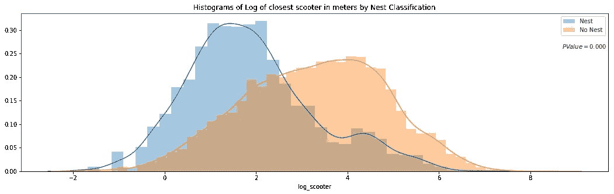
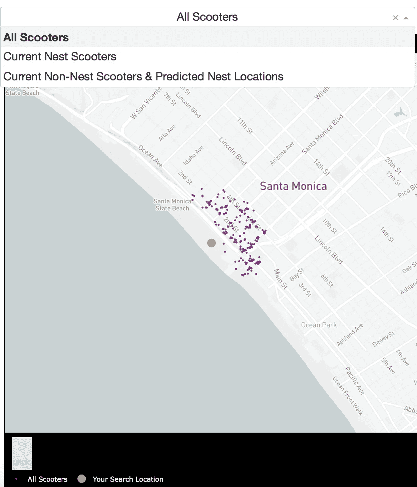

# 鸟瞰:机器学习如何帮助你为电动滑板车充电

> 原文：<https://towardsdatascience.com/a-birds-eye-view-leveraging-machine-learning-to-generate-nests-30dd2136a839?source=collection_archive---------20----------------------->

Bird scooters in Columbus, Ohio

自从我开始在西雅图使用自行车共享出行以来，我就对地理位置数据和交通共享经济着迷了。当我看到这个[项目](https://www.arcgis.com/apps/Cascade/index.html?appid=9b39f195da0e457c944ae4fc7333f32f)利用了来自洛杉矶交通部的移动数据 RESTful API 时，我迫不及待地投入其中，尝试利用一家公司的移动数据 API 构建一个数据产品。

不幸的是，主要的自行车和踏板车提供商(Bird，JUMP，Lime)没有公开的 API。然而，[有些人](https://github.com/ubahnverleih/WoBike/blob/master/Bird.md)似乎已经能够对用于在他们的 Android 和 iOS 应用程序中填充地图的 Bird API 进行逆向工程。

该数据的一个有趣特征是nest_id，它指示鸟踏板车是否在“巢”中——一个集中的落鸟点，用于将带电的鸟释放回流通中。

我开始提出以下问题:

1.  *能否进行实时预测以确定踏板车当前是否在巢穴中？*
2.  *对于非巢穴小型摩托车，可以从地理空间聚类中生成新的巢穴位置建议吗？*

为了回答这些问题，我构建了一个全栈机器学习 web 应用程序 NestGenerator，它为新的嵌套位置提供了一个自动推荐引擎。该应用程序可以帮助 Bird 在 Android 和 iOS 应用程序中运行的内部鸟巢位置生成功能。NestGenerator 还为鸟类充电者提供实时战略洞察力，这些充电者被引诱根据其所在区域的滑板车和鸟巢位置的邻近程度来优化其滑板车收集和放下路线。

# **鸟**

随着波导最近的[10 亿美元估值](https://www.bloomberg.com/news/articles/2018-05-29/sequoia-said-to-value-scooter-company-bird-at-1-billion)和 2018 年夏天的[3 亿美元 C 轮融资](https://www.crunchbase.com/funding_round/bird-series-c--f1c65a27)，电动滑板车市场出现了大幅增长。伯德提供的电动滑板车最高时速为 15 英里，解锁费用为 1 美元，每分钟使用费用为 15 美分。鸟类滑板车遍布全球 100 多个城市，他们在 2018 年底宣布，自 2017 年推出以来，他们已经超过了 1000 万辆滑板车。

Bird scooters in Tel Aviv, Israel

随着所有这些滑板车在城市的普及，人们迫切需要给它们充电。因为它们是电动的，所以需要有人给它们充电！充电器可以在他们的家里为滑板车充电，并在巢穴地点将它们放回流通中，从而获得额外的收入。每只鸟的基本价格是 5 美元。当鸟类更难捕捉时，它从那里上升。

# 数据收集和机器学习管道

The full data pipeline for building “NestGenerator”

## 数据

从这里的细节[开始](https://github.com/ubahnverleih/WoBike/blob/master/Bird.md)，我能够编写一个 Python 脚本，返回指定区域内的鸟类滑板车列表、它们的地理位置、唯一 ID、电池电量和鸟巢 ID。

在四周的时间里，我收集了四个城市(亚特兰大、奥斯汀、圣莫尼卡和华盛顿特区)不同时段的摩托车数据。从不同城市收集数据对于训练一个可以在不同城市间推广的机器学习模型的目标至关重要。

一旦配备了踏板车的纬度和经度坐标，我就能够利用附加的 API 和市政数据源来获取精确的地理位置数据，从而创建原始的踏板车属性和城市要素数据集。

**数据来源:**

*   [步行分数 API](https://www.walkscore.com/professional/api.php) :返回任意地点的步行分数、公交分数和自行车分数。
*   [Google Elevation API](https://developers.google.com/maps/documentation/elevation/start) :返回地球表面所有位置的高程数据。
*   [Google Places API](https://developers.google.com/places/web-service/intro) :返回关于地点的信息。在本 API 中，地点被定义为机构、地理位置或显著的兴趣点。
*   [Google 反向地理编码 API](https://developers.google.com/maps/documentation/geocoding/start) :反向地理编码是将地理坐标转换成人类可读地址的过程。
*   [天气公司数据](https://cloud.ibm.com/catalog/services/weather-company-data):返回地理位置的当前天气情况。
*   [LocationIQ](https://locationiq.com) :附近兴趣点(PoI) API 返回给定坐标周围指定的 PoI 或地点。
*   [OSMnx](https://github.com/gboeing/osmnx) : Python 包，允许您从 OpenStreetMap 的 API 下载空间几何图形和模型、投影、可视化和分析街道网络。

## 特征工程

经过广泛的 API 争论，其中包括为期四周的数据收集阶段，我终于能够整合一个多样化的功能集来训练机器学习模型。我设计了 38 个特征来区分一辆摩托车是否在巢穴中。

Full Feature Set

这些特征可以归结为四类:

*   基于舒适度:给定半径内的公园、给定半径内的加油站、步行得分、自行车得分
*   城市网络结构:交叉口数量、平均迂回度、平均街道长度、每个节点的平均街道数、海拔高度
*   基于距离:与最近的高速公路、主要道路、次要道路、住宅道路的接近度
*   特定于踏板车的属性:电池电量、与最近踏板车的接近度、给定半径内的高电池电量(> 90%)踏板车、给定半径内的踏板车总数

**对数标度变换**

对于每个特性，我绘制了分布图，以探索特性工程机会的数据。对于具有右偏分布的特征，其中平均值通常大于中值，我应用这些对数变换来归一化分布并减少异常值观察的可变性。这种方法用于生成邻近最近的踏板车、最近的高速公路、主要道路、次要道路和住宅道路的日志要素。

An example of a log transformation

## 统计分析:系统方法

接下来，我想确保我包含在模型中的特征在按嵌套分类分解时显示出显著的差异。我的想法是，当通过巢分类分层时，任何没有显著差异的特征都不会对踏板车是否在巢中产生有意义的预测影响。

按嵌套分类分层的要素分布可以进行统计显著性差异测试。我使用显著性水平为 0.01%的不成对样本 t 检验来计算 p 值和置信区间，以确定通过嵌套分类分层的特征的均值是否存在统计学显著差异。如果 p 值小于 0.01%的阈值，并且 99.9%的置信区间不跨越零，我拒绝零假设。通过拒绝零假设而支持替代假设，通过嵌套分类，认为特征的平均值存在显著差异。

Battery Level Distribution Stratified by Nest Classification to run a t-test

Log of Closest Scooter Distribution Stratified by Nest Classification to run a t-test

**扔掉特征**

使用上面的方法，我删除了 10 个没有显示统计显著结果的特征。

Statistically Insignificant Features Removed Before Model Development

## 模型开发

我训练了两个模型，一个随机森林分类器和一个极端梯度提升分类器，因为基于树的模型可以处理倾斜的数据，捕捉重要的特征交互，并提供特征重要性计算。我根据为所有四个城市收集的 70%的数据训练模型，并将剩余的 30%用于测试。

在针对交叉验证数据的性能对模型进行超参数调整之后，是时候对初始数据收集之外的 30%测试数据运行模型了。

我还从没有参与训练模型的其他城市(哥伦布、劳德代尔堡、圣地亚哥)收集了额外的测试数据。我采取这一步骤是为了确保选择的机器学习模型能够很好地适用于各个城市。每个模型在附加测试数据上的性能决定了哪个模型将被集成到应用程序开发中。

**在其他城市测试数据上的表现**

The Random Forest Classifier displayed superior performance across the board

我选择使用随机森林模型，因为它在 AUC 得分和额外城市测试数据的准确性指标方面表现优异。AUC 是 ROC 曲线下的面积，它提供了跨所有可能的分类阈值的模型性能的总度量。

AUC Score on Test Data for each Model

**特征重要性**

电池电量是最重要的特征。其他重要的模型特征是与高级电池踏板车的接近度、与最近踏板车的接近度以及与高级电池踏板车的平均距离。

Feature Importance for the Random Forest Classifier

## 权衡空间

一旦我有了一个用于嵌套分类的工作机器学习模型，我就开始使用 Python 编写的 Flask web 框架构建应用程序。在花了几天时间为应用程序编写代码并合并了经过训练的随机森林模型后，我有足够的时间来测试基本功能。我终于可以在本地运行应用程序来调用 Bird API，并实时地将 scooter 分类成巢了！然而，有一个大问题。生成预测并填充到应用程序中花了七分多钟。那是不可能的。

问题依然存在:*这个模型会在生产级环境中实现实时分类的目标吗？*这是生产级机器学习应用中的一个关键权衡，在一端，我们针对模型性能进行优化，在另一端，我们针对低延迟应用性能进行优化。

随着我继续测试应用程序的性能，我仍然面临着依赖如此多的 API 进行实时特性生成的挑战。由于跨如此多的外部 API 的速率限制约束和每日请求限制，当前的机器学习分类器不可行合并到最终应用中。

**运行时兼容应用模型**

回到绘图板后，我训练了一个随机森林模型，它主要依赖于直接从 Bird API 生成的特定于滑板车的特性。

通过称为矢量化的过程，我能够利用 NumPy 数组来转换地理位置距离计算，该数组支持对数据进行批处理操作，而无需编写任何“for”循环。距离计算同时应用于整个地理位置阵列，而不是遍历每个单独的元素。矢量化实现优化了距离相关计算的实时要素工程，将应用程序响应时间提高了 10 倍。

Feature Importance for the Run-time Compliant Random Forest Classifier

这个随机森林模型在测试数据上概括得很好，AUC 得分为 0.95，准确率为 91%。与以前的功能丰富的模型相比，该模型保留了其预测准确性，但应用程序性能提高了 60 倍。对于构建具有实时预测能力的功能应用程序来说，这是一个必要的权衡。

## 地理空间聚类

现在我终于有了一个在生产级环境中对巢穴进行分类的工作机器学习模型，我可以为非巢穴踏板车生成新的巢穴位置。目标是基于给定位置的非嵌套滑板车的数量生成地理空间聚类。

k-means 算法可能是最常见的聚类算法。但是，k-means 对于广泛的地理定位数据来说并不是最佳解决方案，因为它最小化的是方差，而不是大地距离。这可能会由于远离赤道的纬度上的距离计算失真而产生次优聚类。考虑到这一点，我最初开始使用 DBSCAN 算法，该算法基于两个参数对空间数据进行聚类:最小聚类大小和到每个点的物理距离。有几个问题阻止了我继续使用 DBSCAN 算法。

1.  DBSCAN 算法不允许指定簇的数量，这是有问题的，因为目标是生成作为非嵌套指示器的函数的多个簇。
2.  我无法找到一个最佳的物理距离参数，它会根据鸟的 API 数据动态变化。由于在聚类中使用物理距离点的方式发生了扭曲，这导致了次优的嵌套位置。例如，圣莫尼卡有大约 15，000 辆小型摩托车，在一个给定的区域内，小型摩托车的密度较高，而马萨诸塞州的布鲁克林区的小型摩托车数量较少。

An example of how sparse scooter locations vs. highly concentrated scooter locations for a given Bird API call can create cluster distortion based on a static physical distance parameter in the DBSCAN algorithm. **Left:** Bird scooters in Brookline, MA. **Right:** Bird scooters in Santa Monica, CA.

考虑到我正在处理的地理定位指示器数据的粒度，地理空间失真不是问题，k-means 算法可以很好地生成聚类。此外，k-means 算法参数允许基于给定位置的非嵌套踏板车的数量来动态定制集群的数量。

一旦用 k-means 算法形成了聚类，我就从一个给定的聚类内的所有观察值中导出了一个质心。在这种情况下，质心是给定集群中指示器的平均纬度和平均经度。然后，质心坐标被投影为新的嵌套建议。

NestGenerator showcasing non-nest scooters and new nest recommendations utilizing the K-Means algorithm

## NestGenerator 应用

在包装完机器学习组件之后，我转移到构建应用程序的剩余功能。应用的最终迭代部署到 Heroku 的云平台上。

在 NestGenerator 应用程序中，用户指定他们选择的位置。然后，这将为给定位置内的小型摩托车调用 Bird API，并使用训练好的随机森林模型生成用于预测鸟巢分类的所有模型特征。这形成了基于嵌套分类的地图过滤的基础。在该应用程序中，用户可以根据鸟巢分类过滤地图。

Drop-Down Map View filtering based on Nest Classification

**最近生成的巢**

为了查看生成的嵌套建议，用户选择“当前非嵌套滑板车和预测嵌套位置”过滤器，该过滤器将使用这些嵌套位置填充应用程序。基于用户指定的搜索位置，提供具有五个最近的鸟巢的接近度和鸟巢位置的地址的表格，以帮助通知鸟类饲养员他们的决策。

NestGenerator web-layout with nest addresses and proximity to nearest generated nests

## **结论**

通过准确预测巢分类和聚类非巢踏板车，NestGenerator 为新的巢位置提供了自动推荐引擎。对于 Bird 来说，这个应用程序可以帮助他们在 Android 和 iOS 应用程序中运行鸟巢位置生成。NestGenerator 还为鸟类饲养员提供实时战略洞察力，这些饲养员被引诱根据他们所在地区的滑板车和鸟巢位置来优化他们的滑板车收集和投放路线。

## **代号**

这个项目的代码可以在我的 GitHub 上找到

***评论或提问？请发电子邮件至:perryrjohnson7@gmail.com 或联系***[***LinkedIn***](https://www.linkedin.com/in/perryrjohnson/)

*2019 年 5 月 24 日更新:Bird 似乎已经关闭了我访问他们 API 的能力！在另行通知之前，web-app 处于离线状态！*