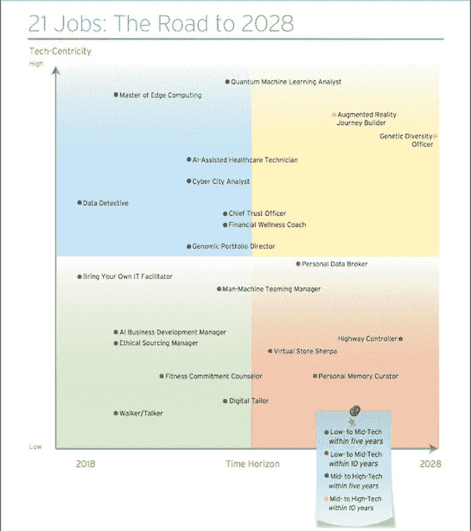
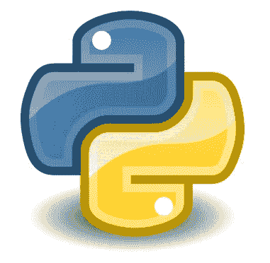

# 我的数据之路

> 原文：<https://towardsdatascience.com/a-bit-about-me-7b8b46bbf022?source=collection_archive---------20----------------------->

大家好，我是 Jack，我是他们数据科学团队中一名投资经理的替代数据侦察员，我对所有数据/ML/techy 方面的东西都充满热情。

This is me, looking decidedly data-sciency, beard included.

话虽如此，这对我来说还是相当新鲜的，因为当我加入目前的团队时，我才真正开始了解这方面的事情。

# 关于我的前数据热

我在达勒姆大学(Durham)主修土木工程，2015 年毕业，一直以来，我都更喜欢数学方面的东西，而不是工程方面。

我从大学一毕业就攻读了 IMC(投资管理证书),并设法在新兴市场股票投资部门找到了一份工作，担任基金管理助理。虽然这给了我积极基金管理过程中的良好基础，以及学习 CFA 资格(特许金融分析师)的能力，但我很快意识到实施基金经理交易，监控基金的现金流等。不适合我，所以我开始找别的地方。

幸运的是，新兴市场股票部门正对着一群自称数据科学家的年轻“书呆子”(这个词是一种喜爱，绝对不是一种侮辱)。通过与团队中几个人的小互动，我开始了解一些他们的工作——利用数据帮助基金经理/分析师做出更好的投资决策。起初，我认为这是一种不会持续很久的时尚，但我对这个行业研究得越多，我就越意识到这些人说得有道理——这无疑是这个行业的发展方向。

然后我决定这是适合我的地方，所以开始尝试与团队中的一些人一起喝咖啡，以 a)更多地了解他们，b)看看他们是否有任何职位空缺……经过几次交谈，我发现他们确实有一个空缺，作为一名数据侦察员。

我以前从未听说过数据侦察兵，也不知道这是否是一个真正的工作角色——听起来有点像这样:

Image: Cognizant

但是我还是决定去尝试一下，因为它听起来确实很有趣。

然后我参加了一个预面试，我必须承认这是我一生中最奇怪的经历之一。我被邀请去一家酒吧“聊天”,聊我自己和团队，以及我的工作角色，所以我立刻认为这是一次相当普通的聊天——我谈论我的简历、我学习的动力、我对工作的兴趣，然后他们谈论团队、工作并回答任何问题等。我手里拿着啤酒，在接下来的一个半小时里经历了一系列的思想实验，这些实验被精心制作成类似于团队每天所做的工作。不打算说谎，这让我有点吃惊——我不习惯在这种情况下被激烈地询问我的统计学和数据分析知识。

我获准去申请，经过四次面试和一次案例研究后，我得到了这份工作。这是 2017 年 1 月。

# 数据热来袭

我现在是一名经验丰富的“数据侦察员”，我在面试过程中了解到，他负责寻找新的、有趣的数据集，我们的团队可以用这些数据集来产生投资见解。在过去的几年里，我肯定参加了成百上千的会议，这些公司声称能够提供几乎任何数据，从中国的石油储量到撒哈拉以南非洲的降雨量。这些会议让我对外面的大量数据大开眼界，我现在坚信这是投资管理/对冲基金行业的前进方向。

# 编程；编排

换个话题，我一直知道我会对编程感兴趣，但是从来没有真正地 a)费心去学习或者 b)设法克服进入环境设置过程这一重要障碍。我在大学里学过一点，主要是 C 语言，但由于我非常忙碌的工程学生时间表的性质，我只学到了足够做我导师设定的项目。

在基金管理助理的工作中，我曾与 VBA 打过交道，构建了几个宏来帮助自动化办公桌工作的各个部分，但对 Excel 随机冻结、关闭以及通常不以非常文明的方式行事的能力，我一直感到沮丧。

然而，当我第一次发现 Python 时，我就被迷住了。它似乎比 C 语言简单得多——一切似乎都有意义，也比 VBA 强大得多。如果你想画点什么，你可以导入一个库，然后输入。plot()"位于要绘制的数据集的末尾。如果您想要加载一个 csv 数据集，您可以导入一个包并键入”。read_csv()”。这是一个完全的游戏变化，至少对我来说。

我开始参与回答我们的分析师/基金经理的一些要求，这些要求需要基本的编码，通常是结合使用 youtube 上由[sendex](https://medium.com/u/e6ae4c70fe05?source=post_page-----7b8b46bbf022--------------------------------)(【https://www.youtube.com/user/sentdex】T2)提供的教程和之前编写的代码。这些通常涉及网络抓取各种指标(价格，日期，数量等)。)来自各个站点。虽然大多数人认为这相当枯燥乏味，但我认为这是我学习数据获取和数据清理基础知识的好方法，因为来自网站的数据很少是干净的。

正是 Python 的这一发现重新点燃了我对学习/构建事物的热情，这种热情最初将我推向了土木工程的道路——我想我也在做同样的事情，但构建虚拟的事物而不是物理结构。

然后我进入了更难的网络抓取——使用 Chrome 中的开发者面板拦截网络流量，使用 selenium 抓取涉及 javascript 的网站。这提高了我对包装的熟练程度，如美丽的 Soup，熊猫，Numpy 和 Requests，还有 Selenium。2018 年 9 月，在通过 CFA 期末考试后，我决定更进一步，报名参加一位同事向我推荐的大会兼职数据科学课程。

该课程包含四个主题，包括设置(anaconda、git、基本命令行等。)、python 基础、统计学和机器学习，以及一个将在 10 周内完成的项目。我学到了很多东西，特别是在机器学习领域，我之前对它知之甚少，并在 Tinder data 上制作了一个我非常自豪的项目(你可以在这里看到相关报道:[https://medium . com/@ jackcballinger/my-friends-give-me-their-Tinder-data-7 fcd 2621 c 140](https://medium.com/@jackcballinger/my-friends-gave-me-their-tinder-data-7fcd2621c140))。

自从课程结束后，我觉得有必要一直有某种项目，以避免变得焦躁不安。迄今为止，这些措施包括:

*   完成**火绒项目**的撰写
*   用 AWS/flask/html/css/javascript 从零开始建立自己的**网站**，这些我都没有任何经验
*   为我的银行交易构建一个简单的随机森林分类器来监控支出
*   类似的东西，但看我的净资产(包括一个人所有的各种账户)，以及使用晨星数据复制投资业绩
*   构建一个**right move/zoopla scraper**来监控特定搜索标准内的公寓，目的是对数据进行各种分析，例如价格如何根据与特定车站的距离而变化

我计划在接下来的几周写下这些，但是如果任何人对有趣的项目有任何其他想法，请让我知道！