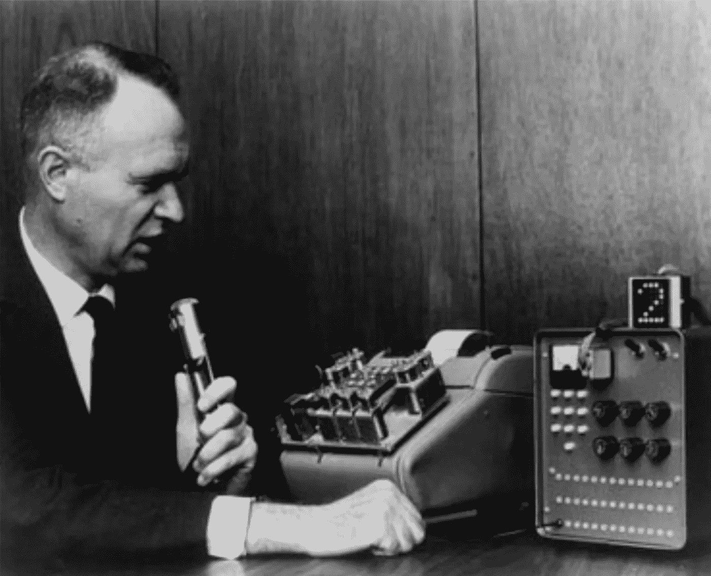
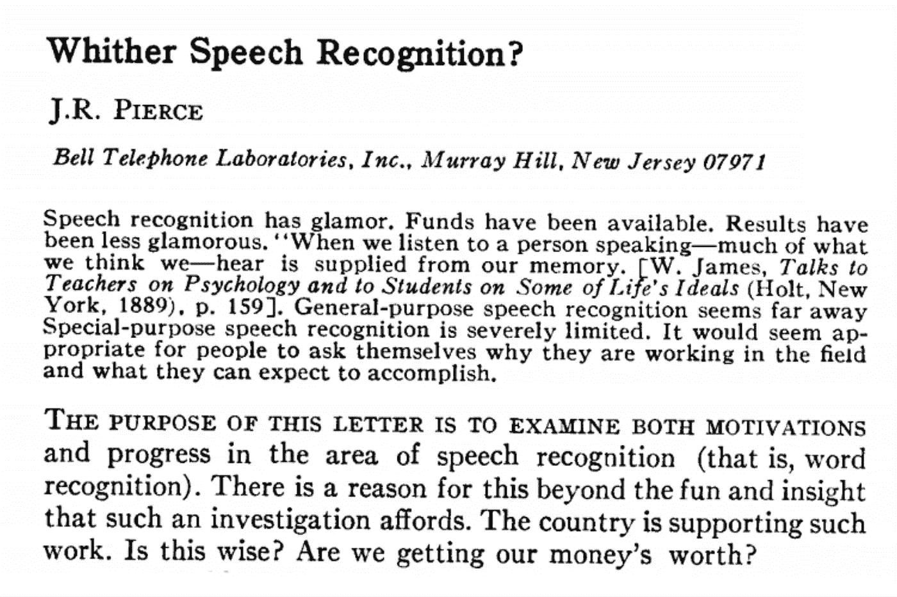
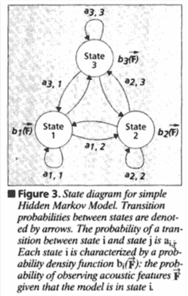
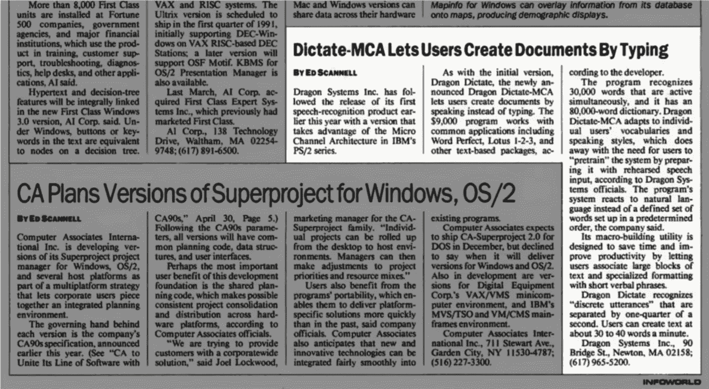
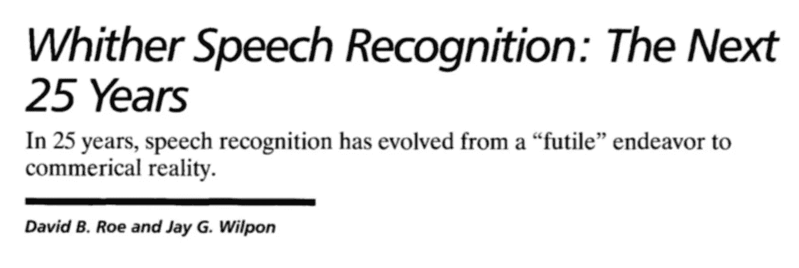

# 自动语音识别简史

> 原文：<https://towardsdatascience.com/a-brief-history-of-asr-automatic-speech-recognition-95de6c014187?source=collection_archive---------9----------------------->

这一刻已经到来很久了。语音识别背后的技术已经发展了半个多世纪，经历了几个充满希望和失望的时期。那么是什么改变了 ASR 在商业应用中的可行性呢？早在我们听说 Siri 之前，这些系统究竟能完成什么？

语音识别的故事是关于不同方法的应用和原始技术的发展，尽管两者有着千丝万缕的联系。在几十年的时间里，研究人员会设想出无数种剖析语言的方法:通过声音、通过结构——以及通过统计。

# 早期

人类对识别和合成语音的兴趣可以追溯到几百年前(至少！)——但直到 20 世纪中叶，我们的祖先才建造出可识别的 ASR。

**1961 年** — IBM 鞋盒

在最早的项目中，有一个名为 Audrey 的“数字识别器”，是贝尔实验室的研究人员在 1952 年发明的。奥黛丽可以通过寻找被称为*共振峰的音频指纹来识别口头数字，共振峰是声音的精华。*

20 世纪 60 年代，IBM 开发了 Shoebox——一个可以识别数字*和*算术命令，如“加”和“总数”的系统。更好的是，Shoebox 可以将数学问题传递给加法机，由加法机计算并打印出答案。

与此同时，日本的研究人员建造了能够识别元音等语音成分的硬件；其他系统可以评估语音的结构，以找出一个单词的结尾。英国大学学院的一个小组通过分析音素(一种语言的离散声音)可以识别 4 个元音和 9 个辅音。

但是，尽管该领域正在逐步向前发展，但前进的道路并不一定清晰。然后:灾难。

【1969 年 10 月——美国声学学会杂志

# 刺骨的寒冷

转折点出现在约翰·r·皮尔斯 1969 年写的一封信中。

皮尔斯早已成为国际知名的工程师；在其他成就中，他创造了晶体管这个词，并帮助发射了第一颗通信卫星 Echo I。到 1969 年，他已经是贝尔实验室的一名主管，该实验室在语音识别的开发方面进行了大量投资。

在《美国声学学会杂志》上发表的一封公开信中，皮尔斯表达了他的担忧。皮尔斯引用了二战和史泼尼克人造卫星后“繁荣”的资金环境，以及缺乏问责制，告诫该领域缺乏科学严谨性，声称有太多的野生实验正在进行:

> “我们都相信语言科学是可能的，尽管在这个领域里像科学家一样行事的人和看起来像科学的结果很少。”皮尔斯，1969 年

皮尔斯说到做到，他资助了贝尔的 ASR 项目，直到 1971 年他辞职后才恢复。

# 进展仍在继续

令人欣慰的是，其他地方有更多的乐观情绪。20 世纪 70 年代初，美国国防部高级研究计划局(ARPA)资助了一项名为*语音理解研究的五年计划。*这导致了几个新的 ASR 系统的诞生，其中最成功的是卡耐基梅隆大学的*哈佩，*到 1976 年，它可以识别 1000 多个单词。

与此同时，IBM 和美国电话电报公司贝尔实验室的努力将这项技术推向了可能的商业应用。IBM 在办公室通信的背景下优先考虑语音转录，而贝尔关注的是“命令和控制”场景:我们今天知道的语音拨号和自动电话树的前身。

尽管有了这些进步，到 20 世纪 70 年代末，除了高度特定的用例之外，ASR 离可行还有很长的路要走。

这也让我头疼。

# 80 年代:马科夫和更多

一个关键的转折点出现在 20 世纪 80 年代中期*隐马尔可夫模型* (HMMs)的普及。这种方法代表了“从基于模板和光谱距离测量的简单模式识别方法到语音处理的统计方法”的重大转变，这转化为准确性的飞跃。

*自 20 世纪 60 年代末以来，语音识别系统的很大一部分改进归功于这种统计方法的强大功能，以及实现 hmm 所需的计算机技术的进步。*

HMMs 席卷了整个行业——但它们并非一夜成名。Jim Baker 在 20 世纪 70 年代早期在 CMU 首次将它们应用于语音识别，而 Leonard E. Baum 在 60 年代已经描述了模型本身。直到 1980 年，杰克·弗格森在国防分析研究所做了一系列富有启发性的讲座，这项技术才开始更广泛地传播。

HMMs 的成功验证了 IBM 沃森研究中心(Watson Research Center)的弗雷德里克·耶利内克(Frederick Jelinek)的工作，他自 20 世纪 70 年代初以来一直主张使用统计模型来解释语音，而不是试图让计算机模仿人类消化语言的方式:通过意义、句法和语法(当时的常用方法)。正如耶利内克后来所说:“飞机不会拍打翅膀。”

这些数据驱动的方法也促进了与行业协作和责任相关的进步，就像个人的灵光乍现一样。随着统计模型越来越受欢迎，ASR 领域开始围绕一套测试进行合并，这将提供一个标准化的基准来进行比较。共享数据集的发布进一步鼓励了这一点:研究人员可以使用大型数据集来训练和测试他们的模型。

换句话说:最终，有了一种(不完美的)方法来衡量和比较成功。

【1990 年 11 月，信息世界

# 消费者可用性—90 年代

不管是好是坏，20 世纪 90 年代以我们今天认可的形式向消费者介绍了自动语音识别。Dragon Dictate 于 1990 年推出，售价高达 9000 美元，宣传一本 80000 字的词典和自然语言处理等功能(见上文*信息世界*文章)。

这些工具很费时(文章声称并非如此，但 Dragon 因提示用户“训练”听写软件适应自己的声音而出名)。它要求用户用生硬的方式说话:Dragon 最初一分钟只能识别 30-40 个单词；人们说话的速度通常比这快四倍。

但它的运作足够好，让 Dragon 成长为一家拥有数百名员工、客户涵盖医疗保健、法律等领域的企业。到 1997 年，该公司推出了 Dragon NaturallySpeaking，它能以更流畅的速度捕捉单词，售价 150 美元，价格低得多。

即便如此，抱怨声可能和高兴的尖叫一样多:就今天消费者对 ASR 的怀疑程度而言，一些功劳应该归于这些早期产品的过度热情的营销。但是，如果没有行业先驱詹姆斯和詹妮特·贝克(他们在 1982 年创建了龙系统公司)的努力，ASR 的产品化可能需要更长的时间。

【1993 年 11 月， IEEE 通信杂志

# 语音识别何去何从——续集

在 J.R. Pierce 的论文发表 25 年后，IEEE 发表了题为*语音识别何去何从:下一个 25 Years⁵* 的后续文章，作者是贝尔实验室(Pierce 工作的同一家机构)的两名资深员工。

后一篇文章调查了大约 1993 年该论文发表时的行业状况——并作为对原文悲观主义的一种反驳。其要点包括:

*   皮尔斯信中的关键问题是他的假设，为了让语音识别变得有用，计算机需要理解单词*的意思*。鉴于当时的技术，这是完全不可行的。
*   从某种意义上来说，皮尔斯是对的:到 1993 年，计算机对语言的理解还很贫乏——到了 2018 年，它们仍然不擅长辨别意思。
*   皮尔斯的错误在于他没有预见到语音识别的无数用途，即使计算机不知道单词的实际意思。

《T2 向何处去》续集以一个预测结尾，预测了 1993 年以后 ASR 将走向何方。这一部分用厚颜无耻的模糊限制语表达(“我们自信地预测，这八个预测中至少有一个会被证明是不正确的”)——但它仍然很有趣。在他们的八个预测中:

*   到 2000 年，更多的人将通过语音对话获得远程信息，而不是通过在计算机键盘上键入命令来访问远程数据库
*   “人们将学会改变他们的讲话习惯以使用语音识别设备，就像他们改变讲话行为以在应答机上留言一样。**即使他们将学习如何使用这项技术，人们还是会抱怨语音识别器。”**

# 黑马

在本系列的下一期文章中，我们将探索自动语音识别的最新发展和当前状态。剧透:神经网络扮演了主角。

但是神经网络实际上和这里描述的大多数方法一样古老——它们是在 20 世纪 50 年代引入的！直到现代时代的计算能力(以及更大的数据集)才改变了这一局面。

但是我们太超前了。关注[媒体](https://medium.com/descript)、[推特](https://twitter.com/descriptapp)或[脸书](https://www.facebook.com/descriptapp)上的[描述](https://www.descript.com/)，继续关注我们下一篇关于自动语音识别的文章。

Juang & Rabiner 的时间线

## 这篇[文章](https://medium.com/descript/a-brief-history-of-asr-automatic-speech-recognition-b8f338d4c0e5)最初发表在 [Descript](https://www.descript.com/) 上。