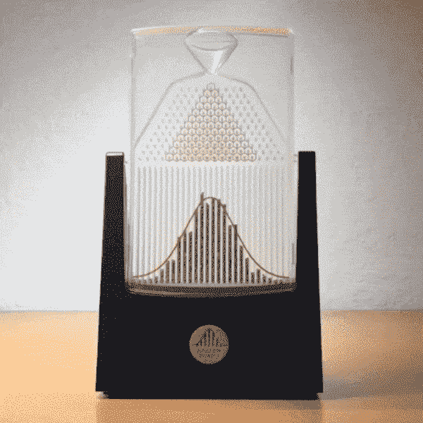
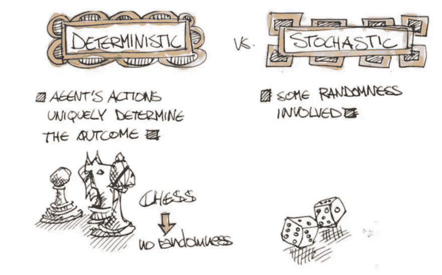
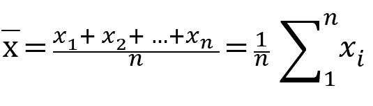
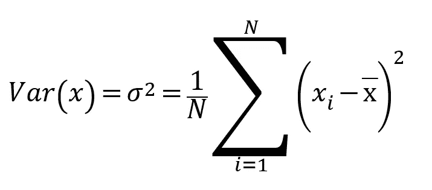
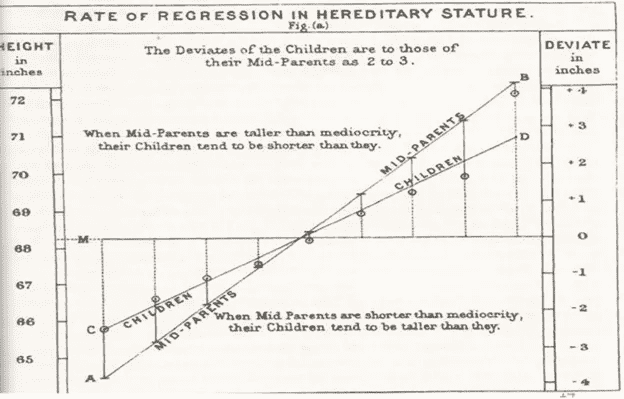
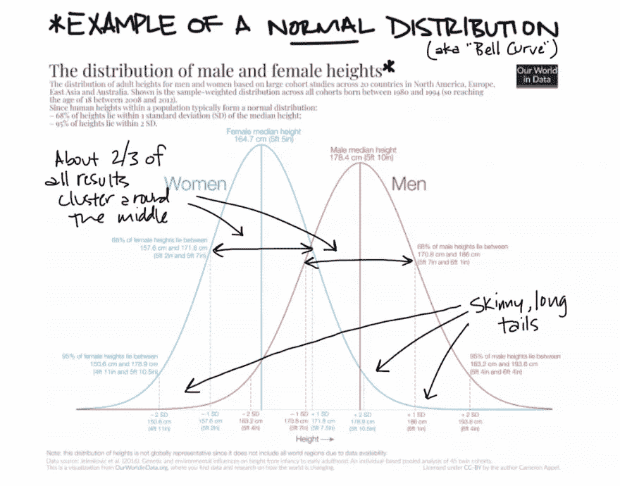
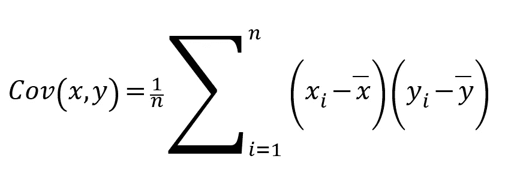
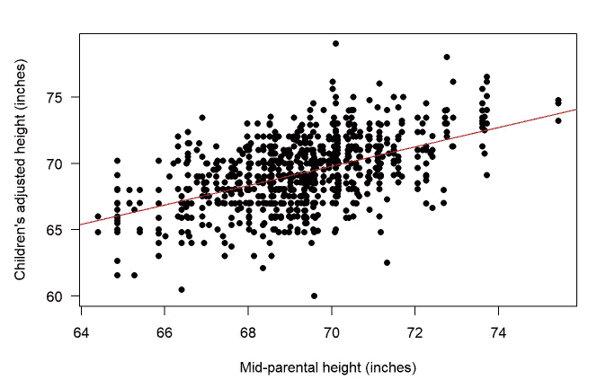
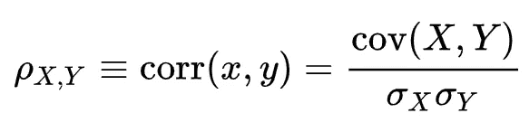

# 统计学简史

> 原文：<https://towardsdatascience.com/a-brief-history-of-statistics-36cfdac9439f?source=collection_archive---------18----------------------->

## 第 1 部分—上升—从正态分布到回归。

十九世纪中叶，科学发现使人类达到了顶峰，一股乐观主义的浪潮席卷了欧洲，带来了新的可能性。我们学会支配自然的所有法则似乎只是时间问题。我们在物理、生物、天文学等方面取得了巨大进步。这证明了过度乐观的合理性。似乎如果我们有好的测量方法，我们就可以描述和预测任何事情。不用说，实证主义者错了，但是让我们假装不知道，继续我们的故事。

# 确定性世界还是随机世界？统计学的兴起。

Galton Board is a machine that tries to demonstrate that different distributions converge to the normal distribution. We call this curious fact the central limit theorem.

更早一点，在十八世纪，当对行星的位置进行一些测量时，有一些轻微的偏差。我们预计这颗行星会在一个位置上，但它稍微在“错误的位置”这种现象有两种可能的解释。要么模型是错误的，要么我们收集这些数据的设备不够好/灵敏。模型看起来相当不错，所以应该是仪器的问题，所以他们开始生产更精确的设备。在分析这些小偏差时，他们注意到他总是遵循某种分布。拉普拉斯将他的一整卷天文学预测仅仅用于处理误差。今天我们知道它是正态分布。

高尔顿盒是一台试图证明不同分布收敛于正态分布的机器。我们称这个奇怪的事实为中心极限定理。

因此，我们开始提高设备的质量，正如预期的那样，误差减少了，这鼓励我们创造越来越好的设备，但随着设备变得越来越精确，一些奇怪的事情开始发生，取而代之的是误差。减少，
开始增加！当时的科学家开始想知道为什么，答案是我们的世界不是确定性的，而是随机的，也就是说，事件具有内在的随机特征！即使我们有最好的数据收集，并知道自然的完美模型，但它也不能保证一个好的预测，因为有我们无法控制的随机因素。

Image from [https://www.youtube.com/watch?v=cfJ-VvptSQs](https://www.youtube.com/watch?v=cfJ-VvptSQs)

# 平均值

我们需要新的技术来应对这个新世界，于是就有了我们所知的统计学，一种理解随机世界的工具。例如，在具有随机特征的测量的情况下，我们应该使用某种中心性的测量，例如平均值:

Translating: We add all the observations and divide by the quantity.

# 方差和标准差

我们统计历史的下一步是查尔斯·达尔文家族的一员，不那么有名，但对历史非常重要，他的表弟弗朗西斯·高尔顿。在许多领域都是天才，高尔顿首先是一个杰出的观察者，也是最早注意到分布的另一个重要特征的人之一，这就是分布的形式，也就是说，虽然平均值传递了中心性的概念，但分布表明了数据的分布程度。远离平均值，因此有了方差和标准差的概念:

Translating: Average and see how far each observation is from the average. If they are always far away, a high dispersion, we have a high variance.

另一个表亲，现在方差是标准差，它基本上是第一个的平方根，其优势是在相同的数据单位中进行解释。图片我们有一个高度表，平均值为 180 厘米，方差为 400 厘米。这个 400 厘米很难解释，
所以我们求根，得出 20 厘米的标准差(20 厘米* 20 厘米= 400 厘米),这意味着人们平均上下变化 20 厘米。

# 协方差、相关性和平均回归。

高尔顿超越了，远远超越了。他建立了一个实验室来收集和绘制各种人类特征，并为此付出了巨大的努力。一个有趣的观察是，天文测量中的相同误差分布已经在其他几次发现，如身高或前臂大小。但他在这里主要是因为他注意到了当时一个非常好奇和创新的特点。首先，当父母的平均身高过高时，他们的孩子会高于平均身高，当父母的平均身高过低时，他们的孩子也会略低于平均身高。

Galton on Regression — 9000 families and 6 years analyzing

到目前为止没什么新鲜的，即使没有数据，每个人都有这种不信任。但他意识到还有第二种行为，这些孩子，来自高或矮的父母，几乎没有他们的父母一样高或一样矮，似乎有一种力量将他们孩子的身高拉回到平均水平，这种力量我们称之为回归均值。否则，再过几代，我们就会出现一边是巨人，一边是侏儒的种群，而我们显然没有观察到他们。

Example comparing height distribution between sex.

有鉴于此，高尔顿创造了这个术语，后来他的知识继承人皮尔森对其进行了完善，皮尔森命名了一种相关性和技术书籍的出版商。我们都知道的公式是:

Covariance, nothing more than the variation between two different variables. That is, how they disperse the average together. Note that the formula is the same, var = (xi-x) (xi-x) and cov = (xi-x) (yi-y), and so var (x) = cov (x, x)

这有一个相当简单的解释。当 X 和 Y 高于平均值时，我们将添加一个大的正数(负*负)，如果两者都低于平均值，我们也添加一个正数(正*正)。如果这个和是一个很大的数，我们说 X 和 Y 是紧密关联的，否则是差关联的。名字只会让学习变得困难，但今天我们称之为协方差。

Original dataset used by Galton

像方差一样，协方差也很难解释。就像我们把方差归一化为标准差一样，这样更容易理解。Pearson 对协方差做了同样的处理，在这种情况下，我们用原始协方差除以 X 和 Y 的标准偏差，结果神奇地落在-1 和+ 1 之间:

Translating: The correlation between X and Y is nothing more than a normalization of Covariance. A correlation is perfect when it is close to both extremes (-1 and 1) and the variables are uncorrelated when the correlation is close to zero.

现在的解释是，相关性越强，使儿童身高回归预期平均身高的“引力”就越强。弱相关性表明这些变量没有密切关联。这个关于十九世纪和二十世纪之交的简单想法彻底改变了所有现代科学。很难找到任何不受这些发现影响的地区。从农业到医学，再到社会科学，每一门现代科学都使用同一种语言:统计学。

*本文并不是对统计学历史的可靠描述，这里描述的许多发现都有以前的合著者，为了简化和便于理解这个主题，这些合著者被省略了。*

查看我们的其他帖子:

*   [统计简史](http://a%20brief%20history%20of%20statistics/)；
*   [为数据科学家推荐书籍、课程和电影。](/how-to-become-a-data-scientist-2a02ed565336)
*   [数据科学](https://medium.com/swlh/data-science-and-the-data-scientist-db200aac4ea0) [的范围是什么；](https://medium.com/beacon-insight/ci%C3%AAncia-de-dados-e-o-cientista-de-dados-72634fcc1a4c)
*   [解释机器学习。](https://medium.com/@marcos.silva0/the-ultimate-guide-using-game-theory-to-interpret-machine-learning-c384cbb6929?sk=8817fb3b75f2da2030cee7a699c8854b)